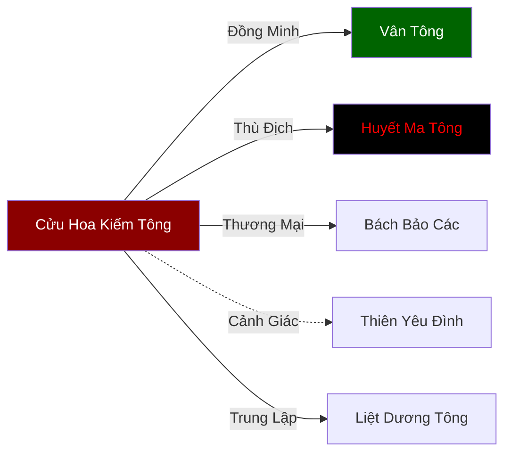

# Thế Lực Sheet Design Spec

## Mục Tiêu

Thiết kế YAML frontmatter template cho tệp Thế Lực (faction), tương tự hệ thống character sheet đã có cho Nhân Vật. Hỗ trợ Obsidian dataview queries, theo dõi trạng thái qua các arc, và bản đồ quan hệ ngoại giao giữa các thế lực.

## Bối Cảnh

### Hệ Thống Hiện Tại
- **Nhân Vật** đã có YAML frontmatter với: `type, name, hantu, archetype, race, avatar, arcs` (mỗi arc chứa status, cultivation, methods, inventory, stats 6 chỉ số, relationships với 6 trục cảm xúc)
- **Thế Lực** hiện chỉ có Markdown (không có YAML frontmatter) → không query được, không track được qua arc
- Các tệp hiện tại có nhiều định dạng khác nhau (7-section Roman, 8-section Roman, 5/6-section Arabic, stub, minimal — xem chi tiết ở mục Migration)
- 228 tệp thế lực hiện tại cần migration (không tính `index.md`)

### Vấn Đề Cần Giải Quyết
1. Không thể filter/sort thế lực theo vùng, hạng, chủng tộc, lãnh đạo trong Obsidian
2. Không track được sự thay đổi của thế lực qua các arc (suy thoái, bị tiêu diệt, hợp nhất...)
3. Không có bản đồ quan hệ ngoại giao giữa các thế lực
4. Không track được nhân sự (ai thuộc thế lực nào, cấu trúc nội bộ)
5. Thiếu thông tin về kinh tế, cơ sở hạ tầng, đặc sản của thế lực

---

## Thiết Kế

### A. YAML Frontmatter

#### Trường Tĩnh (Static Fields — không thay đổi theo arc)

```yaml
---
type: faction
name: Cửu Hoa Kiếm Tông
hantu: 九花劍宗
faction_type: Tông Môn
alignment: 8
race: Nhân Tộc
region: Đông Hoang
founded: 3000 năm trước
founder: Cửu Hoa Chân Nhân
emblem: Cửu_Hoa_Kiếm_Tông.png
specialty: Kiếm Tu
economy: [Mỏ Huyền Thiết, Kiếm Thảo buôn bán, Luyện kiếm đặt hàng]
---
```

| Trường | Kiểu | Mô Tả |
|---|---|---|
| `type` | string | Luôn là `faction` |
| `name` | string | Tên Hán Việt của thế lực |
| `hantu` | string | Tên bằng Hán tự (漢字) |
| `faction_type` | string | Loại hình thế lực (xem danh sách bên dưới) |
| `alignment` | int | -10 đến +10 (xem bảng Alignment bên dưới) |
| `race` | string | Chủng tộc chủ đạo |
| `region` | string | Khu vực hoạt động chính |
| `founded` | string | Thời điểm thành lập |
| `founder` | string | Người sáng lập |
| `emblem` | string | Tên tệp hình ảnh (biểu tượng/huy hiệu) |
| `specialty` | string | Đặc sản/sở trường nổi bật nhất |
| `economy` | list | Nguồn thu nhập cơ bản/lâu dài (thay đổi lớn track qua `assets` per-arc) |

#### Danh Sách `faction_type`

| Loại Hình | Hán Tự | Mô Tả |
|---|---|---|
| Tông Môn | 宗門 | Tông phái tu luyện |
| Gia Tộc | 家族 | Gia tộc/thị tộc |
| Vương Quốc | 王國 | Quốc gia/triều đình |
| Thương Hội | 商會 | Hội thương nhân |
| Quân Đoàn | 軍團 | Tổ chức quân sự |
| Bộ Lạc | 部落 | Bộ lạc |
| Liên Minh | 聯盟 | Liên minh/liên bang |
| Hội | 會 | Hội/xã/đoàn thể |
| Học Viện | 學院 | Trường/học viện |
| Tự Viện | 寺院 | Chùa/tự viện |
| Thành Trì | 城池 | Thành trì/pháo đài |

**Lưu ý:** Nếu thế lực không khớp hoàn toàn với bất kỳ loại nào, chọn loại gần nhất và giải thích trong Section I (Tổng Quan).

#### Bảng Alignment

| Phạm Vi | Tên Gọi | Ví Dụ |
|---|---|---|
| -10 đến -7 | Thuần Ma Đạo | Huyết Ma Tông, Vực Thẳm Ma Cung |
| -6 đến -3 | Thiên Ma | Hợp Hoan Tông, Ảnh Nguyệt Uyển |
| -2 đến +2 | Trung Lập | Bách Bảo Các, Thiên Sa Thương Hội, Phế Linh Các |
| +3 đến +6 | Thiên Chính | Dược Vương Cốc, Vân Tông |
| +7 đến +10 | Thuần Chính Đạo | Cửu Hoa Kiếm Tông, Vô Tranh Tự |

Alignment phản ánh lập trường đạo đức công khai của thế lực, không phải cách người ngoài nhìn nhận. Ví dụ: Phế Linh Các (`alignment: 2`) là trung lập thiên chính — họ không làm điều ác nhưng cũng không theo đuổi chính nghĩa, chỉ đơn giản muốn tồn tại.

---

### B. Per-Arc Tracking (`arcs` array)

Mỗi phần tử trong mảng `arcs` là một snapshot trạng thái của thế lực tại arc đó.

```yaml
arcs:
  - arc: 1
    status: Hưng Thịnh
    rank: Hạng Nhất
    leader: Lục Trần
    population: 5000
    territory: [Cửu Hoa Sơn, Thiên Hoa Phong]
    assets:
      - name: Mỏ Huyền Thiết
        type: Tài Nguyên
      - name: Cửu Hoa Tru Tiên Trận
        type: Trận Pháp
      - name: Tàng Kinh Các
        type: Công Trình
    stats: [12000, 8000, 14000, 5000, 13000, 11000]
    divisions:
      - name: Thiên Hoa Phong
        role: Tổng Đàn
        headcount:
          thai_thuong: 2
          ho_phap: 2
          truong_lao: 3
          chan_truyen: 5
          noi_mon: 120
          ngoai_mon: 800
          tap_dich: 2000
        members:
          - character: "[Thái Thượng Đại Trưởng Lão]"
            position: Thái Thượng Đại Trưởng Lão
            cultivation: Hóa Thần Trung Kỳ
            placeholder: true
          - character: "[Thái Thượng Trưởng Lão]"
            position: Thái Thượng Trưởng Lão
            cultivation: Hóa Thần Sơ Kỳ
            placeholder: true
          - character: "[Hộ Pháp Nhất]"
            position: Hộ Pháp
            cultivation: Nguyên Anh Đỉnh Phong
            placeholder: true
          - character: "[Hộ Pháp Nhị]"
            position: Hộ Pháp
            cultivation: Nguyên Anh Hậu Kỳ
            placeholder: true
          - character: Lục Trần
            position: Tông Chủ
            cultivation: Hóa Thần Sơ Kỳ
          - character: "[Thánh Tử]"
            position: Thánh Tử
            cultivation: Kim Đan Hậu Kỳ
            placeholder: true
          - character: "[Thánh Nữ]"
            position: Thánh Nữ
            cultivation: Kim Đan Trung Kỳ
            placeholder: true
      - name: Bạch Hoa Phong
        role: Kiếm Pháp Tu Luyện
        headcount:
          truong_lao: 1
          chan_truyen: 3
          noi_mon: 80
          ngoai_mon: 400
          tap_dich: 600
        members:
          - character: "[Bạch Hoa Phong Chủ]"
            position: Phong Chủ
            cultivation: Nguyên Anh Trung Kỳ
            placeholder: true
          - character: Diệp Tĩnh Sương
            position: Ngoại Môn Đệ Tử
            cultivation: Trúc Cơ Sơ Kỳ
          - character: Lâm Phong
            position: Ngoại Môn Đệ Tử
            cultivation: Trúc Cơ Sơ Kỳ
    relationships:
      - faction: Vân Tông
        description: Đồng minh lâu năm, cùng thuộc Chính Đạo Đông Hoang
        diplomacy:
          lien_minh: 80
          tin: 60
          uy_hiep: 10
          thuong_mai: 50
          on_oan: 30
          le_thuoc: 0
      - faction: Huyết Ma Tông
        description: Kẻ thù truyền kiếp, Ma Đạo đối lập
        diplomacy:
          lien_minh: -90
          tin: -80
          uy_hiep: 70
          thuong_mai: -100
          on_oan: -85
          le_thuoc: 0
```

#### Các Trường Per-Arc

| Trường | Kiểu | Mô Tả |
|---|---|---|
| `arc` | int | Số arc |
| `status` | string | Hưng Thịnh / Suy Thoái / Bị Tiêu Diệt / Phân Liệt / Hợp Nhất / Ẩn Dật / Mới Thành Lập |
| `rank` | string | Hạng Nhất → Hạng Năm (có thể thay đổi giữa các arc) |
| `leader` | string | Người quản lý hành chính (thường là Tông Chủ — KHÔNG nhất thiết là người mạnh nhất, xem Section D Hệ Thống Cấp Bậc) |
| `population` | int | Tổng số thành viên (xem lưu ý bên dưới) |
| `territory` | list | Danh sách lãnh thổ kiểm soát |
| `assets` | list | Tài sản quan trọng (name + type) |
| `stats` | list | 6 chỉ số sức mạnh (xem mục Stats) |
| `divisions` | list | Cơ cấu nội bộ (xem mục Divisions) |
| `relationships` | list | Quan hệ ngoại giao (xem mục Relationships) |

**Population vs Headcount:** `population` là tổng số thành viên ước tính. Tổng `headcount` của tất cả divisions không cần khớp chính xác `population` — cho phép sai lệch 10–15% vì có thành viên lưu động, ẩn cư, hoặc chưa phân bổ. Ví dụ: `population: 5000` mà tổng headcount = 4400 là chấp nhận được.

**Giá trị `assets.type`:** Tài Nguyên | Trận Pháp | Công Trình | Bí Cảnh | Pháp Bảo

#### Giá Trị `status`

| Status | Mô Tả |
|---|---|
| Mới Thành Lập | Vừa được sáng lập, đang xây dựng |
| Hưng Thịnh | Phát triển mạnh, thời kỳ hoàng kim |
| Ổn Định | Duy trì, không phát triển đáng kể |
| Suy Thoái | Đang suy yếu |
| Phân Liệt | Bị chia rẽ nội bộ |
| Hợp Nhất | Vừa sáp nhập với thế lực khác |
| Ẩn Dật | Rút lui khỏi chính trường |
| Bị Tiêu Diệt | Đã bị hủy diệt |
| Chưa Xác Định | Chưa có dữ liệu, cần bổ sung (dùng cho migration stub) |

---

### C. Hệ Thống Stats (6 Chỉ Số)

Thứ tự: `[Quân Lực, Tài Nguyên, Uy Danh, Nhân Khẩu, Phòng Thủ, Ảnh Hưởng]`

| Chỉ Số | Hán Tự | Mô Tả |
|---|---|---|
| Quân Lực | 軍力 | Sức mạnh quân sự, chiến đấu |
| Tài Nguyên | 財源 | Tài sản, nguyên liệu, lãnh thổ |
| Uy Danh | 威名 | Danh tiếng, uy tín chính trị |
| Nhân Khẩu | 人口 | Dân số, khả năng tuyển mộ |
| Phòng Thủ | 防守 | Phòng ngự (trận pháp, địa thế) |
| Ảnh Hưởng | 影響 | Tầm ảnh hưởng lên các thế lực khác, kinh tế, văn hóa |

#### Phạm Vi Stats Theo Hạng (Hướng Dẫn, Không Cứng Nhắc)

| Hạng | Mô Tả | Phạm Vi Gợi Ý |
|---|---|---|
| Hạng Năm | Thôn, nhóm nhỏ, mới thành lập | 10–150 |
| Hạng Tư | Tiểu tông phái, bộ lạc | 150–500 |
| Hạng Ba | Trung đẳng tông môn, thành trì | 500–2000 |
| Hạng Nhì | Đại phái, vương quốc | 2000–5000 |
| Hạng Nhất | Bá chủ khu vực, siêu cường | 5000–15000 |

Phạm vi là hướng dẫn, cho phép overlap và ngoại lệ. Ví dụ: một thế lực Hạng Tư có thể có Quân Lực 600 (vượt phạm vi) nhưng Tài Nguyên chỉ 80.

**Lưu ý:** Stats thế lực và stats nhân vật dùng cùng thang đo nhưng đo lường khác nhau. Stats nhân vật đo năng lực cá nhân, stats thế lực đo sức mạnh tổ chức — không so sánh trực tiếp được.

---

### D. Hệ Thống Divisions (Cơ Cấu Nội Bộ)

Mỗi division đại diện cho một đơn vị tổ chức (Phong, Sơn, Động, Chi, Phòng — tùy loại hình thế lực và địa hình).

#### Cấu Trúc Division

```yaml
divisions:
  - name: Tên Đơn Vị
    role: Chức Năng
    headcount:
      thai_thuong: 0
      ho_phap: 0
      truong_lao: 0
      chan_truyen: 0
      noi_mon: 0
      ngoai_mon: 0
      tap_dich: 0
    members:
      - character: Tên (hoặc "[Placeholder]")
        position: Chức Vụ
        cultivation: Cảnh Giới
        placeholder: true  # chỉ khi là placeholder
```

#### Hệ Thống Cấp Bậc Chuẩn (Tông Môn)

Xếp theo tu vi từ cao xuống thấp:

```
Thái Thượng Đại Trưởng Lão (太上大長老) — tu vi cao nhất, bế quan/bán ẩn cư
Thái Thượng Trưởng Lão (太上長老) — multiple, cựu tông chủ hoặc nguyên lão
Hộ Pháp (護法) — multiple, tu vi cao hơn Tông Chủ, trấn giữ tông môn
Tông Chủ (宗主) — 1, quản lý hành chính, KHÔNG nhất thiết mạnh nhất
Trưởng Lão / Phong Chủ (長老/峰主) — multiple, quản lý division
Thánh Tử / Thánh Nữ (聖子/聖女) — thế hệ kế tiếp, ngôi sao
Chân Truyền Đệ Tử (真傳弟子) — đệ tử ruột của lãnh đạo
Nội Môn Đệ Tử (內門弟子) — Trúc Cơ trở lên
Ngoại Môn Đệ Tử (外門弟子) — Luyện Khí kỳ
Tạp Dịch (雜役) — phàm nhân hoặc tư chất kém
```

**Lưu ý quan trọng:**
- Thái Thượng Trưởng Lão có tu vi **cao hơn** Hộ Pháp
- Hộ Pháp có tu vi **cao hơn** Tông Chủ
- Tông Chủ là người **quản lý**, không nhất thiết là người mạnh nhất
- Có thể có nhiều Hộ Pháp và nhiều Thái Thượng Trưởng Lão

#### Headcount Theo Loại Hình Thế Lực

**Tông Môn:**
```yaml
headcount:
  thai_thuong: 0     # tổng: Thái Thượng Đại Trưởng Lão + Thái Thượng Trưởng Lão
  ho_phap: 0
  truong_lao: 0
  chan_truyen: 0
  noi_mon: 0
  ngoai_mon: 0
  tap_dich: 0
```

> `thai_thuong` là tổng số cả hai cấp bậc Thái Thượng (Đại Trưởng Lão + Trưởng Lão). Chi tiết phân biệt thể hiện qua `members` list.

**Gia Tộc:**
```yaml
headcount:
  truong_lao: 0
  chinh_chi: 0
  thu_chi: 0
  gia_nhan: 0
```

**Quân Đoàn:**
```yaml
headcount:
  tuong: 0
  uy: 0
  binh: 0
```

**Bộ Lạc:**
```yaml
headcount:
  truong_lao: 0
  chien_binh: 0
  dan_thuong: 0
```

**Vương Quốc:**
```yaml
headcount:
  vuong: 1
  dai_than: 0
  quan_vien: 0
  cam_ve: 0
  dan: 0
```

**Thương Hội:**
```yaml
headcount:
  hoi_truong: 1
  truong_lao: 0
  thuong_nhan: 0
  ho_ve: 0
  nhan_cong: 0
```

**Liên Minh:**
```yaml
headcount:
  minh_chu: 1
  pho_minh_chu: 0
  truong_lao: 0
  su_gia: 0
  thanh_vien_phai: 0
```

**Hội:**
```yaml
headcount:
  hoi_truong: 1
  pho_hoi_truong: 0
  thanh_vien: 0
  tong_quan: 0
```

**Học Viện:**
```yaml
headcount:
  vien_truong: 1
  giao_su: 0
  tro_giang: 0
  sinh_vien: 0
  tap_dich: 0
```

**Tự Viện:**
```yaml
headcount:
  tru_tri: 1
  truong_lao: 0
  tang_lu: 0
  sa_di: 0
  cu_si: 0
```

**Thành Trì:**
```yaml
headcount:
  thanh_chu: 1
  pho_thanh_chu: 0
  ve_binh: 0
  quan_vien: 0
  dan_cu: 0
```

#### Quy Tắc Members

- **Thế lực lớn (Hạng Nhất-Nhì):** Chỉ liệt kê lãnh đạo cấp cao (Thái Thượng, Hộ Pháp, Tông Chủ, Phong Chủ, Thánh Tử/Nữ) và nhân vật quan trọng cho cốt truyện. Dùng `headcount` cho số lượng tổng thể.
- **Thế lực nhỏ (Hạng Tư-Năm):** Có thể liệt kê hầu hết thành viên trong `members`.
- **Placeholder:** Dùng `[Tên Chức Vụ]` trong ngoặc vuông và `placeholder: true` cho vị trí cần tồn tại nhưng chưa có nhân vật. Khi tạo nhân vật mới, thay thế placeholder bằng tên thật và xóa flag.

---

### E. Hệ Thống Relationships (6 Trục Ngoại Giao)

```yaml
relationships:
  - faction: Tên Thế Lực
    description: Mô tả bằng Tiếng Việt
    diplomacy:
      lien_minh: 0
      tin: 0
      uy_hiep: 0
      thuong_mai: 0
      on_oan: 0
      le_thuoc: 0
```

| Trục | Hán Tự | Phạm Vi | Ý Nghĩa |
|---|---|---|---|
| `lien_minh` | 聯盟 | -100 → +100 | -100 = thù địch, +100 = đồng minh thân cận |
| `tin` | 信 | -100 → +100 | -100 = nghi kỵ, +100 = tin tưởng tuyệt đối |
| `uy_hiep` | 威脅 | -100 → +100 | -100 = cung cấp an ninh, 0 = trung lập, +100 = mối đe dọa sống còn |
| `thuong_mai` | 商貿 | -100 → +100 | -100 = cấm vận, +100 = đối tác chiến lược |
| `on_oan` | 恩怨 | -100 → +100 | -100 = huyết thù, +100 = đại ân |
| `le_thuoc` | 隸屬 | -100 → +100 | -100 = bị chi phối, +100 = chi phối đối phương |

**Tính Đối Xứng:** Quan hệ ngoại giao KHÔNG bắt buộc đối xứng — mỗi faction ghi nhận từ **góc nhìn của mình**:
- `lien_minh`, `tin`, `thuong_mai` thường gần đối xứng nhưng không nhất thiết bằng nhau
- `uy_hiep` vốn bất đối xứng: A cảm thấy bị B đe dọa (uy_hiep: 70) nhưng B không nhất thiết cảm thấy A đe dọa
- `le_thuoc` đối nghịch: nếu A `le_thuoc: -60` (bị B chi phối) thì B nên có `le_thuoc: +60` (chi phối A)
- Khi tạo/cập nhật faction, agent nên kiểm tra faction đối tác và giữ consistency hợp lý

---

### F. Markdown Body (11 Sections)

Giữ 7 section hiện tại, thêm 4 section mới. Section IV và XI có Mermaid chart.

```markdown
# TÊN THẾ LỰC (漢字)

## I. Tổng Quan
(Thông tin cơ bản — tóm tắt từ YAML)

## II. Địa Lý & Tài Nguyên
(Vị trí, địa hình, tài nguyên chi tiết)

## III. Văn Hóa & Tín Ngưỡng
(Triết lý, môn quy, phong tục, lễ nghi)

## IV. Cơ Cấu Tổ Chức
(Mô tả text + Mermaid hierarchy chart)

## V. Công Pháp & Trận Pháp
(Công pháp trấn phái, trận pháp hộ sơn)

## VI. Đặc Sản Môn Phái ← MỚI
(Kỹ năng/dịch vụ độc đáo mà thế lực khác không có)

## VII. Cơ Sở Hạ Tầng ← MỚI
(Kiến trúc đặc biệt, bí cảnh, công trình)

## VIII. Kinh Tế ← MỚI
(Nguồn thu, chi phí, đối tác thương mại, mô hình kinh tế)

## IX. Lịch Sử Tóm Tắt
(Lịch sử hình thành, biến cố lớn)

## X. Giai Thoại & Bí Mật
(Truyền thuyết, bí mật ẩn giấu)

## XI. Quan Hệ Thế Lực ← MỚI
(Mermaid relationship map giữa các thế lực)
```

#### Mermaid Chart Quy Tắc

- **Hạng Nhất-Nhì:** Mermaid hierarchy chart (Section IV) và relationship map (Section XI) **bắt buộc**
- **Hạng Ba:** Mermaid chart **khuyến khích** nếu có ≥3 divisions
- **Hạng Tư-Năm:** Mermaid chart **tùy chọn** — có thể mô tả bằng text nếu cơ cấu đơn giản

#### Mermaid Hierarchy Chart (Section IV)

```mermaid
graph TD
    TTDTL["[Thái Thượng Đại Trưởng Lão]<br/>Hóa Thần Trung Kỳ"]
    TTTL["[Thái Thượng Trưởng Lão]<br/>Hóa Thần Sơ Kỳ"]
    HP1["[Hộ Pháp Nhất]<br/>Nguyên Anh Đỉnh Phong"]
    HP2["[Hộ Pháp Nhị]<br/>Nguyên Anh Hậu Kỳ"]
    TC[Tông Chủ: Lục Trần<br/>Hóa Thần Sơ Kỳ]

    TTDTL -.->|Bế Quan| HP1
    TTTL -.->|Bế Quan| HP1
    HP1 --> TC
    HP2 --> TC
    TC --> BH["[Bạch Hoa Phong Chủ]<br/>Nguyên Anh Trung Kỳ"]
    TC --> HH["[Hồng Hoa Phong Chủ]<br/>Nguyên Anh Sơ Kỳ"]
    TC --> TT["[Thánh Tử]<br/>Kim Đan Hậu Kỳ"]
    TC --> TN["[Thánh Nữ]<br/>Kim Đan Trung Kỳ"]
    BH --> DTS[Diệp Tĩnh Sương<br/>Trúc Cơ Sơ Kỳ]
    BH --> LP[Lâm Phong<br/>Trúc Cơ Sơ Kỳ]
    BH --> BH_COUNT[Nội Môn: 80 &#124; Ngoại Môn: 400]
    HH --> HH_COUNT[Nội Môn: 50 &#124; Ngoại Môn: 300]

    style TTDTL fill:#4B0082,color:#fff
    style TTTL fill:#4B0082,color:#fff
    style HP1 fill:#800080,color:#fff
    style HP2 fill:#800080,color:#fff
    style TC fill:#8B0000,color:#fff
    style TT fill:#DAA520,color:#000
    style TN fill:#DAA520,color:#000
```



Quy ước:
- **Đường nét đứt** (-.->): Thái Thượng bế quan, không trực tiếp chỉ huy
- **Đường nét liền** (-->): Quan hệ chỉ huy trực tiếp
- **Ngoặc vuông []**: Placeholder character
- **Màu sắc**: Tím đậm = Thái Thượng, Tím = Hộ Pháp, Đỏ sẫm = Tông Chủ, Vàng = Thánh Tử/Nữ

#### Mermaid Relationship Map (Section XI)



Quy ước:
- **Đường nét liền**: Quan hệ chính thức
- **Đường nét đứt**: Quan hệ không chính thức / tiềm ẩn
- **Nhãn**: Loại quan hệ (Đồng Minh, Thù Địch, Thương Mại, Cảnh Giác, Trung Lập, Phụ Thuộc)

---

## Ví Dụ Hoàn Chỉnh: Cửu Hoa Kiếm Tông

```yaml
---
type: faction
name: Cửu Hoa Kiếm Tông
hantu: 九花劍宗
faction_type: Tông Môn
alignment: 8
race: Nhân Tộc
region: Đông Hoang
founded: 3000 năm trước
founder: Cửu Hoa Chân Nhân
emblem: Cửu_Hoa_Kiếm_Tông.png
specialty: Kiếm Tu
economy: [Mỏ Huyền Thiết, Kiếm Thảo buôn bán, Luyện kiếm đặt hàng, Thu phí bảo hộ]
arcs:
  - arc: 1
    status: Hưng Thịnh
    rank: Hạng Nhất
    leader: Lục Trần
    population: 5000
    territory: [Cửu Hoa Sơn, Thiên Hoa Phong, Bát Đại Phụ Phong]
    assets:
      - name: Mỏ Huyền Thiết
        type: Tài Nguyên
      - name: Cửu Hoa Tru Tiên Trận
        type: Trận Pháp
      - name: Tàng Kinh Các
        type: Công Trình
      - name: Táng Kiếm Trì
        type: Bí Cảnh
    stats: [12000, 8000, 14000, 5000, 13000, 11000]
    divisions:
      - name: Thiên Hoa Phong
        role: Tổng Đàn
        headcount:
          thai_thuong: 2
          ho_phap: 2
          truong_lao: 3
          chan_truyen: 5
          noi_mon: 120
          ngoai_mon: 800
          tap_dich: 2000
        members:
          - character: "[Thái Thượng Đại Trưởng Lão]"
            position: Thái Thượng Đại Trưởng Lão
            cultivation: Hóa Thần Trung Kỳ
            placeholder: true
          - character: "[Thái Thượng Trưởng Lão]"
            position: Thái Thượng Trưởng Lão
            cultivation: Hóa Thần Sơ Kỳ
            placeholder: true
          - character: "[Hộ Pháp Nhất]"
            position: Hộ Pháp
            cultivation: Nguyên Anh Đỉnh Phong
            placeholder: true
          - character: "[Hộ Pháp Nhị]"
            position: Hộ Pháp
            cultivation: Nguyên Anh Hậu Kỳ
            placeholder: true
          - character: Lục Trần
            position: Tông Chủ
            cultivation: Hóa Thần Sơ Kỳ
          - character: "[Thánh Tử]"
            position: Thánh Tử
            cultivation: Kim Đan Hậu Kỳ
            placeholder: true
          - character: "[Thánh Nữ]"
            position: Thánh Nữ
            cultivation: Kim Đan Trung Kỳ
            placeholder: true
      - name: Bạch Hoa Phong
        role: Kiếm Pháp Tu Luyện
        headcount:
          truong_lao: 1
          chan_truyen: 3
          noi_mon: 80
          ngoai_mon: 400
          tap_dich: 600
        members:
          - character: "[Bạch Hoa Phong Chủ]"
            position: Phong Chủ
            cultivation: Nguyên Anh Trung Kỳ
            placeholder: true
          - character: Diệp Tĩnh Sương
            position: Ngoại Môn Đệ Tử
            cultivation: Trúc Cơ Sơ Kỳ
          - character: Lâm Phong
            position: Ngoại Môn Đệ Tử
            cultivation: Trúc Cơ Sơ Kỳ
      - name: Hồng Hoa Phong
        role: Luyện Đan
        headcount:
          truong_lao: 1
          chan_truyen: 2
          noi_mon: 50
          ngoai_mon: 300
          tap_dich: 400
        members:
          - character: "[Hồng Hoa Phong Chủ]"
            position: Phong Chủ
            cultivation: Nguyên Anh Sơ Kỳ
            placeholder: true
    relationships:
      - faction: Vân Tông
        description: Đồng minh lâu năm, cùng thuộc Chính Đạo Đông Hoang
        diplomacy:
          lien_minh: 80
          tin: 60
          uy_hiep: 10
          thuong_mai: 50
          on_oan: 30
          le_thuoc: 0
      - faction: Huyết Ma Tông
        description: Kẻ thù truyền kiếp, Ma Đạo đối lập
        diplomacy:
          lien_minh: -90
          tin: -80
          uy_hiep: 70
          thuong_mai: -100
          on_oan: -85
          le_thuoc: 0
---
```

---

## Ví Dụ: Phế Linh Các (Thế Lực Nhỏ)

```yaml
---
type: faction
name: Phế Linh Các
hantu: 廢靈閣
faction_type: Tông Môn
alignment: 2
race: Nhân Tộc
region: Đông Hoang
founded: 50 năm trước
founder: Lạc Vô Danh
emblem: Phế_Linh_Các.png
specialty: Phế linh căn tu luyện
economy: [Dược thảo tạp loại, Sửa chữa pháp khí cũ]
arcs:
  - arc: 1
    status: Ổn Định
    rank: Hạng Năm
    leader: Lạc Vô Danh
    population: 200
    territory: [Thung lũng vô danh phía đông nam Cửu Hoa Sơn]
    assets:
      - name: Mạch linh thạch cấp thấp
        type: Tài Nguyên
      - name: Trận pháp che giấu cấp thấp
        type: Trận Pháp
    stats: [30, 20, 5, 15, 40, 10]
    divisions:
      - name: Chính Điện
        role: Toàn Bộ
        headcount:
          truong_lao: 2
          chan_truyen: 5
          noi_mon: 30
          ngoai_mon: 80
          tap_dich: 83
        members:
          - character: Lạc Vô Danh
            position: Các Chủ
            cultivation: Kim Đan Hậu Kỳ
          - character: "[Đại Trưởng Lão]"
            position: Trưởng Lão
            cultivation: Trúc Cơ Viên Mãn
            placeholder: true
          - character: "[Nhị Trưởng Lão]"
            position: Trưởng Lão
            cultivation: Trúc Cơ Viên Mãn
            placeholder: true
    relationships:
      - faction: Cửu Hoa Kiếm Tông
        description: Láng giềng, bị coi thường nhưng không bị đe dọa
        diplomacy:
          lien_minh: 0
          tin: 10
          uy_hiep: 0
          thuong_mai: 5
          on_oan: 0
          le_thuoc: -20
---
```

---

## Quy Tắc Cập Nhật Agent Instructions

Cập nhật `.jules/Thế_Lực.md` để phản ánh template mới:

1. **BẮT BUỘC** YAML frontmatter ở đầu mỗi tệp thế lực
2. Markdown body theo 11 section (giữ 7 cũ + 4 mới)
3. Section IV phải có Mermaid hierarchy chart
4. Section XI phải có Mermaid relationship map
5. Placeholder characters dùng `[Tên]` và `placeholder: true`
6. Headcount keys tùy chỉnh theo `faction_type`
7. Stats thứ tự: `[Quân Lực, Tài Nguyên, Uy Danh, Nhân Khẩu, Phòng Thủ, Ảnh Hưởng]`
8. Tất cả description/text **bằng Tiếng Việt**, Hán tự chỉ dùng trong tên

## Migration

228 tệp thế lực hiện tại cần thêm YAML frontmatter và 4 section mới. Đề xuất migration theo batch:
1. Thế lực đã xuất hiện trong cốt truyện (ưu tiên cao, cần arc data)
2. Thế lực Hạng Nhất-Nhì (quan trọng cho thế giới)
3. Thế lực Hạng Ba-Năm (có thể migration tự động với data cơ bản)

### Phân Loại Tệp Hiện Tại

228 tệp thế lực phân bố theo nhiều định dạng:

| Định Dạng | Số Tệp | Mô Tả |
|---|---|---|
| 7-section Roman | ~130 | Format chuẩn (I–VII), Cửu Hoa style |
| 8-section Roman | ~30 | 7-section + VIII. Quan Hệ |
| 5-section Arabic | ~22 | Format mới (1–5) |
| 6-section Arabic | ~13 | 5-section + section phụ |
| Stub (1–2 dòng) | ~48 | Chỉ có header, chưa có nội dung |
| Minimal (header + mô tả) | ~8 | Header + đoạn mô tả ngắn |

### Bảng Ánh Xạ Migration

**Format A: 7-Section Roman (I–VII)**

| Section Mới | Nguồn |
|---|---|
| I. Tổng Quan | ← I. Tổng Quan |
| II. Địa Lý & Tài Nguyên | ← II. Địa Lý & Tài Nguyên |
| III. Văn Hóa & Tín Ngưỡng | ← III. Văn Hóa & Tín Ngưỡng |
| IV. Cơ Cấu Tổ Chức | ← IV. Cơ Cấu Tổ Chức |
| V. Công Pháp & Trận Pháp | ← V. Công Pháp & Trận Pháp |
| VI. Đặc Sản Môn Phái | ← MỚI (trích từ V nếu có) |
| VII. Cơ Sở Hạ Tầng | ← MỚI (trích từ II nếu có) |
| VIII. Kinh Tế | ← MỚI |
| IX. Lịch Sử Tóm Tắt | ← VI. Lịch Sử Tóm Tắt |
| X. Giai Thoại & Bí Mật | ← VII. Giai Thoại & Bí Mật |
| XI. Quan Hệ Thế Lực | ← MỚI (hoặc từ VIII. Quan Hệ nếu là 8-section) |

**Format B: 5-Section Arabic (1–5)**

Các tệp 5-section thực tế dùng heading:
1. Thông Tin Cơ Bản
2. Tổ Chức & Cấp Bậc
3. Đặc Điểm Tu Luyện & Bí Thuật
4. Lịch Sử
5. Quan Hệ Chủng Tộc & Thế Lực Khác

| Section Mới | Nguồn |
|---|---|
| I. Tổng Quan | ← 1. Thông Tin Cơ Bản |
| II. Địa Lý & Tài Nguyên | ← MỚI `<!-- Cần bổ sung -->` |
| III. Văn Hóa & Tín Ngưỡng | ← MỚI `<!-- Cần bổ sung -->` |
| IV. Cơ Cấu Tổ Chức | ← 2. Tổ Chức & Cấp Bậc |
| V. Công Pháp & Trận Pháp | ← 3. Đặc Điểm Tu Luyện & Bí Thuật (phần công pháp) |
| VI. Đặc Sản Môn Phái | ← 3. Đặc Điểm Tu Luyện & Bí Thuật (phần kỹ năng đặc biệt) |
| VII. Cơ Sở Hạ Tầng | ← MỚI `<!-- Cần bổ sung -->` |
| VIII. Kinh Tế | ← MỚI `<!-- Cần bổ sung -->` |
| IX. Lịch Sử Tóm Tắt | ← 4. Lịch Sử |
| X. Giai Thoại & Bí Mật | ← MỚI `<!-- Cần bổ sung -->` |
| XI. Quan Hệ Thế Lực | ← 5. Quan Hệ Chủng Tộc & Thế Lực Khác |

> Tệp 6-section Arabic ánh xạ giống Format B, section phụ (VD: "6. Địa Điểm Liên Quan") phân bổ vào Section II hoặc VII tùy nội dung.

**Format C: Stub & Minimal (~56 tệp)**

Các tệp chỉ có header hoặc mô tả ngắn cần **tạo nội dung mới hoàn toàn**, không phải restructure. Migration strategy cho nhóm này:
- YAML frontmatter: điền các trường tĩnh (name, hantu, faction_type, region) từ header có sẵn
- `arcs`: tạo skeleton arc 1 với data tối thiểu, đánh dấu `status: Chưa Xác Định`
- 11 section Markdown: tạo khung section trống với `<!-- Cần bổ sung -->`

**Lưu ý migration chung:**
- Section mới không có nguồn dữ liệu: tạo trống với ghi chú `<!-- Cần bổ sung -->`
- YAML frontmatter được tạo mới hoàn toàn cho tất cả tệp
- Nội dung section 3 (5-section) có thể cần chia giữa Section V và VI — agent nên đọc nội dung thực tế để quyết định
