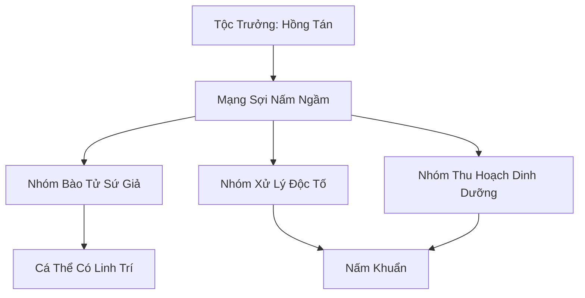

# BÀO TỬ MẬT LÂM TỘC (孢子密林族)

## I. Tổng Quan (总览)
Bào Tử Mật Lâm Tộc là một chủng tộc Vi Tộc độc đáo, đóng vai trò là "hệ thần kinh" và "màng lọc sinh học" của Rừng Huyết Độc tại Nam Cương. Tồn tại dưới dạng hàng vạn cá thể nấm liên kết với nhau bằng mạng sợi ngầm khổng lồ, tộc nhân này âm thầm phân giải các độc tố nguy hiểm và duy trì sự sống cho tầng dưới tán rừng. Dù không có sức mạnh chiến đấu trực diện, khả năng thao túng bào tử khiến họ trở thành một thế lực không thể xem thường trong địa bàn của mình.

## II. Địa Lý & Tài Nguyên (地理 với tài nguyên)
Hoạt động tại tầng đất ẩm ướt và tối tăm nhất của Rừng Huyết Độc. Địa bàn là những thảm nấm dày đặc phủ kín mặt đất, nơi ánh sáng gần như không tồn tại. Tài nguyên chính là khả năng xử lý huyết độc và các loại nấm dược liệu hiếm thấy, có tác dụng thanh lọc linh lực bị ô nhiễm. Mạng sợi nấm ngầm của tộc kết nối trực tiếp với địa mạch, cho phép họ cảm nhận mọi rung động từ sâu dưới lòng đất.

## III. Văn Hóa & Tín Ngưỡng (文化 với信仰)
Đề cao triết lý: "Rừng là cơ thể, ta là tế bào". Mỗi cá thể nấm coi mình là một phần không thể tách rời của hệ sinh thái đại ngàn. Họ không có tôn giáo cá nhân mà tôn thờ sự lan tỏa và cộng sinh. Văn hóa của tộc gắn liền với việc phát tán bào tử - mỗi đợt phát tán là một lần sẻ chia ký ức và tri thức cho toàn bộ quần thể.

## IV. Cơ Cấu Tổ Chức (组织结构)


## V. Công Pháp & Trận Pháp (功法 với阵法)
- **Công Pháp:** Không có công pháp tu luyện nhân tạo, tiến hóa thông qua việc *Phân Giải Linh Lực Độc* từ môi trường để tăng cường mật độ mạng lưới sợi nấm.
- **Trận Pháp:** *Bào Tử Mê Vụ Trận* - trận pháp tự nhiên có khả năng phát tán đám mây bào tử gây ảo giác, tê liệt thần kinh và ăn mòn hộ thể linh lực của những kẻ dám phá hoại thảm nấm.

## VI. Đặc Sản Môn Phái (门派特产)
- **Huyết Độc Linh Nấm:** Loại nấm đã qua tịnh hóa, dùng làm thuốc giải cho các loại độc tố liên quan đến máu.
- **Bào Tử Ánh Sáng:** Bào tử phát quang dùng để chiếu sáng trong môi trường tối tăm mà không cần lửa.

## VII. Cơ Sở Hạ Tầng (基础设施)
- **Thảm Nấm Khổng Lồ:** Kiến trúc sinh học bề mặt đóng vai trò là nơi cư trú và trạm thu phát bào tử.
- **Tổ Nấm Nguyên Thủy:** Trung tâm lưu trữ ký ức sinh học của toàn tộc, nằm tại điểm giao thoa địa mạch sâu nhất.

## VIII. Kinh Tế (経済)
Kinh tế mang tính thụ động. Họ không trực tiếp tham gia giao thương nhưng thỉnh thoảng cung cấp nấm dược liệu cho các bộ lạc bán yêu để đổi lấy các loại linh dịch thúc đẩy sự phát triển của thảm nấm. Giá trị lớn nhất họ mang lại là việc thanh lọc đất đai rừng già một cách miễn phí.

## IX. Lịch Sử Tóm Tắt (简史)
Tồn tại từ khi Rừng Huyết Độc mới hình thành, Bào Tử Mật Lâm Tộc đã chứng kiến sự biến đổi của Nam Cương qua hàng vạn năm. Họ từng là lực lượng chính ngăn chặn sự sụp đổ hoàn toàn của rừng già sau các cuộc chiến thượng cổ. Tuy nhiên, sự bành trướng gần đây của Vạn Độc Môn đang đe dọa nghiêm trọng đến sự tồn vong của mạng lưới nấm cổ xưa này.

## X. Giai Thoại & Bí Mật (轶 sự với bí mật)
Tương truyền Tộc trưởng Hồng Tán có thể cảm nhận được ý chí của chính Rừng Huyết Độc và mỗi khi có một đại năng tu sĩ ngã xuống trong rừng, linh hồn của họ sẽ được mạng sợi nấm thu giữ và chuyển hóa thành kiến thức cho tộc.

## XI. Quan Hệ Thế Lực (势力关系)
```mermaid
graph LR
    BTMLT[Bào Tử Mật Lâm Tộc] -- Cộng sinh -- LKDV[Linh Khuẩn Dược Viên]
    BTMLT -- Bị bóc lột -- VDM[Vạn Độc Môn]
    BTMLT -- Thân thiện -- BYT[Bán Yêu Thôn]
    BTMLT -- Cảnh giác -- ĐMTHĐ[Địa Mạch Thám Hiểm Đội]
```
