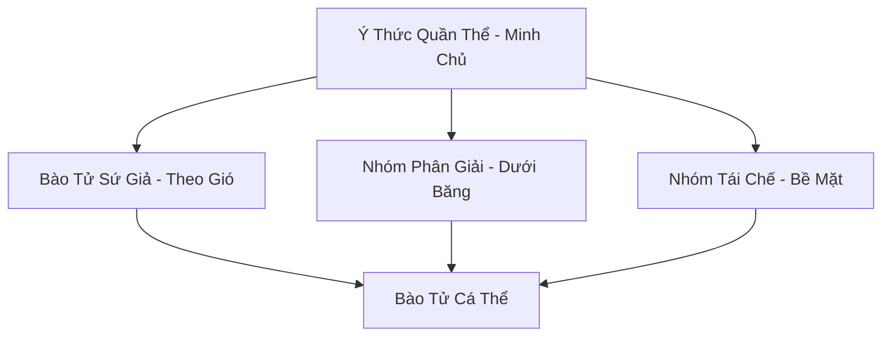

# BÀO TỬ TUYẾT LIÊN MINH (孢子雪联盟)

## I. Tổng Quan (总览)
Bào Tử Tuyết Liên Minh là một dạng sống tập thể nguyên thủy, trải rộng khắp các bình nguyên tuyết trắng của Bắc Băng. Tồn tại dưới dạng hàng tỷ bào tử nhỏ li ti, liên minh này đóng vai trò là "người dọn dẹp" vĩ đại của đại dương băng giá. Họ chuyên phân giải xác của những cường giả và yêu thú chết từ thời thượng cổ, tái chế nguồn linh lực tàn dư bị kẹt trong băng và trả lại sự thanh khiết cho thiên địa. Dù không có hình hài cụ thể, ý thức tập thể của họ là một phần không thể thiếu trong sự cân bằng linh khí phương Bắc.

## II. Địa Lý & Tài Nguyên (地理 với tài nguyên)
Địa bàn hoạt động là các vùng tundra mở, đặc biệt tập trung tại những nơi từng diễn ra các cuộc đại chiến thượng cổ. Tài nguyên quý giá nhất của liên minh là khả năng thu thập và nén "Linh Khí Tàn Dư" thành các tinh thể nhỏ (Tuyết Linh Phấn) - một loại nguyên liệu cực kỳ hiếm dùng để hồi phục thần thức và gia tăng thọ nguyên cho tu sĩ cấp cao.

## III. Văn Hóa & Tín Ngưỡng (文化 với信仰)
Đề cao triết lý: "Cái chết nuôi dưỡng sự sống". Họ không có tôn giáo hay lễ nghi cá nhân, mọi hành động đều tuân theo bản năng tập thể nhằm tối ưu hóa việc tịnh hóa môi trường. Văn hóa của liên minh là sự lan tỏa - khi một khu vực được thanh lọc xong, các bào tử sẽ theo gió cuốn đi để tìm kiếm những vùng đất chết khác, mang theo ký ức của vạn vật vào vòng luân hồi mới.

## IV. Cơ Cấu Tổ Chức (组织结构)


## V. Công Pháp & Trận Pháp (功法 với阵法)
- **Công Pháp:** Không có công pháp tu luyện nhân tạo, tiến hóa thông qua việc *Chuyển Hóa Tử Khí Thượng Cổ* thành năng lượng sống cho quần thể.
- **Trận Pháp:** *Tuyết Vực Tịnh Hóa Trận* - toàn bộ thảm nấm tuyết hoạt động như một trận pháp thanh tẩy diện rộng, có khả năng hóa giải các loại tà thuật nguyền rủa bám trên di vật cổ đại trong phạm vi hàng trăm dặm.

## VI. Đặc Sản Môn Phái (门派特产)
- **Tuyết Linh Phấn:** Loại bụi mịn phát sáng có tác dụng tịnh hóa linh mạch bị ô nhiễm ma khí hoặc độc tố.
- **Hổ Phách Tuyết:** Nhựa cây đóng băng chứa bào tử cổ đại, có khả năng lưu giữ một phần linh hồn tàn dư.

## VII. Cơ Sở Hạ Tầng (基础设施)
- **Thảm Bào Tử Vạn Năm:** Lớp bao phủ bề mặt dày đặc tại các điểm nút địa mạch chiến trường cổ.
- **Hạch Tâm Ý Thức:** Những khối băng lớn chứa nồng độ bào tử cao nhất, nơi tập trung thần thức của toàn liên minh.

## VIII. Kinh Tế (経済)
Kinh tế hoàn toàn mang tính thụ động và sinh thái. Giá trị họ mang lại cho Bắc Băng là việc duy trì sự ổn định của linh khí. Tuy nhiên, một số thế lực như Bạch Cốt Hội thường lén lút thu hoạch Tuyết Linh Phấn để bán trên thị trường đen với giá cắt cổ.

## IX. Lịch Sử Tóm Tắt (简史)
Xuất hiện tự nhiên từ kỷ nguyên Thái Cổ, ngay sau khi những cuộc chiến thần ma đầu tiên kết thúc. Bào Tử Tuyết đã âm thầm tồn tại và thực hiện nhiệm vụ của mình qua hàng triệu năm, đóng vai trò là nhân chứng lặng lẽ cho sự hưng vong của muôn loài dưới lớp băng lạnh lẽo.

## X. Giai Thoại & Bí Mật (轶 sự với bí mật)
Tương truyền ý thức tập thể của liên minh nắm giữ toàn bộ ký ức của những cường giả đã ngã xuống trên chiến trường cổ, và nếu ai có thể kết nối được với thần thức này, họ sẽ sở hữu tri thức của toàn bộ kỷ nguyên trước.

## XI. Quan Hệ Thế Lực (势力关系)
```mermaid
graph LR
    BTLM[Bào Tử Tuyết Liên Minh] -- Bị lợi dụng -- BCH[Bạch Cốt Hội]
    BTLM -- Tịnh hóa -- ALL[Hệ sinh thái Bắc Băng]
    BTLM -- Cạnh tranh -- HĐVTD[Hàn Độc Vi Trùng Đoàn]
    BTLM -- Vô hại -- CQTĐ[Cực Quang Thần Điện]
```
