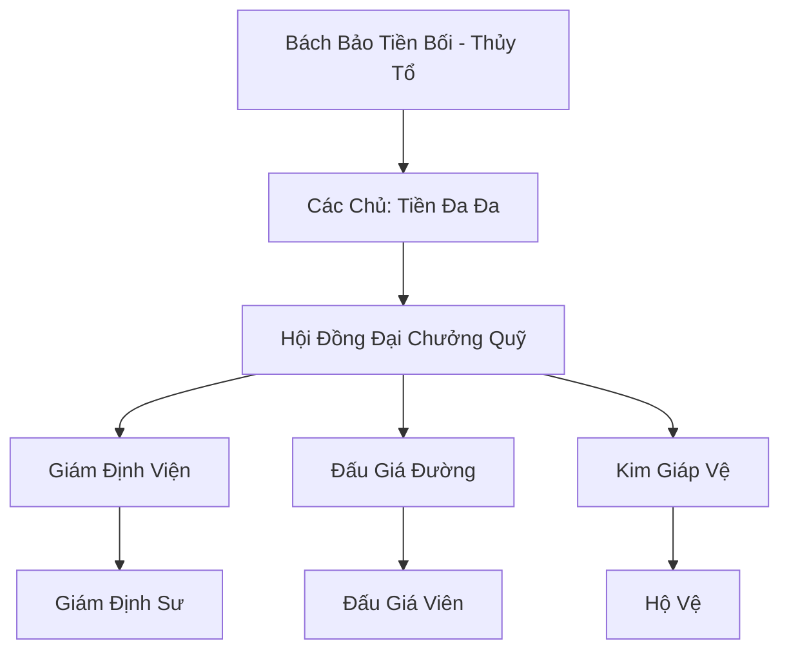

# BÁCH BẢO CÁC (百宝阁)

## I. Tổng Quan (总览)
Bách Bảo Các là thực thể kinh tế hùng mạnh nhất Cố Nguyên Giới, nắm giữ huyết mạch giao thương tài nguyên tu luyện của toàn bộ lục địa. Với triết lý "Tiền có thể thông thần", họ giữ vị thế trung lập tuyệt đối để có thể làm ăn với mọi phe phái, từ các tông môn chính đạo đến những thế lực ma đạo ẩn mình.

## II. Địa Lý & Tài Nguyên (地理 với tài nguyên)
Trụ sở chính đặt tại Bách Bảo Thành - thành phố xa hoa nhất nằm ở trung tâm lục địa, nơi hội tụ của mọi tuyến đường thương mại. Bách Bảo Các sở hữu hệ thống kho bãi "Vạn Bảo Lâu" được bảo vệ bởi hàng lớp trận pháp không gian, chứa đựng lượng tài bảo có thể nuôi sống cả một đại tông môn trong hàng nghìn năm.

## III. Văn Hóa & Tín Ngưỡng (文化与信仰)
Tôn thờ sự thịnh vượng và uy tín trong kinh doanh. Thành viên Bách Bảo Các tin rằng linh thạch là thước đo chính xác nhất cho giá trị của một tu sĩ. Văn hóa của họ đề cao sự khéo léo trong giao tiếp, khả năng nhìn người và sự quyết đoán trong các thương vụ lớn.

## IV. Cơ Cấu Tổ Chức (组织结构)


## V. Công Pháp & Trận Pháp (功法 với阵法)
- **Công Pháp:** *Kim Tiền Đại Đạo* (Chuyển hóa linh thạch thành lực tấn công), *Linh Nhãn Thông* (Nhìn thấu bảo vật).
- **Trận Pháp:** *Thiên Nhãn Trận* - mạng lưới giám sát toàn cầu cho phép Bách Bảo Các theo dõi sự biến động giá cả và di chuyển của các món hàng quý hiếm.

## VI. Đặc Sản Môn Phái (门派特产)
- **Bách Bảo Lệnh:** Thẻ bài đại diện cho tư cách khách hàng VIP, có khả năng triệu hồi hộ vệ hoặc yêu cầu đấu giá khẩn cấp.
- **Linh Thạch Tinh Khiết:** Loại linh thạch được lọc sạch tạp chất, có giá trị trao đổi cao hơn thông thường.

## VII. Cơ Sở Hạ Tầng (基础设施)
- **Vạn Bảo Lâu:** Tòa tháp đa tầng chứa hàng triệu bảo vật, mỗi tầng là một không gian độc lập.
- **Hệ thống Truyền Tống Trận riêng:** Cho phép vận chuyển hàng hóa thần tốc giữa các chi nhánh.

## VIII. Kinh Tế (经济)
Nguồn thu chính đến từ phí hoa hồng trong các buổi đấu giá và việc kinh doanh độc quyền các loại công pháp, đan dược cao cấp. Họ cũng hoạt động như một ngân hàng khổng lồ, cho các tông môn vay linh thạch với lãi suất thế chấp bằng địa bàn hoặc bí kíp.

## IX. Lịch Sử Tóm Tắt (简史)
Khởi đầu từ một thương đoàn nhỏ thời Thái Cổ, Bách Bảo Tiền Bối đã xây dựng uy tín bằng cách luôn cung cấp hàng thật với giá sòng phẳng. Qua hàng vạn năm, bằng cách thâu tóm các thương hội nhỏ và mở rộng mạng lưới, Bách Bảo Các đã trở thành một đế chế không thể sụp đổ.

## X. Giai Thoại & Bí Mật (轶 sự với bí mật)
Có lời đồn rằng Các Chủ Tiền Đa Đa sở hữu một "Rương Báu Vô Tận", có thể lấy ra bất kỳ món đồ nào trên thế gian nếu người mua trả đủ cái giá bằng linh hồn.

## XI. Quan Hệ Thế Lực (势力关系)
```mermaid
graph LR
    BBC[Bách Bảo Các] -- Cạnh tranh -- TSTH[Thiên Sa Thương Hội]
    BBC -- Đối tác -- TAM[Thái Ất Môn]
    BBC -- Cung cấp -- DCHH[Đại Càn Hoàng Triều]
    BBC -- Giao dịch ngầm -- CUMT[Cửu U Ma Tông]
```
