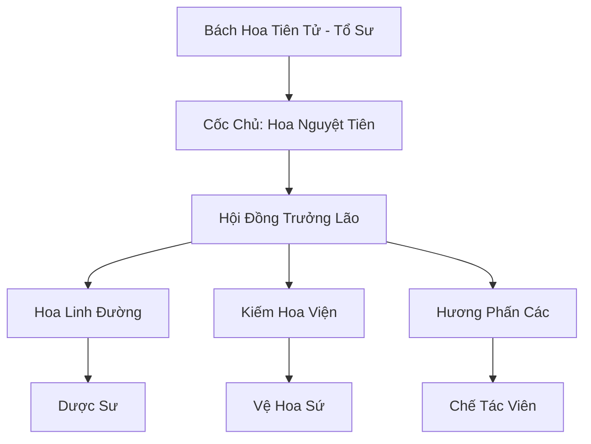

# BÁCH HOA CỐC (百花谷)

## I. Tổng Quan (总览)
Bách Hoa Cốc là tông môn nữ tu danh tiếng nhất Đông Hoang, nổi bật với sự kết hợp giữa vẻ đẹp thanh cao và sức mạnh mộc hệ huyền diệu. Tông môn không chỉ là một cơ sở tu luyện mà còn là một thánh địa trị liệu, nơi cung cấp những loại linh dược quý hiếm nhất lục địa.

## II. Địa Lý & Tài Nguyên (地理与 tài nguyên)
Ẩn mình trong một thung lũng được bảo vệ bởi những rặng núi đá dựng đứng, nơi đây có khí hậu bốn mùa như xuân. Thung lũng sở hữu Vườn Hoa Linh Cảm - nơi quy tụ hàng vạn loài hoa linh dược có khả năng tự hấp thụ linh khí trời đất, tạo nên một môi trường tu luyện mộc hệ hoàn hảo.

## III. Văn Hóa & Tín Ngưỡng (文化与信仰)
Tôn thờ Bách Hoa Tiên Tử và triết lý "Vạn Vật Hữu Linh, Hoa Khai Kiến Đạo". Đệ tử Bách Hoa Cốc đề cao sự dịu dàng nhưng kiên cường, coi trọng nghệ thuật và sự hòa hợp. Mỗi đệ tử khi nhập môn đều chọn cho mình một loài hoa bản mệnh để tu luyện.

## IV. Cơ Cấu Tổ Chức (组织结构)


## V. Công Pháp & Trận Pháp (功法与阵法)
- **Công Pháp:** *Bách Hoa Diễn Nghĩa* (Biến hóa linh hoạt), *Linh Hoa Kiếm Quyết* (Kiếm pháp thanh thoát).
- **Trận Pháp:** *Bách Hoa Trận* - một đại trận ảo giác dựa trên hương thơm và sắc màu, có khả năng ru ngủ hoặc làm hỗn loạn thần thức quân địch.

## VI. Đặc Sản Môn Phái (门派特产)
- **Bách Hoa Linh Sương:** Tinh chất thu thập từ cánh hoa buổi sớm, có tác dụng thanh tẩy tâm hồn và hồi phục linh lực.
- **Phấn Hoa Mê Hồn:** Loại bột mịn có khả năng tạo ra ảo giác ngắn hạn khi tiếp xúc.

## VII. Cơ Sở Hạ Tầng (基础设施)
- **Hương Sắc Điện:** Trung tâm của cốc, nơi đặt linh vị tổ sư và tổ chức các lễ hội hoa.
- **Hồ Hương Sắc:** Hồ nước trung tâm chứa đựng linh dịch hòa tan từ phấn hoa, là nơi rèn luyện của các đệ tử cấp cao.

## VIII. Kinh Tế (经济)
Nguồn thu khổng lồ từ việc cung cấp linh dược và dịch vụ chữa thương cho các tông môn chính đạo. Họ cũng nắm giữ thị trường hương liệu cao cấp và các loại mỹ phẩm linh khí dành cho nữ tu sĩ khắp lục địa.

## IX. Lịch Sử Tóm Tắt (简史)
Được sáng lập bởi Bách Hoa Tiên Tử vào thời Trung Cổ, người đã tìm thấy thung lũng này trong một lần bị thương nặng và được vạn hoa chữa lành. Bà đã lập ra môn phái để che chở cho những nữ tu muốn tìm kiếm sự bình yên giữa thế giới tu chân đầy khốc liệt.

## X. Giai Thoại & Bí Mật (轶 sự với bí mật)
Tương truyền "Nước mắt hoa hồng" của Bách Hoa Tiên Tử vẫn còn lưu lại trong hồ Hương Sắc, và ai có duyên tìm được sẽ đạt đến cảnh giới mộc tu tối thượng.

## XI. Quan Hệ Thế Lực (势力关系)
```mermaid
graph LR
    BHC[Bách Hoa Cốc] -- Đồng minh -- TAM[Thái Ất Môn]
    BHC -- Tử địch -- HHT[Hợp Hoan Tông]
    BHC -- Đối tác -- DVC[Dược Vương Cốc]
```
