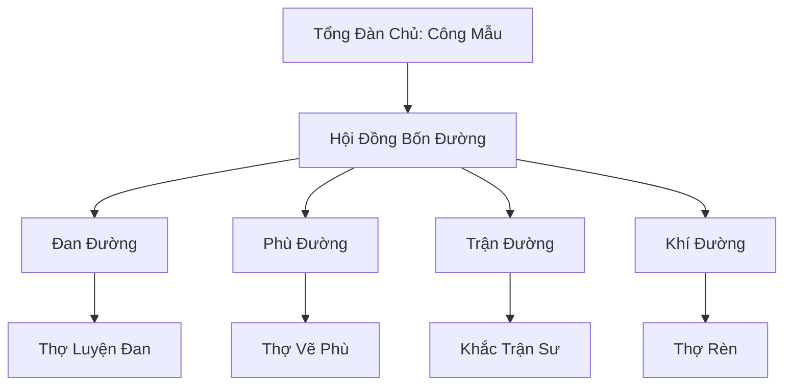

# BÁCH NGHỆ PHƯỜNG TỔNG ĐÀN (百藝坊总坛)

## I. Tổng Quan (总览)
Bách Nghệ Phường Tổng Đàn là một nghiệp đoàn dành cho các tán tu có thiên hướng nghệ nhân, tọa lạc tại một thung lũng yên bình phía nam Đông Hoang. Với triết lý "Nghề tinh hơn tu cao", hội tập trung vào việc sản xuất các vật phẩm tu luyện giá rẻ, chất lượng ổn định, phục vụ cho tầng lớp tu sĩ bình dân và phàm nhân giàu có.

## II. Địa Lý & Tài Nguyên (地理 với tài nguyên)
Trụ sở nằm trong một thung lũng hẻo lánh có suối nước nóng linh lực chảy qua, giúp duy trì nhiệt độ lý tưởng cho các phòng luyện đan. Đất đai vùng này giàu khoáng chất thô, cung cấp nguồn nguyên liệu tại chỗ dồi dào cho các thợ rèn và thợ vẽ phù.

## III. Văn Hóa & Tín Ngưỡng (文化 với信仰)
Đề cao tinh thần lao động và sự khéo léo. Thành viên của hội coi việc hoàn thiện một món pháp bảo cũng là một hình thức tu hành. Hàng năm vào mùa xuân, hội tổ chức "Bách Nghệ Tỷ Thí", nơi các thợ nghề so tài kỹ thuật thay vì chiến đấu bằng vũ lực.

## IV. Cơ Cấu Tổ Chức (组织结构)


## V. Công Pháp & Trận Pháp (功法 với阵法)
- **Công Pháp:** Không có công pháp chiến đấu chính thống, chủ yếu tu luyện các bí thuật hỗ trợ như *Linh Hỏa Khống Chế Thuật*, *Thần Thức Đa Luồng*.
- **Trận Pháp:** Sử dụng hệ thống trận pháp liên kết giữa các lò luyện để tối ưu hóa việc phân bổ linh lực và nhiệt lượng.

## VI. Đặc Sản Môn Phái (门派特产)
- **Bách Nghệ Đan:** Loại đan dược phổ thông giúp phục hồi linh lực nhanh chóng với giá thành rẻ.
- **Phù Lục Tán Tu:** Các loại bùa chú tiện dụng cho cuộc sống hàng ngày (nhóm lửa, lọc nước, phát sáng).

## VII. Cơ Sở Hạ Tầng (基础设施)
- **Vạn Nghệ Lầu:** Trung tâm điều hành và là nơi trưng bày sản phẩm tiêu biểu của hội.
- **Hệ thống Lò Luyện Trung Tâm:** Khu vực lò nung quy mô lớn cho phép hàng trăm thợ cùng làm việc một lúc.

## VIII. Kinh Tế (経済)
Nguồn thu chủ yếu đến từ việc bán lẻ sản phẩm cho tán tu và các hợp đồng cung cấp hàng sỉ cho các thương hội nhỏ. Tổng đàn thu phí thành viên bằng cách trích 20% lợi nhuận từ mỗi món đồ bán ra để duy trì cơ sở hạ tầng.

## IX. Lịch Sử Tóm Tắt (简史)
Được thành lập 100 năm trước bởi Công Mẫu, một nữ đan sư có tài nhưng bị Đan Hà Cốc xua đuổi. Bà muốn tạo ra một nơi mà những tu sĩ không có tư chất chiến đấu vẫn có thể khẳng định giá trị bản thân thông qua đôi bàn tay khéo léo.

## X. Giai Thoại & Bí Mật (轶 sự với bí mật)
Đồn rằng trong mật thất của Đan Đường có một chiếc lò luyện cổ đại bị phong ấn, tương truyền nếu kích hoạt được nó sẽ có thể luyện ra "Cải Mệnh Đan" - loại đan dược thay đổi linh căn.

## XI. Quan Hệ Thế Lực (势力关系)
```mermaid
graph LR
    BNPTĐ[Bách Nghệ Phường Tổng Đàn] -- Khách hàng -- TSTH[Thiên Sa Thương Hội]
    BNPTĐ -- Tránh né -- HSM[Huyết Sát Minh]
    BNPTĐ -- Cạnh tranh -- SLC[Thạch Linh Cung]
    BNPTĐ -- Cũ kỹ -- ĐHC[Đan Hà Cốc]
```
