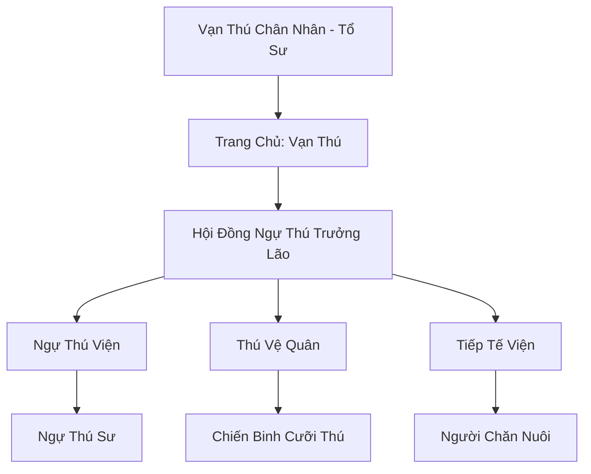

# BÁCH THÚ SƠN TRANG (百兽山庄)

## I. Tổng Quan (总览)
Bách Thú Sơn Trang là thế lực ngự thú hàng đầu Cố Nguyên Giới, nổi tiếng với khả năng khống chế và cộng sinh với hàng vạn loài yêu thú khác nhau. Tọa lạc tại vùng đồi núi giao thoa giữa Đông Hoang và Nam Cương, sơn trang đóng vai trò là trạm trung chuyển tài nguyên sinh học lớn nhất lục địa. Họ cung cấp từ những loài linh thú đưa thư nhỏ nhắn đến những con đại yêu chiến đấu khổng lồ, giữ vai trò quan trọng trong việc tăng cường sức mạnh cho các tông môn nhân tộc.

## II. Địa Lý & Tài Nguyên (地理 với tài nguyên)
Trụ sở chính bao phủ hàng chục ngọn đồi xanh mướt, mỗi ngọn đồi được cải tạo thành một hệ sinh thái riêng biệt cho từng loài thú (Rừng cho tẩu thú, hồ cho thủy tộc, vách đá cho phi cầm). Sơn trang sở hữu "Vạn Thú Mạch" - mạch linh khí có khả năng kích thích sự tiến hóa và khai mở linh trí cho động vật, cùng với các khu bảo tồn chứa đựng những loài yêu thú hiếm có nguy cơ tuyệt chủng.

## III. Văn Hóa & Tín Ngưỡng (文化 với信仰)
Tôn thờ Vạn Thú chân nhân và triết lý "Người và Thú cùng chung một Đạo". Đệ tử sơn trang dành phần lớn thời gian sống và tu tập cùng linh thú bản mệnh của mình. Văn hóa của họ rất thực dụng, am hiểu sâu sắc về sinh học và tự nhiên. Sự thăng tiến trong môn phái không chỉ dựa trên tu vi cá nhân mà còn dựa trên cấp độ và số lượng thú mà tu sĩ đó có thể điều khiển.

## IV. Cơ Cấu Tổ Chức (组织结构)


## V. Công Pháp & Trận Pháp (功法 với阵法)
- **Công Pháp:** *Vạn Thú Quyết* (Kết nối thần thức), *Đồng Sinh Cộng Tử Ấn* (Chia sẻ sát thương và sinh lực với thú).
- **Trận Pháp:** *Bách Thú Quy Tâm Trận* - đại trận có khả năng trấn áp hung tính của yêu thú hoang dã diện rộng hoặc tập hợp sức mạnh của hàng vạn linh thú thành một đòn tấn công hủy diệt.

## VI. Đặc Sản Môn Phái (门派特产)
- **Thú Noãn (Trứng linh thú):** Các loại trứng yêu thú đã được sàng lọc và đảm bảo tư chất tốt.
- **Thú Linh Đan:** Loại thuốc giúp tăng tốc độ trưởng thành và đột phá cảnh giới cho yêu thú.

## VII. Cơ Sở Hạ Tầng (基础设施)
- **Vạn Thú Đài:** Sân đấu và sàn giao dịch linh thú quy mô lớn nhất thế giới.
- **Hệ thống Chuồng Trại Phù Văn:** Các khu vực nuôi nhốt có khả năng tự điều chỉnh môi trường sống theo thuộc tính của từng loài.

## VIII. Kinh Tế (経済)
Nguồn thu khổng lồ từ việc buôn bán và cho thuê linh thú cho mọi thế lực trên lục địa. Họ cũng nắm giữ thị trường vật liệu yêu thú (da, sừng, nội đan) và cung cấp dịch vụ huấn luyện thú chuyên nghiệp cho các quý tộc và tu sĩ tự do.

## IX. Lịch Sử Tóm Tắt (简史)
Sáng lập bởi Vạn Thú chân nhân, một tán tu có khả năng đặc biệt trong việc giao tiếp với dã thú. Ông đã tập hợp những người có cùng thiên phú để xây dựng nên một nơi trú ẩn cho cả người và thú, dần dần phát triển thành một đế chế kinh tế và quân sự có vị thế không thể lay chuyển tại Đông Hoang.

## X. Giai Thoại & Bí Mật (轶 sự với bí mật)
Tương truyền sâu trong cấm địa của sơn trang có cất giữ một viên "Vạn Thú Linh Châu", thứ chứa đựng linh hồn của mọi loài yêu thú đã từng tồn tại trên thế gian, cho phép người sở hữu triệu hồi quân đoàn linh hồn thú vạn năm.

## XI. Quan Hệ Thế Lực (势力关系)
```mermaid
graph LR
    BTS[Bách Thú Sơn Trang] -- Cung cấp -- DCHH[Đại Càn Hoàng Triều]
    BTS -- Xung đột -- TYD[Thiên Yêu Đình]
    BTS -- Đối tác -- TCV[Tiên Cầm Viện]
    BTS -- Giao thương -- BBC[Bách Bảo Các]
```
