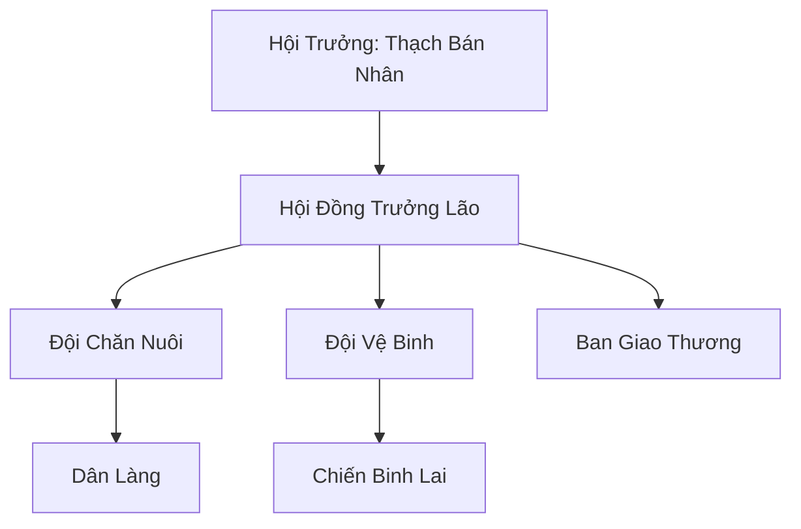

# BÁN CỰ NHÂN HỘI (半巨人会)

## I. Tổng Quan (总览)
Bán Cự Nhân Hội là một cộng đồng nhỏ gồm những cá thể hỗn huyết giữa Nhân Tộc và Cự Tộc, cư ngụ tại vùng tundra khắc nghiệt của Bắc Băng. Bị coi là "những kẻ lai tạp" và bị cả hai chủng tộc thuần huyết khinh bỉ, họ đã tập hợp lại để cùng nhau sinh tồn và bảo vệ phẩm giá của mình. Đây là nơi duy nhất mà kích thước cơ thể không quyết định vị thế, nơi những cá thể mang hai dòng máu có thể tìm thấy sự đồng cảm.

## II. Địa Lý & Tài Nguyên (地理 với tài nguyên)
Làng của hội nằm giữa một đồng bằng tuyết mênh mông, xa cách các tuyến đường hành chính lớn. Địa hình tundra trống trải khiến họ dễ bị bão tuyết tấn công nhưng lại an toàn trước sự dòm ngó của các thế lực lớn. Tài nguyên chủ yếu là một đàn gia súc đặc chủng có khả năng chịu lạnh cực tốt và những khoảnh đất hiếm hoi có thể trồng trọt được các loại ngũ cốc băng giá.

## III. Văn Hóa & Tín Ngưỡng (文化 với信仰)
Đề cao triết lý: "Nửa người nửa khổng lồ, trọn vẹn chính mình". Cư dân hội tự hào về sức mạnh thể chất của Cự Tộc kết hợp với trí tuệ linh hoạt của Nhân Tộc. Nghi lễ trưởng thành đặc trưng là việc nâng một tảng đá nặng gấp ba lần trọng lượng cơ thể để chứng minh sự thức tỉnh của huyết mạch.

## IV. Cơ Cấu Tổ Chức (组织结构)


## V. Công Pháp & Trận Pháp (功法 với阵法)
- **Công Pháp:** Chưa có công pháp chính thống, chủ yếu tu luyện các kỹ thuật *Huyết Mạch Cường Hóa* tự phát và các bài tập luyện thể thô sơ.
- **Trận Pháp:** Sử dụng các cọc đá phù văn đơn giản để tạo ra một vùng chắn gió và giữ ấm cho khu vực trung tâm làng.

## VI. Đặc Sản Môn Phái (门派特产)
- **Sữa Tuyết Ngưu:** Loại sữa đặc, giàu năng lượng và linh lực, giúp tu sĩ giữ ấm cơ thể trong thời gian dài.
- **Thạch Khí Thô:** Các công cụ bằng đá được mài giũa tỉ mỉ, có độ bền vượt trội so với đồ dùng nhân tộc thông thường.

## VII. Cơ Sở Hạ Tầng (基础设施)
- **Thạch Điện Sơ Khai:** Tòa nhà lớn nhất làng làm từ đá tảng, nơi hội họp và trú ẩn khi có bão lớn.
- **Hệ thống Chuồng Thú Ngầm:** Các hang đá dưới lòng đất dùng để bảo vệ đàn gia súc trong mùa đông.

## VIII. Kinh Tế (経済)
Nền kinh tế mang tính tự cung tự cấp. Hội trao đổi sức lao động của các chiến binh lai (làm những công việc nặng nhọc như phá băng, vận chuyển đá) cho các thành bang phương Bắc để đổi lấy thực phẩm và các bản sao công pháp tu luyện cơ bản.

## IX. Lịch Sử Tóm Tắt (简史)
Được thành lập 60 năm trước bởi Thạch Bán Nhân, một chiến binh mang dòng máu lai bị trục xuất khỏi bộ lạc cự nhân thuần huyết. Ông đã dành cả đời để tìm kiếm và tập hợp những người đồng cảnh ngộ, xây dựng nên một mái nhà chung giữa tuyết trắng để chống lại sự cô lập của thế giới.

## X. Giai Thoại & Bí Mật (轶 sự với bí mật)
Tương truyền trong làng đang nuôi dưỡng một đứa trẻ mang trong mình ba dòng máu: Cự, Nhân và một dòng máu thần bí khác, được dự đoán là sẽ trở thành người dẫn dắt hội đạt đến một vị thế mới trong tương lai.

## XI. Quan Hệ Thế Lực (势力关系)
```mermaid
graph LR
    BCNH[Bán Cự Nhân Hội] -- Đồng cảnh -- TCNLĐ[Tuyết Cự Nhân Lạc Đoàn]
    BCNH -- Trao đổi -- HDHVĐ[Hàn Dân Hộ Vệ Đội]
    BCNH -- Bị khinh bỉ -- CTTH[Cự Tộc Thuần Huyết]
    BCNH -- Tránh né -- HBC[Huyền Băng Cung]
```
