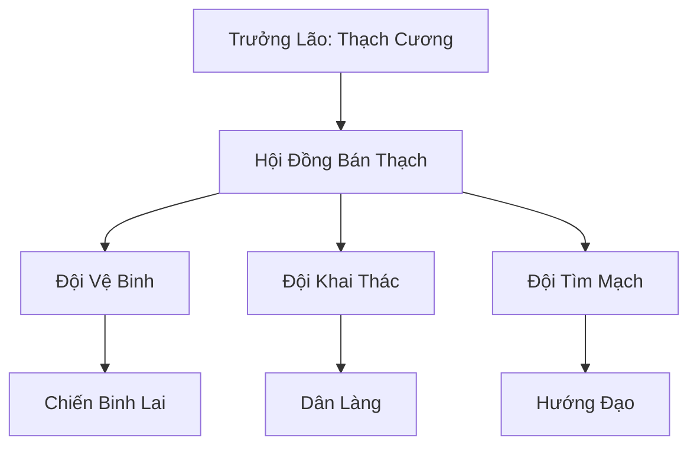

# BÁN THẠCH CỰ NHÂN (半石巨人)

## I. Tổng Quan (总览)
Bán Thạch Cự Nhân là một cộng đồng đặc thù gồm những cá thể mang hai dòng máu Cự Tộc và Thạch Tộc. Sự kết hợp giữa nhục thân mạnh mẽ của người khổng lồ và lớp da đá cứng cáp của thạch nhân tạo nên những sinh vật có sức chống chịu phi thường. Bị cả hai chủng tộc gốc từ bỏ, họ chọn sinh sống tại những vùng đất hoang tàn mà không ai tranh giành, xây dựng một bản sắc riêng biệt dựa trên sự bền bỉ và tự do.

## II. Địa Lý & Tài Nguyên (地理 với tài nguyên)
Cư ngụ tại vùng đá hoang hiểm trở giữa rìa Hoàng Kim Sa Hải và Vĩnh Tịch Chi Địa. Đây là khu vực khô cằn, khắc nghiệt với đa số các chủng tộc khác nhưng lại là nơi lý tưởng để Bán Thạch Cự Nhân ẩn mình. Tài nguyên chính là những mạch nước ngầm bí mật được họ tìm thấy thông qua khả năng cảm nhận địa mạch và các loại khoáng vật thô cấp thấp rải rác trong đá.

## III. Văn Hóa & Tín Ngưỡng (文化 với信仰)
Đề cao triết lý: "Nửa thịt nửa đá — không thuộc về ai, nhưng vẫn tồn tại". Họ tôn trọng sự khác biệt trong cấu tạo cơ thể của mỗi cá nhân. Văn hóa cộng đồng mang đậm tính chia sẻ và thấu hiểu nỗi đau chung bị ruồng bỏ. Nghi thức quan trọng nhất là "Lễ Tụ Thạch", nơi cả cộng đồng cùng nhau cầu nguyện cho những đứa trẻ mới sinh có được sự cân bằng giữa hai huyết mạch.

## IV. Cơ Cấu Tổ Chức (组织结构)


## V. Công Pháp & Trận Pháp (功法 với阵法)
- **Công Pháp:** Hiện tại chưa có công pháp hoàn chỉnh, chủ yếu dựa vào *Thân Thể Cường Hóa* bẩm sinh và các kỹ thuật chiến đấu tay không tận dụng lớp da đá.
- **Trận Pháp:** Sử dụng các cột đá tự nhiên sắp xếp theo quy luật để tạo ra các vùng nhiễu loạn thần thức cấp thấp, ngăn chặn sự xâm nhập của những kẻ tò mò.

## VI. Đặc Sản Môn Phái (门派特产)
- **Thạch Nhũ Linh Dịch:** Loại nước tinh khiết nhỏ ra từ các kẽ đá trong hang sâu, có tác dụng tăng cường độ cứng cho da thịt.
- **Cốt Thạch Vũ Khí:** Các loại vũ khí thô sơ làm từ sự kết hợp giữa xương yêu thú lớn và đá thạch anh.

## VII. Cơ Sở Hạ Tầng (基础设施)
- **Hang Đá Tảng:** Hệ thống hang động khổng lồ được gia cố bằng sức mạnh thể chất, nơi ở của toàn bộ cộng đồng.
- **Bể Chứa Nước Ngầm:** Công trình quan trọng nhất duy trì sự sống giữa vùng đất hoang.

## VIII. Kinh Tế (経済)
Nền kinh tế hoàn toàn mang tính tự cung tự cấp và trao đổi vật phẩm. Họ đổi các loại quặng thô và dịch vụ dẫn đường qua vùng đá hoang cho Đại Mạc Gác Đêm hoặc các thương đoàn nhỏ để lấy nhu yếu phẩm cần thiết.

## IX. Lịch Sử Tóm Tắt (简史)
Được hình thành từ hàng trăm năm trước khi những cá thể bị ruồng bỏ từ hai tộc Cự và Thạch tình cờ gặp nhau tại biên giới. Thạch Cương - một chiến binh mang nỗi hận sâu sắc với cả hai tộc - đã quyết định dừng chân và lập nên cộng đồng này, biến vùng đất hoang thành pháo đài cuối cùng của những kẻ không quê hương.

## X. Giai Thoại & Bí Mật (轶 sự với bí mật)
Tương truyền phần đá trên cơ thể của Thạch Cương có khả năng "thì thầm" những lời cảnh báo của đại địa, giúp ông biết trước được các cơn chấn động hoặc sự xuất hiện của kẻ thù từ xa.

## XI. Quan Hệ Thế Lực (势力关系)
```mermaid
graph LR
    BTC[Bán Thạch Cự Nhân] -- Thân thiện -- ĐMGĐ[Đại Mạc Gác Đêm]
    BTC -- Tránh né -- CTTH[Cự Tộc Thuần Huyết]
    BTC -- Cảnh giác -- STLM[Sa Tặc Liên Minh]
    BTC -- Trung lập -- ALL[Mọi Thế Lực]
```
