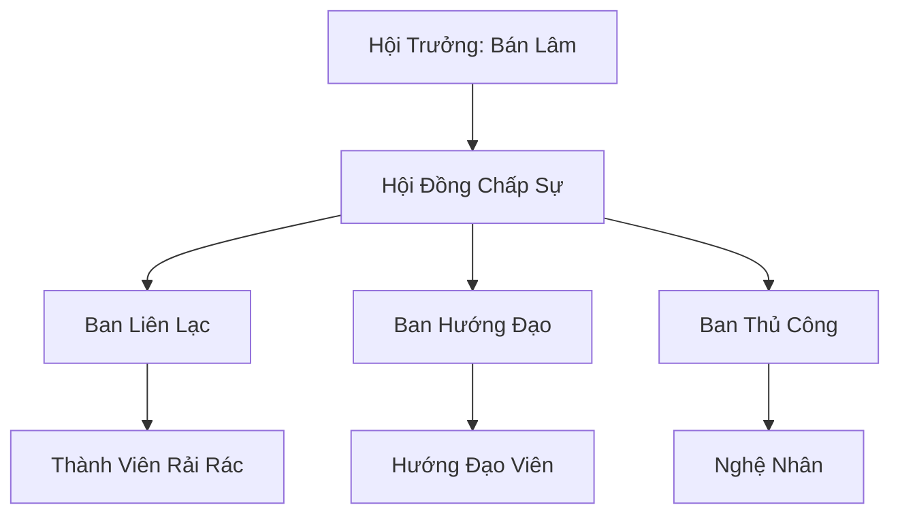

# BÁN TINH LINH HỘI (半精灵会)

## I. Tổng Quan (总览)
Bán Tinh Linh Hội là một tổ chức tương trợ dành cho những cá thể mang hai dòng máu Tinh Linh và Nhân Tộc. Sống trong một thế giới nơi sự thuần huyết được coi trọng, các bán tinh linh thường phải đối mặt với sự ghẻ lạnh và xua đuổi. Hội ra đời như một mái nhà chung, nơi họ có thể khẳng định bản sắc riêng và bảo vệ quyền lợi của những kẻ "đứng giữa hai thế giới".

## II. Địa Lý & Tài Nguyên (地理 với tài nguyên)
Trụ sở chính là một cụm nhà gỗ đơn sơ nằm ẩn mình tại bìa rừng phía nam Vĩnh Hằng Sâm Lâm. Đây là vùng đệm giữa lãnh thổ của Vương Đình và các thành bang nhân tộc, nơi cả hai bên đều không mặn mà quản lý. Tài nguyên của hội rất hạn chế, chủ yếu dựa vào việc thu hái linh quả tự nhiên và các loại vật liệu thủ công từ rừng thưa.

## III. Văn Hóa & Tín Ngưỡng (文化 với信仰)
Đề cao triết lý: "Nửa này nửa kia, nhưng vẫn là một con người hoàn chỉnh". Thành viên hội tin rằng sự kết hợp huyết mạch là một món quà thay vì một lời nguyền. Văn hóa hội mang đậm tính hòa hợp, kết hợp sự tinh tế của tinh linh và tính thực dụng của con người. Buổi họp mặt hàng năm là dịp để họ chia sẻ những câu chuyện về sự kỳ thị và cách vượt qua chúng.

## IV. Cơ Cấu Tổ Chức (组织结构)


## V. Công Pháp & Trận Pháp (功法 với阵法)
- **Công Pháp:** Chưa có hệ thống công pháp riêng biệt. Thành viên thường tự biến tấu các bài tu luyện cơ bản để phù hợp với thể chất lai, tập trung vào khả năng cảm nhận linh khí rừng rậm một cách linh hoạt.
- **Trận Pháp:** Sử dụng các loại bẫy dây leo và báo động bằng bướm giấy đơn giản để bảo vệ nơi cư trú.

## VI. Đặc Sản Môn Phái (门派特产)
- **Trang Sức Gỗ Linh:** Các món đồ thủ công tinh xảo kết hợp giữa kỹ thuật điêu khắc nhân tộc và cảm quan thẩm mỹ tinh linh.
- **Bản Đồ Bìa Rừng:** Các bản ghi chép chi tiết về các lối đi bí mật và khu vực nguy hiểm quanh Vĩnh Hằng Sâm Lâm.

## VII. Cơ Sở Hạ Tầng (基础设施)
- **Nhà Gỗ Cộng Đồng:** Nơi ở và sinh hoạt chung của các thành viên thường trực.
- **Trạm Tin Bướm Giấy:** Hệ thống trạm nhỏ dùng để thu phát các thông điệp ngắn thông qua pháp thuật bướm giấy.

## VIII. Kinh Tế (経済)
Kinh tế dựa trên việc cung cấp dịch vụ dẫn đường cho các đoàn thám hiểm và thương nhân muốn tiếp cận bìa rừng. Họ cũng trao đổi các thông tin tình báo về biến động khí hậu và yêu thú khu vực biên giới để đổi lấy nhu yếu phẩm tu luyện cơ bản.

## IX. Lịch Sử Tóm Tắt (简史)
Sáng lập 15 năm trước bởi Bán Lâm sau khi ông bị Vương Đình trục xuất vì huyết thống không thuần khiết. Bắt đầu từ hai bàn tay trắng, ông đã kết nối được những bán tinh linh đang lẩn lút khắp nơi, tạo nên một cộng đồng có tiếng nói tuy nhỏ bé nhưng đầy kiên cường.

## X. Giai Thoại & Bí Mật (轶 sự với bí mật)
Tương truyền Bán Lâm đang bí mật nghiên cứu một loại "Huyết Mạch Dung Hợp Thuật" có thể cho phép bán tinh linh sử dụng được các công pháp tối cao của cả hai chủng tộc mà không bị phản phệ.

## XI. Quan Hệ Thế Lực (势力关系)
```mermaid
graph LR
    BTLH[Bán Tinh Linh Hội] -- Bị xua đuổi -- TLVĐ[Tinh Linh Vương Đình]
    BTLH -- Liên kết ngầm -- HTLLĐ[Hắc Tinh Linh Lưu Đày]
    BTLH -- Dịch vụ -- TMT[Thiên Mộc Thành]
    BTLH -- Cảnh giác -- ALL[Mọi Thế Lực Lớn]
```
