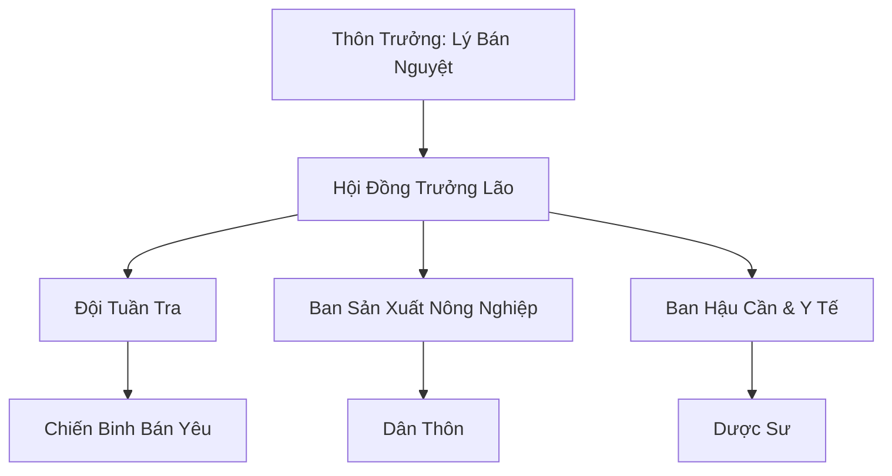

# BÁN YÊU THÔN (半妖村)

## I. Tổng Quan (总览)
Bán Yêu Thôn là một cộng đồng nhỏ bé và kiên cường nằm ẩn sâu trong vùng Rừng Huyết Độc của Nam Cương. Đây là nơi trú ngụ của những cá thể mang trong mình hai dòng máu Nhân và Yêu, những kẻ bị xã hội ruồng bỏ và coi là điềm xấu. Với triết lý "Nửa yêu nửa nhân, trọn vẹn là mình", cư dân thôn đã xây dựng nên một mái ấm bình yên, nơi sự khác biệt được tôn trọng và sự đoàn kết là vũ khí duy nhất để tồn tại giữa vòng vây của thiên nhiên khắc nghiệt và lòng người hiểm ác.

## II. Địa Lý & Tài Nguyên (地理 với tài nguyên)
Thôn tọa lạc trong Thung lũng Song Nguyệt, một vùng đất hình lưỡi liềm được bao bọc bởi các vách đá dựng đứng. Sương mù huyết độc loãng bao phủ khu vực này đóng vai trò như một hàng rào tự nhiên bảo vệ thôn khỏi những kẻ xâm nhập bình thường. Tài nguyên quý giá nhất của thôn là nguồn nước suối ngầm được lọc qua các tầng địa mạch tinh khiết và những mảnh ruộng nhỏ trồng được loại linh cốc đặc chủng có khả năng kháng độc.

## III. Văn Hóa & Tín Ngưỡng (文化 với信仰)
Cư dân thôn coi bản chất lai của mình là một sự kết hợp độc đáo thay vì một khiếm khuyết. Văn hóa của thôn là sự giao thoa hài hòa giữa nếp sống cộng đồng của nhân tộc và bản năng hoang dã của yêu tộc. Mỗi đêm rằm, tiếng hát "Khúc Song Nguyệt" vang vọng khắp thung lũng như một lời nhắc nhở về nguồn gốc và sự tự hào của họ. Họ không tôn thờ thần thánh cụ thể nào mà tin vào sự cộng sinh của vạn vật.

## IV. Cơ Cấu Tổ Chức (组织结构)


## V. Công Pháp & Trận Pháp (功法 với阵法)
- **Công Pháp:** *Song Huyết Dung Hợp Quyết* - công pháp độc quyền giúp bán yêu điều hòa hai nguồn năng lượng đối nghịch trong cơ thể, biến sự xung đột huyết thống thành sức mạnh bùng nổ.
- **Trận Pháp:** *Huyết Vụ Mê Trận* - tận dụng sương độc tự nhiên để tạo ra các ảo ảnh và chướng ngại vật, khiến quân địch lạc hướng khi cố gắng tiến vào thung lũng.

## VI. Đặc Sản Môn Phái (门派特产)
- **Huyết Độc Linh Cốc:** Loại gạo mang theo dược tính nhẹ, giúp tu sĩ tăng cường khả năng kháng độc tố rừng già.
- **Bán Yêu Huyết Phù:** Linh phù được vẽ bằng máu của các chủng tộc lai, có uy lực biến hóa kỳ dị.

## VII. Cơ Sở Hạ Tầng (基础设施)
- **Đài Song Nguyệt:** Quảng trường trung tâm làm bằng đá trắng, nơi diễn ra các lễ hội và họp thôn.
- **Hang Trú Đông:** Hệ thống hang đá ấm áp được lót bằng lông thú dành cho các cá thể có bản năng ngủ đông.

## VIII. Kinh Tế (経済)
Kinh tế tự cung tự cấp là chính. Tuy nhiên, thôn duy trì một đường dây thương mại bí mật với Quỷ Thị Nam Cương để trao đổi các loại dược liệu quý hiếm thu thập được trong Rừng Huyết Độc lấy các nhu yếu phẩm như vải vóc, muối và tài liệu tu luyện.

## IX. Lịch Sử Tóm Tắt (简史)
Được hình thành hơn 150 năm trước bởi một nhóm bán yêu chạy trốn khỏi các cuộc truy sát "diệt yêu". Lý Bán Nguyệt, với tu vi Kim Đan vượt trội, đã đứng ra thống nhất các nhóm lẻ tẻ và thiết lập nên trật tự thôn như hiện nay, biến một vùng đất tử thần thành một ốc đảo của sự sống.

## X. Giai Thoại & Bí Mật (轶 sự với bí mật)
Tương truyền trong thôn đang bí mật bảo vệ một đứa trẻ mang huyết mạch của loài rồng (Bán Yêu Long), thực thể được cho là sở hữu tiềm năng có thể thay đổi toàn bộ cục diện quyền lực tại Nam Cương nếu trưởng thành hoàn toàn.

## XI. Quan Hệ Thế Lực (势力关系)
```mermaid
graph LR
    BYT[Bán Yêu Thôn] -- Giao dịch ngầm -- QTNC[Quỷ Thị Nam Cương]
    BYT -- Cảnh giác -- VDM[Vạn Độc Môn]
    BYT -- Tránh né -- HSM[Huyết Sát Minh]
    BYT -- Thân thiện -- BHAT[Bạch Hồ Ẩn Tộc]
```
