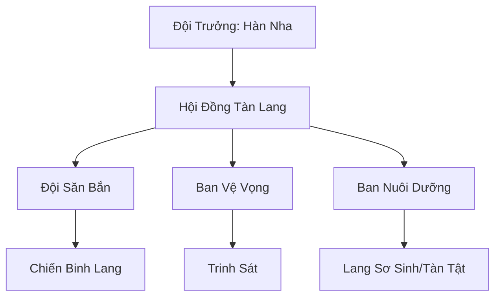

# BĂNG LANG TÀN ĐỘI (冰狼残队)

## I. Tổng Quan (总览)
Băng Lang Tàn Đội là một nhóm nhỏ các lang yêu bị trục xuất khỏi Băng Lang Bộ Lạc do già yếu, bệnh tật hoặc tàn phế. Thay vì chờ đợi cái chết trong cô độc, họ đã tập hợp lại dưới sự dẫn dắt của Hàn Nha để cùng nhau tìm kiếm một con đường sống mới. Dù bị coi là những kẻ thất bại, họ vẫn giữ vững niềm kiêu hãnh của loài sói và ý chí sinh tồn mãnh liệt giữa bão tuyết phương Bắc.

## II. Địa Lý & Tài Nguyên (地理 với tài nguyên)
Trú ngụ tại vùng rìa phía nam của lãnh thổ Băng Lang Bộ Lạc, nơi rừng thông tuyết thưa thớt và linh khí nghèo nàn. Địa điểm chính là một hang đá nhỏ bên cạnh một con suối đã đóng băng vĩnh cửu. Tài nguyên của họ cực kỳ hạn hẹp, chủ yếu dựa vào những gì săn bắn được và những viên linh thạch vụn nhặt nhạnh từ các phế tích nhỏ.

## III. Văn Hóa & Tín Ngưỡng (文化 với信仰)
Đề cao triết lý: "Sói bị đuổi vẫn là sói". Thành viên tàn đội không bao giờ cầu xin sự thương hại từ bộ lạc cũ. Văn hóa của họ mang đậm tính đùm bọc, nơi những cá thể yếu ớt nhất vẫn tìm thấy giá trị của mình thông qua sự phối hợp bầy đàn. Tiếng hú vọng về phương Bắc mỗi đêm trăng tròn vừa là lời tưởng nhớ tổ tiên, vừa là lời khẳng định sự tồn tại bất khuất của họ.

## IV. Cơ Cấu Tổ Chức (组织结构)


## V. Công Pháp & Trận Pháp (功法 với阵法)
- **Công Pháp:** Không có công pháp hệ thống, chủ yếu dựa vào bản năng *Huyết Mạch Cuồng Hóa* và các kỹ năng chiến đấu phối hợp được đúc kết từ kinh nghiệm sinh tồn thực tế.
- **Trận Pháp:** Sử dụng lối đánh du kích "Vây Linh Sát", tận dụng địa hình tuyết dày để cô lập và tiêu diệt các mục tiêu đơn lẻ lớn hơn mình.

## VI. Đặc Sản Môn Phái (门派特产)
- **Răng Nanh Sói Tuyết:** Vật liệu cứng cáp dùng để chế tạo dao găm hoặc mũi tên linh lực.
- **Da Thú Chống Lạnh:** Các loại da được xử lý đặc biệt giúp giữ ấm cơ thể trong những trận đại bão tuyết.

## VII. Cơ Sở Hạ Tầng (基础设施)
- **Hang Suối Băng:** Nơi trú ẩn an toàn nhất, được gia cố bằng sức mạnh thể chất và một vài phù lục phòng thủ đơn giản.
- **Bãi Tập Luyện:** Một khoảnh sân tuyết nhỏ nơi Hàn Nha dạy các kỹ năng săn bắn cho thế hệ sau.

## VIII. Kinh Tế (経済)
Nền kinh tế hoàn toàn phụ thuộc vào săn bắn và thu lượm. Họ trao đổi da lông và xương yêu thú cho các thương hội liều lĩnh đi qua vùng biên giới để lấy lương thực khô và dược liệu trị thương cơ bản.

## IX. Lịch Sử Tóm Tắt (简史)
Được hình thành cách đây vài năm khi Hàn Nha, một lang yêu cái bị đuổi khỏi bầy vì sinh con dị tật, quyết định không đầu hàng số phận. Bà đã cứu giúp những lang yêu đồng cảnh ngộ khác, biến một đám quân tàn thành một đội ngũ có tổ chức, đủ sức tồn tại ở vùng ranh giới tử thần của Bắc Băng.

## X. Giai Thoại & Bí Mật (轶 sự với bí mật)
Tương truyền đứa con dị tật của Hàn Nha mang trong mình huyết mạch "Thiên Lang" cổ đại, thứ có khả năng hiệu lệnh toàn bộ bầy sói Bắc Băng, nhưng sức mạnh này vẫn đang bị phong ấn sâu trong cơ thể yếu ớt của nó.

## XI. Quan Hệ Thế Lực (势力关系)
```mermaid
graph LR
    BLTĐ[Băng Lang Tàn Đội] -- Đối địch -- BLBL[Băng Lang Bộ Lạc]
    BLTĐ -- Liên lạc ngầm -- BHAT[Bạch Hồ Ẩn Tộc]
    BLTĐ -- Đồng cảnh -- ĐDLĐ[Đoản Dực Lạc Đoàn]
    BLTĐ -- Trao đổi -- PBTĐ[Phá Băng Thương Đội]
```
