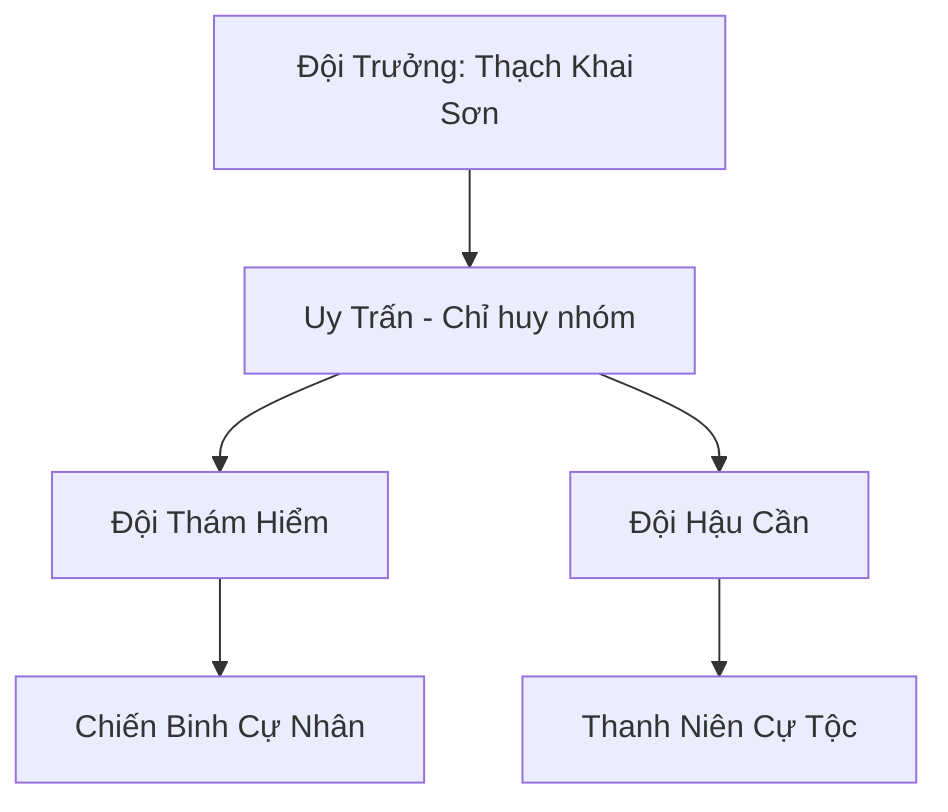

# BĂNG NGUYÊN KHAI HOANG ĐỘI (冰原开荒队)

## I. Tổng Quan (总览)
Băng Nguyên Khai Hoang Đội là một đơn vị thám hiểm nhỏ nhưng đầy tham vọng, gồm những thanh niên Cự Tộc khao khát tự do và những vùng đất mới. Chán ghét cuộc sống bị chèn ép tại các khu vực biên giới phía nam, họ đã quyết định tiến sâu về phương Bắc lạnh giá để khai phá những vùng đất chưa ai từng đặt chân tới. Với sức mạnh nhục thân to lớn và tinh thần thép, họ là những người đi tiên phong trong việc mở rộng ranh giới sinh tồn của chủng tộc giữa băng giá vĩnh cửu.

## II. Địa Lý & Tài Nguyên (地理 với tài nguyên)
Hoạt động tại vùng tundra hoang sơ phía Bắc Bắc Băng, nơi địa hình thay đổi liên tục theo các đợt bão tuyết. Họ không có căn cứ cố định mà di chuyển theo các mạch linh khí tiềm năng. Tài nguyên của đội hoàn toàn dựa vào những gì khám phá được trên đường đi: từ các mỏ linh thạch lộ thiên cho đến những hang động bí mật chứa đựng di vật cổ đại.

## III. Văn Hóa & Tín Ngưỡng (文化 với信仰)
Đề cao triết lý: "Đất mới cho kẻ dũng cảm". Thành viên đội tin rằng tương lai của Cự Tộc nằm ở những vùng đất chưa khai phá. Văn hóa của họ mang đậm tính tiên phong, tôn trọng sự hy sinh và chia sẻ thành quả một cách công bằng. Mỗi vùng đất mới phát hiện đều được họ cắm cọc đá khắc tên như một lời khẳng định chủ quyền và lòng kiêu hãnh.

## IV. Cơ Cấu Tổ Chức (组织结构)


## V. Công Pháp & Trận Pháp (功法 với阵法)
- **Công Pháp:** Dựa trên bản năng *Cự Linh Lực* của tộc, tập trung vào việc gia tăng sức bền và khả năng chống chọi với nhiệt độ cực thấp.
- **Trận Pháp:** Sử dụng "Trận Pháp Đá Tảng" đơn giản để dựng hàng rào chắn gió và bảo vệ khu trại tạm thời trước sự tấn công của yêu thú bão tuyết.

## VI. Đặc Sản Môn Phái (门派特产)
- **Băng Tinh Khoáng:** Loại quặng thô chứa năng lượng băng giá tinh thuần, được thu thập trực tiếp từ các khe nứt sông băng.
- **Thịt Thú Ướp Băng:** Thực phẩm dự trữ đặc trưng có khả năng cung cấp năng lượng lớn cho Cự Tộc trong thời gian dài.

## VII. Cơ Sở Hạ Tầng (基础设施)
- **Lều Trại Dã Chiến:** Hệ thống lều bằng da thú khổng lồ có khả năng giữ nhiệt và cơ động cao.
- **Trạm Gác Đá:** Các tháp canh thô sơ được dựng lên nhanh chóng tại các điểm dừng chân chiến lược.

## VIII. Kinh Tế (経済)
Nền kinh tế hoàn toàn phụ thuộc vào việc thám hiểm và săn bắn. Họ thu thập linh thạch và dược liệu hoang dã để dự trữ cho những chuyến hành trình dài hơn về phía cực Bắc. Thỉnh thoảng họ trao đổi tin tức về các mạch khoáng mới cho các bộ lạc cự nhân khác để lấy trang thiết bị kim loại.

## IX. Lịch Sử Tóm Tắt (简史)
Được thành lập cách đây 2 năm bởi Thạch Khai Sơn - một thiếu niên Cự Tộc cao lớn và bướng bỉnh. Hắn đã thuyết phục được một nhóm bạn cùng lứa rời bỏ sự an toàn giả tạo của Tuyết Cự Nhân Lạc Đoàn để tiến vào vùng tử địa phương Bắc, bắt đầu hành trình tìm kiếm "Vùng đất hứa" trong truyền thuyết của tổ tiên.

## X. Giai Thoại & Bí Mật (轶 sự với bí mật)
Tương truyền Thạch Khai Sơn đang nắm giữ một phiến đá chứa đựng văn tự từ thời đại thần thoại, thứ mà hắn tin rằng sẽ dẫn đường đến một đại di tích có khả năng khôi phục lại vinh quang của Cự Tộc cổ đại.

## XI. Quan Hệ Thế Lực (势力关系)
```mermaid
graph LR
    BNKHĐ[Băng Nguyên Khai Hoang Đội] -- Xuất thân -- TCNLĐ[Tuyết Cự Nhân Lạc Đoàn]
    BNKHĐ -- Trao đổi -- ĐBTĐ[Đại Bàng Tuyết Đàn]
    BNKHĐ -- Cảnh giác -- SMU[Sương Ma Uyển]
    BNKHĐ -- Độc lập -- ALL[Mọi Thế Lực]
```
