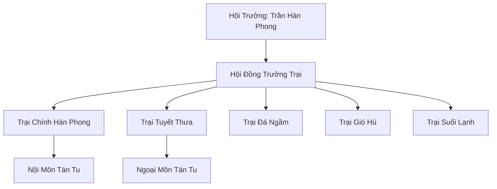

# BĂNG NGUYÊN TÁN TU HỘI (冰原散修会)

## I. Tổng Quan (总览)
Băng Nguyên Tán Tu Hội là một tổ chức tương trợ tự phát dành cho những tu sĩ không thuộc về bất kỳ tông môn chính thống nào tại Bắc Băng. Trong môi trường khắc nghiệt nơi cái lạnh có thể nuốt chửng linh hồn của những kẻ đơn độc, hội ra đời như một lá chắn bảo vệ cho những tán tu bần cùng. Với tôn chỉ "Một mình thì chết, cùng nhau thì sống", hội đã trở thành một mạng lưới sinh tồn bền bỉ, giúp hàng trăm tu sĩ tìm thấy chỗ đứng giữa băng tuyết.

## II. Địa Lý & Tài Nguyên (地理 với tài nguyên)
Hoạt động chủ yếu tại vùng rìa phía nam Bắc Băng, nơi khí hậu tương đối ôn hòa hơn vùng lõi. Hội quản lý 5 trại trú ẩn rải rác, trong đó Trại chính Hàn Phong được xây dựng tại nơi địa mạch rò rỉ chút hơi ấm. Tài nguyên của hội rất hạn chế, chủ yếu là các mỏ linh thạch cấp thấp đã gần cạn và các loại dược thảo phổ thông có khả năng chịu lạnh.

## III. Văn Hóa & Tín Ngưỡng (文化 với信仰)
Đề cao tinh thần đồng đạo và sự tự do. Không có sự phân biệt giai cấp khắt khe, vị thế trong hội được quyết định bởi đóng góp cho cộng đồng và tu vi cá nhân. Văn hóa "Luận đạo" phát triển mạnh mẽ, nơi các tán tu thoải mái trao đổi kinh nghiệm tu luyện. Mỗi mùa Đông Chí, lễ hội "Hội Ẩm" được tổ chức để gắn kết tình cảm và sưởi ấm tâm hồn các thành viên.

## IV. Cơ Cấu Tổ Chức (组织结构)


## V. Công Pháp & Trận Pháp (功法 với阵法)
- **Công Pháp:** Không có công pháp thống nhất, nhưng hội sở hữu một số bí thuật *Hàn Khí Chống Chọi* được các tiền bối đúc kết và chia sẻ rộng rãi.
- **Trận Pháp:** *Ngũ Trại Liên Hoàn Trận* - trận pháp phòng ngự cơ bản kết nối 5 điểm trú ẩn thông qua tín hiệu linh lực, giúp ứng cứu lẫn nhau khi gặp yêu thú tấn công quy mô lớn.

## VI. Đặc Sản Môn Phái (门派特产)
- **Tán Tu Linh Rượu:** Loại rượu rẻ tiền nhưng có tác dụng kích thích khí huyết, rất được ưa chuộng bởi những tu sĩ nghèo.
- **Băng Thảo Bùa:** Loại bùa chú đơn giản giúp tạm thời kháng lạnh cấp thấp cho phàm nhân.

## VII. Cơ Sở Hạ Tầng (基础设施)
- **Trại Chính Hàn Phong:** Tổ hợp lều trại kiên cố bao quanh một lò lửa linh lực trung tâm.
- **Sàn Giao Dịch Tự Do:** Nơi các thành viên tự do mua bán, đổi chác các vật phẩm thu thập được.

## VIII. Kinh Tế (経済)
Kinh tế dựa trên sự tự nguyện và đóng góp. Mỗi thành viên có nghĩa vụ nộp 1/10 thu hoạch để duy trì trận pháp bảo vệ và quỹ cứu tế. Hội cũng thu lợi nhuận từ việc cung cấp dịch vụ bảo vệ cho các ngôi làng phàm nhân xung quanh trước sự quấy nhiễu của yêu thú cấp thấp.

## IX. Lịch Sử Tóm Tắt (简史)
Được thành lập cách đây 200 năm sau một trận đại bão tuyết khiến hàng trăm tán tu thiệt mạng. Những người sống sót nhận ra rằng sự đơn độc chính là kẻ thù lớn nhất, từ đó họ đã chung tay xây dựng nên điểm trú ẩn đầu tiên, đặt nền móng cho Băng Nguyên Tán Tu Hội ngày nay.

## X. Giai Thoại & Bí Mật (轶 sự với bí mật)
Tương truyền dưới nền đá của Trại chính Hàn Phong ẩn chứa một mạch linh thạch thượng cổ cực kỳ tinh khiết, nhưng Trần Hàn Phong đã ra lệnh phong tỏa thông tin này để tránh sự dòm ngó của các tông môn lớn.

## XI. Quan Hệ Thế Lực (势力关系)
```mermaid
graph LR
    BNTTH[Băng Nguyên Tán Tu Hội] -- Hợp tác -- PBTĐ[Phá Băng Thương Đội]
    BNTTH -- Liên kết -- BPTTT[Bắc Phong Thông Tín Trạm]
    BNTTH -- Cảnh giác -- BCH[Bạch Cốt Hội]
    BNTTH -- Trung lập -- HBC[Huyền Băng Cung]
```
