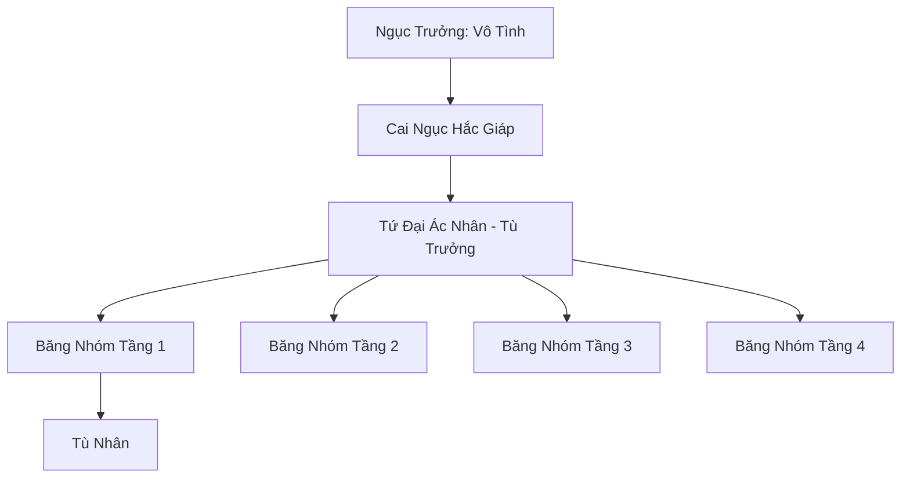

# BĂNG NGỤC THÀNH (冰狱城)

## I. Tổng Quan (总览)
Băng Ngục Thành là nhà tù lớn nhất và tàn khốc nhất lục địa, tọa lạc trên một hòn đảo băng trôi biệt lập tại Bắc Băng. Ban đầu được xây dựng bởi liên minh các đại tông môn để giam giữ những tội nhân không thể giết ngay lập tức, thành phố này dần biến thành một vương quốc tự trị của tội phạm và những kẻ bị ruồng bỏ. Tại đây, luật pháp duy nhất là sức mạnh của nắm đấm, nơi kẻ mạnh nhất làm vua và kẻ yếu nhất chỉ là phân bón cho băng tuyết.

## II. Địa Lý & Tài Nguyên (地理 với tài nguyên)
Thành phố được xây dựng sâu vào lòng một núi băng khổng lồ, chia làm 4 tầng ngục giam với độ khắc nghiệt tăng dần theo độ sâu. Tài nguyên duy nhất là "Xích Sắt Vạn Năm" - loại xích sắt bị nhiễm hàn khí cực nặng dùng để chế tạo vũ khí thô sơ. Thành phố hoàn toàn phụ thuộc vào nguồn cung ứng lương thực và linh thạch từ bên ngoài thông qua các đường dây buôn lậu.

## III. Văn Hóa & Tín Ngưỡng (文化 với信仰)
Tôn thờ Sức Mạnh và Sự Sinh Tồn. Cư dân Băng Ngục Thành không có đức tin vào thần thánh, họ chỉ tin vào lưỡi đao trên tay và số linh thạch có trong túi. Văn hóa tại đây mang đậm tính thực dụng dã man, nơi việc ăn thịt yêu thú sống hoặc thậm chí là đồng loại (trong những thời kỳ đói kém) không phải là hiếm thấy. Hình xăm và những vết sẹo được coi là biểu tượng của địa vị.

## IV. Cơ Cấu Tổ Chức (组织结构)


## V. Công Pháp & Trận Pháp (功法 với阵法)
- **Công Pháp:** Không có công pháp chính thống, cư dân học các *Cấm Thuật Sinh Tồn* (Kháng độc, ăn mòn linh lực).
- **Trận Pháp:** *Hàn Băng Tỏa Hồn Trận* - trận pháp khổng lồ bao phủ toàn bộ đảo, liên tục hút cạn linh lực của tù nhân để duy trì sự đóng băng của kết giới không gian, khiến việc đào tẩu là không thể.

## VI. Đặc Sản Môn Phái (门派特产)
- **Băng Ngục Huyết Rượu:** Loại rượu nấu từ linh thảo biến dị và máu yêu thú, giúp tu sĩ tạm thời quên đi cái lạnh và sự đau đớn.
- **Xương Mài Đao:** Vũ khí thô sơ được mài từ xương người hoặc thú, có khả năng xuyên thấu giáp trụ nhờ được tôi luyện trong tử khí lâu ngày.

## VII. Cơ Sở Hạ Tầng (基础设施)
- **Đấu Trường Máu:** Trung tâm giải trí duy nhất, nơi tù nhân chiến đấu sinh tử để giành lấy sự ưu tiên về lương thực và chỗ ở.
- **Cổng Trục Xuất:** Nơi duy nhất kết nối với thế giới bên ngoài, được canh giữ bởi trung đoàn Hắc Giáp.

## VIII. Kinh Tế (経済)
Kinh tế hoàn toàn dựa trên sự trao đổi và chiếm đoạt. Ngục trưởng và cai ngục thu lợi nhuận từ việc ăn bớt ngân sách của các tông môn gửi đến và tham gia vào mạng lưới buôn lậu với Thiên Sa Thương Hội. Linh thạch là thứ quý giá nhất, có thể dùng để đổi lấy bất kỳ đặc quyền nào trong tù.

## IX. Lịch Sử Tóm Tắt (简史)
Được thiết lập cách đây hàng nghìn năm bởi liên minh Chính Đạo nhằm mục đích giam giữ các đầu sỏ ma tộc sau đại chiến. Tuy nhiên, sự tham nhũng của các đời cai ngục và sự khắc nghiệt của môi trường đã khiến nơi đây mất đi ý nghĩa giáo hóa ban đầu, trở thành một hang ổ tội phạm quy mô lớn mà chính quyền cũng phải e ngại khi muốn can thiệp.

## X. Giai Thoại & Bí Mật (轶 sự với bí mật)
Tương truyền ở tầng sâu nhất (Tầng 4), có một tù nhân lão thái bà đã bị giam giữ từ thời Thái Cổ, người biết được bí mật về lối thoát duy nhất không cần thông qua Cổng Trục Xuất.

## XI. Quan Hệ Thế Lực (势力关系)
```mermaid
graph LR
    BNT[Băng Ngục Thành] -- Giao dịch ngầm -- TSTH[Thiên Sa Thương Hội]
    BNT -- Đối địch -- DCHH[Đại Càn Hoàng Triều]
    BNT -- Cung cấp nô lệ -- CUMT[Cửu U Ma Tông]
    BNT -- Trung lập -- SMU[Sương Ma Uyển]
```
