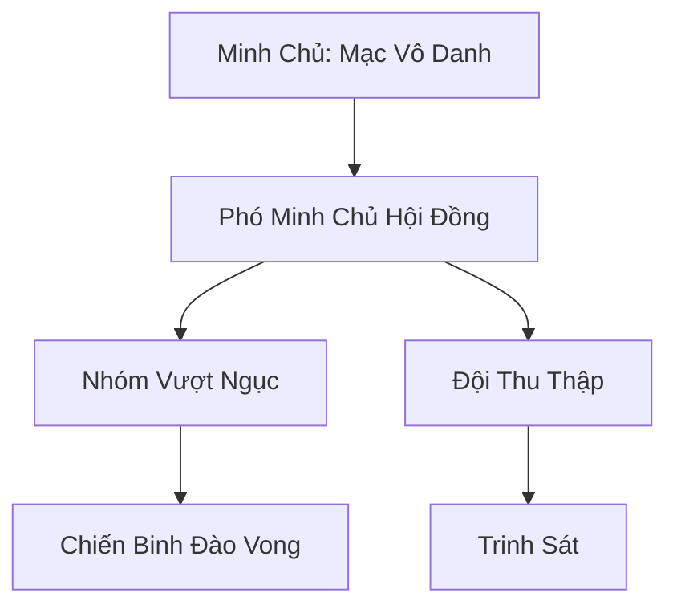

# BĂNG NGỤC ĐÀO VONG GIẢ (冰狱逃亡者)

## I. Tổng Quan (总览)
Băng Ngục Đào Vong Giả là một liên minh lỏng lẻo gồm những cá thể đã thực hiện cuộc vượt ngục chấn động khỏi Băng Ngục Thành. Họ là những kẻ bị cả xã hội tu chân ruồng bỏ, mang trên mình những tội danh và cấm chế nặng nề. Dưới sự dẫn dắt của Mạc Vô Danh, họ lẩn trốn giữa những khe nứt sông băng, sống một cuộc đời ngoài vòng pháp luật với khao khát duy nhất là giữ vững sự tự do quý giá.

## II. Địa Lý & Tài Nguyên (地理 với tài nguyên)
Không có căn cứ cố định. Họ liên tục di chuyển giữa các hang băng tự nhiên dọc theo bờ biển Bắc Hải để tránh né sự truy quét của cai ngục Hắc Giáp. Tài nguyên của liên minh cực kỳ khan hiếm, chủ yếu dựa vào những gì họ chiếm đoạt được từ các đội tiếp tế của nhà tù và những mảnh bản đồ cổ chỉ dẫn đến các kho báu dưới đáy biển băng.

## III. Văn Hóa & Tín Ngưỡng (文化 với信仰)
Đề cao triết lý: "Tự do quý hơn tính mạng". Thành viên liên minh coi sự phản bội là tội lỗi tối thượng. Họ có văn hóa ẩn danh, xóa bỏ quá khứ và chỉ sống cho hiện tại. Mỗi cá nhân đều mang trên mình ít nhất một vết sẹo hoặc cấm chế từ thời bị giam cầm như một lời nhắc nhở về nỗi hận đối với Băng Ngục Thành.

## IV. Cơ Cấu Tổ Chức (组织结构)


## V. Công Pháp & Trận Pháp (功法 với阵法)
- **Công Pháp:** *Ngục Ảnh Bộ* (Thân pháp chuyên dụng để lẩn tránh thần thức), *Hàn Sát Cấm Thuật* (Sử dụng chính cấm chế trong cơ thể để tấn công).
- **Trận Pháp:** *Ảo Ảnh Băng Sương Trận* - trận pháp ngụy trang cấp thấp dùng để che giấu lối vào các hang động tạm thời.

## VI. Đặc Sản Môn Phái (门派特产)
- **Sơ Đồ Ngục Giam:** Các bản vẽ chi tiết về kết cấu và điểm yếu của Băng Ngục Thành (Hàng cấm).
- **Xương Mài Đục:** Loại vũ khí thô sơ có khả năng phá giải một số loại cấm chế không gian đơn giản.

## VII. Cơ Sở Hạ Tầng (基础设施)
- **Hang Băng Di Động:** Các hang động được yểm bùa để có thể thay đổi vị trí hoặc tan biến khi cần thiết.
- **Trạm Tiếp Tế Ngầm:** Các điểm giấu lương thực và linh thạch rải rác trên bờ biển.

## VIII. Kinh Tế (経済)
Nguồn thu nhập đến từ việc đánh cướp các thương thuyền nhỏ hoặc các đội vận tải của Băng Ngục Thành. Họ cũng bí mật trao đổi các thông tin tuyệt mật về cấu trúc nhà tù cho các thế lực ma đạo khác muốn giải cứu thuộc hạ.

## IX. Lịch Sử Tóm Tắt (简史)
Khởi nguồn từ cuộc đại vượt ngục 30 năm trước do Mạc Vô Danh dẫn đầu. Trong số hàng trăm tù nhân, chỉ có 47 người sống sót qua được biển băng và sự truy sát của quân đoàn Hắc Giáp. Kể từ đó, họ đã trở thành một biểu tượng của sự phản kháng thầm lặng chống lại sự tàn bạo của ngục tù phương Bắc.

## X. Giai Thoại & Bí Mật (轶 sự với bí mật)
Tương truyền Mạc Vô Danh vốn là một kiếm tu tài ba bị hãm hại, và trong cơ thể ông ta vẫn còn găm một mảnh "Hàn Băng Thần Châm" liên tục ăn mòn tu vi, nhưng đồng thời cũng cung cấp cho ông khả năng cảm nhận cái lạnh ở mức độ thần thánh.

## XI. Quan Hệ Thế Lực (势力关系)
```mermaid
graph LR
    BNĐVG[Băng Ngục Đào Vong Giả] -- Tử địch -- BNT[Băng Ngục Thành]
    BNĐVG -- Giao dịch -- BCH[Bạch Cốt Hội]
    BNĐVG -- Cảnh giác -- HBC[Huyền Băng Cung]
    BNĐVG -- Thân thiện -- BLTĐ[Băng Lang Tàn Đội]
```
