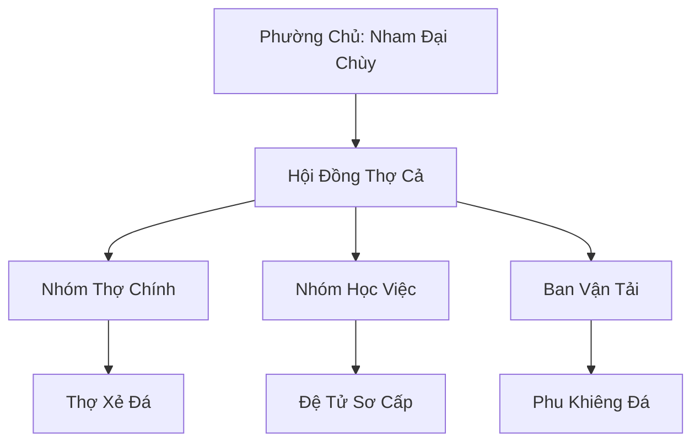

# BĂNG SƠN THỢ ĐÁ (冰山石匠)

## I. Tổng Quan (总览)
Băng Sơn Thợ Đá là một nghiệp đoàn lao động thủ công gồm những người khổng lồ (Cự Tộc) có thân hình nhỏ bé và sức mạnh suy giảm so với đồng tộc thuần huyết. Sống tại vùng đá băng khắc nghiệt phương Bắc, họ duy trì sự tồn tại bằng cách cung cấp sức lao động thô sơ nhưng không thể thay thế trong việc xây dựng các công trình kiến trúc chịu lạnh. Dù bị coi là hạng lao nô trong mắt các thế lực lớn, họ vẫn tự hào về kỹ năng đục đá và sự kiên trì của mình.

## II. Địa Lý & Tài Nguyên (地理 với tài nguyên)
Trụ sở nằm tại một xưởng đục đá lộ thiên gần biên giới Cực Quang Thần Điện. Khu vực này đan xen giữa các vỉa đá granite chịu lạnh và các khối băng vĩnh cửu có độ cứng ngang với sắt thép. Tài nguyên quý giá nhất là "Đá Băng Vạn Năm" - nguyên liệu chính để xây dựng các mật thất tu luyện băng hệ.

## III. Văn Hóa & Tín Ngưỡng (文化 với信仰)
Đề cao triết lý: "Đục đá là sống, ngừng đục là chết". Thành viên phường coi lao động là nghĩa vụ và là cách duy nhất để khẳng định sự tồn tại. Văn hóa của họ rất đơn giản, không trọng hình thức, coi trọng sự hoàn thành công việc đúng thời hạn. Nghi lễ lớn nhất là tiệc mừng công sau khi hoàn thành các đại công trình, nơi họ cùng nhau ăn mừng bằng thịt nướng khổng lồ.

## IV. Cơ Cấu Tổ Chức (组织结构)


## V. Công Pháp & Trận Pháp (功法 với阵法)
- **Công Pháp:** Không có hệ thống công pháp tu tiên, chủ yếu dựa trên bản năng *Cự Lực* bẩm sinh. Nham Đại Chùy sở hữu kỹ thuật *Chấn Nham Chùy* giúp phá vỡ các khối đá cứng nhất thông qua tần số rung động.
- **Trận Pháp:** Sử dụng "Trận Pháp Định Tâm Đá" sơ cấp để giữ cho các khối băng xây dựng không bị tan chảy khi gặp nhiệt độ biến động.

## VI. Đặc Sản Môn Phái (门派特产)
- **Băng Thạch Phôi:** Các khối đá đã được đục đẽo chuẩn xác theo kích thước yêu cầu, sẵn sàng để lắp ráp công trình.
- **Búa Đá Cường Hóa:** Loại công cụ làm việc cũng là vũ khí thô sơ, có trọng lượng lên tới hàng ngàn cân.

## VII. Cơ Sở Hạ Tầng (基础设施)
- **Xưởng Đục Đá Tuyết Sơn:** Khu vực thi công rộng lớn với hệ thống ròng rọc bằng linh dây.
- **Hầm Trú Ẩn Công Nhân:** Các hang đá đơn sơ phục vụ việc ăn ở của toàn bộ thành viên.

## VIII. Kinh Tế (経済)
Nguồn thu nhập hoàn toàn phụ thuộc vào tiền công từ các hợp đồng xây dựng cho Cực Quang Thần Điện. Tuy nhiên, họ thường xuyên bị nợ lương hoặc bị ép giá. Nham Đại Chùy phải bí mật bán các loại quặng kim loại thô thu thập được trong lúc làm việc để nuôi sống phường.

## IX. Lịch Sử Tóm Tắt (简史)
Được thành lập 20 năm trước khi Nham Đại Chùy nhận thấy các tông môn lớn ở Bắc Băng cần một lực lượng lao động giá rẻ cho các công trình vĩ đại. Ông đã tập hợp những Cự Tộc lang thang, không có tư chất chiến đấu để lập nên phường thợ này, chấp nhận cuộc sống bị bóc lột để đổi lấy sự an toàn cơ bản.

## X. Giai Thoại & Bí Mật (轶 sự với bí mật)
Tương truyền Nham Đại Chùy đã bí mật vẽ lại toàn bộ sơ đồ kiến trúc và hệ thống mạch linh lực bên trong Cực Quang Thần Điện lên một tấm da thú khổng lồ, một bí mật có thể khiến toàn bộ phường bị diệt môn nếu lộ ra ngoài.

## XI. Quan Hệ Thế Lực (势力关系)
```mermaid
graph LR
    BSTĐ[Băng Sơn Thợ Đá] -- Bị bóc lột -- CQTĐ[Cực Quang Thần Điện]
    BSTĐ -- Trao đổi -- TCNLĐ[Tuyết Cự Nhân Lạc Đoàn]
    BSTĐ -- Liên kết -- CTĐMTH[Cự Tộc Đông Miên Thủ Vệ]
    BSTĐ -- Tránh né -- HBC[Huyền Băng Cung]
```
