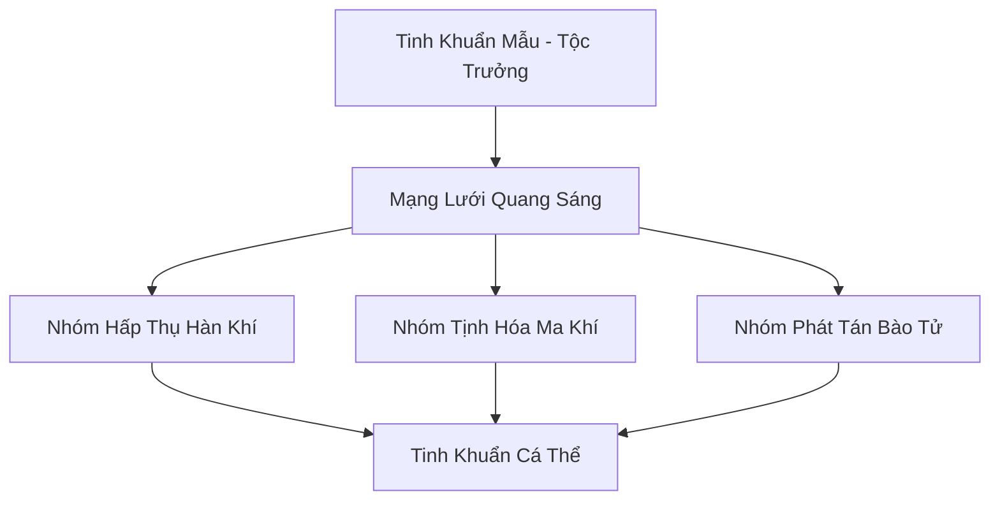

# BĂNG TINH KHUẨN TỘC (冰晶菌族)

## I. Tổng Quan (总览)
Băng Tinh Khuẩn Tộc là một trong những dạng sống cổ xưa nhất cư ngụ trong các hang động băng giá dưới chân Tuyết Sơn. Đây là một chủng tộc Vi Tộc có ý thức cộng đồng cao, tồn tại dưới dạng một mạng lưới các bào tử phát sáng xanh nhạt. Dù không tham gia vào các cuộc tranh đấu quyền lực, sự hiện diện của họ đóng vai trò tối quan trọng trong việc duy trì sự thanh khiết của linh khí và ức chế sự rò rỉ của ma khí từ lòng đất phương Bắc.

## II. Địa Lý & Tài Nguyên (地理 với tài nguyên)
Trụ sở và địa bàn hoạt động là hệ thống mê cung hang băng tự nhiên chạy dọc theo địa mạch của Tuyết Sơn. Tài nguyên của tộc chính là bản thân các cá thể khuẩn tộc, có khả năng phát ra "Hàn Quang" - một loại ánh sáng lạnh không tỏa nhiệt nhưng chứa đựng năng lượng tịnh hóa. Họ cũng sản sinh ra "Hàn Quang Linh Phấn", một loại nguyên liệu cực hiếm dùng để chế tác đan dược cấp cao.

## III. Văn Hóa & Tín Ngưỡng (文化 với信仰)
Đề cao triết lý: "Sáng trong bóng tối, lặng trong im lìm". Cư dân khuẩn tộc sống một cuộc đời thầm lặng, giao tiếp với nhau thông qua tần số ánh sáng nhấp nháy. Họ không có thần thánh theo nghĩa thông thường, chỉ tôn sùng sự tồn tại vĩnh cửu của băng giá và sự cân bằng của địa mạch. Văn hóa của tộc là sự cộng sinh tuyệt đối, nơi mỗi cá nhân là một nút thắt trong mạng lưới ánh sáng chung.

## IV. Cơ Cấu Tổ Chức (组织结构)


## V. Công Pháp & Trận Pháp (功法 với阵法)
- **Công Pháp:** Không có công pháp tu luyện nhân tạo, sức mạnh đến từ quá trình *Quang Hợp Hàn Khí* tự nhiên, giúp quần thể phát triển và lan rộng.
- **Trận Pháp:** *Quang Hàn Tịnh Hóa Trận* - toàn bộ quần thể hoạt động như một trận pháp sống khổng lồ, có khả năng bao phủ toàn bộ hang động để ngăn chặn sự xâm nhập của các loại uế khí và sát ý tà ác.

## VI. Đặc Sản Môn Phái (门派特产)
- **Hàn Quang Linh Phấn:** Loại bụi sáng có tác dụng thanh lọc tâm ma và cường hóa thần thức cho tu sĩ hệ Thủy hoặc Băng.
- **Băng Tinh Thạch Chiếu Sáng:** Các khối băng bị khuẩn tộc bám vào lâu ngày, có khả năng phát sáng liên tục trong hàng trăm năm.

## VII. Cơ Sở Hạ Tầng (基础设施)
- **Hang Quang Sai:** Khu vực tập trung mật độ khuẩn tộc cao nhất, nơi ánh sáng xanh rực rỡ nhất.
- **Lõi Tinh Khuẩn:** Trung tâm thần thức của toàn bộ tộc, nằm sâu trong hang động cổ nhất.

## VIII. Kinh Tế (経済)
Kinh tế mang tính thụ động. Hội không tham gia giao thương nhưng sự hiện diện của họ tạo ra môi trường tu luyện lý tưởng, đôi khi được các tu sĩ cấp cao đổi lại bằng việc cung cấp các loại linh dịch thủy hệ để hỗ trợ sự phát triển của quần thể.

## IX. Lịch Sử Tóm Tắt (简史)
Tồn tại từ kỷ nguyên Thái Cổ, lâu đời hơn hầu hết các tông môn tu tiên tại Bắc Băng. Khuẩn tộc đã chứng kiến sự hình thành và sụp đổ của nhiều kỷ nguyên, âm thầm đóng vai trò là "màng lọc" linh lực cho toàn bộ vùng Tuyết Sơn mà không cần sự thừa nhận của thế giới bên ngoài.

## X. Giai Thoại & Bí Mật (轶 sự với bí mật)
Tương truyền Tinh Khuẩn Mẫu có thể cảm nhận được sự biến động nhỏ nhất của phong ấn thượng cổ dưới lòng đất và ánh sáng của toàn tộc thực chất là một phần của hệ thống phong ấn đại ma từ thời khai thiên lập địa.

## XI. Quan Hệ Thế Lực (势力关系)
```mermaid
graph LR
    BTKT[Băng Tinh Khuẩn Tộc] -- Cộng sinh -- TSTSN[Hệ sinh thái Tuyết Sơn]
    BTKT -- Vô hại -- HBC[Huyền Băng Cung]
    BTKT -- Cảm nhận -- THVL[Tuyết Hoa Vi Linh]
    BTKT -- Ức chế -- CUMT[Cửu U Ma Tông]
```
