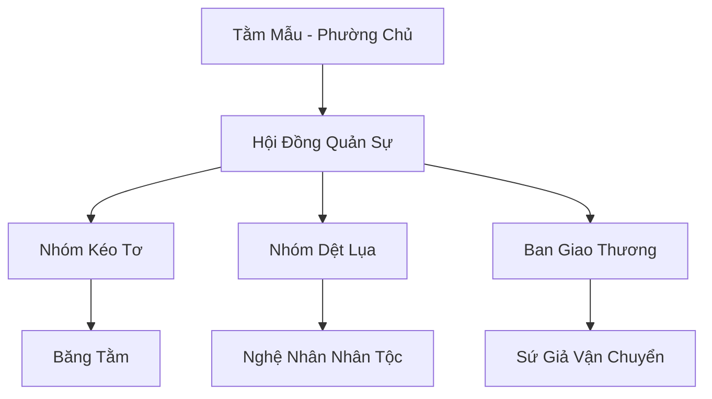

# BĂNG TẰM TI PHƯỜNG (冰蚕丝坊)

## I. Tổng Quan (总览)
Băng Tằm Ti Phường là một nghiệp đoàn sản xuất tơ lụa đặc thù tại Bắc Băng, nơi cư ngụ và làm việc của loài Băng Tằm có linh tính. Nổi tiếng với việc tạo ra "Băng Tằm Ti" - loại tơ trong suốt, bền chắc và có khả năng dẫn dụ linh lực thủy hệ cực tốt, phường thợ này từng là nguồn cung cấp y phục chính cho các bậc đại năng phương Bắc. Dù hiện tại đang đối mặt với sự cạnh tranh từ các phương pháp nuôi trồng nhân tạo, giá trị của tơ tằm hoang dã từ phường vẫn luôn được giới chuyên môn đánh giá cao nhất.

## II. Địa Lý & Tài Nguyên (地理 với tài nguyên)
Trụ sở nằm rải rác trong các hang động tự nhiên trên sườn phía bắc Tuyết Sơn, nơi có nhiệt độ thấp lý tưởng cho loài tằm sinh trưởng. Tài nguyên lớn nhất là "Băng Tằm Ti" hoang dã và một lượng nhỏ "Kim Ti" cực kỳ quý hiếm. Phường cũng kiểm soát các mạch linh thảo nhỏ dùng làm thức ăn cao cấp cho tằm vương.

## III. Văn Hóa & Tín Ngưỡng (文化 với信仰)
Đề cao triết lý: "Dệt sợi nối duyên". Thành viên phường coi việc kéo tơ là một hình thức thiền định và dâng hiến cho đại địa. Văn hóa của họ rất tĩnh lặng, kiên nhẫn và tỉ mỉ. Họ tôn trọng chu kỳ tự nhiên của loài tằm, tuyệt đối không vắt kiệt sức lao động của chúng để đảm bảo chất lượng tơ luôn ở mức tinh khiết nhất.

## IV. Cơ Cấu Tổ Chức (组织结构)


## V. Công Pháp & Trận Pháp (功法 với阵法)
- **Công Pháp:** Tằm Mẫu sở hữu khả năng *Tơ Linh Thần Giao* để điều phối hành vi của hàng trăm con tằm. Nghệ nhân dệt sử dụng *Linh Lực Khâu Thừa Thuật* để thêu phù văn vào vải.
- **Trận Pháp:** *Ôn Hòa Kết Giới Trận* - trận pháp duy trì độ ẩm và nhiệt độ ổn định bên trong các hang tằm, ngăn chặn sự đóng băng quá mức của tơ khi mới kéo ra.

## VI. Đặc Sản Môn Phái (门派特产)
- **Băng Tằm Ti:** Sợi tơ trong suốt như pha lê, cực kỳ bền chắc và có tính kháng hàn tuyệt đối.
- **Lụa Tuyết Liên:** Loại vải cao cấp dệt từ tơ tằm ăn hoa tuyết liên, có tác dụng an thần và thanh lọc tâm ma.

## VII. Cơ Sở Hạ Tầng (基础设施)
- **Hang Tằm Vạn Năm:** Hệ thống hang động có cấu trúc tổ ong tự nhiên, nơi ở của tằm vương và kho lưu trữ tơ.
- **Khung Dệt Linh Lực:** Các máy dệt được yểm phù văn giúp tăng tốc độ sản xuất và độ chính xác của hoa văn.

## VIII. Kinh Tế (経済)
Kinh tế dựa trên việc xuất khẩu tơ thô và các sản phẩm lụa thành phẩm. Do mất đi khách hàng lớn nhất là Huyền Băng Cung, phường hiện đang mở rộng hợp tác với Phá Băng Thương Đội để đưa hàng hóa về Trung Thổ, nơi lụa băng tằm đang trở thành một xu hướng thời trang và pháp bảo mới.

## IX. Lịch Sử Tóm Tắt (简史)
Được thành lập từ thời kỷ nguyên Thượng Cổ bởi Tằm Mẫu - một cá thể băng tằm đã thức tỉnh linh trí sau khi nuốt phải tinh huyết của một vị thần thú. Bà đã dẫn dắt đồng loại xây dựng nên một vương quốc tơ lụa thầm lặng trên vách núi, duy trì sự tồn tại thông qua việc trao đổi tài nguyên với các chủng tộc khác.

## X. Giai Thoại & Bí Mật (轶 sự với bí mật)
Tương truyền Tằm Mẫu có thể dệt nên một "Sợi Tơ Định Mệnh" có khả năng kết nối linh hồn của hai người ở xa nhau vạn dặm, giúp họ cảm nhận được sinh tử của đối phương.

## XI. Quan Hệ Thế Lực (势力关系)
```mermaid
graph LR
    BTTP[Băng Tằm Ti Phường] -- Cộng sinh -- TLDV[Tuyết Liên Dược Phường]
    BTTP -- Cạnh tranh -- HBC[Huyền Băng Cung]
    BTTP -- Xuất khẩu -- PBTĐ[Phá Băng Thương Đội]
    BTTP -- Cảnh giác -- ALL[Kẻ Săn Trộm Tơ]
```
