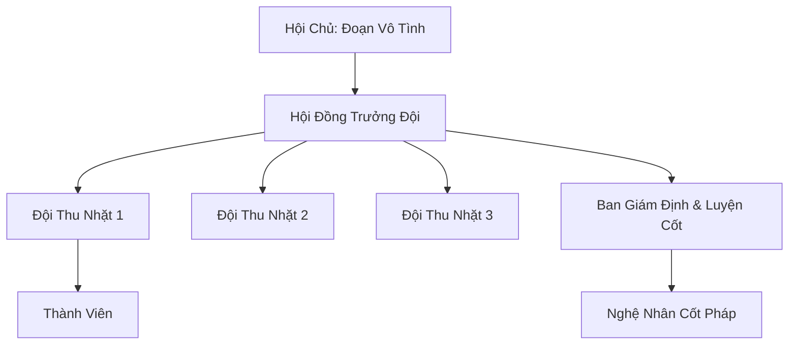

# BẠCH CỐT HỘI (白骨会)

## I. Tổng Quan (总览)
Bạch Cốt Hội là một tổ chức ngầm chuyên hành nghề "nhặt rác chiến trường" tại vùng biển Bắc Hải lạnh lẽo. Họ khai thác những gì còn sót lại từ các cuộc đại chiến thượng cổ bị chôn vùi dưới lớp băng vạn năm. Dù bị coi là hèn hạ và mang hơi hướng tà đạo, hội vẫn tồn tại nhờ nắm giữ những vật phẩm có giá trị nghiên cứu và sức mạnh đặc thù từ xương cốt người chết.

## II. Địa Lý & Tài Nguyên (地理 với tài nguyên)
Trụ sở chính ẩn mình trong hệ thống hầm đá tự nhiên bên dưới những vách đá dựng đứng ven bờ biển Bắc Hải. Tài nguyên cốt lõi của hội là các "Bãi Xương Cổ" - nơi tàn dư của các cường giả và thần thú chết trong chiến tranh tích tụ oán khí và linh lực tàn dư qua nhiều kỷ nguyên.

## III. Văn Hóa & Tín Ngưỡng (文化 với信仰)
Đề cao triết lý thực dụng: "Người chết không cần của cải". Thành viên hội coi xương cốt là vật liệu và linh hồn tàn dư là năng lượng. Văn hóa của họ mang đậm màu sắc lạnh lẽo, thường xuyên tổ chức "Khai Cốt Yến" để vinh danh những phát hiện mới từ lòng đất lạnh.

## IV. Cơ Cấu Tổ Chức (组织结构)


## V. Công Pháp & Trận Pháp (功法 với阵法)
- **Công Pháp:** *Bạch Cốt Ấn* (Kỹ thuật chế tác pháp bảo từ xương), *Oán Khí Đồng Hóa Thuật*.
- **Trận Pháp:** *Cốt Giáp Trận* - sử dụng xương cốt cường giả cắm xung quanh lãnh thổ để tạo ra áp lực tinh thần và lớp phòng thủ vật lý cho hang ổ.

## VI. Đặc Sản Môn Phái (门派特产)
- **Cốt Phấn:** Loại bột làm từ xương nghiền, dùng để bón cho linh thảo thuộc tính Ám hoặc làm chất dẫn cho tà thuật.
- **Pháp Khí Tàn:** Các mảnh vỡ linh bảo thượng cổ vẫn còn sót lại uy lực đáng kể.

## VII. Cơ Sở Hạ Tầng (基础设施)
- **Cốt Kho:** Nơi phân loại và lưu trữ hàng vạn bộ xương và di vật theo niên đại và phẩm cấp.
- **Hầm Luyện Cốt:** Khu vực nghiên cứu cách rèn đúc và nén linh lực vào vật liệu hữu cơ.

## VIII. Kinh Tế (経済)
Kinh tế dựa trên việc buôn bán các di vật khai quật được trên thị trường đen. Họ là nguồn cung cấp vật liệu quan trọng cho các tông môn ma đạo muốn nghiên cứu về oán khí và thi tu. Thỉnh thoảng hội cũng tìm được những bảo vật hoàn chỉnh mang lại nguồn lợi nhuận khổng lồ.

## IX. Lịch Sử Tóm Tắt (简史)
Được thành lập 50 năm trước bởi Đoạn Vô Tình, một tán tu tình cờ phát hiện ra một hầm mộ đại năng bị rò rỉ dưới vách đá. Ông nhận ra rằng đây là một mỏ vàng chưa được khai phá và đã tập hợp những kẻ bần cùng để lập nên Bạch Cốt Hội.

## X. Giai Thoại & Bí Mật (轶 sự với bí mật)
Tương truyền Đoạn Vô Tình đang bí mật lắp ráp một "Cổ Thần Khôi Lỗi" từ xương của hàng trăm cường giả khác nhau, nhằm tạo ra một thực thể có thể sánh ngang với tu sĩ Nguyên Anh đỉnh phong.

## XI. Quan Hệ Thế Lực (势力关系)
```mermaid
graph LR
    BCH[Bạch Cốt Hội] -- Giao dịch ngầm -- HSM[Huyết Sát Minh]
    BCH -- Tránh né -- HBC[Huyền Băng Cung]
    BCH -- Trao đổi -- BNĐVG[Băng Ngục Đào Vong Giả]
    BCH -- Theo dõi -- BTLM[Bào Tử Tuyết Liên Minh]
```
