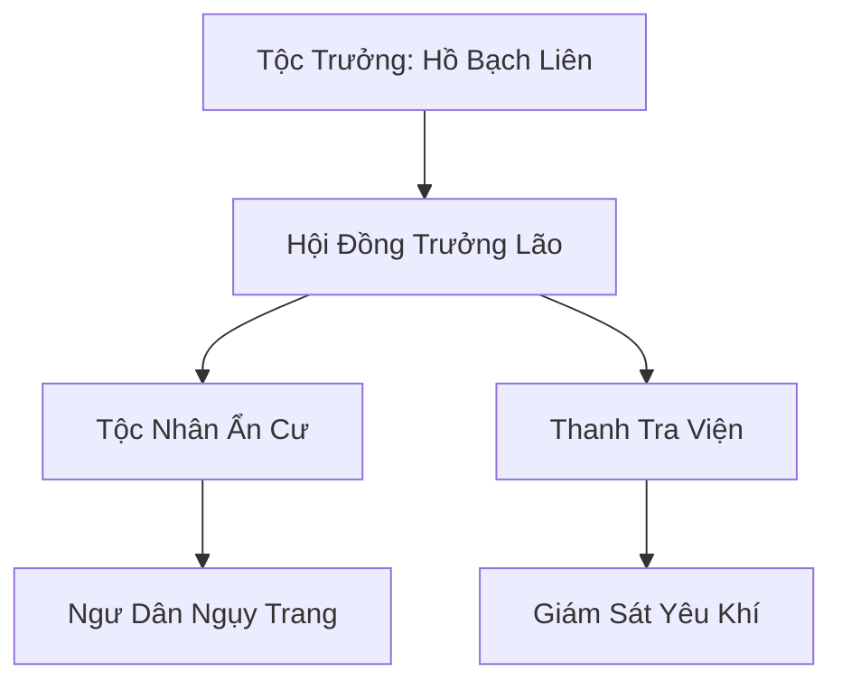

# BẠCH HỒ ẨN TỘC (白狐隐族)

## I. Tổng Quan (总览)
Bạch Hồ Ẩn Tộc là một bộ lạc yêu tộc nhỏ nhắn và hiền lành, bao gồm các cá thể hồ yêu tuyết sống sót sau những cuộc săn lùng thảm khốc. Để tồn tại, họ đã chọn con đường hòa nhập hoàn toàn vào xã hội nhân tộc, ngụy trang dưới lớp vỏ bọc là những ngư dân nghèo tại vùng biển Bắc Hải. Với phương châm "Sống là ẩn, lộ là chết", họ duy trì một sự tồn tại thầm lặng nhưng đầy bền bỉ.

## II. Địa Lý & Tài Nguyên (地理 với tài nguyên)
Cư trú tại một làng chài nhỏ hẻo lánh ven bờ biển Bắc Hải, nơi sương mù thường xuyên che phủ, tạo điều kiện thuận lợi cho việc che giấu yêu khí. Tài nguyên của tộc bao gồm nguồn hải sản dồi dào và các loại ngọc trai đặc biệt chỉ có ở vùng nước đóng băng, chứa đựng linh khí thủy hệ tinh khiết.

## III. Văn Hóa & Tín Ngưỡng (文化 với信仰)
Tôn thờ ánh trăng và sự tĩnh lặng của băng tuyết. Văn hóa của tộc xoay quanh việc rèn luyện thuật biến hóa và sự kiên nhẫn. Mỗi đệ tử từ nhỏ đã được dạy cách kìm nén bản năng yêu tộc để không bị lộ diện trước mặt con người. Đêm Đông Chí hàng năm là thời điểm quan trọng nhất, khi cả tộc tụ họp trong hang bí mật để được sống thật với hình hài của mình.

## IV. Cơ Cấu Tổ Chức (组织结构)


## V. Công Pháp & Trận Pháp (功法 với阵法)
- **Công Pháp:** *Tuyết Hồ Huyễn Hóa Thuật* (Bí thuật ngụy trang cấp cao), *Linh Thủy Ngưng Châu* (Kỹ thuật nuôi cấy ngọc trai bằng linh lực).
- **Trận Pháp:** *Ảo Ảnh Sương Mù Trận* - trận pháp phòng thủ bao quanh làng chài và hang bí mật, sử dụng hơi lạnh của biển để đánh lạc hướng thần thức của những thợ săn yêu thú.

## VI. Đặc Sản Môn Phái (门派特产)
- **Bạch Hồ Ngọc Trai:** Ngọc trai mang theo hơi lạnh tự nhiên, giúp tu sĩ bình ổn hỏa khí và tăng cường thần thức.
- **Huyễn Ảnh Phù:** Phù lục giúp người sử dụng tạm thời thay đổi diện mạo ở mức độ cơ bản.

## VII. Cơ Sở Hạ Tầng (基础设施)
- **Hang Tuyết Hồ:** Hang động ngầm bên dưới vách đá, nơi lưu giữ các bí kíp và là nơi tụ họp bí mật của tộc.
- **Bến Thuyền Ngụy Trang:** Khu vực neo đậu thuyền chài, nhìn bên ngoài hoàn toàn bình thường nhưng được yểm các lớp bảo vệ linh lực.

## VIII. Kinh Tế (経済)
Nguồn thu nhập chính đến từ việc bán hải sản và ngọc trai cho các thương buôn đi ngang qua. Nhờ vào thuật biến hóa, họ có thể tiếp cận những khu vực biển nguy hiểm mà con người không dám tới, từ đó thu thập được những nguyên liệu quý giá mang lại lợi nhuận ổn định.

## IX. Lịch Sử Tóm Tắt (简史)
Khởi nguồn từ một nhóm hồ yêu tuyết chạy trốn khỏi các cuộc tàn sát của thợ săn lông thú hàng trăm năm trước. Hồ Bạch Liên đã dùng trí tuệ và sự hy sinh của mình để dẫn dắt bộ lạc hòa nhập vào làng chài của nhân tộc, xây dựng nên một bình phong bảo vệ hoàn hảo cho thế hệ sau.

## X. Giai Thoại & Bí Mật (轶 sự với bí mật)
Tương truyền mỗi lần Hồ Bạch Liên khóc vì nỗi nhớ quê hương đã mất, nước mắt của bà sẽ hóa thành một viên ngọc trai màu đỏ hiếm thấy, chứa đựng oán niệm và sức mạnh thần giao cách cảm cực mạnh.

## XI. Quan Hệ Thế Lực (势力关系)
```mermaid
graph LR
    BHAT[Bạch Hồ Ẩn Tộc] -- Giao thương ngầm -- PBTĐ[Phá Băng Thương Đội]
    BHAT -- Liên kết -- BLTĐ[Băng Lang Tàn Đội]
    BHAT -- Sợ hãi -- TYĐ[Thiên Yêu Đình]
    BHAT -- Tránh né -- CQTĐ[Cực Quang Thần Điện]
```
