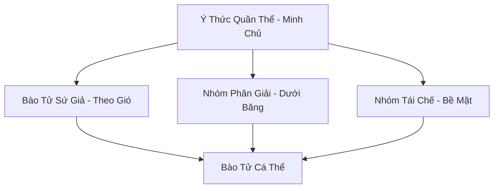

# BÀO TỬ TUYẾT LIÊN MINH (孢子雪联盟)

## I. Tổng Quan (总览)
Bào Tử Tuyết Liên Minh là một dạng sống tập thể nguyên thủy, trải rộng khắp các bình nguyên tuyết trắng của Bắc Băng. Tồn tại dưới dạng hàng tỷ bào tử nhỏ li ti, liên minh này đóng vai trò là "người dọn dẹp" vĩ đại của đại dương băng giá — hay như cổ thư Huyền Băng Cung ghi: *"Bào tử tuyết là bàn tay vô hình của thiên đạo, quét sạch tàn dư chiến tranh để vạn vật bắt đầu lại."* Họ chuyên phân giải xác của những cường giả và yêu thú chết từ thời thượng cổ, tái chế nguồn linh lực tàn dư bị kẹt trong băng và trả lại sự thanh khiết cho thiên địa. Dù không có hình hài cụ thể, ý thức tập thể của họ là một phần không thể thiếu trong sự cân bằng linh khí phương Bắc. Hiện tại, quần thể đang mở rộng bất thường — dấu hiệu cho thấy số lượng xác chết và tử khí dưới băng đang gia tăng vì một lý do chưa rõ.

## II. Địa Lý & Tài Nguyên (地理 với tài nguyên)
Địa bàn hoạt động là các vùng tundra mở, đặc biệt tập trung tại những nơi từng diễn ra các cuộc đại chiến thượng cổ — "Vạn Cốt Bình Nguyên" ở phía tây, "Huyết Tuyết Hoang Mạc" ở trung tâm, và "Tàn Binh Trũng" ở rìa đông. Tài nguyên quý giá nhất của liên minh là khả năng thu thập và nén "Linh Khí Tàn Dư" thành các tinh thể nhỏ gọi là "Tuyết Linh Phấn" - một loại nguyên liệu cực kỳ hiếm dùng để hồi phục thần thức và gia tăng thọ nguyên cho tu sĩ cấp cao. Ngoài ra, nơi nào thảm bào tử tuyết dày đặc nhất, nơi đó chắc chắn có di vật hoặc hài cốt cường giả bên dưới — quy luật này được Bạch Cốt Hội gọi là "Bào Tử Chỉ Nam" và tận dụng triệt để.
Khu vực xung quanh ẩn chứa nhiều bí mật chưa được khám phá — hang động chưa ai đến, mạch khoáng chưa ai biết, dấu tích cổ đại mà thời gian chưa kịp xóa nhòa.

## III. Văn Hóa & Tín Ngưỡng (文化 với信仰)
Đề cao triết lý: *"Cái chết nuôi dưỡng sự sống, tro tàn sinh mầm mới."* Họ không có tôn giáo hay lễ nghi cá nhân, mọi hành động đều tuân theo bản năng tập thể nhằm tối ưu hóa việc tịnh hóa môi trường. Văn hóa của liên minh là sự lan tỏa — khi một khu vực được thanh lọc xong, các bào tử sẽ theo gió cuốn đi để tìm kiếm những vùng đất chết khác, mang theo ký ức của vạn vật vào vòng luân hồi mới. Hiện tượng đáng chú ý nhất là "Tuyết Linh Vũ" — mỗi khi một bãi chiến trường cổ đại được thanh lọc hoàn toàn, hàng triệu bào tử sẽ đồng loạt phát sáng trắng bạc rồi bay lên trời như một trận mưa ngược, tạo nên cảnh tượng mà lữ khách phương Bắc coi là điềm lành: *"Thấy Tuyết Linh Vũ, ba năm không gặp họa."*
Mỗi thế hệ mới được truyền dạy không chỉ kỹ năng sinh tồn mà cả câu chuyện về nguồn cội, để ngọn lửa ký ức không bao giờ tắt dù hoàn cảnh khắc nghiệt đến đâu.

## IV. Cơ Cấu Tổ Chức (组织结构)


## V. Công Pháp & Trận Pháp (功法 với阵法)
- **Công Pháp:** Không có công pháp tu luyện nhân tạo, tiến hóa thông qua việc *Chuyển Hóa Tử Khí Thượng Cổ* thành năng lượng sống cho quần thể. Mỗi lần phân giải xong hài cốt một cường giả, ý thức tập thể sẽ hấp thụ một phần ký ức tàn dư — quá trình này được gọi là "Tử Ký Dung Hóa" — giúp quần thể dần dần tích lũy tri thức và nâng cao thần thức tổng thể.
- **Trận Pháp:** *Tuyết Vực Tịnh Hóa Trận* - toàn bộ thảm nấm tuyết hoạt động như một trận pháp thanh tẩy diện rộng, có khả năng hóa giải các loại tà thuật nguyền rủa bám trên di vật cổ đại trong phạm vi hàng trăm dặm. Khi trận pháp hoạt động ở cường độ tối đa — thường xảy ra tại các chiến trường cổ lớn — mặt tuyết sẽ phát sáng nhàn nhạt như ánh trăng, và mọi sinh vật bước vào vùng này đều cảm thấy một sự thanh thản kỳ lạ lan tỏa trong tâm thức.

## VI. Đặc Sản Môn Phái (门派特产)
- **Tuyết Linh Phấn:** Loại bụi mịn phát sáng có tác dụng tịnh hóa linh mạch bị ô nhiễm ma khí hoặc độc tố, đồng thời có khả năng hồi phục thần thức bị tổn thương. Một lạng Tuyết Linh Phấn trên thị trường đen có giá tương đương ba ngàn linh thạch trung phẩm — nhưng Bạch Cốt Hội là kẻ thu hoạch chính và bán với giá gấp đôi.
- **Hổ Phách Tuyết "Cổ Ký Thạch":** Nhựa cây đóng băng chứa bào tử cổ đại, có khả năng lưu giữ một phần linh hồn tàn dư của cường giả đã chết. Các luyện khí sư nghiên cứu lịch sử coi đây là "sách sử sống" — mỗi viên hổ phách chứa một mảnh ký ức từ thời đại trước.
- **Bào Tử Tịnh Thổ:** Bào tử sống được thu thập cẩn thận và bảo quản trong bình ngọc, dùng để rải lên các vùng đất bị ô nhiễm nặng, khởi động quá trình tịnh hóa tự nhiên kéo dài hàng thập kỷ.
Ngoài ra, Bào Tử Tuyết Liên Minh còn sở hữu vật phẩm có giá trị văn hóa hơn vật chất — thứ mà thương nhân bỏ qua nhưng nhà sử học trả bất cứ giá nào.

## VII. Cơ Sở Hạ Tầng (基础设施)
- **Thảm Bào Tử Vạn Năm "Bạch Tuyết Thảm":** Lớp bao phủ bề mặt dày đặc tại các điểm nút địa mạch chiến trường cổ, trông giống như tuyết trắng bình thường nhưng phát sáng nhẹ khi nhìn bằng thần thức. Khu vực lớn nhất — "Đại Bạch Tuyết Thảm" tại Vạn Cốt Bình Nguyên — trải rộng hơn năm mươi dặm vuông.
- **Hạch Tâm Ý Thức "Tuyết Tâm":** Ba khối băng cổ đại lớn chứa nồng độ bào tử cao nhất, nơi tập trung thần thức của toàn liên minh. Mỗi Tuyết Tâm nằm tại trung tâm một chiến trường cổ lớn, được bao bọc bởi nhiều lớp thảm bào tử dày đặc như thành lũy tự nhiên.
Toàn bộ hạ tầng mang dấu ấn đặc trưng cộng đồng — không phải xa hoa mà là thực dụng đúc kết qua nhiều thế hệ thử nghiệm.

## VIII. Kinh Tế (経済)
Kinh tế hoàn toàn mang tính thụ động và sinh thái. Giá trị họ mang lại cho Bắc Băng là việc duy trì sự ổn định của linh khí và thanh lọc tử khí từ các chiến trường cổ — nếu không có bào tử tuyết, toàn bộ vùng tundra Bắc Băng sẽ trở thành vùng đất chết tràn ngập oán khí. Tuy nhiên, một số thế lực như Bạch Cốt Hội thường lén lút thu hoạch Tuyết Linh Phấn để bán trên thị trường đen với giá cắt cổ — hoạt động mà liên minh không có khả năng ngăn chặn do thiếu phương tiện tự vệ chủ động. Ngoài ra, Hổ Phách Tuyết cũng bị các nhà khảo cổ và sử gia tu tiên tìm kiếm ráo riết, tạo ra một thị trường ngầm nhỏ nhưng lợi nhuận cao.
Tiềm năng kinh tế vượt xa những gì đang được khai thác — sự thiếu hụt nhân lực, kiến thức thương mại, và bảo hộ chính trị khiến phần lớn giá trị vẫn nằm yên.

## IX. Lịch Sử Tóm Tắt (简史)
Xuất hiện tự nhiên từ kỷ nguyên Thái Cổ, ngay sau khi những cuộc chiến thần ma đầu tiên kết thúc và để lại hàng vạn xác chết trên bình nguyên tuyết. Bào Tử Tuyết đã âm thầm tồn tại và thực hiện nhiệm vụ của mình qua hàng triệu năm, đóng vai trò là nhân chứng lặng lẽ cho sự hưng vong của muôn loài dưới lớp băng lạnh lẽo. Sự kiện đáng chú ý nhất trong lịch sử liên minh là "Đại Thanh Tẩy Vạn Cốt" — khi quần thể mất ba ngàn năm để phân giải hoàn toàn chiến trường của Đại Chiến Thần Ma lần thứ nhất, giải phóng một lượng linh khí tàn dư khổng lồ nuôi sống toàn bộ hệ sinh thái Bắc Băng cho đến tận ngày nay.
Mỗi thế hệ kế tiếp gánh di sản và gánh nặng thế hệ trước — nhưng cũng mang khả năng mới mà cha ông chưa từng tưởng tượng.

## X. Giai Thoại & Bí Mật (轶 sự với bí mật)
Tương truyền ý thức tập thể của liên minh nắm giữ toàn bộ ký ức của những cường giả đã ngã xuống trên chiến trường cổ, và nếu ai có thể kết nối được với thần thức này, họ sẽ sở hữu tri thức của toàn bộ kỷ nguyên trước. Tin đồn này đã khiến không ít tu sĩ liều mạng thử "Thông Linh" với Tuyết Tâm — nhưng mọi nỗ lực đều kết thúc trong thất bại, vì ký ức của hàng vạn cường giả ập đến cùng lúc đủ để phá hủy thần thức của bất kỳ ai. Ngoài ra, sự mở rộng bất thường gần đây của quần thể khiến một số học giả lo ngại rằng có một nguồn tử khí mới khổng lồ đang rò rỉ từ dưới lòng đất — có thể là dấu hiệu của việc phong ấn dưới Tuyết Sơn đang nứt vỡ.
Những bí mật này, nếu được tiết lộ, có thể khiến nhiều thế lực phải nhìn lại đánh giá của mình về cộng đồng nhỏ bé này — vừa là cơ hội vừa là mối nguy.

## XI. Quan Hệ Thế Lực (势力关系)
```mermaid
graph LR
    BTLM[Bào Tử Tuyết Liên Minh] -- Bị lợi dụng -- BCH[Bạch Cốt Hội]
    BTLM -- Tịnh hóa -- ALL[Hệ sinh thái Bắc Băng]
    BTLM -- Cạnh tranh -- HĐVTD[Hàn Độc Vi Trùng Đoàn]
    BTLM -- Vô hại -- CQTĐ[Cực Quang Thần Điện]
Nhìn tổng thể, mạng lưới quan hệ tuy mỏng manh nhưng đủ duy trì sự tồn tại — trong thế giới tu chân tàn khốc, tồn tại đã là chiến thắng.
```
