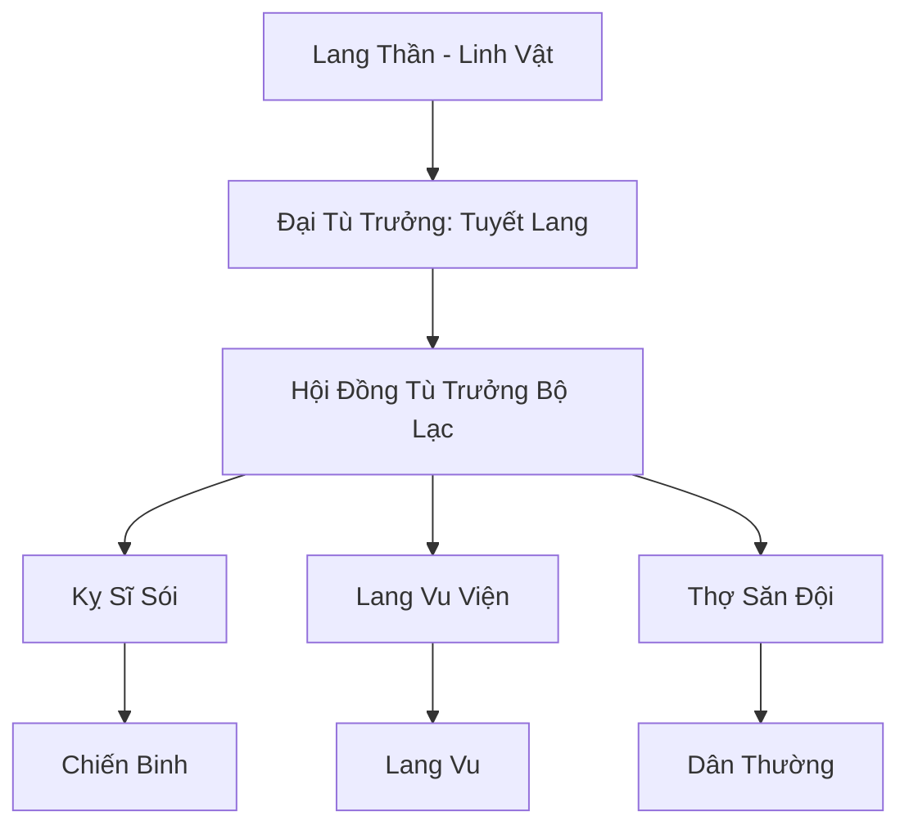

# BĂNG LANG BỘ LẠC (冰狼部落)

## I. Tổng Quan (总览)
Băng Lang Bộ Lạc là một cộng đồng du mục hùng mạnh cư ngụ tại ranh giới khắc nghiệt của Bắc Băng. Đây là sự kết hợp độc đáo giữa những con người mang huyết thống Băng Tộc và loài Winter Wolf (Băng Lang) thông thái. Thay vì tu luyện tiên pháp thanh cao, họ chọn con đường cộng sinh sinh tử với bầy sói, tạo nên một đạo quân kỵ sĩ sói dũng mãnh, có khả năng di chuyển và chiến đấu hiệu quả ngay cả trong những trận bão tuyết dữ dội nhất.

## II. Địa Lý & Tài Nguyên (地理 với tài nguyên)
Trụ sở chính là các lều trại di động di chuyển theo mùa dọc theo Rừng Tuyết biên thùy. Họ nắm giữ bí mật về các hang động băng giá chứa đựng "Băng Tinh Linh Thạch" và các loại rêu tuyết có tác dụng cầm máu thần kỳ. Tài nguyên lớn nhất chính là bầy sói hàng vạn con được thuần hóa qua nhiều thế hệ.

## III. Văn Hóa & Tín Ngưỡng (文化 với信仰)
Tôn thờ Lang Thần và sức mạnh của bầy đàn. Cư dân bộ lạc tin rằng "Một con sói đơn độc sẽ chết, nhưng cả đàn sẽ tồn tại". Văn hóa của họ đề cao sự dũng cảm, lòng trung thành tuyệt đối và bản năng sinh tồn. Nghi lễ lớn nhất là "Lễ Khế Ước", nơi một thiếu niên sẽ chọn cho mình một chú sói con để cùng nhau lớn lên và chiến đấu trọn đời.

## IV. Cơ Cấu Tổ Chức (组织结构)


## V. Công Pháp & Trận Pháp (功法 với阵法)
- **Công Pháp:** *Băng Lang Luyện Thể Quyết* (Cường hóa nhục thân), *Lang Tâm Thông* (Giao tiếp tâm linh với sói).
- **Trận Pháp:** *Tuyết Ảnh Vây Hãm Trận* - trận pháp phối hợp giữa hàng trăm kỵ sĩ sói, tạo ra các dư ảnh mờ ảo trong bão tuyết để cô lập và tiêu diệt quân địch.

## VI. Đặc Sản Môn Phái (门派特产)
- **Tuyết Lang Đao:** Kiếm ngắn làm từ nanh sói già, có khả năng gây đóng băng vết thương đối phương.
- **Rượu Lang Huyết:** Loại rượu mạnh giúp tu sĩ giữ ấm cơ thể và tăng cường khí huyết trong môi trường cực lạnh.

## VII. Cơ Sở Hạ Tầng (基础设施)
- **Hang Lang Thần:** Nơi tôn nghiêm nhất, nơi trú ngụ của Lang Vương và các vị tổ tiên.
- **Hệ thống Lều Trại Phù Văn:** Các lều trại có khả năng chống lại áp lực của bão tuyết cấp 10.

## VIII. Kinh Tế (経済)
Kinh tế dựa trên săn bắn và thu thập. Họ trao đổi da sói, xương yêu thú và các dược liệu băng hệ cho các thương hội từ Trung Tâm để lấy gạo, vải vóc và vũ khí kim loại. Họ cũng thỉnh thoảng nhận các nhiệm vụ bảo vệ các đoàn thám hiểm đi vào vùng lõi Bắc Băng.

## IX. Lịch Sử Tóm Tắt (简史)
Được thành lập bởi Tuyết Lang Nha, một vị anh hùng bị trục xuất khỏi Huyền Băng Cung do mang trong mình dòng máu lai. Ông đã thuần hóa được bầy sói hoang và tập hợp những kẻ bị ruồng bỏ để xây dựng nên một bộ lạc có thể kiêu hãnh tồn tại giữa tuyết trắng, thách thức sự thống trị của các tông môn chính thống.

## X. Giai Thoại & Bí Mật (轶 sự với bí mật)
Tương truyền mỗi khi trăng tròn đỏ xuất hiện, các chiến binh cao cấp của bộ lạc có thể thực hiện "Lang Hóa", biến thành những thực thể bán thú với sức mạnh tăng vọt gấp nhiều lần.

## XI. Quan Hệ Thế Lực (势力关系)
```mermaid
graph LR
    BLBL[Băng Lang Bộ Lạc] -- Đối địch -- HBC[Huyền Băng Cung]
    BLBL -- Thân thiện -- BTS[Bách Thú Sơn Trang]
    BLBL -- Giao thương -- BBC[Bách Bảo Các]
    BLBL -- Cảnh giác -- CQTĐ[Cực Quang Thần Điện]
```
