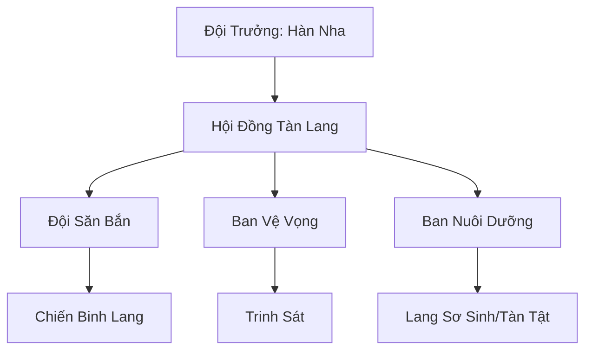

# BĂNG LANG TÀN ĐỘI (冰狼残队)

> *"Sói bị đuổi vẫn là sói — răng gãy thì cắn bằng nanh, chân cụt thì chiến bằng hồn."*
> — Hàn Nha, trong đêm đầu tiên sau khi bị trục xuất khỏi bộ lạc

## I. Tổng Quan (总览)
Băng Lang Tàn Đội là một nhóm nhỏ các lang yêu bị trục xuất khỏi Băng Lang Bộ Lạc do già yếu, bệnh tật hoặc tàn phế. Thay vì chờ đợi cái chết trong cô độc trên tuyết trắng vô tận, họ đã tập hợp lại dưới sự dẫn dắt của Hàn Nha — lang yêu cái bị đuổi vì sinh con dị tật — để cùng nhau tìm kiếm một con đường sống mới. Dù bị coi là những kẻ thất bại, họ vẫn giữ vững niềm kiêu hãnh của loài sói và ý chí sinh tồn mãnh liệt giữa bão tuyết phương Bắc. Hai mươi lăm cá thể tàn phế ấy đã chứng minh rằng sự đoàn kết có thể bù đắp cho mọi khiếm khuyết thể xác, và ánh mắt hoang dã của chúng vẫn khiến những kẻ săn đầu thưởng phải dè chừng.

## II. Địa Lý & Tài Nguyên (地理与资源)
Trú ngụ tại vùng rìa phía nam của lãnh thổ Băng Lang Bộ Lạc, nơi rừng thông tuyết thưa thớt và linh khí nghèo nàn — khu vực mà bộ lạc chính gọi khinh bỉ là "Tuyết Rác Địa." Địa điểm chính là Hang Suối Băng — hang đá tự nhiên bên cạnh con suối Hàn Nha Tuyền đã đóng băng vĩnh cửu, nơi nước ngầm rỉ ra qua các kẽ đá tạo thành những cột băng lung linh. Hang rộng vừa đủ chứa hai mươi lăm con sói, lối vào hẹp chỉ cho một con sói trưởng thành chui qua — phòng thủ tự nhiên tốt nhất mà họ có. Tài nguyên cực kỳ hạn hẹp: thú hoang nhỏ vùng biên giới ngày càng hiếm, linh thạch vụn nhặt nhạnh từ phế tích cổ lẫn trong đá, và vài bụi Hàn Tâm Thảo — dược thảo chịu lạnh mọc quanh suối băng, lá trắng bạc như tuyết, có tác dụng giảm đau và cầm máu khi nhai trực tiếp. Tuy nhiên, Hàn Nha đã khéo léo biến vùng rừng thông tuyết xung quanh hang thành mạng lưới bẫy tự nhiên tinh vi, biến điểm yếu địa lý thành lợi thế phòng thủ.

## III. Văn Hóa & Tín Ngưỡng (文化与信仰)
Đề cao triết lý: "Sói bị đuổi vẫn là sói." Thành viên tàn đội không bao giờ cầu xin sự thương hại từ bộ lạc cũ, và bất kỳ ai nhắc đến việc quay về đều bị coi là phản bội tinh thần của đàn. Văn hóa của họ mang đậm tính đùm bọc, nơi những cá thể yếu ớt nhất vẫn tìm thấy giá trị của mình thông qua sự phối hợp bầy đàn — con sói mù Thiết Nhĩ đảm nhận canh gác bằng thính giác siêu nhạy, con sói ba chân Liệt Phong phụ trách trinh sát nhờ tốc độ vẫn nhanh hơn hầu hết thú hoang. Tiếng hú vọng về phương Bắc mỗi đêm trăng tròn — nghi thức "Vọng Nguyệt Hào" — vừa là lời tưởng nhớ tổ tiên, vừa là lời khẳng định sự tồn tại bất khuất. Mỗi thành viên mới gia nhập đều được Hàn Nha cào một vết trên vai trái gọi là "Tàn Ấn," biểu tượng cho việc chấp nhận thân phận lưu đày và thề sống chết cùng đàn. Hàn Nha dạy đàn con: "Bộ lạc đuổi ta vì ta yếu. Nhưng sói đi trong bầy thì không bao giờ yếu — chỉ có sói cô độc mới chết."

## IV. Cơ Cấu Tổ Chức (组织结构)


Hàn Nha đứng đầu — lang yêu cái tuổi hai trăm năm, lông xám bạc, một chân trước bị thương nên đi hơi khập khiễng nhưng hàm răng vẫn sắc và thần thức vẫn nhạy bén. Hội Đồng Tàn Lang gồm ba lang yêu già nhất, họp bàn mỗi khi có quyết định lớn — già Thiết Nhĩ (mù) chuyên phân tích tình hình an ninh qua âm thanh, già Bạch Nha (gần mất hết răng) phụ trách phân phối thức ăn công bằng, và già Sắt Móng quản lý huấn luyện lang non. Đội Săn Bắn gồm mười chiến binh — mỗi con đều mang ít nhất một khuyết tật nhưng bù đắp bằng sự phối hợp ăn ý. Ban Vệ Vọng dùng lang yêu mù hoặc tàn tật nhưng giác quan khác vẫn nhạy bén để canh gác — Thiết Nhĩ có thể nghe bước chân trên tuyết từ nửa dặm xa. Ban Nuôi Dưỡng chăm sóc lang sơ sinh và lang yêu quá già để tự lo — công việc mà ở bộ lạc cũ không tồn tại vì yếu thì bị đuổi.

## V. Công Pháp & Trận Pháp (功法与阵法)
- **Công Pháp:** Không có công pháp hệ thống, chủ yếu dựa vào bản năng *Huyết Mạch Cuồng Hóa* — khả năng kích hoạt sức mạnh tiềm ẩn trong huyết mạch lang thần khi tính mạng bị đe dọa, đổi lại là suy kiệt nghiêm trọng sau khi hiệu lực hết. Hàn Nha đã phát triển bộ chiến thuật "Tàn Lang Quyền" — tận dụng khiếm khuyết cơ thể làm bất ngờ cho đối phương: sói mù lao vào trước đánh lạc hướng vì kẻ thù không ngờ nó chiến đấu bằng thính giác, sói ba chân nhử mồi vì đối phương sẽ coi thường tốc độ của nó rồi bị phục kích từ phía sau.
- **Trận Pháp:** Sử dụng lối đánh du kích "Vây Linh Sát," tận dụng địa hình tuyết dày để cô lập và tiêu diệt các mục tiêu đơn lẻ lớn hơn mình. Chiến thuật cốt lõi: đào hào tuyết ngầm xung quanh con mồi, rồi đồng loạt xuất hiện từ bốn phía — kỹ thuật mà thợ săn nhân tộc gọi với vẻ kinh sợ là "Tuyết Địa Quỷ Trận."

## VI. Đặc Sản Môn Phái (门派特产)
- **Răng Nanh Sói Tuyết:** Vật liệu cứng cáp thu từ xác sói thường chết trong bão hoặc nanh rụng tự nhiên của lang yêu già, dùng chế tạo dao găm hoặc mũi tên linh lực. Nanh của sói già đã ngấm hàn khí suốt đời có thể xuyên thủng giáp da thường mà không cần phù ấn, thợ rèn phương nam gọi là "Hàn Nha Tiên."
- **Da Thú Chống Lạnh "Hàn Lang Bì":** Da thú xử lý đặc biệt bằng nước bọt lang yêu chứa hàn khí, ngâm trong suối băng rồi phơi trong gió tuyết ba ngày ba đêm, giữ ấm cơ thể trong bão tuyết cấp năm. Thương nhân phương nam sẵn sàng trả năm viên linh thạch hạ phẩm cho một tấm Hàn Lang Bì đủ may áo khoác.
- **Máu Lang Yêu Cô Đặc:** Dùng trong một số bài đan dược tăng cường thể phách và giác quan, đặc biệt hiệu quả cho tu sĩ thể tu đạo. Thu thập từ lang yêu già tự nguyện hiến — mỗi con chỉ cho một lượng nhỏ mỗi mùa để không ảnh hưởng sức khỏe.
- **Hàn Tâm Thảo:** Dược thảo chịu lạnh mọc quanh suối băng, dùng trực tiếp nhai giảm đau cầm máu hoặc phơi khô tán bột làm thuốc đắp vết thương. Tàn đội thu hái cẩn thận, chỉ lấy một phần ba mỗi bụi để cây kịp tái sinh.

## VII. Cơ Sở Hạ Tầng (基础设施)
- **Hang Suối Băng:** Nơi trú ẩn an toàn nhất, lối vào hẹp được gia cố bằng xương thú lớn xếp chồng và một vài phù lục phòng thủ đơn giản. Bên trong chia ba khu: khu ngủ nghỉ lót rêu khô và lông thú; "Ổ Ấm" — hốc đá riêng nơi lang sơ sinh và bị thương nặng được chăm sóc, luôn có ít nhất một con sói trưởng thành nằm cạnh sưởi ấm; và khu dự trữ thức ăn nằm sâu nhất nơi lạnh nhất giữ thịt tươi lâu hơn.
- **Tàn Lang Trường:** Khoảnh sân tuyết giữa rừng thông nơi Hàn Nha dạy Tàn Lang Quyền và kỹ năng săn bắn cho thế hệ sau, mặt tuyết in đầy dấu chân và vết cào của nhiều thế hệ lang non. Ở giữa sân có một thân cây thông khô cắm thẳng dùng làm "mục tiêu" tập luyện, chi chít vết móng vuốt.
- **Trạm Canh Đỉnh Đá:** Tảng đá cao nhất gần hang, từ đây có thể nhìn thấy mọi chuyển động trên đồng tuyết trải dài phía nam, bao gồm cả tuần tra viên của Băng Lang Bộ Lạc khi chúng đi qua.

## VIII. Kinh Tế (经济)
Nền kinh tế hoàn toàn phụ thuộc vào săn bắn và thu lượm, không có nguồn thu ổn định. Họ trao đổi da lông và xương yêu thú cho Phá Băng Thương Đội — đối tác duy nhất dám giao dịch với đám sói bị lưu đày — để lấy lương thực khô và dược liệu trị thương cơ bản. Gần đây, Hàn Nha bắt đầu cung cấp dịch vụ trinh sát địa hình cho kẻ lưu vong và tán tu muốn tìm đường an toàn qua vùng biên giới Băng Lang, thu phí bằng thịt khô hoặc linh thạch hạ phẩm. Mùa đông khắc nghiệt nhất, khi thú hoang biến mất trong bão tuyết liên miên, tàn đội phải ăn rêu đá và vỏ cây thông để sống — Hàn Nha luôn nhịn ăn nhường phần cho đàn con và lang yêu già, bà nói: "Đội trưởng ăn sau cùng — đó là luật duy nhất ta đặt ra."

## IX. Lịch Sử Tóm Tắt (简史)
Được hình thành cách đây hai mươi năm khi Hàn Nha, một lang yêu cái bị đuổi khỏi bầy vì sinh con dị tật — đứa con có bộ lông trắng bạc thay vì xám như toàn tộc, bị coi là điềm xấu. Thay vì chấp nhận chết ngoài tuyết lạnh, bà cõng đứa con trên lưng đi qua bốn ngày bão tuyết, tìm được Hang Suối Băng khi đã gần kiệt sức. Dần dần, những lang yêu đồng cảnh ngộ — sói mù Thiết Nhĩ, sói ba chân Liệt Phong, lão sói già Bạch Nha gần mất hết răng — lần lượt tìm đến sau khi nghe tiếng hú của Hàn Nha vọng trong đêm. Bà biến đám quân tàn thành đội ngũ có tổ chức, đủ sức tồn tại ở vùng ranh giới tử thần của Bắc Băng. Sự kiện đáng nhớ nhất là trận chiến đêm "Huyết Nguyệt" khi đàn sói hợp lực tiêu diệt một con Hàn Hùng Trắng to gấp mười lần chúng, chứng minh rằng sự phối hợp có thể chiến thắng sức mạnh thuần túy — bộ da Hàn Hùng Trắng đó giờ trải trên sàn Ổ Ấm, là chiến tích và nguồn sưởi quý giá nhất của tàn đội.

## X. Giai Thoại & Bí Mật (轶事与秘密)
Đứa con dị tật của Hàn Nha — "Ngân Nha," lang yêu con lông trắng bạc — mang trong mình huyết mạch "Thiên Lang" cổ đại, thứ có khả năng hiệu lệnh toàn bộ bầy sói Bắc Băng bất kể phái hệ. Sức mạnh này vẫn đang bị phong ấn sâu trong cơ thể yếu ớt — Ngân Nha sinh ra nhỏ hơn lang non thường, hay ốm, và ít nói, nhưng mỗi khi nó tru lên, thú hoang trong bán kính một dặm đều im bặt như bị trấn áp bởi uy áp vô hình. Nếu Ngân Nha tỉnh thức huyết mạch thành công, nó sẽ trở thành "Thiên Lang Vương" — vị bá chủ bầy sói đầu tiên trong ba ngàn năm, và mọi lang yêu trên toàn Bắc Băng sẽ buộc phải quy phục theo bản năng huyết mạch.

Hàn Nha biết con mình không bình thường nhưng không hiểu tại sao — bà chỉ biết rằng vào đêm Ngân Nha chào đời, bão tuyết trên toàn Bắc Băng dừng lại một khắc, khoảnh khắc tĩnh lặng tuyệt đối mà chỉ những lang yêu ngoài trời mới nhận ra. Đây chính là lý do thực sự khiến Băng Lang Bộ Lạc muốn trục xuất Hàn Nha — không phải vì con dị tật, mà vì sợ hãi trước điều nó có thể trở thành. Nếu Lang Vương đương nhiệm biết Ngân Nha vẫn sống, hắn sẽ không đuổi mà sẽ giết.

## XI. Quan Hệ Thế Lực (势力关系)
```mermaid
graph LR
    BLTĐ[Băng Lang Tàn Đội] -- Đối địch -- BLBL[Băng Lang Bộ Lạc]
    BLTĐ -- Liên lạc ngầm -- BHAT[Bạch Hồ Ẩn Tộc]
    BLTĐ -- Đồng cảnh -- ĐDLĐ[Đoản Dực Lạc Đoàn]
    BLTĐ -- Trao đổi -- PBTĐ[Phá Băng Thương Đội]
```

- **Băng Lang Bộ Lạc:** Cựu bộ lạc, coi tàn đội là "rác rưởi biết thở." Tuần tra viên thỉnh thoảng đi qua vùng Tuyết Rác Địa để xua đuổi, nhưng Hàn Nha khôn ngoan chọn đất mà bộ lạc không thèm nên xung đột trực tiếp hiếm khi xảy ra.
- **Bạch Hồ Ẩn Tộc:** Liên lạc ngầm qua các cuộc gặp bí mật ở ranh giới lãnh thổ, trao đổi thông tin về động thái các thế lực lớn. Bạch Hồ trưởng tộc là một trong số ít kẻ biết về sự tồn tại của Ngân Nha, và bà ấy đã hứa giữ bí mật vì hiểu rằng Thiên Lang tỉnh thức sẽ thay đổi cục diện toàn Bắc Băng.
- **Đoản Dực Lạc Đoàn:** Đồng cảnh ngộ — bọn chim cánh ngắn cũng bị đàn chim lớn khinh bỉ. Hai bên chưa hợp tác chính thức nhưng tôn trọng lãnh thổ của nhau, đôi khi để lại thịt thú dư ở ranh giới như quà tặng không lời.
- **Phá Băng Thương Đội:** Đối tác thương mại duy nhất, đổi da thú lấy nhu yếu phẩm mỗi khi thương đội liều lĩnh đi qua vùng biên — thuyền trưởng của họ là người duy nhất ngoài tàn đội dám ngồi uống rượu cùng Hàn Nha.
