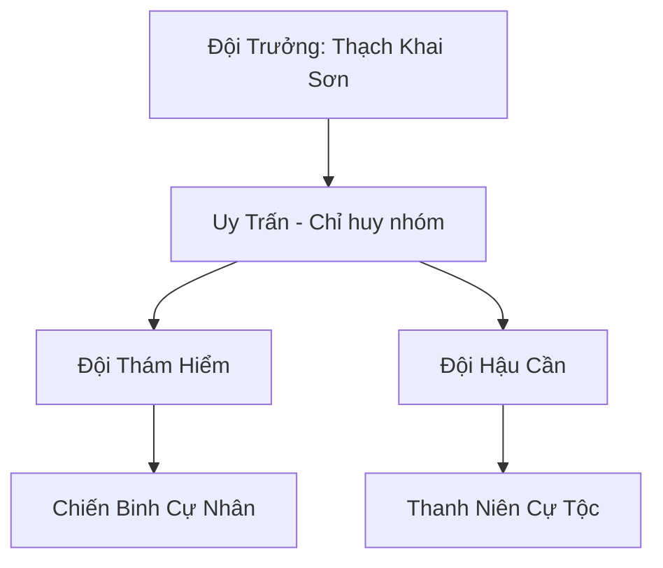

# BĂNG NGUYÊN KHAI HOANG ĐỘI (冰原开荒队)

> *"Đất mới cho kẻ dũng cảm — nếu kẻ dũng cảm không chết cóng trước khi tìm thấy đất."*
> — Thạch Khai Sơn, khi dẫn đội vượt qua trận bão tuyết đầu tiên

## I. Tổng Quan (总览)
Băng Nguyên Khai Hoang Đội là một đơn vị thám hiểm nhỏ nhưng đầy tham vọng, gồm mười hai thanh niên Cự Tộc khao khát tự do và những vùng đất mới. Chán ghét cuộc sống bị chèn ép tại các khu vực biên giới phía nam, họ đã quyết định tiến sâu về phương Bắc lạnh giá để khai phá những vùng đất chưa ai từng đặt chân tới. Với sức mạnh nhục thân to lớn và tinh thần thép, họ là những người đi tiên phong trong việc mở rộng ranh giới sinh tồn của chủng tộc giữa băng giá vĩnh cửu. Dù chỉ là mười hai thanh niên bướng bỉnh, ngọn giáo da cam cắm trên đỉnh lều trại của họ đã trở thành biểu tượng cho hy vọng của thế hệ Cự Tộc trẻ — rằng tương lai không nằm ở sự phục tùng, mà ở những chân trời chưa ai khám phá.

## II. Địa Lý & Tài Nguyên (地理与资源)
Hoạt động tại vùng tundra hoang sơ phía Bắc Bắc Băng, nơi địa hình thay đổi liên tục theo các đợt bão tuyết — hôm nay là đồng bằng tuyết phẳng lì, ngày mai đã thành dãy gò đá lởm chởm do gió cuốn tuyết dày lên. Họ không có căn cứ cố định mà di chuyển theo các mạch linh khí tiềm năng, cắm trại ở bất cứ nơi nào có dấu hiệu khoáng sản hoặc nơi trú ẩn tự nhiên. Thạch Khai Sơn đặt tên cho mỗi vùng đất khám phá: "Bạch Nguyên Nhất" là bình nguyên tuyết đầu tiên họ vượt qua, "Phong Khốc Đài" là vách đá nơi gió rít đến mức không ai đứng vững, "Ẩn Tuyền Cốc" là thung lũng bí ẩn nơi họ phát hiện suối nước nóng giữa băng giá. Tài nguyên hoàn toàn dựa vào khám phá: mỏ linh thạch lộ thiên nằm rải rác trong các khe băng nứt, hang động chứa quặng thô và thỉnh thoảng là di vật cổ đại — Thạch Khai Sơn đã vẽ tất cả lên bản đồ da thú mà hắn gọi là "Bản Đồ Hy Vọng."

## III. Văn Hóa & Tín Ngưỡng (文化与信仰)
Đề cao triết lý: "Đất mới cho kẻ dũng cảm." Thành viên đội tin rằng tương lai của Cự Tộc nằm ở những vùng đất chưa khai phá, không phải ở việc cúi đầu phục vụ các thế lực đã chia hết đất đai ở phương nam. Văn hóa của họ mang đậm tính tiên phong, tôn trọng sự hy sinh và chia sẻ thành quả một cách công bằng — ai tìm thấy mỏ quặng mới thì cả đội cùng khai thác, ai săn được thú lớn thì cả đội cùng ăn, không phân biệt công trạng. Mỗi vùng đất mới phát hiện đều được họ cắm cọc đá khắc tên — "Trụ Đá Khai Hoang" — như một lời khẳng định chủ quyền và lòng kiêu hãnh. Mỗi tối quanh đống lửa trại, Thạch Khai Sơn kể lại truyền thuyết về "Cổ Cự Nhân Vùng Đất Hứa" cho đồng đội nghe, và mỗi lần kể hắn lại thêm thắt chi tiết mới cho câu chuyện thêm hấp dẫn — đến mức không ai phân biệt được đâu là truyền thuyết thật, đâu là trí tưởng tượng của hắn.

## IV. Cơ Cấu Tổ Chức (组织结构)


Cơ cấu đơn giản theo kiểu quân đội dã chiến. Thạch Khai Sơn là đội trưởng kiêm thủ lĩnh tinh thần — thiếu niên Cự Tộc cao ba trượng rưỡi, vai rộng như cổng thành, luôn mang theo cây giáo cắm ngọn cờ da cam. Hai Uy Trấn phụ trách chỉ huy nhóm nhỏ khi đội tách ra khảo sát — Thạch Thiết phụ trách nhóm thám hiểm tiền phong, luôn đi đầu dò đường; Uy Trấn thứ hai phụ trách hậu cần, quản lý lương thảo và trang thiết bị. Chín chiến binh còn lại chia thành hai nhóm luân phiên: nhóm khảo sát ban ngày và nhóm canh gác ban đêm. Mọi quyết định quan trọng đều do Thạch Khai Sơn quyết định sau khi nghe ý kiến cả đội — hắn không phải lãnh đạo bằng uy quyền mà bằng lòng tin và sự liều lĩnh khiến mọi người muốn đi theo.

## V. Công Pháp & Trận Pháp (功法与阵法)
- **Công Pháp:** Dựa trên bản năng *Cự Linh Lực* của tộc, tập trung vào việc gia tăng sức bền và khả năng chống chọi với nhiệt độ cực thấp. Thạch Khai Sơn đã tự phát triển thêm một kỹ thuật gọi là "Hàn Tức Công" — hít thở sâu trong gió tuyết để luyện phổi chịu lạnh, sau vài tháng luyện tập có thể hoạt động liên tục trong bão tuyết mà không kiệt sức. Kỹ thuật này thô sơ nhưng hiệu quả thực tế, và hắn đang ghi chép lại cẩn thận để truyền cho thế hệ sau.
- **Trận Pháp:** Sử dụng "Trận Pháp Đá Tảng" đơn giản — mười hai cự nhân xếp đá lớn thành hàng rào hình vòng cung chắn gió và bảo vệ khu trại tạm thời trước sự tấn công của yêu thú bão tuyết. Khi bị tấn công, cả đội đứng sát nhau thành khối, dùng sức mạnh nhục thân thuần túy để chống trả — đơn giản nhưng với sức mạnh Cự Tộc, ít yêu thú nào dám lao vào bức tường thịt cao ba trượng.

## VI. Đặc Sản Môn Phái (门派特产)
- **Băng Tinh Khoáng:** Loại quặng thô chứa năng lượng băng giá tinh thuần, được thu thập trực tiếp từ các khe nứt sông băng nơi linh khí ngưng tụ thành tinh thể. Quặng này có màu xanh lam trong suốt, phát ra hơi lạnh ngay cả trong ngày nắng, được các thợ rèn phương nam đánh giá cao khi chế tạo vũ khí băng hệ.
- **Thịt Thú Ướp Băng:** Thực phẩm dự trữ đặc trưng — thịt yêu thú bão tuyết ướp trong tuyết vĩnh cửu, giữ nguyên dược tính và hương vị hàng tháng trời, cung cấp năng lượng lớn cho Cự Tộc trong các chuyến hành trình dài. Mỗi miếng thịt đủ cho một cự nhân ăn ba ngày, nhưng nếu phàm nhân ăn một miếng thì no cả tuần.
- **Bản Đồ Vùng Cực:** Các bản vẽ trên da thú ghi lại địa hình, mạch khoáng và nguồn nước mà đội khám phá được. Đối với các bộ lạc Cự Tộc khác muốn mở rộng lãnh thổ, những bản đồ này có giá trị ngang linh thạch.

## VII. Cơ Sở Hạ Tầng (基础设施)
- **Lều Trại Dã Chiến:** Hệ thống lều bằng da thú khổng lồ, mỗi lều cao bốn trượng, may từ da Bạch Hùng Tuyết — loại gấu trắng khổng lồ sống ở vùng cực — có khả năng giữ nhiệt ngay cả khi ngoài trời âm bốn mươi độ. Lều có thể tháo dỡ và dựng lại trong vòng nửa canh giờ nhờ hệ thống cọc xương thú lắp ghép.
- **Trạm Gác Đá:** Các tháp canh thô sơ xếp bằng đá tảng tại các điểm dừng chân chiến lược, cao đủ để quan sát xung quanh hàng dặm trên bình nguyên tuyết phẳng. Mỗi trạm gác khắc ký hiệu riêng của đội để đánh dấu lãnh thổ đã khảo sát.
- **Ẩn Tuyền Trại:** Khu trại bán cố định tại Ẩn Tuyền Cốc — thung lũng có suối nước nóng tự nhiên, là nơi đội trở về nghỉ ngơi và hồi phục sau mỗi chuyến thám hiểm dài. Đây là "căn cứ" gần nhất mà họ có, và Thạch Khai Sơn đang tính xây dựng thành trạm tiền phương vĩnh viễn.

## VIII. Kinh Tế (经济)
Nền kinh tế hoàn toàn phụ thuộc vào việc thám hiểm và săn bắn. Họ thu thập linh thạch và dược liệu hoang dã để dự trữ cho những chuyến hành trình dài hơn về phía cực Bắc — mỗi khi tìm được mỏ quặng mới, cả đội dành vài ngày khai thác trước khi tiếp tục hành trình. Thỉnh thoảng họ trao đổi tin tức về các mạch khoáng mới cho các bộ lạc cự nhân khác để lấy trang thiết bị kim loại, đặc biệt là rìu và búa rèn — vũ khí mà Cự Tộc không tự chế tạo được vì bàn tay quá lớn để làm công việc tinh xảo. Đại Bàng Tuyết Đàn đôi khi đổi thông tin địa hình từ trên cao lấy thịt thú ướp băng — mối quan hệ thương mại đơn giản nhưng cả hai bên đều hài lòng.

## IX. Lịch Sử Tóm Tắt (简史)
Được thành lập cách đây hai năm bởi Thạch Khai Sơn — một thiếu niên Cự Tộc cao lớn và bướng bỉnh, tuổi mới mười bảy theo lịch Cự Tộc nhưng đã cao gần bốn trượng. Hắn lớn lên trong Tuyết Cự Nhân Lạc Đoàn, chứng kiến tộc nhân phải cúi đầu trước các thế lực nhỏ hơn nhưng mạnh hơn về tu vi, và không chịu nổi cảnh đó. Hắn đã thuyết phục được mười một bạn cùng lứa rời bỏ sự an toàn giả tạo để tiến vào vùng tử địa phương Bắc, bắt đầu hành trình tìm kiếm "Vùng Đất Hứa" trong truyền thuyết tổ tiên. Hai năm qua, đội đã vượt qua ba trận bão tuyết lớn, mất hai thành viên vì yêu thú tấn công nhưng tuyển thêm hai người mới từ các bộ lạc lang thang, và khám phá được bốn khu vực chưa từng có trên bản đồ — bao gồm Ẩn Tuyền Cốc, nơi có thể trở thành căn cứ đầu tiên của Cự Tộc ở vùng cực Bắc.

## X. Giai Thoại & Bí Mật (轶事与秘密)
Thạch Khai Sơn đang nắm giữ một phiến đá chứa đựng văn tự từ thời đại thần thoại, thứ mà hắn tìm thấy trong một hang động sâu dưới lòng sông băng vào tháng đầu tiên của hành trình. Phiến đá khắc ký tự Cự Tộc cổ đại, lớn hơn văn tự hiện đại gấp ba lần, nội dung mà hắn chỉ dịch được một phần nhờ truyền thuyết tổ tiên: "...hướng về ngôi sao không bao giờ di chuyển... vượt qua biển băng thứ ba... nơi đá nói chuyện..." Hắn tin rằng phiến đá là bản đồ dẫn đến một đại di tích — có thể là thành trì cổ đại của Cự Tộc thời kỳ hoàng kim, nơi ẩn giấu bí mật về nguồn gốc sức mạnh nguyên thủy của chủng tộc.

Ngoài ra, trong chuyến thám hiểm gần đây nhất, đội phát hiện dấu chân khổng lồ trong tuyết — lớn gấp đôi dấu chân của Thạch Khai Sơn, sâu đến mức cho thấy sinh vật để lại phải nặng ít nhất gấp mười lần một cự nhân trưởng thành. Dấu chân hướng về phía bắc và biến mất trong bão tuyết. Thạch Khai Sơn không biết nên sợ hãi hay phấn khích — nếu đó là Cự Tộc cổ đại còn sống sót, hắn muốn tìm thấy họ; nếu đó là yêu thú chưa từng biết, hắn vẫn muốn tìm thấy nó.

## XI. Quan Hệ Thế Lực (势力关系)
```mermaid
graph LR
    BNKHĐ[Băng Nguyên Khai Hoang Đội] -- Xuất thân -- TCNLĐ[Tuyết Cự Nhân Lạc Đoàn]
    BNKHĐ -- Trao đổi -- ĐBTĐ[Đại Bàng Tuyết Đàn]
    BNKHĐ -- Cảnh giác -- SMU[Sương Ma Uyển]
    BNKHĐ -- Độc lập -- ALL[Mọi Thế Lực]
```

- **Tuyết Cự Nhân Lạc Đoàn:** Nơi xuất thân của hầu hết thành viên, quan hệ hữu hảo. Lạc Đoàn Trưởng vừa lo lắng vừa tự hào khi nhìn bọn trẻ ra đi — ông từng nói: "Nếu chúng tìm thấy Vùng Đất Hứa, cả tộc sẽ đi theo; nếu chúng chết, ít nhất chúng chết như những cự nhân đứng thẳng."
- **Đại Bàng Tuyết Đàn:** Thỉnh thoảng trao đổi thông tin địa hình không trung lấy thịt thú, mối quan hệ thực dụng và tôn trọng lẫn nhau.
- **Sương Ma Uyển:** Cảnh giác — vùng sương mù bí ẩn phía tây bắc mà đội tránh xa sau khi một thành viên suýt lạc vào và kể lại nghe thấy tiếng gọi tên mình vọng ra từ sương.
