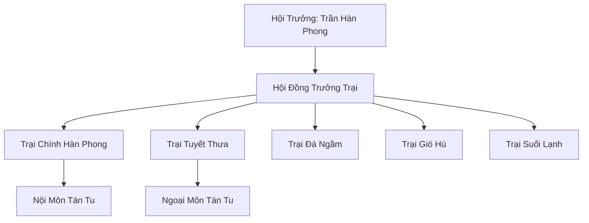

# BĂNG NGUYÊN TÁN TU HỘI (冰原散修会)

## I. Tổng Quan (总览)
Băng Nguyên Tán Tu Hội là một tổ chức tương trợ tự phát dành cho những tu sĩ không thuộc về bất kỳ tông môn chính thống nào tại Bắc Băng. Trong môi trường khắc nghiệt nơi cái lạnh có thể nuốt chửng linh hồn của những kẻ đơn độc, hội ra đời như một lá chắn bảo vệ cho những tán tu bần cùng. Với tôn chỉ *"Một mình thì chết, cùng nhau thì sống"*, hội đã trở thành một mạng lưới sinh tồn bền bỉ, giúp hàng trăm tu sĩ tìm thấy chỗ đứng giữa băng tuyết. Trần Hàn Phong thường nói trong các buổi luận đạo: *"Đạo tu tiên không chỉ có một con đường — tán tu không phải kẻ lạc lối, mà là người tự tìm đường."* Lời nói ấy đã trở thành phương châm sống của năm trăm thành viên rải rác khắp rìa nam Bắc Băng.

## II. Địa Lý & Tài Nguyên (地理 với tài nguyên)
Hoạt động chủ yếu tại vùng rìa phía nam Bắc Băng, nơi khí hậu tương đối ôn hòa hơn vùng lõi nhưng vẫn đủ lạnh để giết chết phàm nhân trong vài canh giờ. Hội quản lý năm trại trú ẩn rải rác — "Hàn Phong", "Tuyết Thưa", "Đá Ngầm", "Gió Hú", và "Suối Lạnh" — trong đó Trại chính Hàn Phong được xây dựng tại nơi một địa mạch nhỏ rò rỉ chút hơi ấm, giúp mặt đất xung quanh không bị đóng băng hoàn toàn và cho phép canh tác dược thảo chịu lạnh cơ bản. Tài nguyên của hội rất hạn chế, chủ yếu là các mỏ linh thạch cấp thấp đã gần cạn và các loại dược thảo phổ thông như "Hàn Tuyết Thảo" và "Băng Tâm Liên" — nhưng điều quý giá nhất lại là mạch linh thạch thượng cổ ẩn giấu dưới nền đá của Trại Hàn Phong mà Trần Hàn Phong chưa dám khai thác.

## III. Văn Hóa & Tín Ngưỡng (文化 với信仰)
Đề cao tinh thần đồng đạo và sự tự do. Không có sự phân biệt giai cấp khắt khe, vị thế trong hội được quyết định bởi đóng góp cho cộng đồng và tu vi cá nhân. Văn hóa "Luận Đạo" phát triển mạnh mẽ — cứ mỗi thất nhật, các tán tu tập trung tại lò lửa trung tâm Trại Hàn Phong để chia sẻ kinh nghiệm tu luyện, trao đổi bí quyết kháng hàn, và tranh luận về đạo lý trong buổi họp gọi là "Hỏa Bàn Đạo". Mỗi mùa Đông Chí, lễ hội "Hội Ẩm Đông Chí" được tổ chức long trọng — toàn bộ năm trại cùng đốt lửa, uống "Tán Tu Linh Rượu", và hát bài "Băng Nguyên Ca" — bài hát truyền thống tán tu kể về hành trình đơn độc trên bình nguyên tuyết trắng. Câu nói được khắc trên tảng đá trước mỗi trại: *"Tuyết phủ vạn dặm không che nổi lửa lòng."*

## IV. Cơ Cấu Tổ Chức (组织结构)


## V. Công Pháp & Trận Pháp (功法 với阵法)
- **Công Pháp:** Không có công pháp thống nhất, nhưng hội sở hữu một số bí thuật *Hàn Khí Chống Chọi* được các tiền bối đúc kết và chia sẻ rộng rãi, nổi bật nhất là "Nội Hỏa Ôn Kinh" — bài tập dẫn linh khí hỏa hệ vi lượng trong cơ thể để duy trì thân nhiệt, cho phép tán tu cảnh Luyện Khí chịu được cái lạnh mà bình thường cần tu vi Trúc Cơ mới kháng nổi.
- **Trận Pháp:** *Ngũ Trại Liên Hoàn Trận* - trận pháp phòng ngự cơ bản kết nối năm điểm trú ẩn thông qua năm "Liên Hoàn Trụ" bằng linh thạch chôn dưới đất, giúp truyền tín hiệu cảnh báo tức thời khi bất kỳ trại nào bị tấn công. Khi kích hoạt đồng bộ, trận pháp cho phép chuyển hướng linh lực từ các trại còn lại để tăng cường phòng ngự cho trại đang bị tấn công — tuy sức mạnh khiêm tốn nhưng đã nhiều lần cứu sống cả trại trước bầy yêu thú tuyết.

## VI. Đặc Sản Môn Phái (门派特产)
- **Tán Tu Linh Rượu "Hỏa Tâm Niệp":** Loại rượu rẻ tiền nhưng có tác dụng kích thích khí huyết và xua tan hàn khí tạm thời, nấu từ "Hỏa Tâm Quả" — loại quả đỏ nhỏ mọc gần các khe nứt địa nhiệt. Rất được ưa chuộng bởi những tu sĩ nghèo và lữ khách qua đường, được bán tại Sàn Giao Dịch Tự Do với giá hai viên linh thạch hạ phẩm mỗi bình.
- **Băng Thảo Bùa "Kháng Hàn Phù":** Loại bùa chú đơn giản giúp tạm thời kháng lạnh cấp thấp cho phàm nhân trong ba canh giờ, được các làng nhân tộc xung quanh mua với số lượng lớn vào mùa đông.
- **Hàn Tuyết Thảo Khô:** Dược thảo chịu lạnh phơi khô, dùng trong các bài thuốc giải hàn độc cơ bản và bồi bổ kinh mạch cho tu sĩ cấp thấp.

## VII. Cơ Sở Hạ Tầng (基础设施)
- **Trại Chính Hàn Phong:** Tổ hợp ba mươi căn lều trại kiên cố bao quanh một lò lửa linh lực trung tâm mang tên "Vĩnh Diệm Lô" — lò lửa được duy trì liên tục suốt hai trăm năm chưa từng tắt, trở thành biểu tượng tinh thần của toàn hội. Bên cạnh lò lửa là "Luận Đạo Thạch" — sáu tảng đá xếp thành vòng tròn, nơi diễn ra các buổi "Hỏa Bàn Đạo" hàng tuần.
- **Sàn Giao Dịch Tự Do "Băng Nguyên Chợ":** Nơi các thành viên tự do mua bán, đổi chác các vật phẩm thu thập được, họp mỗi ba ngày một lần tại bãi đất trống giữa Trại Hàn Phong. Không có thuế giao dịch, nhưng bán hàng giả sẽ bị trục xuất vĩnh viễn.

## VIII. Kinh Tế (経済)
Kinh tế dựa trên sự tự nguyện và đóng góp. Mỗi thành viên có nghĩa vụ nộp "Thập Nhất Thuế" — một phần mười thu hoạch — để duy trì trận pháp bảo vệ và quỹ cứu tế "Đồng Đạo Kim". Hội cũng thu lợi nhuận từ việc cung cấp dịch vụ bảo vệ cho sáu ngôi làng phàm nhân xung quanh — trong đó làng "Tuyết Hoa" và làng "Bạch Thạch" là hai khách hàng thường xuyên nhất — trước sự quấy nhiễu của yêu thú cấp thấp. Ngoài ra, "Băng Nguyên Chợ" thu hút các thương nhân qua đường, tạo ra một dòng tiền phụ nhỏ nhưng đều đặn. Tổng thu nhập hàng năm của hội tương đương khoảng năm ngàn viên linh thạch hạ phẩm — đủ sống nhưng không dư dả.

## IX. Lịch Sử Tóm Tắt (简史)
Được thành lập cách đây 200 năm sau trận đại bão tuyết "Bạch Sát" — cơn bão kéo dài bảy ngày liên tục khiến hàng trăm tán tu thiệt mạng vì cô lập và đói rét. Những người sống sót nhận ra rằng sự đơn độc chính là kẻ thù lớn nhất, từ đó họ đã chung tay xây dựng nên điểm trú ẩn đầu tiên — "Sơ Hỏa Trại" — tiền thân của Trại Hàn Phong ngày nay. Qua hai mươi đời Hội Trưởng, hội đã mở rộng từ một trại thành năm, và lò lửa "Vĩnh Diệm Lô" do Hội Trưởng đời thứ ba nhóm lên vẫn cháy đến tận bây giờ. Trần Hàn Phong là Hội Trưởng đương nhiệm, được bầu chọn cách đây hai mươi năm nhờ tu vi cao nhất hội và tính cách điềm đạm công bằng.

## X. Giai Thoại & Bí Mật (轶 sự với bí mật)
Tương truyền dưới nền đá của Trại chính Hàn Phong ẩn chứa một mạch linh thạch thượng cổ cực kỳ tinh khiết — mạch "Hàn Ngọc" — có thể cung cấp đủ linh thạch trung phẩm cho toàn hội tu luyện trong ngàn năm. Trần Hàn Phong đã ra lệnh phong tỏa thông tin này để tránh sự dòm ngó của các tông môn lớn, đặc biệt là Huyền Băng Cung và Cực Quang Thần Điện. Nếu tin tức lộ ra, hội sẽ bị nuốt chửng trong chớp mắt — và năm trăm tán tu sẽ lại trở về với cuộc sống đơn độc. Ngoài ra, một số trưởng lão hội đồn đại rằng "Vĩnh Diệm Lô" không phải chỉ là một lò lửa thường — ngọn lửa cháy suốt hai trăm năm bất chấp mọi bão tuyết ấy có thể là tàn dư của một phong ấn cổ đại đang từ từ suy yếu.

## XI. Quan Hệ Thế Lực (势力关系)
```mermaid
graph LR
    BNTTH[Băng Nguyên Tán Tu Hội] -- Hợp tác -- PBTĐ[Phá Băng Thương Đội]
    BNTTH -- Liên kết -- BPTTT[Bắc Phong Thông Tín Trạm]
    BNTTH -- Cảnh giác -- BCH[Bạch Cốt Hội]
    BNTTH -- Trung lập -- HBC[Huyền Băng Cung]
```
