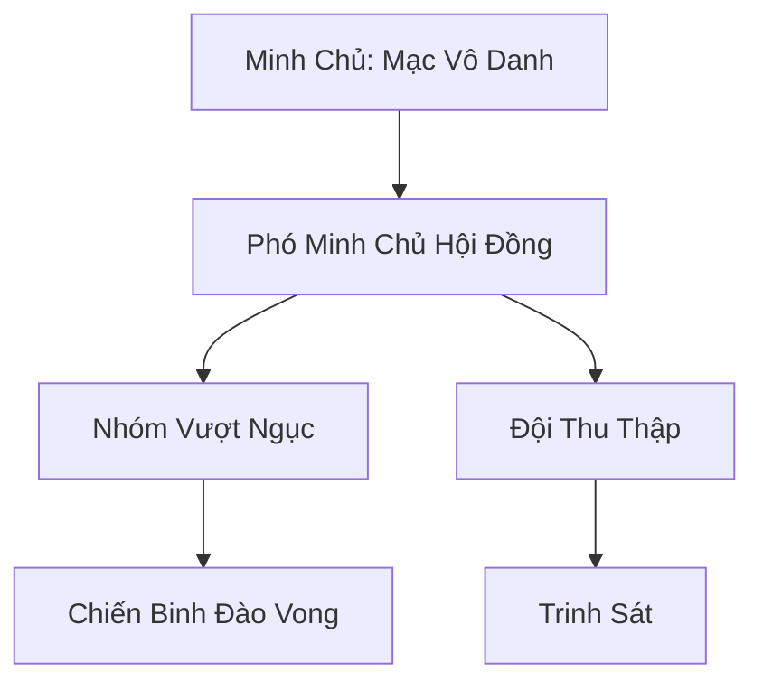

# BĂNG NGỤC ĐÀO VONG GIẢ (冰狱逃亡者)

## I. Tổng Quan (总览)
Băng Ngục Đào Vong Giả là một liên minh lỏng lẻo gồm những cá thể đã thực hiện cuộc vượt ngục chấn động khỏi Băng Ngục Thành. Họ là những kẻ bị cả xã hội tu chân ruồng bỏ, mang trên mình những tội danh và cấm chế nặng nề — xích linh khí siết quanh đan điền, phù ấn khắc sâu vào xương, dấu cấm thiêu trên trán. Dưới sự dẫn dắt của Mạc Vô Danh, họ lẩn trốn giữa những khe nứt sông băng, sống một cuộc đời ngoài vòng pháp luật với khao khát duy nhất là giữ vững sự tự do quý giá. Mạc Vô Danh khắc lên vách hang một câu mà cả bốn mươi bảy người đều thuộc lòng: *"Ngục tù giam được xác, nhưng không giam được hồn — tự do là thứ duy nhất đáng để chết."*

## II. Địa Lý & Tài Nguyên (地理 với tài nguyên)
Không có căn cứ cố định — đó là quy tắc sinh tồn số một. Họ liên tục di chuyển giữa các hang băng tự nhiên dọc theo bờ biển Bắc Hải, mỗi nơi ở không quá bảy ngày, để tránh né sự truy quét của đội tuần tra "Hắc Giáp Liệp Đội" từ Băng Ngục Thành. Các hang ổ tạm thời được đánh dấu bằng "Ngục Ấn" — ký hiệu bí mật mà chỉ thành viên liên minh mới nhận ra, khắc lờ mờ trên các tảng băng trôi gần lối vào. Tài nguyên của liên minh cực kỳ khan hiếm, chủ yếu dựa vào những gì họ chiếm đoạt được từ các đội tiếp tế của nhà tù và những mảnh "Bản Đồ Cổ Vực" chỉ dẫn đến các kho báu dưới đáy biển băng — bản đồ mà Mạc Vô Danh tìm được trong một xà lim bí mật của Băng Ngục Thành trước khi trốn thoát.

## III. Văn Hóa & Tín Ngưỡng (文化 với信仰)
Đề cao triết lý: *"Tự do quý hơn tính mạng, phản bội nặng hơn cái chết."* Thành viên liên minh coi sự phản bội là tội lỗi tối thượng — kẻ nào tiết lộ vị trí hang ổ sẽ bị xử bằng "Ngục Hình" — chính các cấm chế trong cơ thể chúng sẽ được kích hoạt để giết chết từ bên trong. Họ có văn hóa ẩn danh triệt để: xóa bỏ tên thật, xóa bỏ quá khứ, và chỉ gọi nhau bằng biệt danh dựa trên vết sẹo hoặc khiếm khuyết. Mỗi cá nhân đều mang trên mình ít nhất một vết sẹo hoặc cấm chế từ thời bị giam cầm như một lời nhắc nhở về nỗi hận đối với Băng Ngục Thành. Nghi thức quan trọng nhất là "Lễ Đốt Xích" — mỗi năm vào ngày kỷ niệm cuộc vượt ngục, cả liên minh sẽ nung chảy một đoạn xích sắt trong lửa rồi rải tro xuống biển, tượng trưng cho sự giải phóng.

## IV. Cơ Cấu Tổ Chức (组织结构)


## V. Công Pháp & Trận Pháp (功法 với阵法)
- **Công Pháp:** *Ngục Ảnh Bộ* (Thân pháp chuyên dụng để lẩn tránh thần thức, được Mạc Vô Danh sáng tạo trong mười năm bị giam cầm đơn độc — mỗi bước chân tạo ra một tàn ảnh băng giá có thể đánh lừa cả thần thức Kim Đan kỳ), *Hàn Sát Cấm Thuật* (Sử dụng chính cấm chế trong cơ thể để tấn công — biến xiềng xích thành vũ khí, mỗi đòn tấn công sẽ gây đau đớn cho cả người dùng lẫn kẻ thù).
- **Trận Pháp:** *Ảo Ảnh Băng Sương Trận* - trận pháp ngụy trang dùng để che giấu lối vào các hang động tạm thời, tạo ra một lớp sương băng dày đặc khiến mắt thường và thần thức đều nhìn thấy một vách băng liền mạch. Trận pháp do sáu Phó Minh Chủ thay phiên duy trì, mỗi người một ca sáu canh giờ.

## VI. Đặc Sản Môn Phái (门派特产)
- **Sơ Đồ Ngục Giam "Băng Ngục Toàn Đồ":** Các bản vẽ chi tiết về kết cấu và điểm yếu của Băng Ngục Thành, được Mạc Vô Danh ghi nhớ và vẽ lại sau khi vượt ngục. Đây là hàng cấm tuyệt đối, chỉ bán cho những kẻ sẵn sàng trả giá bằng máu — mỗi bản chỉ tiết lộ một phần nhỏ, không bao giờ đầy đủ.
- **Xương Mài Đục "Ngục Thoát Trùy":** Loại vũ khí thô sơ được mài từ xương yêu thú Bắc Hải, có khả năng phá giải một số loại cấm chế không gian đơn giản nhờ tần số rung động đặc biệt khi va chạm.
- **Cấm Chế Ấn Phù:** Các phù lục ghi lại cách thức vô hiệu hóa một số loại cấm chế thông dụng trong ngục, được chế tác bởi những thành viên có kinh nghiệm bị giam giữ lâu nhất.

## VII. Cơ Sở Hạ Tầng (基础设施)
- **Hang Băng Di Động "Vô Ảnh Sào":** Các hang động được yểm bùa Ảo Ảnh Băng Sương Trận để có thể biến mất khỏi cảm nhận khi cần thiết. Mỗi hang có diện tích đủ cho mười người nằm chen chúc, với một lối thoát ngầm luôn được giữ thông suốt hướng ra biển.
- **Trạm Tiếp Tế Ngầm "Ngục Ấn Điểm":** Mười hai điểm giấu lương thực và linh thạch rải rác trên bờ biển, mỗi điểm được đánh dấu bằng Ngục Ấn và chứa đủ nhu yếu phẩm cho bảy ngày sống sót. Vị trí các trạm thay đổi mỗi ba tháng theo một quy tắc mà chỉ Mạc Vô Danh và hai Phó Minh Chủ tin cẩn nhất nắm giữ.

## VIII. Kinh Tế (経済)
Nguồn thu nhập đến từ việc đánh cướp các thương thuyền nhỏ hoặc các đội vận tải "Hàn Lương Đội" của Băng Ngục Thành — mỗi lần tấn công đều phải tính toán kỹ lưỡng để tránh chạm trán với lực lượng Hắc Giáp hộ tống. Họ cũng bí mật trao đổi các thông tin tuyệt mật về cấu trúc nhà tù cho các thế lực ma đạo khác muốn giải cứu thuộc hạ, giao dịch qua trung gian Bạch Cốt Hội tại phiên chợ đen "Quỷ Thị". Thu nhập bấp bênh và nguy hiểm, nhưng Mạc Vô Danh luôn duy trì kỷ luật phân chia nghiêm ngặt: năm phần mười cho quỹ chung, ba phần mười cho chiến binh, hai phần mười dự trữ cho trường hợp khẩn cấp.

## IX. Lịch Sử Tóm Tắt (简史)
Khởi nguồn từ cuộc đại vượt ngục 30 năm trước do Mạc Vô Danh dẫn đầu, được gọi là "Đêm Băng Vỡ". Trong đêm đó, Mạc Vô Danh đã lợi dụng một trận bão tuyết cấp tám để phá vỡ phong ấn tầng hầm thứ bảy, giải phóng hơn ba trăm tù nhân. Tuy nhiên, trong số hàng trăm tù nhân, chỉ có 47 người sống sót qua được biển băng và sự truy sát của quân đoàn Hắc Giáp — phần lớn chết vì đuối nước trong biển băng hoặc bị cấm chế trong cơ thể kích hoạt tự hủy. Kể từ đó, họ đã trở thành một biểu tượng của sự phản kháng thầm lặng chống lại sự tàn bạo của ngục tù phương Bắc, và "Đêm Băng Vỡ" trở thành ngày lễ linh thiêng nhất của liên minh.

## X. Giai Thoại & Bí Mật (轶 sự với bí mật)
Tương truyền Mạc Vô Danh vốn là một kiếm tu tài ba bị hãm hại bởi chính sư huynh đồng môn, và trong cơ thể ông ta vẫn còn găm một mảnh "Hàn Băng Thần Châm" liên tục ăn mòn tu vi, nhưng đồng thời cũng cung cấp cho ông khả năng cảm nhận cái lạnh ở mức độ thần thánh — ông có thể phát hiện bất kỳ biến động nhiệt độ nào trong phạm vi mười dặm, kể cả hơi thở của một sát thủ đang ẩn nấp. Ngoài ra, mảnh "Bản Đồ Cổ Vực" mà ông mang theo được đồn đại chỉ dẫn đến một pháp bảo thượng cổ bị chôn giấu dưới đáy biển băng — thứ mà nếu tìm được, có thể giúp ông phá giải toàn bộ cấm chế trong cơ thể bốn mươi bảy thành viên và khôi phục hoàn toàn tu vi Nguyên Anh.

## XI. Quan Hệ Thế Lực (势力关系)
```mermaid
graph LR
    BNĐVG[Băng Ngục Đào Vong Giả] -- Tử địch -- BNT[Băng Ngục Thành]
    BNĐVG -- Giao dịch -- BCH[Bạch Cốt Hội]
    BNĐVG -- Cảnh giác -- HBC[Huyền Băng Cung]
    BNĐVG -- Thân thiện -- BLTĐ[Băng Lang Tàn Đội]
```
