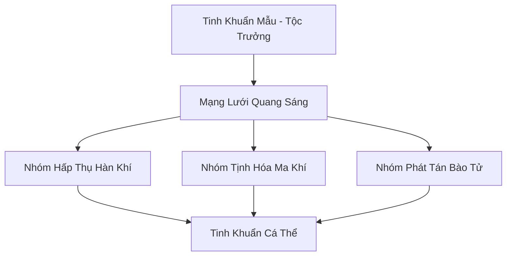

# BĂNG TINH KHUẨN TỘC (冰晶菌族)

## I. Tổng Quan (总览)
Băng Tinh Khuẩn Tộc là một trong những dạng sống cổ xưa nhất cư ngụ trong các hang động băng giá dưới chân Tuyết Sơn. Đây là một chủng tộc Vi Tộc có ý thức cộng đồng cao, tồn tại dưới dạng một mạng lưới các bào tử phát sáng xanh nhạt — ánh sáng mà các tu sĩ phương Bắc gọi là "Hàn Quang" hoặc "Ánh Trăng Dưới Đất". Dù không tham gia vào các cuộc tranh đấu quyền lực, sự hiện diện của họ đóng vai trò tối quan trọng trong việc duy trì sự thanh khiết của linh khí và ức chế sự rò rỉ của ma khí từ lòng đất phương Bắc. Huyền Băng Cung ghi trong cổ thư: *"Nơi nào Hàn Quang tắt, nơi đó ma khí thức — hãy coi khuẩn tộc như ngọn đèn canh giữ bóng tối."* Hiện tại, quần thể đang suy giảm bí ẩn, và nếu xu hướng này không được đảo ngược, toàn bộ hệ thống tịnh hóa tự nhiên của Tuyết Sơn sẽ sụp đổ.

## II. Địa Lý & Tài Nguyên (地理 với tài nguyên)
Trụ sở và địa bàn hoạt động là hệ thống mê cung hang băng tự nhiên mang tên "Quang Hàn Mê Cung" chạy dọc theo địa mạch của Tuyết Sơn, kéo dài hơn trăm dặm từ chân núi đến tận vùng lõi băng. Tài nguyên của tộc chính là bản thân các cá thể khuẩn tộc, có khả năng phát ra "Hàn Quang" - một loại ánh sáng lạnh không tỏa nhiệt nhưng chứa đựng năng lượng tịnh hóa, biến mọi hang động nơi chúng cư ngụ thành những "phòng tu luyện" thiên nhiên được các tu sĩ hệ Thủy và Băng khao khát. Họ cũng sản sinh ra "Hàn Quang Linh Phấn" — loại bụi sáng tích tụ trên vách hang qua hàng ngàn năm, cực hiếm và cực quý. Khu vực "Quang Tâm Động" nằm sâu nhất trong mê cung là nơi mật độ khuẩn tộc dày đặc nhất, ánh sáng xanh rực rỡ đến mức có thể nhìn thấy rõ từng đường gân trên lá cỏ.
Tại "Nguyệt Quang Động" — hang ở độ sâu trung bình — ánh sáng xanh phản chiếu qua tinh thể băng tạo hiện tượng "Hàn Quang Cầu Vồng" chỉ xuất hiện ba lần mỗi thế kỷ khi sao Bắc Đẩu chiếu thẳng xuống miệng hang.

## III. Văn Hóa & Tín Ngưỡng (文化 với信仰)
Đề cao triết lý: *"Sáng trong bóng tối, lặng trong im lìm."* Cư dân khuẩn tộc sống một cuộc đời thầm lặng, giao tiếp với nhau thông qua tần số ánh sáng nhấp nháy — mỗi nhịp sáng tối mang một ý nghĩa khác nhau, tạo thành một ngôn ngữ phức tạp mà các học giả gọi là "Quang Ngữ". Họ không có thần thánh theo nghĩa thông thường, chỉ tôn sùng sự tồn tại vĩnh cửu của băng giá và sự cân bằng của địa mạch. Văn hóa của tộc là sự cộng sinh tuyệt đối, nơi mỗi cá nhân là một nút thắt trong mạng lưới ánh sáng chung — khi một cá thể chết đi, ánh sáng của nó không tắt mà hòa vào các cá thể lân cận, trong hiện tượng mà Tu sĩ gọi là "Quang Hồi". Mỗi khi quần thể mở rộng đến một hang động mới, toàn bộ mạng lưới sẽ đồng loạt nhấp nháy ba lần — nghi thức "Tân Quang Khai" — đánh dấu sự chinh phục một vùng đất tối.
Trong quần thể tồn tại hiện tượng "Quang Bi" — khu vực bị ô nhiễm ma khí, ánh sáng xanh chuyển tím đậm và nhấp nháy chậm, như thể cả quần thể đang khóc cho sự mất mát.

## IV. Cơ Cấu Tổ Chức (组织结构)


## V. Công Pháp & Trận Pháp (功法 với阵法)
- **Công Pháp:** Không có công pháp tu luyện nhân tạo, sức mạnh đến từ quá trình *Quang Hợp Hàn Khí* tự nhiên — hấp thụ hàn khí và ma khí từ môi trường rồi chuyển hóa thành năng lượng ánh sáng và linh khí tinh thuần. Tốc độ tiến hóa chậm chạp theo thang đo vạn năm, nhưng sự tích lũy qua kỷ nguyên Thái Cổ đến nay đã khiến Tinh Khuẩn Mẫu đạt đến mức thần thức tương đương Trúc Cơ — một kỳ tích đối với Vi Tộc.
- **Trận Pháp:** *Quang Hàn Tịnh Hóa Trận* - toàn bộ quần thể hoạt động như một trận pháp sống khổng lồ, có khả năng bao phủ toàn bộ hang động để ngăn chặn sự xâm nhập của các loại uế khí và sát ý tà ác. Khi ma khí rò rỉ mạnh, khuẩn tộc sẽ tập trung mật độ cao tại điểm rò rỉ, ánh sáng xanh chuyển sang trắng chói — trạng thái "Bạch Quang Phong Ấn" — có khả năng ức chế và từ từ hóa giải ma khí cường độ trung bình.
Khuẩn tộc còn sở hữu khả năng "Quang Dẫn" — dùng ánh sáng dẫn đường cho tu sĩ lạc trong mê cung hang băng, hành vi mà học giả vẫn tranh luận là bản năng hay ý thức cộng đồng.

## VI. Đặc Sản Môn Phái (门派特产)
- **Hàn Quang Linh Phấn:** Loại bụi sáng có tác dụng thanh lọc tâm ma và cường hóa thần thức cho tu sĩ hệ Thủy hoặc Băng. Một lạng Linh Phấn cần hàng ngàn năm để tích tụ trên vách hang, khiến giá trị của nó trên thị trường tương đương với linh thạch trung phẩm theo trọng lượng. Tuyết Liên Dược Phường là đơn vị duy nhất được phép thu hoạch có kiểm soát.
- **Băng Tinh Thạch Chiếu Sáng "Quang Thạch":** Các khối băng bị khuẩn tộc bám vào lâu ngày, có khả năng phát sáng liên tục trong hàng trăm năm mà không cần linh lực duy trì. Được các tu sĩ dùng làm đèn chiếu sáng trong bế quan thất, và các thương nhân bán với giá năm mươi linh thạch hạ phẩm mỗi khối.
- **Tịnh Hóa Dịch:** Chất lỏng trong suốt tiết ra từ quần thể khuẩn tộc khi chúng xử lý ma khí, có tác dụng giải trừ oán khí bám trên pháp bảo và di vật cổ đại.
- **Quang Hàn Trà:** Lá cỏ tuyết mọc gần hang khuẩn tộc thấm đẫm Hàn Quang, hãm trà có tác dụng thanh tâm tĩnh trí mạnh gấp ba lần trà thường — Huyền Băng Cung thu mua ba trăm linh thạch hạ phẩm mỗi cân.

## VII. Cơ Sở Hạ Tầng (基础设施)
- **Quang Tâm Động:** Khu vực tập trung mật độ khuẩn tộc cao nhất, nơi ánh sáng xanh rực rỡ nhất trong toàn bộ Quang Hàn Mê Cung. Vách hang phủ đầy tinh thể phát sáng, tạo nên cảnh tượng mà thám hiểm gia Lý Phong từng viết: *"Như đứng giữa bầu trời sao, nhưng sao ở dưới chân."* Nơi đây cũng là trung tâm tịnh hóa ma khí mạnh nhất.
- **Lõi Tinh Khuẩn "Nguyên Mẫu Động":** Trung tâm thần thức của toàn bộ tộc, nằm sâu trong hang động cổ nhất — một khoang đá tròn hoàn hảo tự nhiên, bên trong chỉ có duy nhất Tinh Khuẩn Mẫu phát ra ánh sáng vàng kim — khác biệt hoàn toàn với ánh xanh của khuẩn tộc thường.
- **Thiên Quang Mạch:** Đường hầm tự nhiên nối các khoang hang lớn, khuẩn tộc bao phủ biến thành "sông ánh sáng" chảy xuyên lòng núi — tu sĩ đi qua chỉ cần nhắm mắt đi theo cảm giác ấm áp của Hàn Quang.

## VIII. Kinh Tế (経済)
Kinh tế mang tính thụ động. Hội không tham gia giao thương nhưng sự hiện diện của họ tạo ra môi trường tu luyện lý tưởng, đôi khi được các tu sĩ cấp cao đổi lại bằng việc cung cấp các loại linh dịch thủy hệ để hỗ trợ sự phát triển của quần thể. Tuyết Liên Dược Phường đã thiết lập một "Khế Ước Cộng Sinh" với khuẩn tộc — mỗi năm cung cấp một trăm bình "Ngọc Thủy Linh Dịch" để nuôi dưỡng quần thể, đổi lại quyền thu hoạch Hàn Quang Linh Phấn tại các khu vực được chỉ định. Ngoài ra, một số tu sĩ giàu có sẵn sàng trả giá cao để được bế quan trong các hang động có khuẩn tộc cư ngụ, gián tiếp tạo ra nguồn thu cho những ai kiểm soát lối vào Quang Hàn Mê Cung.
Một số gia đình tu sĩ giàu có thiết lập "Quang Phòng Khế" — hợp đồng thuê riêng hang động có khuẩn tộc cư ngụ để bế quan, giá năm ngàn linh thạch hạ phẩm mỗi năm.

## IX. Lịch Sử Tóm Tắt (简史)
Tồn tại từ kỷ nguyên Thái Cổ, lâu đời hơn hầu hết các tông môn tu tiên tại Bắc Băng. Khuẩn tộc đã chứng kiến sự hình thành và sụp đổ của nhiều kỷ nguyên, âm thầm đóng vai trò là "màng lọc" linh khí cho toàn bộ vùng Tuyết Sơn mà không cần sự thừa nhận của thế giới bên ngoài. Trong suốt lịch sử, chỉ có một sự kiện khiến quần thể bị tổn thất nghiêm trọng: "Đại Rò Rỉ Ma Khí" ba ngàn năm trước, khi một phong ấn cổ đại dưới Tuyết Sơn bị nứt và ma khí tràn ngập toàn bộ mê cung — khuẩn tộc đã hy sinh gần một nửa quần thể để phong tỏa vết nứt, và di chứng từ sự kiện đó có thể liên quan đến sự suy giảm bí ẩn hiện tại.
Tốc độ suy giảm quần thể đang gia tăng nhanh hơn dự kiến — nếu tiếp tục, "Quang Tâm Động" sẽ tắt trong một trăm năm, chấm dứt ánh sáng cuối cùng dưới lòng Tuyết Sơn.

## X. Giai Thoại & Bí Mật (轶 sự với bí mật)
Tương truyền Tinh Khuẩn Mẫu có thể cảm nhận được sự biến động nhỏ nhất của phong ấn thượng cổ dưới lòng đất và ánh sáng của toàn tộc thực chất là một phần của hệ thống phong ấn đại ma từ thời khai thiên lập địa. Nếu giả thuyết này là thật, sự suy giảm quần thể hiện tại có nghĩa phong ấn đang yếu đi — và khi khuẩn tộc tuyệt diệt, thứ bị phong ấn bên dưới Tuyết Sơn sẽ thoát ra. Tinh Hàn Tử của Hàn Tinh Quan Trắc Đài là người duy nhất bên ngoài nhận ra mối liên hệ này, sau khi quan sát thấy cực quang phương Bắc nhấp nháy đồng bộ với nhịp sáng của khuẩn tộc — hiện tượng mà ông ghi trong nhật ký là *"Thiên Địa Đồng Mạch"*.
Cứ mỗi khi U Tinh nhấp nháy mạnh nhất, nhịp sáng khuẩn tộc dưới lòng đất cũng đồng bộ — cho thấy mối liên hệ sâu xa hơn bất kỳ ai tưởng tượng.

## XI. Quan Hệ Thế Lực (势力关系)
```mermaid
graph LR
    BTKT[Băng Tinh Khuẩn Tộc] -- Cộng sinh -- TSTSN[Hệ sinh thái Tuyết Sơn]
    BTKT -- Vô hại -- HBC[Huyền Băng Cung]
    BTKT -- Cảm nhận -- THVL[Tuyết Hoa Vi Linh]
    BTKT -- Ức chế -- CUMT[Cửu U Ma Tông]
```
