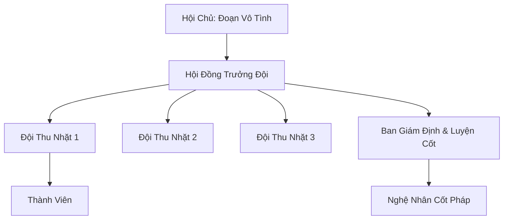

# BẠCH CỐT HỘI (白骨会)

## I. Tổng Quan (总览)
Bạch Cốt Hội là một tổ chức ngầm chuyên hành nghề "nhặt rác chiến trường" tại vùng biển Bắc Hải lạnh lẽo. Họ khai thác những gì còn sót lại từ các cuộc đại chiến thượng cổ bị chôn vùi dưới lớp băng vạn năm — từ mảnh vỡ linh bảo cho đến xương cốt cường giả vẫn còn phảng phất oán khí. Dù bị coi là hèn hạ và mang hơi hướng tà đạo, hội vẫn tồn tại nhờ nắm giữ những vật phẩm có giá trị nghiên cứu và sức mạnh đặc thù từ xương cốt người chết. Đoạn Vô Tình thường nói với thuộc hạ: *"Kẻ sống tranh giành, kẻ chết bỏ lại — ta chỉ là người quét dọn sau bữa tiệc của cường giả."* Câu nói này vừa là triết lý sống, vừa là lời biện hộ cho nghề nghiệp bị khinh bỉ của toàn hội.

## II. Địa Lý & Tài Nguyên (地理 với tài nguyên)
Trụ sở chính ẩn mình trong hệ thống hầm đá tự nhiên bên dưới những vách đá dựng đứng ven bờ biển Bắc Hải, được gọi là "Bạch Cốt Nhai" — nơi sóng biển đập vào vách đá tạo ra tiếng hú rùng rợn như tiếng gào của vong hồn. Lối vào chính nằm ẩn sau một thác nước đóng băng vĩnh cửu mang tên "Băng Lệ Bộc", chỉ có thể phát hiện bằng cách cảm ứng oán khí. Tài nguyên cốt lõi của hội là các "Bãi Xương Cổ" — nơi tàn dư của các cường giả và thần thú chết trong chiến tranh tích tụ oán khí và linh lực tàn dư qua nhiều kỷ nguyên. Trong số đó, "Vạn Cốt Trủng" nằm dưới đáy biển băng là bãi xương lớn nhất mà hội từng phát hiện, chứa đựng hàng vạn bộ hài cốt từ thời Đại Chiến Thần Ma.

## III. Văn Hóa & Tín Ngưỡng (文化 với信仰)
Đề cao triết lý thực dụng: *"Người chết không cần của cải, kẻ sống không cần đạo đức."* Thành viên hội coi xương cốt là vật liệu và linh hồn tàn dư là năng lượng, không mang theo bất kỳ sự kính trọng hay sợ hãi nào đối với cái chết. Văn hóa của họ mang đậm màu sắc lạnh lẽo, thường xuyên tổ chức "Khai Cốt Yến" — buổi tiệc vinh danh những phát hiện mới từ lòng đất lạnh, nơi Đoạn Vô Tình đích thân đánh giá phẩm cấp của từng bộ xương trước mặt toàn hội. Quy tắc sắt của hội là "Nhặt được gì nộp hết, chia đều theo công", và bất kỳ ai giấu giếm vật phẩm sẽ bị xử phạt bằng cách bỏ lại giữa Bãi Xương Cổ vào ban đêm — nơi oán khí có thể nuốt chửng thần thức trong vài canh giờ.

## IV. Cơ Cấu Tổ Chức (组织结构)


## V. Công Pháp & Trận Pháp (功法 với阵法)
- **Công Pháp:** *Bạch Cốt Ấn* (Kỹ thuật chế tác pháp bảo từ xương, cho phép rút trích oán khí và linh lực tàn dư trong cốt hài để tạo ra các "Cốt Phù" dùng một lần), *Oán Khí Đồng Hóa Thuật* (Kỹ thuật hấp thụ oán khí vào bản thân để tạm thời tăng cường sức tấn công ám hệ, nhưng sử dụng quá nhiều sẽ dẫn đến tâm ma nhập thể).
- **Trận Pháp:** *Cốt Giáp Trận* - sử dụng xương cốt cường giả cắm xung quanh lãnh thổ để tạo ra áp lực tinh thần và lớp phòng thủ vật lý cho hang ổ. Mỗi bộ xương đóng vai trò là một "trận nhãn" nhỏ, và khi có kẻ xâm nhập, oán khí từ các bộ xương sẽ kết hợp tạo thành ảo ảnh "Vạn Cốt Phục Sinh" — khiến kẻ địch tưởng rằng mình đang bị hàng ngàn vong linh tấn công.

## VI. Đặc Sản Môn Phái (门派特产)
- **Cốt Phấn:** Loại bột làm từ xương nghiền, dùng để bón cho linh thảo thuộc tính Ám hoặc làm chất dẫn cho tà thuật. Cốt Phấn từ xương cường giả Kim Đan trở lên có giá trị đặc biệt cao, được gọi là "Kim Cốt Phấn" và chỉ bán cho khách quen.
- **Pháp Khí Tàn:** Các mảnh vỡ linh bảo thượng cổ vẫn còn sót lại uy lực đáng kể. Trong số đó, "Liệt Nhật Kiếm Phiến" — một mảnh vỡ của bảo kiếm từ thời Đại Chiến — là vật phẩm có giá trị nhất mà hội từng tìm thấy nhưng chưa dám bán ra.
- **Cốt Phù:** Bùa chú khắc trên mảnh xương, có khả năng triệu hồi oán khí tạm thời để tấn công hoặc phòng thủ, thời hạn sử dụng một lần.

## VII. Cơ Sở Hạ Tầng (基础设施)
- **Cốt Kho "Vạn Cốt Đường":** Nơi phân loại và lưu trữ hàng vạn bộ xương và di vật theo niên đại và phẩm cấp, được chia thành bảy gian: Thái Cổ, Thượng Cổ, Trung Cổ, Cận Cổ, Cận Đại, Hiện Đại, và "Bí Tàng" — gian cuối cùng chỉ Đoạn Vô Tình mới có chìa khóa.
- **Hầm Luyện Cốt "Bạch Hỏa Lò":** Khu vực nghiên cứu cách rèn đúc và nén linh lực vào vật liệu hữu cơ, trang bị một lò luyện đặc chế đốt bằng "Oán Hỏa" — ngọn lửa sinh ra từ việc đốt cháy oán khí cô đặc.

## VIII. Kinh Tế (経済)
Kinh tế dựa trên việc buôn bán các di vật khai quật được trên thị trường đen, với đầu mối chính tại "Quỷ Thị" — phiên chợ đen diễn ra vào mỗi đêm không trăng ở vùng ven biển Bắc Hải. Họ là nguồn cung cấp vật liệu quan trọng cho các tông môn ma đạo muốn nghiên cứu về oán khí và thi tu, trong đó Huyết Sát Minh là khách hàng lớn nhất và nguy hiểm nhất. Thỉnh thoảng hội cũng tìm được những bảo vật hoàn chỉnh mang lại nguồn lợi nhuận khổng lồ — lần gần nhất là một chiếc nhẫn trữ vật còn nguyên vẹn từ thời Thượng Cổ, bán được ba vạn linh thạch trung phẩm cho một vị khách giấu mặt.

## IX. Lịch Sử Tóm Tắt (简史)
Được thành lập 50 năm trước bởi Đoạn Vô Tình, một tán tu tình cờ phát hiện ra một hầm mộ đại năng bị rò rỉ dưới vách đá khi đang trú bão. Ông nhận ra rằng đây là một mỏ vàng chưa được khai phá và đã tập hợp những kẻ bần cùng để lập nên Bạch Cốt Hội. Qua năm thập kỷ, hội đã từ một nhóm nhặt rác trở thành một tổ chức ngầm có hệ thống, với mạng lưới khách hàng trải dài từ Bắc Băng đến tận Tây Mạc. Sự kiện đáng nhớ nhất là "Đại Khai Quật Vạn Cốt Trủng" mười năm trước, khi hội phát hiện ra bãi xương cổ đại lớn nhất từ trước đến nay — cũng là thời điểm Đoạn Vô Tình đột phá Kim Đan nhờ hấp thụ oán khí của một bộ hài cốt Nguyên Anh.

## X. Giai Thoại & Bí Mật (轶 sự với bí mật)
Tương truyền Đoạn Vô Tình đang bí mật lắp ráp một "Cổ Thần Khôi Lỗi" từ xương của hàng trăm cường giả khác nhau, nhằm tạo ra một thực thể có thể sánh ngang với tu sĩ Nguyên Anh đỉnh phong. Dự án mang mật danh "Bạch Cốt Tướng Quân" đã kéo dài suốt hai mươi năm, và theo lời đồn, chỉ còn thiếu một bộ xương sống Nguyên Anh Hậu Kỳ để hoàn thiện. Ngoài ra, trong gian "Bí Tàng" của Cốt Kho còn lưu giữ một tấm thạch bản khắc bản đồ chỉ dẫn đến một chiến trường cổ đại chưa từng bị khai quật — nơi được cho là chứa đựng di hài của một vị Hợp Thể kỳ cường giả.

## XI. Quan Hệ Thế Lực (势力关系)
```mermaid
graph LR
    BCH[Bạch Cốt Hội] -- Giao dịch ngầm -- HSM[Huyết Sát Minh]
    BCH -- Tránh né -- HBC[Huyền Băng Cung]
    BCH -- Trao đổi -- BNĐVG[Băng Ngục Đào Vong Giả]
    BCH -- Theo dõi -- BTLM[Bào Tử Tuyết Liên Minh]
```
