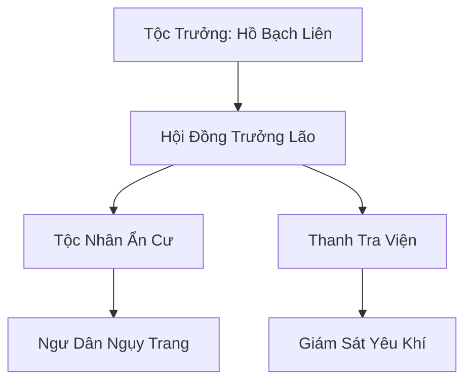

# BẠCH HỒ ẨN TỘC (白狐隐族)

> *"Sống là ẩn, lộ là chết. Nhưng trong những đêm tuyết rơi dày nhất, khi cả thế giới chìm trong trắng xóa, chúng ta mới thực sự là chính mình."*
> — Hồ Bạch Liên, lời dặn dò thế hệ sau trong lễ Đông Chí

## I. Tổng Quan (总览)
Bạch Hồ Ẩn Tộc là một bộ lạc yêu tộc nhỏ nhắn và hiền lành, bao gồm các cá thể hồ yêu tuyết sống sót sau những cuộc săn lùng thảm khốc. Để tồn tại, họ đã chọn con đường hòa nhập hoàn toàn vào xã hội nhân tộc, ngụy trang dưới lớp vỏ bọc là những ngư dân nghèo tại vùng biển Bắc Hải. Bốn mươi ba thành viên — từ trẻ sơ sinh đến trưởng lão — sống rải rác trong mười hai ngôi nhà gỗ đơn sơ ven bờ biển, ngày ngày ra khơi đánh cá như bao ngư dân khác. Với phương châm "Sống là ẩn, lộ là chết", họ duy trì một sự tồn tại thầm lặng nhưng đầy bền bỉ, được dẫn dắt bởi Tộc Trưởng Hồ Bạch Liên — nữ hồ yêu Kim Đan Sơ Kỳ đã sống hơn bốn trăm năm, đôi mắt lúc nào cũng phảng phất nỗi buồn của kẻ mất quê hương.

## II. Địa Lý & Tài Nguyên (地理与资源)
Cư trú tại làng chài Ngư Hàn — một thôn nhỏ hẻo lánh ven bờ biển Bắc Hải, nơi sương mù từ biển lạnh thường xuyên che phủ suốt bảy tháng trong năm, tạo điều kiện thuận lợi cho việc che giấu yêu khí. Bờ biển quanh Ngư Hàn toàn đá cuội và vách đá thấp, nước biển trong vắt nhưng lạnh đến mức phàm nhân chỉ dám đánh cá vào ba tháng hè ngắn ngủi — trong khi hồ yêu tuyết nhờ thể chất đặc biệt có thể lặn quanh năm. Dưới vách đá phía bắc làng có Hang Tuyết Hồ — hang động tự nhiên bị giấu kín sau lớp phù văn ngụy trang, bên trong rộng như sảnh đường, vách hang phủ lớp băng tinh khiết không bao giờ tan. Tài nguyên của tộc bao gồm nguồn hải sản dồi dào từ vùng biển lạnh và các loại ngọc trai đặc biệt chỉ có ở vùng nước đóng băng, gọi là "Hàn Ngọc Châu" — ngọc trai chứa đựng linh khí thủy hệ tinh khiết, hình thành trong lòng loài trai Băng Xà chỉ sống ở độ sâu mà phàm nhân không thể chạm tới.

## III. Văn Hóa & Tín Ngưỡng (文化与信仰)
Tôn thờ ánh trăng và sự tĩnh lặng của băng tuyết. Văn hóa của tộc xoay quanh việc rèn luyện thuật biến hóa và sự kiên nhẫn — mỗi đệ tử từ nhỏ đã được dạy cách kìm nén bản năng yêu tộc để không bị lộ diện trước mặt con người. Trẻ em hồ yêu phải vượt qua "Thử Thách Nhẫn" lúc năm tuổi — bị nhốt trong phòng với mùi thịt nướng trong khi duy trì hình hài nhân tộc suốt ba ngày ba đêm, bất kỳ ai để lộ đuôi cáo hoặc tai nhọn đều phải tập luyện thêm một năm. Đêm Đông Chí hàng năm là thời điểm quan trọng nhất, khi cả tộc tụ họp trong Hang Tuyết Hồ để được sống thật với hình hài của mình — bốn mươi ba cá thể hồ yêu lông trắng muốt, chín đuôi, bảy đuôi, năm đuôi tùy theo tuổi tác, quây quần bên đống lửa linh nhảy múa và kể lại truyền thuyết về quê hương Tuyết Hồ Lĩnh đã mất. Ngoài ra, tộc có phong tục "Nguyệt Dạ Ca" — vào đêm trăng rằm, một trưởng lão sẽ đứng trên vách đá hát khúc ca cổ bằng ngôn ngữ hồ yêu, giọng hát hòa với tiếng sóng biển, nghe như tiếng gió rít qua khe đá đối với người ngoài nhưng thực chất mang thông điệp tinh thần cho cả tộc.

## IV. Cơ Cấu Tổ Chức (组织结构)


## V. Công Pháp & Trận Pháp (功法与阵法)
- **Công Pháp:** *Tuyết Hồ Huyễn Hóa Thuật* (Bí thuật ngụy trang cấp cao, cho phép biến hóa hoàn hảo từ ngoại hình đến khí tức, đánh lừa cả thần thức tu sĩ Trúc Cơ), *Linh Thủy Ngưng Châu* (Kỹ thuật nuôi cấy ngọc trai bằng linh lực, kết hợp yêu khí hồ tuyết với thủy linh khí biển lạnh).
- **Trận Pháp:** *Ảo Ảnh Sương Mù Trận* - trận pháp phòng thủ bao quanh làng chài và hang bí mật, sử dụng hơi lạnh của biển kết hợp huyễn thuật hồ yêu để tạo ra lớp sương mù dày đặc đánh lạc hướng thần thức. Bất kỳ tu sĩ nào dùng thần thức quét qua khu vực đều chỉ thấy một làng chài bình thường với những ngư dân phàm nhân — trận pháp này là kiệt tác của Hồ Bạch Liên, được bà xây dựng suốt một trăm năm.

## VI. Đặc Sản Môn Phái (门派特产)
- **Bạch Hồ Ngọc Trai (Hàn Ngọc Châu):** Ngọc trai mang theo hơi lạnh tự nhiên, giúp tu sĩ bình ổn hỏa khí và tăng cường thần thức. Loại thượng phẩm có lõi trong suốt phát sáng xanh nhạt, giá bán qua Phá Băng Thương Đội lên đến mười linh thạch trung phẩm mỗi viên. Thương nhân bên ngoài không biết nguồn gốc thực sự, chỉ nghĩ đó là sản phẩm tự nhiên hiếm của Bắc Hải.
- **Huyễn Ảnh Phù:** Phù lục được Hồ Bạch Liên đích thân vẽ bằng mực pha từ lệ châu hồ yêu, giúp người sử dụng tạm thời thay đổi diện mạo ở mức độ cơ bản trong hai canh giờ. Mỗi năm chỉ chế tạo được vài tấm, bán bí mật cho Phá Băng Thương Đội với giá cao.
- **Hải Sản Đông Lạnh Linh:** Hải sản đánh bắt từ vùng nước sâu Bắc Hải, được bảo quản bằng hàn khí tự nhiên của hồ yêu, giữ tươi nguyên dược tính khi vận chuyển. Đây là nguồn thu nhập ổn định và ít gây nghi ngờ nhất.

## VII. Cơ Sở Hạ Tầng (基础设施)
- **Hang Tuyết Hồ:** Hang động ngầm bên dưới vách đá phía bắc làng, nơi lưu giữ các bí kíp công pháp khắc trên vách băng và là nơi tụ họp bí mật của tộc. Bên trong có một hồ nước ngầm lạnh đến mức đóng băng bề mặt, là nơi Hồ Bạch Liên thiền định tu luyện.
- **Bến Thuyền Ngụy Trang:** Khu vực neo đậu mười hai chiếc thuyền chài, nhìn bên ngoài hoàn toàn bình thường nhưng mỗi chiếc được yểm phù văn huyễn thuật ở đáy thuyền, có khả năng tăng tốc gấp ba lần bình thường khi cần tháo chạy.
- **Mộ Tuyết Hồ Lĩnh:** Khu mộ nhỏ phía sau làng, nơi chôn cất tộc nhân qua đời. Mỗi ngôi mộ được đánh dấu bằng viên đá trắng, nhìn như mộ phàm nhân nhưng dưới lòng đất có phù văn giữ cho thi hài duy trì hình hài hồ yêu thật — vì tộc tin rằng người chết nên được trở về với bản thể.

## VIII. Kinh Tế (経済)
Nguồn thu nhập chính đến từ việc bán hải sản và ngọc trai cho các thương buôn đi ngang qua, đặc biệt là Phá Băng Thương Đội — đối tác duy nhất biết thân phận thật của tộc. Nhờ vào thuật biến hóa, hồ yêu có thể lặn xuống những khu vực biển nguy hiểm mà con người không dám tới — vùng nước đóng băng sâu, hang san hô lạnh, và rãnh đáy biển — từ đó thu thập được Hàn Ngọc Châu và hải sản quý giá mang lại lợi nhuận ổn định. Mỗi tháng, Châu Phá Thiên của Phá Băng Thương Đội ghé qua Ngư Hàn một lần để thu mua ngọc trai và giao nhu yếu phẩm, hai bên giao dịch nhanh gọn trong sương mù sáng sớm.

## IX. Lịch Sử Tóm Tắt (简史)
Khởi nguồn từ một nhóm hai mươi ba hồ yêu tuyết chạy trốn khỏi cuộc tàn sát của thợ săn lông thú Cực Quang Thần Điện hơn một trăm năm mươi năm trước. Quê hương của tộc — Tuyết Hồ Lĩnh, một dãy núi tuyết phía bắc — bị thợ săn đốt cháy để lùa hồ yêu ra khỏi hang, hàng trăm cá thể bị giết lấy lông trắng bán cho quý tộc may áo khoác. Hồ Bạch Liên — lúc đó mới Trúc Cơ Viên Mãn — đã dẫn nhóm sống sót trốn chạy suốt ba năm ròng, vượt qua Băng Nguyên, đổi hướng nhiều lần để xóa dấu vết, cuối cùng định cư tại Ngư Hàn — một làng chài nhỏ nơi không ai thèm để ý. Bà dành hai mươi năm tiếp theo xây dựng Ảo Ảnh Sương Mù Trận, dạy cả tộc thuật biến hóa, và thiết lập lớp vỏ bọc ngư dân hoàn hảo. Dân số tộc tăng dần từ hai mươi ba lên bốn mươi ba qua các thế hệ mới, và Hồ Bạch Liên đã đột phá Kim Đan trong hang tuyết cách đây ba mươi năm — sức mạnh đủ để bảo vệ cả tộc trong trường hợp khẩn cấp.

## X. Giai Thoại & Bí Mật (轶事与秘密)
Tương truyền mỗi lần Hồ Bạch Liên khóc vì nỗi nhớ quê hương đã mất, nước mắt của bà sẽ hóa thành một viên ngọc trai màu đỏ hiếm thấy gọi là "Lệ Châu", chứa đựng oán niệm và sức mạnh thần giao cách cảm cực mạnh. Suốt một trăm năm mươi năm, bà đã tích lũy được bảy viên Lệ Châu, cất giữ trong hộp ngọc băng tận sâu nhất Hang Tuyết Hồ. Có lời đồn rằng nếu gom đủ chín viên — tương ứng chín đuôi cáo hoàn mỹ — Lệ Châu sẽ hợp nhất thành pháp bảo "Cửu Vĩ Lệ Kính", có khả năng chiếu rọi sự thật ẩn sau mọi huyễn thuật, kể cả huyễn thuật cấp Nguyên Anh.

Một bí mật khác mà ngay cả trưởng lão cũng không biết rõ: Hồ Bạch Liên bí mật duy trì liên lạc với một hồ yêu cô độc tên Tuyết Nhi đang sống ẩn mình tại Huyền Băng Cung với danh nghĩa thị nữ phàm nhân. Tuyết Nhi là cháu gái bà, bị lạc trong cuộc tháo chạy năm xưa, và hai người liên lạc qua bướm tuyết linh — loại bướm bằng băng chỉ bay được trong bão tuyết, không ai để ý đến.

## XI. Quan Hệ Thế Lực (势力关系)
```mermaid
graph LR
    BHAT[Bạch Hồ Ẩn Tộc] -- Giao thương ngầm -- PBTĐ[Phá Băng Thương Đội]
    BHAT -- Liên kết -- BLTĐ[Băng Lang Tàn Đội]
    BHAT -- Sợ hãi -- TYĐ[Thiên Yêu Đình]
    BHAT -- Tránh né -- CQTĐ[Cực Quang Thần Điện]
```
