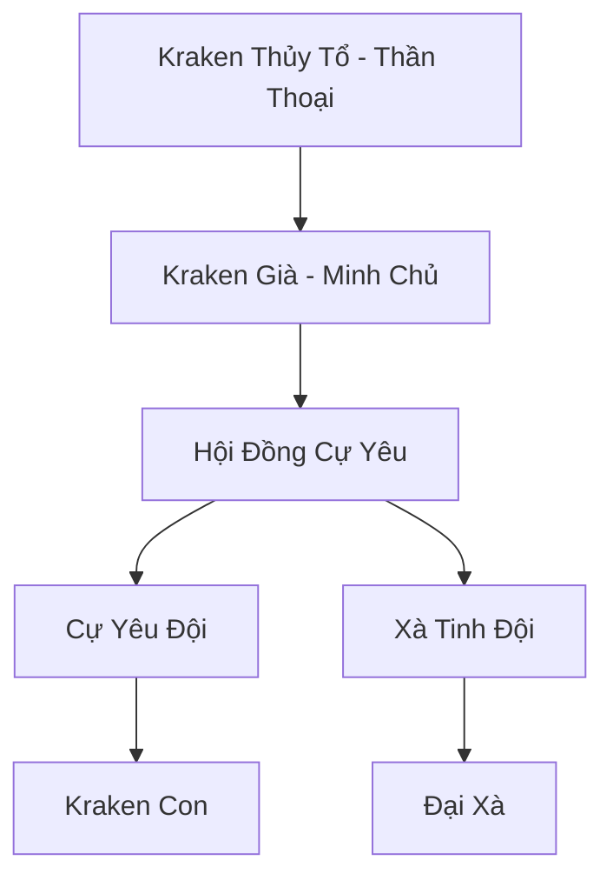

# BẮC HẢI CỰ YÊU HANG (北海巨妖穴)

## I. Tổng Quan (总览)
Bắc Hải Cự Yêu Hang là một tổ hợp các hang động băng giá nằm tại ranh giới giữa biển Bắc Băng và Vô Tận Hải. Đây không phải là một thế lực chính trị có tổ chức chặt chẽ, mà là một "thánh địa ngủ đông" của những loài yêu thú biển khổng lồ nhất thế giới (Kraken, Xà Tinh, Kình Ngư Thượng Cổ). Dù không chủ động tham gia tranh đấu, nhưng sự tồn tại của chúng là một lá chắn tự nhiên ngăn chặn mọi hành trình vượt biển phương Bắc. Ngư dân vùng biên truyền nhau câu nói: *"Qua Hải Vực Gào Thét mà còn sống, ấy là cự yêu đang ngủ say — chớ dại quay lại lần hai."* Sự hiện diện đơn thuần của hang ổ đã biến toàn bộ vùng biển xung quanh thành một khu vực cấm tự nhiên, nơi mà ngay cả Long Cung cũng e dè không dám tuần tra thường xuyên.

## II. Địa Lý & Tài Nguyên (地理 với tài nguyên)
Trụ sở chính là hệ thống hang đá ngầm khổng lồ nằm sâu dưới các tảng băng trôi vĩnh cửu, kéo dài từ "Vạn Niên Băng Trụ" ở phía bắc cho đến "Hải Cốt Thung Lũng" ở rìa nam — nơi xương cốt các cự yêu đã ngã xuống từ thời Thái Cổ vẫn còn phát ra linh áp đáng sợ. Nơi đây tích tụ linh khí hàn băng cực kỳ đậm đặc, giúp các cự yêu duy trì trạng thái ngủ đông kéo dài hàng ngàn năm mà không suy giảm tu vi. Tài nguyên chính là những mảnh vảy, xương cốt và nội đan của các loài thú cổ đại đã chết, cùng với vô số cổ vật từ những con tàu bị bão biển đánh chìm — trong đó nổi tiếng nhất là "Hải Đế Trầm Thuyền", chiếc chiến hạm mất tích của Hải Hoàng Đế Triều thứ ba mà các hải tặc vẫn đang liều mạng tìm kiếm.
Khu vực xung quanh ẩn chứa nhiều bí mật chưa được khám phá — hang động chưa ai đến, mạch khoáng chưa ai biết, dấu tích cổ đại mà thời gian chưa kịp xóa nhòa.

## III. Văn Hóa & Tín Ngưỡng (文化 với信仰)
Tôn thờ bản năng và sự tĩnh lặng của đại dương. Các cự yêu có một mối liên kết tâm linh lỏng lẻo thông qua tiếng sóng âm biển sâu — một loại "Hải Vực Cộng Minh" mà chỉ những sinh vật có thể chất vượt quá ngàn trượng mới có thể cảm nhận. Họ coi hang ổ là vùng đất thánh và mọi sự xâm nhập đều bị coi là hành vi thách thức cần phải trừng phạt bằng sự hủy diệt diện rộng. Mỗi khi một cự yêu chết đi, xác của nó sẽ từ từ chìm xuống Hải Cốt Thung Lũng, và các đồng loại sẽ phát ra một tiếng trầm hùng kéo dài suốt ba ngày đêm — ngư dân gọi hiện tượng này là "Biển Khóc". Có câu cổ ngữ trong hang: *"Đại dương vô ngôn, xúc tu tự phán."*
Mỗi thế hệ mới được truyền dạy không chỉ kỹ năng sinh tồn mà cả câu chuyện về nguồn cội, để ngọn lửa ký ức không bao giờ tắt dù hoàn cảnh khắc nghiệt đến đâu.

## IV. Cơ Cấu Tổ Chức (组织结构)


## V. Công Pháp & Trận Pháp (功法 với阵法)
- **Công Pháp:** Không có công pháp tu luyện nhân tạo, sức mạnh đến từ *Huyết Mạch Thượng Cổ* và khả năng thao túng nước lạnh giá. Mỗi cự yêu bẩm sinh đã mang trong mình sức mạnh ngang hàng với một tu sĩ Hóa Thần chỉ nhờ vào thể phách thuần túy, và việc ngủ đông càng lâu thì huyết mạch càng tinh thuần hơn.
- **Trận Pháp:** *Hàn Băng Thâm Uyên Trận* - một trận pháp tự nhiên được cường hóa bởi ý chí của các cự yêu, biến vùng biển xung quanh thành một máy nghiền băng khổng lồ, bóp nát mọi chiến hạm. Khi trận pháp kích hoạt tối đa, nước biển trong phạm vi trăm dặm sẽ đóng băng rồi vỡ vụn liên tục theo nhịp thở của Kraken Già, tạo ra cảnh tượng mà các hải đồ ghi là "Vùng Hải Tử".

## VI. Đặc Sản Môn Phái (门派特产)
- **Vảy Kraken:** Loại vật liệu cực bền, có khả năng kháng lại mọi loại đòn tấn công thủy hệ. Một mảnh vảy cỡ bàn tay đủ để rèn thành một tấm khiên chống được ba đòn tấn công Nguyên Anh kỳ, khiến nó trở thành mặt hàng được các thế lực ma đạo săn lùng ráo riết trên khắp thị trường đen Bắc Băng.
- **Băng Tinh Hải Tủy:** Tinh thể hình thành từ hơi thở của cự yêu, chứa đựng năng lượng hàn băng tinh thuần nhất thế giới. Được Tuyết Liên Dược Phường đặt tên là "Giọt Lệ Thâm Uyên", đây là nguyên liệu không thể thay thế trong việc luyện chế "Hàn Ngưng Đan" cấp bảy.
- **Mực Xúc Tu:** Loại mực đen do Kraken tiết ra khi cảm thấy bị đe dọa, có khả năng làm nhiễu loạn thần thức trong phạm vi rộng. Các luyện khí sư tà đạo dùng nó để chế tác phù lục "Hắc Hải Mê Trận".
Ngoài ra, Bắc Hải Cự Yêu Hang còn sở hữu vật phẩm có giá trị văn hóa hơn vật chất — thứ mà thương nhân bỏ qua nhưng nhà sử học trả bất cứ giá nào.

## VII. Cơ Sở Hạ Tầng (基础设施)
- **Vạn Niên Băng Hang:** Những khoang rỗng khổng lồ dưới đáy biển băng dùng làm nơi trú ngụ, mỗi khoang rộng đủ để chứa một con Kraken trưởng thành cuộn tròn. Vách hang phát ra ánh sáng xanh lạnh lẽo từ các tinh thể băng cổ đại bám trên bề mặt, tạo nên cảnh tượng mà thám hiểm gia Lý Hải Phong từng mô tả là "cung điện của tử thần dưới đáy biển".
- **Nghĩa Địa Tàu Đắm:** Khu vực xung quanh hang ổ chứa đựng xác của hàng ngàn con tàu từ nhiều thời đại, trong đó đáng chú ý nhất là khu vực "Thiên Phàm Trủng" — nơi tập trung dày đặc nhất các mảnh vỡ và cổ vật, trở thành điểm hành hương bí mật của Bạch Cốt Hội và Hắc Hải Hải Tặc.
Toàn bộ hạ tầng mang dấu ấn đặc trưng cộng đồng — không phải xa hoa mà là thực dụng đúc kết qua nhiều thế hệ thử nghiệm.

## VIII. Kinh Tế (経済)
Kinh tế mang tính thụ động. Thỉnh thoảng, các thế lực ma đạo gan dạ (như Vực Thẳm Ma Cung) sẽ mạo hiểm đến đây để nhặt những mảnh vật liệu do cự yêu thải ra hoặc trao đổi các linh hồn tươi sống để lấy bảo vật tàu đắm. Hoạt động này diễn ra chủ yếu tại "Xúc Tu Chợ Đen" — một khu vực ở rìa ngoài cùng của hang ổ, nơi các thương nhân liều mạng bày biện vật phẩm trên các tảng băng trôi và chờ đợi một xúc tu nhỏ của Kraken Con thò ra nhặt lấy thứ nó thích. Không có đàm phán, không có giá cả — mọi thứ đều phụ thuộc vào tâm trạng của quái vật.
Tiềm năng kinh tế vượt xa những gì đang được khai thác — sự thiếu hụt nhân lực, kiến thức thương mại, và bảo hộ chính trị khiến phần lớn giá trị vẫn nằm yên.

## IX. Lịch Sử Tóm Tắt (简史)
Được hình thành ngay sau khi kỷ nguyên Thái Cổ kết thúc, khi các loài quái vật khổng lồ bị xua đuổi khỏi các vùng biển nông của Nhân Tộc và Long Tộc. Chúng tìm thấy sự an toàn trong bóng tối lạnh giá của phương Bắc và dần dần biến nơi này thành sào huyệt bất khả xâm phạm. Trận chiến đáng nhớ nhất trong lịch sử là "Đại Chiến Vạn Phàm" cách đây ba ngàn năm, khi liên quân thủy quân của bốn đại tông phái huy động ngàn chiến thuyền tấn công hang ổ nhưng bị Kraken Già đánh tan trong một đêm — sự kiện khiến cho từ đó không ai dám nảy sinh ý định chinh phục Bắc Hải Cự Yêu Hang nữa.
Mỗi thế hệ kế tiếp gánh di sản và gánh nặng thế hệ trước — nhưng cũng mang khả năng mới mà cha ông chưa từng tưởng tượng.

## X. Giai Thoại & Bí Mật (轶 sự với bí mật)
Tương truyền Kraken Già thực chất là một phần xúc tu của Kraken Thủy Tổ bị đứt ra và đã tự phát triển thành một thực thể độc lập có trí tuệ. Nếu truyền thuyết này là thật, điều đó có nghĩa bản thể thực sự của Kraken Thủy Tổ vẫn đang ngủ ở một nơi nào đó sâu hơn nữa dưới đáy biển — và nếu nó tỉnh lại, toàn bộ Bắc Hải sẽ không còn tồn tại. Ngoài ra, một số thám hiểm gia sống sót kể lại rằng trong lòng hang sâu nhất có khắc một dòng chữ cổ bằng ngôn ngữ Thái Cổ: *"Ta ngủ, thế giới bình yên. Ta thức, biển cả thành mộ."*
Những bí mật này, nếu được tiết lộ, có thể khiến nhiều thế lực phải nhìn lại đánh giá của mình về cộng đồng nhỏ bé này — vừa là cơ hội vừa là mối nguy.

## XI. Quan Hệ Thế Lực (势力关系)
```mermaid
graph LR
    BHCYH[Bắc Hải Cự Yêu Hang] -- Bị quấy rối -- HHHT[Hắc Hải Hải Tặc]
    BHCYH -- Đối địch -- CQTĐ[Cực Quang Thần Điện]
    BHCYH -- Giao dịch -- VTMC[Vực Thẳm Ma Cung]
    BHCYH -- Tránh né -- LC[Long Cung]
Nhìn tổng thể, mạng lưới quan hệ tuy mỏng manh nhưng đủ duy trì sự tồn tại — trong thế giới tu chân tàn khốc, tồn tại đã là chiến thắng.
```
