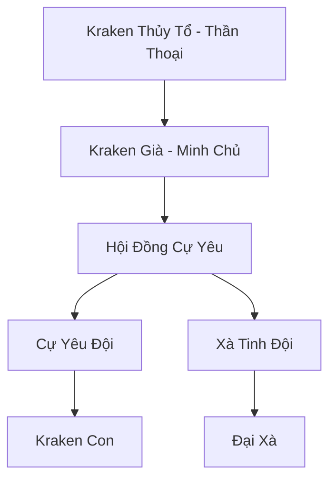

# BẮC HẢI CỰ YÊU HANG (北海巨妖穴)

## I. Tổng Quan (总览)
Bắc Hải Cự Yêu Hang là một tổ hợp các hang động băng giá nằm tại ranh giới giữa biển Bắc Băng và Vô Tận Hải. Đây không phải là một thế lực chính trị có tổ chức chặt chẽ, mà là một "thánh địa ngủ đông" của những loài yêu thú biển khổng lồ nhất thế giới (Kraken, Xà Tinh, Kình Ngư Thượng Cổ). Dù không chủ động tham gia tranh đấu, nhưng sự tồn tại của chúng là một lá chắn tự nhiên ngăn chặn mọi hành trình vượt biển phương Bắc.

## II. Địa Lý & Tài Nguyên (地理 với tài nguyên)
Trụ sở chính là hệ thống hang đá ngầm khổng lồ nằm sâu dưới các tảng băng trôi vĩnh cửu. Nơi đây tích tụ linh khí hàn băng cực kỳ đậm đặc, giúp các cự yêu duy trì trạng thái ngủ đông kéo dài hàng ngàn năm. Tài nguyên chính là những mảnh vảy, xương cốt và nội đan của các loài thú cổ đại đã chết, cùng với vô số cổ vật từ những con tàu bị bão biển đánh chìm.

## III. Văn Hóa & Tín Ngưỡng (文化 với信仰)
Tôn thờ bản năng và sự tĩnh lặng của đại dương. Các cự yêu có một mối liên kết tâm linh lỏng lẻo thông qua tiếng sóng âm biển sâu. Họ coi hang ổ là vùng đất thánh và mọi sự xâm nhập đều bị coi là hành vi thách thức cần phải trừng phạt bằng sự hủy diệt diện rộng.

## IV. Cơ Cấu Tổ Chức (组织结构)


## V. Công Pháp & Trận Pháp (功法 với阵法)
- **Công Pháp:** Không có công pháp tu luyện nhân tạo, sức mạnh đến từ *Huyết Mạch Thượng Cổ* và khả năng thao túng nước lạnh giá.
- **Trận Pháp:** *Hàn Băng Thâm Uyên Trận* - một trận pháp tự nhiên được cường hóa bởi ý chí của các cự yêu, biến vùng biển xung quanh thành một máy nghiền băng khổng lồ, bóp nát mọi chiến hạm.

## VI. Đặc Sản Môn Phái (门派特产)
- **Vảy Kraken:** Loại vật liệu cực bền, có khả năng kháng lại mọi loại đòn tấn công thủy hệ.
- **Băng Tinh Hải Tủy:** Tinh thể hình thành từ hơi thở của cự yêu, chứa đựng năng lượng hàn băng tinh thuần nhất thế giới.

## VII. Cơ Sở Hạ Tầng (基础设施)
- **Vạn Niên Băng Hang:** Những khoang rỗng khổng lồ dưới đáy biển băng dùng làm nơi trú ngụ.
- **Nghĩa Địa Tàu Đắm:** Khu vực xung quanh hang ổ chứa đựng xác của hàng ngàn con tàu từ nhiều thời đại.

## VIII. Kinh Tế (経済)
Kinh tế mang tính thụ động. Thỉnh thoảng, các thế lực ma đạo gan dạ (như Vực Thẳm Ma Cung) sẽ mạo hiểm đến đây để nhặt những mảnh vật liệu do cự yêu thải ra hoặc trao đổi các linh hồn tươi sống để lấy bảo vật tàu đắm.

## IX. Lịch Sử Tóm Tắt (简史)
Được hình thành ngay sau khi kỷ nguyên Thái Cổ kết thúc, khi các loài quái vật khổng lồ bị xua đuổi khỏi các vùng biển nông của Nhân Tộc và Long Tộc. Chúng tìm thấy sự an toàn trong bóng tối lạnh giá của phương Bắc và dần dần biến nơi này thành sào huyệt bất khả xâm phạm.

## X. Giai Thoại & Bí Mật (轶 sự với bí mật)
Tương truyền Kraken Già thực chất là một phần xúc tu của Kraken Thủy Tổ bị đứt ra và đã tự phát triển thành một thực thể độc lập có trí tuệ.

## XI. Quan Hệ Thế Lực (势力关系)
```mermaid
graph LR
    BHCYH[Bắc Hải Cự Yêu Hang] -- Bị quấy rối -- HHHT[Hắc Hải Hải Tặc]
    BHCYH -- Đối địch -- CQTĐ[Cực Quang Thần Điện]
    BHCYH -- Giao dịch -- VTMC[Vực Thẳm Ma Cung]
    BHCYH -- Tránh né -- LC[Long Cung]
```
