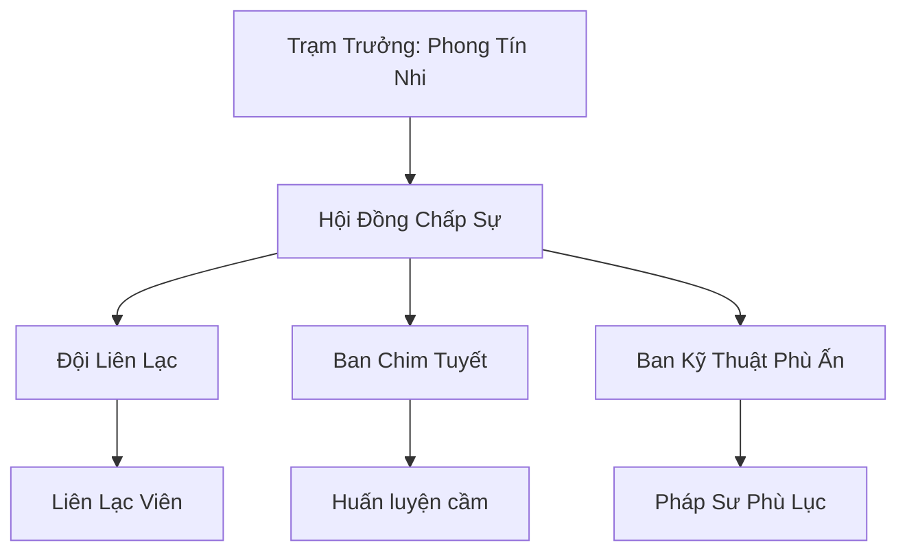

# BẮC PHONG THÔNG TÍN TRẠM (北风通信站)

## I. Tổng Quan (总览)
Bắc Phong Thông Tín Trạm là mạng lưới liên lạc quan trọng nhất tại vùng rìa nam Bắc Băng. Trong môi trường khắc nghiệt nơi bão tuyết có thể cắt đứt mọi liên lạc linh lực thông thường, trạm đóng vai trò là nhịp cầu duy nhất giúp các bộ lạc và thương đoàn duy trì sự kết nối với thế giới bên ngoài. Phong Tín Nhi thường nói: *"Một bức thư đến đúng lúc có giá trị hơn ngàn viên linh thạch đến muộn."* Với phương châm giản dị ấy, trạm đã trở thành mạch máu thông tin không thể thiếu cho toàn bộ đời sống tu chân phương Bắc, dù quy mô chỉ vỏn vẹn mười ba người.

## II. Địa Lý & Tài Nguyên (地理 với tài nguyên)
Trạm chính là một tòa tháp đá kiên cố mang tên "Tháp Thính Phong" nằm trên một điểm cao chiến lược tại tundra Bắc Băng, nơi gió bốn phương hội tụ tạo thành một vùng xoáy linh khí phong hệ đặc biệt thích hợp cho việc truyền tín hiệu. Ngoài ra, mạng lưới còn bao gồm mười hai trạm nhỏ rải rác dọc theo "Tuyến Hành Lang Bạch Tuyết" — con đường lữ hành chính nối liền các điểm dân cư rìa nam. Tài nguyên quý giá nhất của trạm là đàn Chim Tuyết "Bạch Vũ" được huấn luyện đặc biệt để bay xuyên qua những trận bão tuyết cường độ thấp, mỗi con mang theo một viên "Phong Linh Châu" nhỏ giúp chúng cảm nhận đường đi giữa mù tuyết. Các trạm nhỏ đều được đánh dấu bằng "Phong Kỳ" — những lá cờ linh lực phát sáng xanh nhạt trong bão, dẫn đường cho lữ khách lạc đường.

## III. Văn Hóa & Tín Ngưỡng (文化 với信仰)
Đề cao triết lý "Tin tức là mạng sống". Thành viên của trạm coi trọng sự trung thực và tốc độ, và mỗi liên lạc viên mới đều phải tuyên thệ trước "Phong Thạch Đài" — tảng đá khắc lời thề bảo mật nằm ở tầng cao nhất của tháp chính. Họ có văn hóa ghi chép tỉ mỉ về các biến động của gió và mây tuyết, biến việc dự báo thời tiết thành một loại nghệ thuật sinh tồn mang tên "Phong Vân Thư". Mỗi buổi sáng, toàn trạm thực hiện nghi thức "Thính Phong" — đứng im lặng trên đỉnh tháp trong mười phút để cảm nhận hướng gió và dự đoán tình hình thời tiết trong ngày. Tín ngưỡng duy nhất là sự tôn trọng đối với sức mạnh của gió phương Bắc, được thể hiện qua câu nói truyền miệng: *"Gió không thiên vị ai — nó mang tin đến cho cả người sống lẫn kẻ chết."*

## IV. Cơ Cấu Tổ Chức (组织结构)


## V. Công Pháp & Trận Pháp (功法 với阵法)
- **Công Pháp:** *Phong Hành Thủ* (Tăng tốc độ di chuyển trong gió ngược, cho phép liên lạc viên chạy trên mặt tuyết mà không lún), *Linh Âm Truyền Tin* (Kỹ thuật nén tín hiệu thần thức vào phù lục, cho phép truyền tải lượng thông tin gấp mười lần so với phương pháp thông thường). Hai bài công pháp này tuy đơn giản nhưng là kết quả đúc kết của bốn mươi năm kinh nghiệm thực chiến trong bão tuyết.
- **Trận Pháp:** *Linh Lực Khuếch Đại Trận* - trận pháp cốt lõi đặt tại tháp chính, giúp tăng phạm vi truyền tin của các phù lục lên gấp nhiều lần. Trận pháp sử dụng mười hai trụ đá "Phong Trụ" xếp theo hình sao, mỗi trụ gắn một viên Phong Linh Thạch, khi hoạt động đồng thời sẽ tạo ra một vùng cộng hưởng tín hiệu bao phủ toàn bộ rìa nam Bắc Băng.

## VI. Đặc Sản Môn Phái (门派特产)
- **Bắc Phong Phù:** Loại bùa truyền tin có khả năng chống nhiễu loạn từ hàn khí, được khắc bằng mực chế từ huyết Chim Tuyết pha bột Phong Linh Thạch. Mỗi phù lục có thời hạn sử dụng ba tháng và có thể truyền tải tín hiệu xuyên qua bão tuyết cấp bốn.
- **Lông Chim Tuyết:** Vật liệu nhẹ và chứa phong linh khí, dùng để chế tạo ám khí hoặc pháp bảo tốc độ. Đặc biệt, lông đuôi của "Bạch Vũ Vương" — con chim tuyết đầu đàn — được đồn đại có thể dẫn đường trong bất kỳ trận bão nào, bất kể cường độ.
- **Phong Vân Thư Lục:** Các bản ghi chép chi tiết về quy luật gió và bão tuyết theo mùa, được các thương đoàn và bộ lạc mua với giá cao để lập kế hoạch hành trình.

## VII. Cơ Sở Hạ Tầng (基础设施)
- **Tháp Thính Phong:** Tòa tháp đá cao bảy tầng với hệ thống thu phát tín hiệu liên tục, đỉnh tháp gắn một "Phong Linh Chuông" lớn sẽ tự rung khi có bão tuyết cấp năm trở lên đang tiến đến, cảnh báo cho toàn bộ cư dân trong phạm vi ba mươi dặm. Tầng hầm của tháp là nơi Phong Tín Nhi cất giấu "Hồn Ngọc" chứa bản sao mật thư.
- **Chuồng Chim Băng "Bạch Vũ Sào":** Khu vực nuôi dưỡng hai mươi con chim tuyết với môi trường mô phỏng bão tố để rèn luyện sức bền, được xây dựng bên hông tháp chính với mái che bằng da thú Bạch Hùng.

## VIII. Kinh Tế (経済)
Nguồn thu ổn định từ phí dịch vụ chuyển phát thư tín và bưu kiện nhỏ, với ba mức giá: "Thường Tốc" (mười ngày), "Cấp Tốc" (ba ngày), và "Sinh Tử Tốc" (một ngày, giá gấp mười lần nhưng cam kết thư đến nơi hoặc hoàn tiền). Phong Tín Nhi cũng bí mật thu lợi nhuận từ việc phân tích và bán các xu hướng thông tin (không tiết lộ nội dung thư) cho các thương hội lớn — một hoạt động mà bà gọi là "đọc gió" và coi đó là nghệ thuật hơn là gian lận. Ngoài ra, dịch vụ bán "Phong Vân Thư Lục" theo quý đang trở thành nguồn thu mới quan trọng.

## IX. Lịch Sử Tóm Tắt (简史)
Được sáng lập 40 năm trước bởi Phong Tín Nhi, một tu sĩ phong hệ bị lạc trong bão tuyết và được cứu mạng nhờ sự dẫn đường của một con chim tuyết hoang. Bà nhận ra nhu cầu cấp thiết về thông tin tại vùng đất này và đã dùng số vốn ít ỏi — ba trăm viên linh thạch hạ phẩm và một bộ phù lục rẻ tiền — để xây dựng trạm liên lạc đầu tiên trên nền một tháp canh đổ nát. Qua bốn thập kỷ, trạm đã mở rộng từ một người thành mười ba, và mạng lưới mười hai trạm phụ trải dài khắp rìa nam Bắc Băng, trở thành hạ tầng không thể thiếu cho thương mại và sinh tồn phương Bắc.

## X. Giai Thoại & Bí Mật (轶 sự với bí mật)
Tương truyền Phong Tín Nhi bí mật lưu trữ bản sao của mọi bức thư đã từng đi qua trạm của mình trong một "Hồn Ngọc" tuyệt mật, coi đó là con bài tẩy để bảo vệ mạng sống của toàn trạm trước các thế lực lớn. Viên Hồn Ngọc này được giấu trong một hốc đá bí mật dưới tầng hầm Tháp Thính Phong, bên ngoài yểm ba lớp phong ấn mà chỉ Phong Tín Nhi mới biết cách mở. Nếu thông tin này bị lộ, nó sẽ trở thành quả bom có thể phá vỡ quan hệ ngoại giao giữa hàng chục thế lực — đặc biệt là một bức mật thư giữa hai vị trưởng lão Cực Quang Thần Điện bàn về việc thanh trừng nội bộ.

## XI. Quan Hệ Thế Lực (势力关系)
```mermaid
graph LR
    BPTTT[Bắc Phong Thông Tín Trạm] -- Cung cấp dịch vụ -- PBTĐ[Phá Băng Thương Đội]
    BPTTT -- Liên kết -- HPTTĐ[Hàn Phong Truyền Tin Đội]
    BPTTT -- Cảnh giác -- CQTĐ[Cực Quang Thần Điện]
    BPTTT -- Hỗ trợ -- BNTTH[Băng Nguyên Tán Tu Hội]
```
