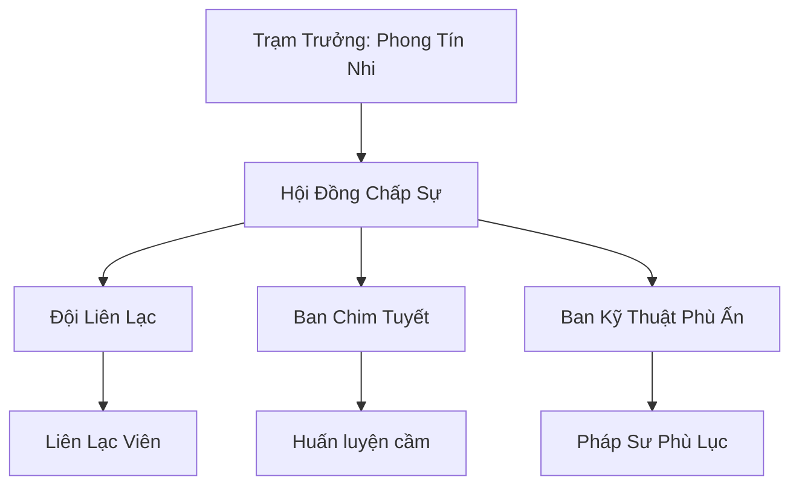

# BẮC PHONG THÔNG TÍN TRẠM (北风通信站)

## I. Tổng Quan (总览)
Bắc Phong Thông Tín Trạm là mạng lưới liên lạc quan trọng nhất tại vùng rìa nam Bắc Băng. Trong môi trường khắc nghiệt nơi bão tuyết có thể cắt đứt mọi liên lạc linh lực thông thường, trạm đóng vai trò là nhịp cầu duy nhất giúp các bộ lạc và thương đoàn duy trì sự kết nối với thế giới bên ngoài.

## II. Địa Lý & Tài Nguyên (地理 với tài nguyên)
Trạm chính là một tòa tháp đá kiên cố nằm trên một điểm cao chiến lược tại tundra Bắc Băng. Ngoài ra, mạng lưới còn bao gồm hàng chục trạm nhỏ rải rác dọc theo tuyến đường lữ hành chính. Tài nguyên quý giá nhất của trạm là đàn Chim Tuyết được huấn luyện đặc biệt để bay xuyên qua những trận bão tuyết cường độ thấp.

## III. Văn Hóa & Tín Ngưỡng (文化 với信仰)
Đề cao triết lý "Tin tức là mạng sống". Thành viên của trạm coi trọng sự trung thực và tốc độ. Họ có văn hóa ghi chép tỉ mỉ về các biến động của gió và mây tuyết, biến việc dự báo thời tiết thành một loại nghệ thuật sinh tồn. Tín ngưỡng duy nhất là sự tôn trọng đối với sức mạnh của gió phương Bắc.

## IV. Cơ Cấu Tổ Chức (组织结构)


## V. Công Pháp & Trận Pháp (功法 với阵法)
- **Công Pháp:** *Phong Hành Thủ* (Tăng tốc độ di chuyển), *Linh Âm Truyền Tin* (Kỹ thuật nén tín hiệu thần thức).
- **Trận Pháp:** *Linh Lực Khuếch Đại Trận* - trận pháp cốt lõi đặt tại tháp chính, giúp tăng phạm vi truyền tin của các phù lục lên gấp nhiều lần.

## VI. Đặc Sản Môn Phái (门派特产)
- **Bắc Phong Phù:** Loại bùa truyền tin có khả năng chống nhiễu loạn từ hàn khí.
- **Lông Chim Tuyết:** Vật liệu nhẹ và chứa phong linh khí, dùng để chế tạo ám khí hoặc pháp bảo tốc độ.

## VII. Cơ Sở Hạ Tầng (基础设施)
- **Tháp Thông Tín:** Tòa tháp đá cao điểm với hệ thống thu phát tín hiệu liên tục.
- **Chuồng Chim Băng:** Khu vực nuôi dưỡng chim tuyết với môi trường mô phỏng bão tố để rèn luyện sức bền.

## VIII. Kinh Tế (経済)
Nguồn thu ổn định từ phí dịch vụ chuyển phát thư tín và bưu kiện nhỏ. Phong Tín Nhi cũng bí mật thu lợi nhuận từ việc phân tích và bán các xu hướng thông tin (không tiết lộ nội dung thư) cho các thương hội lớn.

## IX. Lịch Sử Tóm Tắt (简史)
Được sáng lập 40 năm trước bởi Phong Tín Nhi, một tu sĩ phong hệ bị lạc trong bão tuyết và được cứu mạng nhờ sự dẫn đường của một con chim tuyết. Bà nhận ra nhu cầu cấp thiết về thông tin tại vùng đất này và đã dùng số vốn ít ỏi để xây dựng trạm liên lạc đầu tiên.

## X. Giai Thoại & Bí Mật (轶 sự với bí mật)
Tương truyền Phong Tín Nhi bí mật lưu trữ bản sao của mọi bức thư đã từng đi qua trạm của mình trong một "Hồn Ngọc" tuyệt mật, coi đó là con bài tẩy để bảo vệ mạng sống của toàn trạm trước các thế lực lớn.

## XI. Quan Hệ Thế Lực (势力关系)
```mermaid
graph LR
    BPTTT[Bắc Phong Thông Tín Trạm] -- Cung cấp dịch vụ -- PBTĐ[Phá Băng Thương Đội]
    BPTTT -- Liên kết -- HPTTĐ[Hàn Phong Truyền Tin Đội]
    BPTTT -- Cảnh giác -- CQTĐ[Cực Quang Thần Điện]
    BPTTT -- Hỗ trợ -- BNTTH[Băng Nguyên Tán Tu Hội]
```
