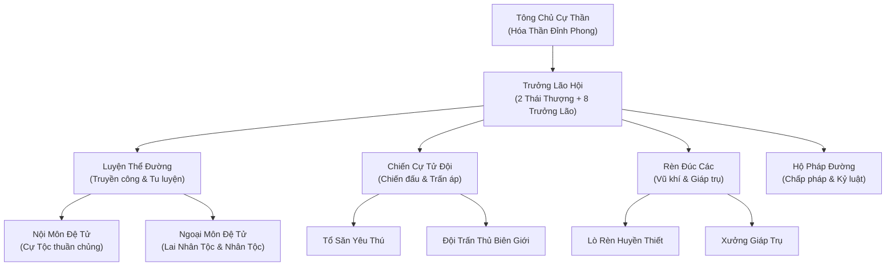
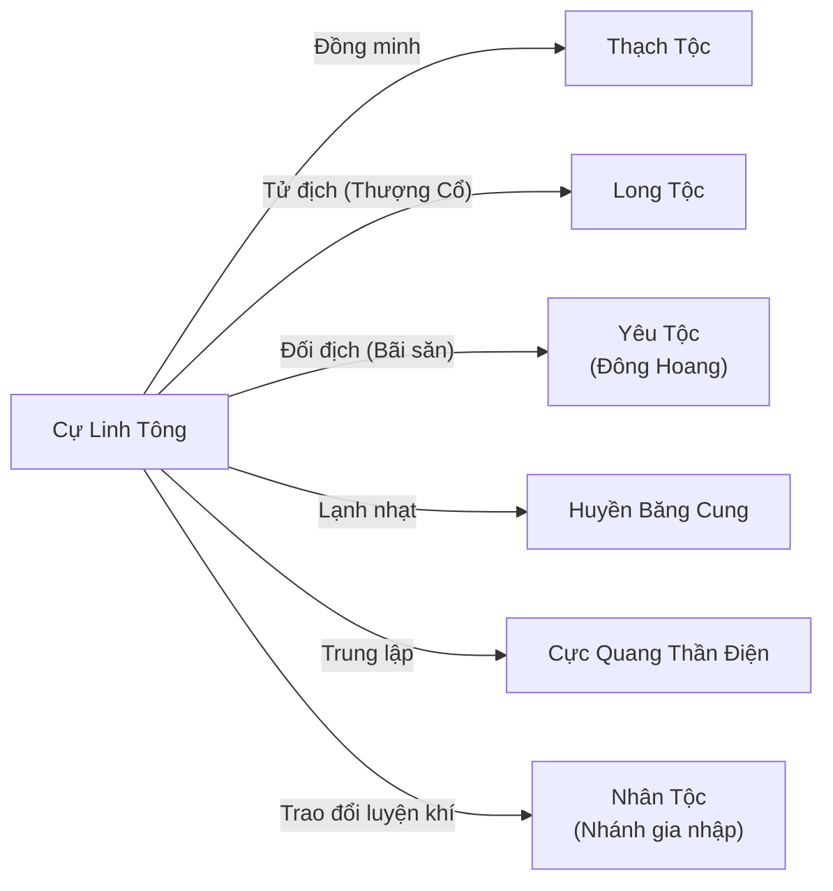

# CỰ LINH TÔNG (巨灵宗)

## I. Tổng Quan (总览)
Cự Linh Tông là thượng cổ tông môn của Cự Tộc (Người Khổng Lồ, Titan) — một trong những chủng tộc cổ đại mạnh mẽ nhất lục địa, từng chia đôi thiên hạ với Long Tộc vào thời hồng hoang. Tông môn tọa lạc trên rặng núi khổng lồ nằm giữa vùng Trung Tâm và Bắc Băng, nơi những ngọn núi cao vạn trượng quanh năm phủ tuyết trắng và gió lạnh cắt da cắt thịt.

Đây là thế lực Luyện Thể thuần túy nhất thế giới tu luyện — nơi sức mạnh cơ bắp, nhục thân bất diệt và huyết mạch Cự Tộc được tôn thờ trên tất cả. Mỗi thành viên Cự Linh Tông, dù là lão tổ Đại Cự Nhân hay Chiến Cự Tử thế hệ trẻ, đều có khả năng đối chọi với hàng ngàn binh sĩ tinh nhuệ Nhân Tộc. Tông Chủ Cự Thần được xưng là lực lượng vật lý khủng khiếp nhất toàn lục địa — một cú đấm của ngài có thể chấn động không gian, một cú giẫm chân có thể khiến sơn hà rung chuyển.

Tuy quy mô nhân khẩu không đông đúc như các tông môn Nhân Tộc hay bộ lạc Yêu Tộc, Cự Linh Tông vẫn đứng vững ở Hạng Nhì nhờ vào sức chiến đấu cá nhân áp đảo và lãnh thổ hiểm trở tự nhiên khiến bất kỳ đạo quân xâm lược nào cũng phải chùn bước.

## II. Địa Lý & Tài Nguyên (地理 与 资源)
Trụ sở chính của Cự Linh Tông là Thần Chùy Phong — ngọn núi có hình dạng cây búa khổng lồ, đỉnh núi phẳng lỳ như mặt búa và thân núi thon dần về phía chân. Truyền thuyết kể rằng ngọn núi này chính là cây búa của một vị Cự Thần thượng cổ cắm xuống đất sau trận đại chiến với Long Tộc, hóa thạch thành núi đá qua hàng vạn năm. Toàn bộ rặng núi xung quanh đều thuộc lãnh thổ tông môn, với hệ thống hang động rộng lớn dưới lòng núi được sử dụng làm nơi tu luyện, rèn đúc và sinh hoạt.

Tầng Băng Vĩnh Cửu nằm ở sườn Bắc của rặng núi, nơi nhiệt độ quanh năm xuống dưới âm trăm độ và băng giá vĩnh cửu dày hàng ngàn trượng. Đây là nơi các Chiến Cự Tử luyện tập chịu đựng cực hạn — đứng trần trong băng giá hàng tháng trời để rèn luyện nhục thân đạt đến trạng thái bất hoại. Chỉ những ai vượt qua thử thách Tầng Băng Vĩnh Cửu mới được công nhận là chân truyền đệ tử.

Về tài nguyên, rặng núi Thần Chùy Phong chứa đựng mạch quặng Huyền Thiết Vạn Năm — loại quặng sắt đã được Hàn khí và áp lực địa chất tinh luyện tự nhiên suốt hàng vạn năm, cứng hơn cả linh thiết thông thường nhiều lần. Đây là nguyên liệu chính để rèn đúc vũ khí tạ đặc trưng của Cự Tộc. Ngoài ra, vùng biên giới Bắc Băng – Đông Hoang còn có những bãi săn giàu có yêu thú lớn, cung cấp nguồn thực phẩm và nguyên liệu luyện thể dồi dào.

## III. Văn Hóa & Tín Ngưỡng (文化 与 信仰)
Triết lý cốt lõi của Cự Linh Tông chỉ có ba chữ: **Sức mạnh là trên hết**. Mọi thứ trong tông môn đều xoay quanh việc tu dưỡng nhục thân cường tráng nhất, rèn luyện cơ bắp mạnh mẽ nhất, và duy trì huyết mạch Cự Tộc thuần khiết nhất. Họ coi thường các loại pháp thuật bay lượn, cho rằng đó là trò hề của những kẻ yếu đuối không dám đối đầu trực diện. Một Đại Cự Nhân từng tuyên bố: "Cần gì bay? Ta nhảy lên là đầu chạm trời."

Tông môn mang tính bảo thủ sâu sắc, đặc biệt trong vấn đề huyết mạch. Cự Tộc thuần chủng được coi trọng hơn lai Nhân Tộc, và việc duy trì dòng dõi thuần huyết là ưu tiên hàng đầu. Tuy nhiên, qua nhiều thế hệ, số lượng Cự Tộc thuần chủng ngày càng suy giảm, buộc tông môn phải chấp nhận thành viên lai và thậm chí cả Nhân Tộc thuần — miễn là họ chứng minh được sức mạnh thể chất vượt trội.

Văn hóa tông môn tôn thờ nhục thân như thánh vật. Họ coi trọng vết sẹo chiến đấu hơn bất kỳ huân chương nào, và mỗi Chiến Cự Tử đều tự hào khoe những vết thương từ trận chiến với yêu thú lớn. Nghi lễ quan trọng nhất trong năm là "Tế Cự Thần" — toàn bộ tông môn tụ tập tại đỉnh Thần Chùy Phong, đấm vào mặt đất cùng lúc tạo ra chấn động đủ mạnh để cả rặng núi rung chuyển, tưởng nhớ trận đại chiến thượng cổ với Long Tộc.

## IV. Cơ Cấu Tổ Chức (组织结构)
Cự Linh Tông quản lý chủ yếu theo dòng dõi huyết mạch — thuần chủng hay lai — kết hợp với hệ thống cấp bậc tông môn truyền thống. Tông Chủ Cự Thần đứng đầu tất cả, quyền lực tuyệt đối không ai dám thách thức. Dưới Tông Chủ là Trưởng Lão Hội gồm các Đại Cự Nhân — những lão tổ khổng lồ đã tu luyện hàng ngàn năm, da thịt cứng hơn thần binh, mỗi bước chân khiến đất đai rung chuyển. Chiến Cự Tử là thế hệ trẻ xuất sắc nhất, được chọn lọc để trấn áp yêu thú lớn và bảo vệ biên giới. Nhân Tộc gia nhập tông môn được xếp vào hàng Luyện Khí Sĩ, hỗ trợ trong các lĩnh vực mà Cự Tộc kém cỏi như luyện khí, đan dược và rèn đúc chi tiết tinh xảo. Ngoài ra, một số chủng tộc nhỏ lẻ bị Cự Tộc chinh phục trong quá khứ hiện phục vụ trong vai trò lao công và hậu cần.

## V. Công Pháp & Trận Pháp (功法 与 阵法)
Cự Linh Tông chuyên tu Luyện Thể (Thể Tu), đi theo con đường cực đoan về phòng thủ nhục thân và sức mạnh cơ bắp thuần túy. Họ gần như không sử dụng phép thuật bay lượn hay linh lực tấn công tầm xa — thay vào đó dùng sức bật nén không gian để di chuyển nhanh, và dùng nắm đấm thuần túy để giải quyết mọi vấn đề.

- **Bá Thể Cự Thần Cảnh (霸体巨神境):** Công pháp chấn phái số một, chỉ dành cho Cự Tộc thuần chủng. Tu luyện đến đỉnh phong, nhục thân đạt trạng thái "Bá Thể Bất Diệt" — miễn dịch với mọi pháp thuật dưới cảnh giới Hóa Thần, da thịt cứng hơn bất kỳ pháp bảo nào, và mỗi cú đấm mang theo uy áp trời đất có thể chấn động không gian.

- **Cửu Chuyển Kim Cương Quyết (九转金刚诀):** Công pháp phụ trợ dành cho cả Cự Tộc lai và Nhân Tộc. Qua chín lần chuyển hóa, nhục thân dần đạt đến trạng thái Kim Cương Bất Hoại, tuy không mạnh bằng Bá Thể nhưng đủ để biến một Nhân Tộc bình thường thành cỗ máy chiến đấu cận chiến đáng sợ.

- **Pháp Thiên Tượng Địa (法天象地):** Bí thuật gia truyền cho phép phóng to thân hình lên hàng trăm trượng. Khi thi triển, Cự Tộc trở thành những Titan khổng lồ che khuất cả mặt trời, mỗi bước chân tạo ra hố sâu, mỗi hơi thở cuốn bay cả rừng cây. Đây là vũ khí chiến lược khiến mọi đạo quân phải kinh hãi.

- **Trận Pháp — Cự Thần Sơn Hà Trận (巨神山河阵):** Trận pháp hộ sơn do chính các Đại Cự Nhân dùng thân mình làm trận nhãn. Khi kích hoạt, toàn bộ rặng núi Thần Chùy Phong biến thành một trận pháp sống, sức nặng của hàng tỷ tấn đá núi được chuyển hóa thành áp lực trấn áp bất kỳ kẻ xâm nhập nào — khiến ngay cả tu sĩ Nguyên Anh cũng khó đứng vững.

- **Vũ Khí Đặc Trưng:** Búa khổng lồ, Trụ Đồng Tiên Thiết (thanh trụ đồng nặng vạn cân, đôi khi được Cự Tộc sử dụng bằng cách nhổ cả ngọn núi nhỏ đập xuống kẻ thù). Chiến Cự Tử không xem trọng kiếm pháp hay đao pháp tinh xảo — họ tin rằng vũ khí tốt nhất là thứ nặng nhất.

## VI. Đặc Sản Môn Phái (门派特产)
- **Vũ Khí Tạ Cự Linh:** Những cây búa, trụ đồng và giáp trụ được rèn đúc từ Huyền Thiết Vạn Năm, mỗi món nặng ít nhất ngàn cân. Đối với Nhân Tộc, đây là đồ bỏ đi vì không ai nhấc nổi. Nhưng với Cự Tộc và các chủng tộc luyện thể, đây là bảo bối vô giá — mỗi cú vung vũ khí tạ mang theo trọng lực và động năng khủng khiếp.

- **Cự Cốt Đan (巨骨丹):** Đan dược đặc chế từ tủy xương yêu thú lớn kết hợp Huyền Thiết tinh chất, có tác dụng cường hóa cốt cách và tăng mật độ xương. Nhân Tộc uống vào có thể tăng sức mạnh thể chất gấp đôi trong một thời gian ngắn, nhưng tác dụng phụ là cơ thể đau đớn dữ dội khi hiệu lực hết.

- **Băng Thiết Giáp Phiến:** Những tấm giáp được rèn trong Tầng Băng Vĩnh Cửu, tận dụng nhiệt độ cực thấp để tôi luyện Huyền Thiết đạt đến mật độ tối đa. Giáp trụ này vừa chịu được va đập cực mạnh, vừa tỏa hàn khí lạnh buốt khiến kẻ tấn công cận chiến bị đóng băng tay chân.

## VII. Cơ Sở Hạ Tầng (基础设施)
- **Thần Chùy Phong (神锤峰):** Ngọn núi hình cây búa khổng lồ, trụ sở chính của toàn tông môn. Đỉnh núi phẳng là nơi tổ chức các đại hội và nghi lễ Tế Cự Thần. Bên trong núi là hệ thống hang động nhiều tầng được khoét rộng bằng nắm đấm của các đời Tông Chủ, chứa đựng đại điện, tẩm phòng, kho vũ khí và trận pháp hộ sơn.

- **Tầng Băng Vĩnh Cửu (永冰层):** Khu vực tu luyện khắc nghiệt nhất tông môn, nơi đệ tử phải chịu đựng băng giá cực hạn để rèn luyện nhục thân. Truyền thuyết nói rằng sâu dưới Tầng Băng Vĩnh Cửu phong ấn xác thân của một vị Cự Thần thượng cổ, và hàn khí tỏa ra từ xác thân đó chính là nguồn gốc của băng giá vĩnh cửu.

- **Lò Rèn Huyền Thiết (玄铁锻炉):** Quần thể lò rèn khổng lồ nằm trong lòng núi, mỗi lò lớn đủ để nung chảy hàng tấn Huyền Thiết. Ngọn lửa rèn đúc được duy trì liên tục suốt hàng ngàn năm, sử dụng mạch dung nham sâu dưới lòng đất làm nhiên liệu tự nhiên.

- **Trường Đấu Cự Thần (巨神斗场):** Đấu trường ngoài trời khổng lồ trên sườn núi, nơi các Chiến Cự Tử thi đấu và tranh đoạt thứ hạng. Khán đài được chạm khắc thẳng vào vách đá, có sức chứa hàng ngàn khán giả. Mỗi trận đấu khiến cả ngọn núi rung lắc.

## VIII. Kinh Tế (经济)
Kinh tế Cự Linh Tông dựa trên ba trụ cột chính. Thứ nhất là khai thác khoáng sản — mạch quặng Huyền Thiết Vạn Năm là nguồn thu nhập ổn định nhất, cung cấp nguyên liệu rèn đúc cho cả nội bộ lẫn xuất khẩu sang các thế lực đồng minh. Thứ hai là rèn đúc vũ khí tạ — tuy thị trường hạn chế (chỉ các chủng tộc luyện thể mới sử dụng được), nhưng mỗi món vũ khí tạ của Cự Linh Tông đều có giá cực cao vì chất lượng Huyền Thiết vượt trội. Thứ ba là săn bắt yêu thú lớn — xương cốt, da, nanh và nội đan yêu thú là nguồn nguyên liệu được các tông môn luyện đan và chế tạo pháp khí săn đón.

Ngoài ra, Cự Linh Tông thu phí bảo hộ từ các mỏ quặng nhỏ lẻ dọc biên giới Bắc Băng – Trung Tâm. Bất kỳ ai muốn khai thác khoáng sản trong vùng ảnh hưởng của tông môn đều phải nộp một phần sản lượng hoặc cung cấp vật tư mà Cự Tộc cần (thường là thực phẩm, dược liệu và vải vóc — những thứ mà Cự Tộc không tự sản xuất được).

Điểm yếu kinh tế lớn nhất là sự phụ thuộc vào bên ngoài trong lĩnh vực nông nghiệp và đan dược. Cự Tộc là những chiến binh và thợ rèn tuyệt vời, nhưng hoàn toàn thiếu khả năng trồng trọt linh thảo hay luyện đan tinh vi. Đây là lý do họ chấp nhận Nhân Tộc gia nhập tông môn — không chỉ vì lực lượng chiến đấu mà còn vì tri thức luyện khí và đan dược.

## IX. Lịch Sử Tóm Tắt (简史)
Cự Tộc từng là một trong hai chủng tộc thống trị thiên hạ vào thời Thượng Cổ, ngang hàng với Long Tộc. Hai bên chia đôi lục địa, mỗi bên cai quản một nửa thế giới. Nhưng hòa bình không kéo dài — trận đại chiến hủy thiên diệt địa giữa Cự Tộc và Long Tộc đã phá hủy cả vạn dặm sơn hà, khiến địa hình lục địa biến đổi vĩnh viễn. Kết cục, Long Tộc bị đẩy lui và phong ấn, nhưng Cự Tộc cũng trả giá đắt — một phần huyết mạch bị phong ấn bởi lời nguyền Long Tộc, khiến thế hệ sau ngày càng suy yếu so với tổ tiên.

Sau đại chiến, tàn dư Cự Tộc rút về các rặng núi cao nguyên giá lạnh ở ranh giới Bắc Băng. Cự Linh Tông được thành lập bởi vị Cự Thần đầu tiên với mục đích duy trì huyết thống, bảo tồn võ đạo và chờ đợi ngày phong ấn huyết mạch được giải trừ. Qua hàng vạn năm, tông môn dần thu nhận cả Nhân Tộc — một nhánh Nhân Tộc tự nguyện gia nhập mang theo tri thức luyện khí và đan dược, giúp Cự Tộc tồn tại ổn định hơn trong môi trường khắc nghiệt.

Tông môn duy trì tư thế ẩn thế suốt nhiều kỷ nguyên, chỉ xuất hiện khi lãnh thổ bị xâm phạm. Tuy nhiên, xung đột biên giới với Yêu Tộc Đông Hoang ngày càng leo thang khi cả hai bên tranh giành bãi săn yêu thú lớn. Đây là nguy cơ tiềm ẩn có thể kéo Cự Linh Tông ra khỏi trạng thái ẩn thế.

## X. Giai Thoại & Bí Mật (轶事 与 秘密)
Tương truyền, Tông Chủ Cự Thần hiện tại không phải là vị Cự Thần đầu tiên — nhưng cũng không ai biết đã có bao nhiêu đời Tông Chủ trước ngài. Có thuyết cho rằng "Cự Thần" không phải là tên của một cá nhân mà là danh hiệu truyền thừa, và mỗi đời Tông Chủ khi đạt đến cảnh giới đỉnh phong sẽ hóa thân vào Thần Chùy Phong, trở thành một phần của ngọn núi, vĩnh viễn bảo vệ tông môn.

Sâu dưới Tầng Băng Vĩnh Cửu, các Đại Cự Nhân biết rằng có thứ gì đó bị phong ấn — không phải đơn thuần là xác thân Cự Thần thượng cổ, mà là thứ đáng sợ hơn nhiều. Có người nói đó là Long Cốt — xương của một vị Long Tộc cổ đại bị giết trong đại chiến, và hàn khí chính là để trấn áp Long uy tàn dư. Nếu phong ấn suy yếu, Long uy tỉnh giấc có thể kích hoạt lời nguyền huyết mạch đang ngủ yên trong toàn bộ Cự Tộc.

Một bí mật khác ít người biết: trong tông môn có một nhóm Nhân Tộc bí mật nghiên cứu cách giải trừ phong ấn huyết mạch. Họ tin rằng chìa khóa nằm ở việc tìm lại "Cự Thần Chi Tâm" — trái tim của vị Cự Thần sáng lập, vật phẩm được cho là đã thất lạc từ Thượng Cổ. Nếu tìm được, không chỉ phong ấn huyết mạch có thể giải trừ mà toàn bộ Cự Tộc sẽ khôi phục lại sức mạnh hồng hoang, đủ sức thách thức bất kỳ thế lực Hạng Nhất nào.

## XI. Quan Hệ Thế Lực (势力关系)

- **Thạch Tộc:** Đồng minh thân cận nhất và lâu đời nhất. Hai chủng tộc cùng tôn thờ sức mạnh nhục thân, chia sẻ kỹ thuật luyện thể và trao đổi thương mại thường xuyên. Thạch Tộc cung cấp khoáng thạch đặc biệt, Cự Linh Tông đáp lại bằng vũ khí tạ và cam kết bảo hộ quân sự. Mối quan hệ này bền vững suốt hàng vạn năm mà chưa từng có xung đột nghiêm trọng.

- **Long Tộc:** Kẻ thù truyền kiếp từ thời hồng hoang. Dù Long Tộc đã bị phong ấn và suy yếu nghiêm trọng, Cự Linh Tông chưa bao giờ quên mối hận thù — đặc biệt là lời nguyền huyết mạch mà Long Tộc giáng xuống Cự Tộc trong trận đại chiến cuối cùng. Bất kỳ dấu hiệu nào về sự phục hồi của Long Tộc đều khiến toàn bộ Cự Linh Tông bước vào trạng thái cảnh giác cao nhất.

- **Yêu Tộc (Đông Hoang):** Đối địch do tranh giành bãi săn vùng biên giới. Cự Linh Tông cần yêu thú lớn để luyện thể và rèn đúc, Yêu Tộc coi vùng đó là lãnh thổ thiêng. Hai bên thường xuyên xung đột cục bộ — tổ săn của Chiến Cự Tử đụng độ tuần tra viên Yêu Tộc — nhưng chưa bên nào muốn bùng nổ thành đại chiến toàn diện.

- **Huyền Băng Cung:** Cùng tồn tại tại Bắc Băng nhưng ít giao tiếp. Hai bên có sự khinh thường lẫn nhau ngầm — Huyền Băng Cung coi Cự Linh Tông là thế lực man di thiếu văn hóa, Cự Linh Tông coi Huyền Băng Cung là bọn yếu đuối chỉ biết đánh đàn. Tuy nhiên, cả hai đều ngầm hiểu rằng nếu cần hợp tác chống ngoại xâm, họ sẽ đứng cùng một phía.
