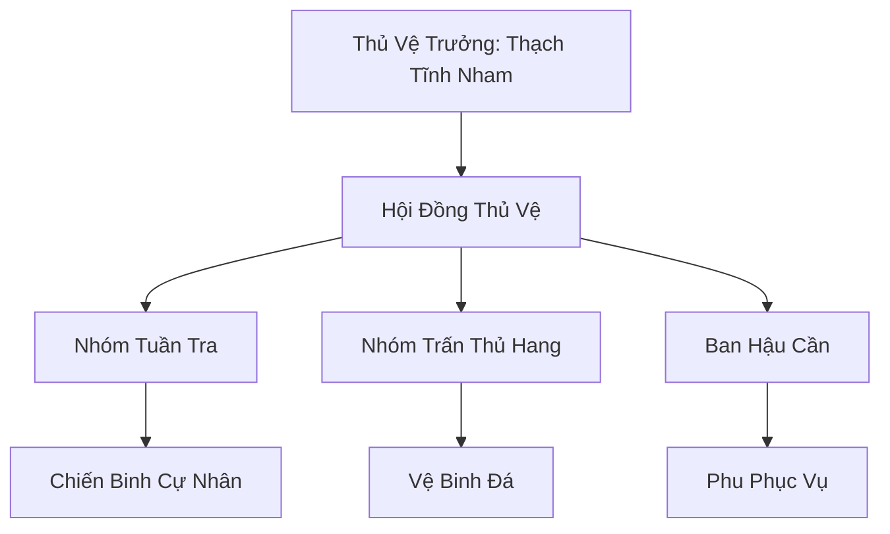

# CỰ TỘC ĐÔNG MIÊN THỦ VỆ (巨族冬眠守卫)

## I. Tổng Quan (总览)
Cự Tộc Đông Miên Thủ Vệ là một đơn vị vũ trang đặc thù gồm những người khổng lồ có tâm tính trầm ổn, chuyên trách việc bảo vệ các vị đại năng Cự Tộc trong thời gian họ thực hiện giấc ngủ đông kéo dài hàng thế kỷ. Đây là một công việc đòi hỏi sự kiên nhẫn và lòng trung thành tuyệt đối, vì những người gác đêm này chính là lá chắn duy nhất ngăn chặn các thế lực tham lam muốn đánh cắp tài bảo hoặc linh hồn của những kẻ đang ngủ say. Thạch Tĩnh Nham có một câu nói được khắc lên vách đá trước mỗi hang đông miên: *"Giấc ngủ của họ là thiêng liêng — kẻ nào dám quấy rối, đá sẽ nghiền nát xương."* Mười lăm Cự Tộc lặng lẽ canh gác giữa bình nguyên tuyết trắng mênh mông, trung thành đến mức đáng sợ, kiên nhẫn đến mức đáng kính.

## II. Địa Lý & Tài Nguyên (地理 với tài nguyên)
Trụ sở chính là một cụm các hang động đá tảng mang tên "Thạch Miên Cốc" nằm rải rác trên vùng tundra mở, nơi có địa tầng vững chắc và linh khí thủy hệ ổn định — điều kiện lý tưởng cho giấc ngủ đông kéo dài. Hệ thống gồm bảy hang chính: "Thiên Thạch Động", "Địa Trấn Động", "Huyền Nham Động" và bốn hang phụ không tên, mỗi hang chứa ít nhất một vị đại năng đang bế quan hoặc đông miên. Tài nguyên chính của đội là nguồn linh thạch do các chủ thuê để lại — được gọi là "Miên Lương" — và các loại thực phẩm khô được tích trữ từ nhiều mùa trước trong "Thạch Kho", một hầm đá chìm sâu dưới đất. Họ cũng nắm giữ bí mật về vị trí của những hang đông miên cổ đại chưa từng được công bố trên bản đồ — tri thức mà Bạch Cốt Hội sẵn sàng trả bất cứ giá nào để có được.

## III. Văn Hóa & Tín Ngưỡng (文化 với信仰)
Đề cao triết lý: *"Canh giấc ngủ của kẻ mạnh, để kẻ yếu được sống."* Thành viên đội coi giấc ngủ của chủ nhân là thiêng liêng và bất khả xâm phạm — bất kỳ ai bước vào phạm vi hang mà không có phép đều bị coi là kẻ thù. Văn hóa tại đây mang đậm tính trầm mặc, giao tiếp chủ yếu bằng các ký hiệu đá — "Thạch Ngữ" — và tiếng gõ nhịp địa mạch mà chỉ Cự Tộc mới cảm nhận được. Nghi lễ hằng ngày là "Gõ Đá Báo Bình An" — mỗi sáng sớm, Thạch Tĩnh Nham dùng chùy đá gõ vào vách hang ba nhịp chậm rãi, lắng nghe tiếng vọng để kiểm tra nhịp thở của các vị đại năng mà không làm phiền đến giấc ngủ. Nếu tiếng vọng bất thường, toàn đội sẽ lập tức chuyển sang trạng thái "Thạch Giới Bị" — phong tỏa mọi lối ra vào và chuẩn bị chiến đấu.

## IV. Cơ Cấu Tổ Chức (组织结构)


## V. Công Pháp & Trận Pháp (功法 với阵法)
- **Công Pháp:** *Địa Mạch Thính Âm Thuật* (Cảm nhận rung động từ khoảng cách xa — Thạch Tĩnh Nham có thể phát hiện bước chân của một con thỏ tuyết cách ba dặm chỉ bằng cách áp tai xuống đất), *Cự Lực Trấn Áp* (Kỹ thuật giải phóng áp lực thể phách bẩm sinh để uy hiếp kẻ thù, khiến tu sĩ Trúc Cơ trở xuống không thể di chuyển trong phạm vi mười trượng).
- **Trận Pháp:** *Địa Chấn Cảnh Báo Trận* - trận pháp sơ cấp kết nối với các vách đá hang động qua mười lăm "Thính Thạch" — viên đá đặc biệt chôn trong đất ở các điểm chiến lược. Khi có thực thể lạ mang theo sát ý tiến vào phạm vi bảo vệ, Thính Thạch sẽ tự động rung chuyển và phát ra tiếng trầm hùng nghe như tiếng núi gầm, đồng thời truyền tín hiệu đến Thạch Tĩnh Nham qua địa mạch.

## VI. Đặc Sản Môn Phái (门派特产)
- **Đá Ngủ Đông "Miên Thạch":** Loại đá có khả năng giữ nhiệt và ổn định linh lực, dùng để lót dưới lưng các tu sĩ bế quan. Một tấm Miên Thạch kích thước một trượng vuông giúp duy trì thân nhiệt và linh lực ổn định trong suốt một trăm năm, được các đại năng đặt hàng trước với giá một ngàn linh thạch trung phẩm.
- **Thạch Nhũ Tinh "Địa Lệ":** Loại tinh thể lỏng nhỏ ra từ hang đá vạn năm, mỗi giọt mất ba năm để hình thành, có tác dụng an thần và tăng cường khả năng bế khí. Tuyết Liên Dược Phường thu mua với giá mười linh thạch trung phẩm mỗi giọt.
- **Thạch Nham Phấn:** Bột đá nghiền từ các vách hang cổ, có tác dụng gia cố kết giới và tăng cường độ bền của trận pháp phòng thủ.

## VII. Cơ Sở Hạ Tầng (基础设施)
- **Hệ thống Hang Đông Miên "Thạch Miên Cốc":** Bảy hang động được gia cố bằng đá tảng và phù văn che giấu khí tức, mỗi hang có cửa đá nặng hàng vạn cân do hai Cự Tộc đẩy mới mở được. Hang "Thiên Thạch Động" là lớn nhất và cổ nhất, bên trong có vách đá tự nhiên khắc đầy bích họa Cự Tộc từ thời Thượng Cổ, mô tả lịch sử chủng tộc bằng những hình vẽ thô mộc nhưng đầy sức sống.
- **Đài Vọng Đá "Cự Nhãn Đài":** Ba điểm quan sát cao điểm được ngụy trang giống như những tảng đá tự nhiên — nhưng thực tế là đá nhân tạo do Băng Sơn Thợ Đá chế tác, bên trong rỗng đủ cho một Cự Tộc ngồi canh suốt ngày đêm mà không bị phát hiện.

## VIII. Kinh Tế (経済)
Kinh tế dựa trên các khế ước bảo vệ dài hạn — "Miên Khế" — thường kéo dài từ năm mươi đến năm trăm năm tùy theo thời gian ngủ đông của khách hàng. Đội nhận "Miên Lương" định kỳ — linh thạch và thực phẩm — từ gia tộc của các vị đại năng đang ngủ đông, với mức giá một trăm linh thạch trung phẩm mỗi năm cho mỗi hang. Thỉnh thoảng họ trao đổi các mảnh vật liệu rơi ra từ cơ thể yêu thú bóng tối bị họ tiêu diệt — đặc biệt là nanh và vuốt "Hàn Ảnh Thú" — cho thợ rèn phương Bắc để lấy trang thiết bị mới. Họ cũng bán thông tin về biến động địa mạch cho các nhóm thợ mỏ, tạo ra một nguồn thu phụ nhỏ nhưng đều đặn.

## IX. Lịch Sử Tóm Tắt (简史)
Được thành lập bởi Thạch Tĩnh Nham, một chiến binh Cự Tộc từng mất toàn bộ gia đình vì lơ là cảnh giác khi đang ngủ đông — một bầy "Hàn Ảnh Thú" đã đột nhập hang vào giữa đêm và tàn sát mọi người trong khi họ ngủ say. Bi kịch ấy khiến ông thề sẽ không để bi kịch đó lặp lại với đồng tộc, từ bỏ giấc ngủ đông vĩnh viễn và dành cả đời canh gác cho người khác. Qua năm thập kỷ, ông đã thuyết phục mười bốn Cự Tộc khác cùng chia sẻ lời thề, tạo nên đơn vị hộ vệ chuyên nghiệp duy nhất phục vụ giấc ngủ đông của chủng tộc. Câu chuyện về ông được Cự Tộc truyền miệng như một tấm gương về lòng trung thành và sự hy sinh.

## X. Giai Thoại & Bí Mật (轶 sự với bí mật)
Tương truyền trong hang "Thiên Thạch Động" — hang bí mật nhất — Thạch Tĩnh Nham đang bảo vệ một vị đại năng đã ngủ suốt 500 năm mà không có dấu hiệu tỉnh lại, người được cho là đang thực hiện quá trình "Hóa Địa" — dung hợp nhục thân với chính địa mạch của Bắc Băng để đạt đến cảnh giới truyền thuyết. Nếu thành công, vị này sẽ trở thành thực thể phi nhân đầu tiên "hợp nhất với đại địa" trong lịch sử Cự Tộc. Ngoài ra, bích họa trên vách Thiên Thạch Động có chứa một đoạn "Thạch Ngữ" cổ đại mà ngay cả Thạch Tĩnh Nham cũng không giải mã được — nhưng ông tin rằng đó là chỉ dẫn đến vùng đất tổ tiên Cự Tộc đã mất từ thời Thái Cổ.

## XI. Quan Hệ Thế Lực (势力关系)
```mermaid
graph LR
    CTĐMTH[Cự Tộc Đông Miên Thủ Vệ] -- Hợp đồng -- CTĐN[Cự Tộc Đại Năng]
    CTĐMTH -- Cảnh giác -- BCH[Bạch Cốt Hội]
    CTĐMTH -- Đồng tộc -- BSTĐ[Băng Sơn Thợ Đá]
    CTĐMTH -- Trao đổi -- PBTĐ[Phá Băng Thương Đội]
```
