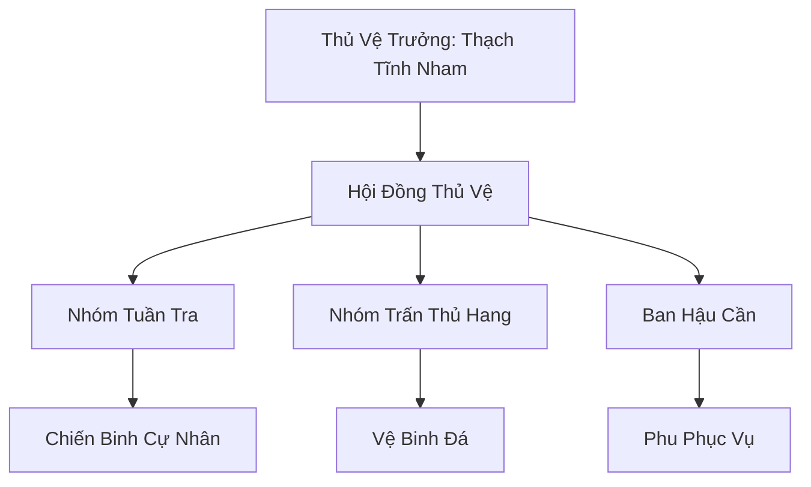

# CỰ TỘC ĐÔNG MIÊN THỦ VỆ (巨族冬眠守卫)

## I. Tổng Quan (总览)
Cự Tộc Đông Miên Thủ Vệ là một đơn vị vũ trang đặc thù gồm những người khổng lồ có tâm tính trầm ổn, chuyên trách việc bảo vệ các vị đại năng Cự Tộc trong thời gian họ thực hiện giấc ngủ đông kéo dài hàng thế kỷ. Đây là một công việc đòi hỏi sự kiên nhẫn và lòng trung thành tuyệt đối, vì những người gác đêm này chính là lá chắn duy nhất ngăn chặn các thế lực tham lam muốn đánh cắp tài bảo hoặc linh hồn của những kẻ đang ngủ say.

## II. Địa Lý & Tài Nguyên (地理 với tài nguyên)
Trụ sở chính là một cụm các hang động đá tảng nằm rải rác trên vùng tundra mở, nơi có địa tầng vững chắc và linh khí thủy hệ ổn định. Tài nguyên chính của đội là nguồn linh thạch do các chủ thuê để lại và các loại thực phẩm khô được tích trữ từ nhiều mùa trước. Họ cũng nắm giữ bí mật về vị trí của những hang đông miên cổ đại chưa từng được công bố trên bản đồ.

## III. Văn Hóa & Tín Ngưỡng (文化 với信仰)
Đề cao triết lý: "Canh giấc ngủ của kẻ mạnh, để kẻ yếu được sống". Thành viên đội coi giấc ngủ của chủ nhân là thiêng liêng và bất khả xâm phạm. Văn hóa tại đây mang đậm tính trầm mặc, giao tiếp chủ yếu bằng các ký hiệu đá và tiếng gõ nhịp địa mạch. Nghi lễ hằng ngày là "Gõ Đá Báo Bình An", nơi họ kiểm tra nhịp thở của các vị đại năng mà không làm phiền đến giấc ngủ của họ.

## IV. Cơ Cấu Tổ Chức (组织结构)


## V. Công Pháp & Trận Pháp (功法 với阵法)
- **Công Pháp:** *Địa Mạch Thính Âm Thuật* (Cảm nhận rung động từ khoảng cách xa), *Cự Lực Trấn Áp*.
- **Trận Pháp:** *Địa Chấn Cảnh Báo Trận* - trận pháp sơ cấp kết nối với các vách đá hang động, tự động phát ra tiếng trầm hùng khi có thực thể lạ mang theo sát ý tiến vào phạm vi bảo vệ.

## VI. Đặc Sản Môn Phái (门派特产)
- **Đá Ngủ Đông:** Loại đá có khả năng giữ nhiệt và ổn định linh lực, dùng để lót dưới lưng các tu sĩ bế quan.
- **Thạch Nhũ Tinh:** Loại tinh thể lỏng nhỏ ra từ hang đá vạn năm, có tác dụng an thần và tăng cường khả năng bế khí.

## VII. Cơ Sở Hạ Tầng (基础设施)
- **Hệ thống Hang Đông Miên:** Các hang động được gia cố bằng đá tảng và phù văn che giấu khí tức.
- **Đài Vọng Đá:** Các điểm quan sát cao điểm được ngụy trang giống như những tảng đá tự nhiên.

## VIII. Kinh Tế (経済)
Kinh tế dựa trên các khế ước bảo vệ dài hạn. Đội nhận linh thạch và thực phẩm định kỳ từ gia tộc của các vị đại năng đang ngủ đông. Thỉnh thoảng họ trao đổi các mảnh vật liệu rơi ra từ cơ thể yêu thú bóng tối bị họ tiêu diệt cho các thợ rèn phương Bắc để lấy trang thiết bị mới.

## IX. Lịch Sử Tóm Tắt (简史)
Được thành lập bởi Thạch Tĩnh Nham, một chiến binh Cự Tộc từng mất toàn bộ gia đình vì lơ là cảnh giác khi đang ngủ đông. Ông đã thề sẽ không để bi kịch đó lặp lại với đồng tộc và đã thuyết phục những người khác cùng tham gia vào đơn vị hộ vệ chuyên nghiệp này, duy trì sự an toàn cho các thế hệ tiền bối.

## X. Giai Thoại & Bí Mật (轶 sự với bí mật)
Tương truyền trong một hang động bí mật nhất, Thạch Tĩnh Nham đang bảo vệ một vị đại năng đã ngủ suốt 500 năm mà không có dấu hiệu tỉnh lại, người được cho là đang thực hiện quá trình hóa thân thành chính địa mạch của Bắc Băng.

## XI. Quan Hệ Thế Lực (势力关系)
```mermaid
graph LR
    CTĐMTH[Cự Tộc Đông Miên Thủ Vệ] -- Hợp đồng -- CTĐN[Cự Tộc Đại Năng]
    CTĐMTH -- Cảnh giác -- BCH[Bạch Cốt Hội]
    CTĐMTH -- Đồng tộc -- BSTĐ[Băng Sơn Thợ Đá]
    CTĐMTH -- Trao đổi -- PBTĐ[Phá Băng Thương Đội]
```
