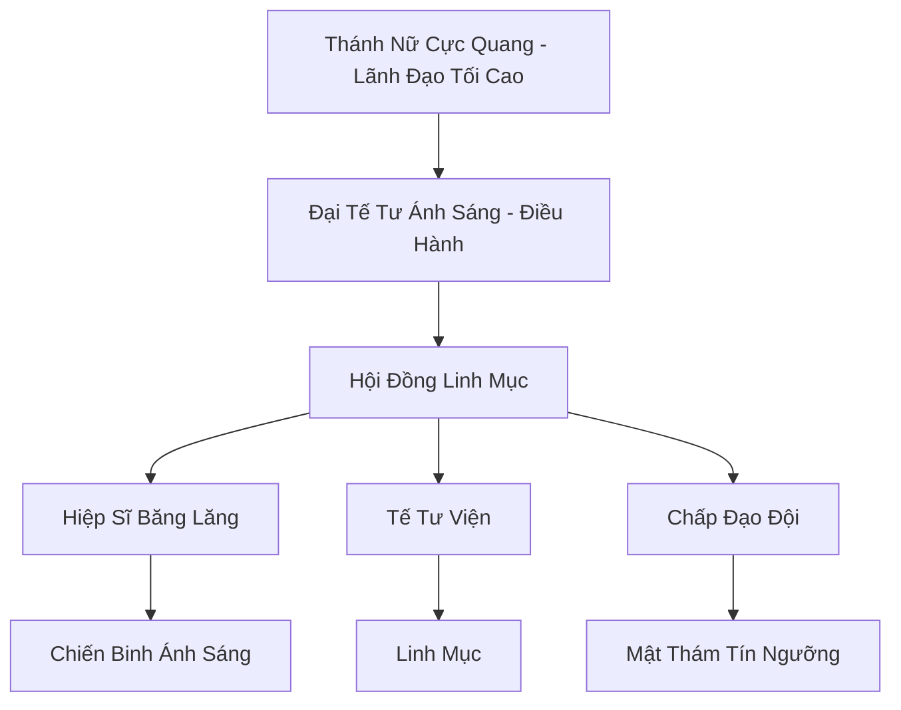

# CỰC QUANG THẦN ĐIỆN (极光神殿)

## I. Tổng Quan (总览)
Cực Quang Thần Điện là thế lực tôn giáo cuồng tín nhất vùng Bắc Băng, ngự trị tại vĩ độ cao nhất nơi ánh sáng cực quang rực rỡ nhất thế giới. Họ tin rằng cực quang là ý chí của một vị thần ánh sáng cổ đại và nhiệm vụ của họ là thanh lọc thế gian bằng ánh sáng lạnh giá. Với sự kết hợp giữa kỹ thuật quang tu và băng hệ công pháp, thần điện là một đối trọng đáng sợ đối với Huyền Băng Cung, thường xuyên sử dụng các biện pháp cực đoan để bành trướng tầm ảnh hưởng.

## II. Địa Lý & Tài Nguyên (地理 với tài nguyên)
Trụ sở chính nằm tại Thung lũng Ánh Sáng Vĩnh Cửu, một khu vực quanh năm được chiếu sáng bởi hiện tượng cực quang ma thuật. Thần điện kiểm soát những mỏ "Quang Linh Thạch" chỉ hình thành dưới sự tác động lâu dài của ánh sáng cực cao và nhiệt độ cực thấp. Nơi đây sở hữu môi trường linh khí quang hệ tinh thuần nhất, giúp tu sĩ đột phá thần thức nhanh chóng nhưng cũng dễ dẫn đến tâm tính lạnh lùng, vô cảm.

## III. Văn Hóa & Tín Ngưỡng (文化 với信仰)
Tôn thờ Thánh Nữ Cực Quang như hiện thân sống của thần linh. Cư dân tin rằng cảm xúc là rào cản đối với sự giác ngộ ánh sáng. Văn hóa thần điện mang đậm tính kỷ luật thép và sự phục tùng tuyệt đối. Nghi lễ quan trọng nhất là "Tế Tự Ánh Sáng", nơi các tín đồ hiến tế linh lực và máu băng để duy trì độ rực rỡ của Cực Quang Bảo Tháp.

## IV. Cơ Cấu Tổ Chức (组织结构)


## V. Công Pháp & Trận Pháp (功法 với阵法)
- **Công Pháp:** *Cực Quang Xuyên Tâm Quyết* (Tấn công xuyên thấu), *Đại Băng Chú* (Phong ấn diện rộng).
- **Trận Pháp:** *Quang Ảnh Vô Hình Trận* - trận pháp sử dụng sự khúc xạ ánh sáng trên các tinh thể băng khổng lồ để che giấu hoàn toàn thần điện hoặc tạo ra hàng vạn phân thân ảo ảnh của quân đội, khiến kẻ thù không thể phân biệt thật giả.

## VI. Đặc Sản Môn Phái (门派特产)
- **Quang Băng Châm:** Loại ám khí tỏa ra ánh sáng chói lòa khiến mục tiêu bị mù tạm thời và đóng băng linh mạch ngay khi chạm vào.
- **Thần Lực Linh Phù:** Linh phù chứa đựng năng lượng cực quang, dùng để tăng cường uy lực cho các chiêu thức quang hệ.

## VII. Cơ Sở Hạ Tầng (基础设施)
- **Cực Quang Bảo Tháp:** Tòa tháp pha lê cao vút, trung tâm thu phát và khuếch đại năng lượng cực quang.
- **Quảng Trường Thanh Tẩy:** Nơi thực hiện các cuộc hành hình và thanh lọc những kẻ bị coi là dị giáo.

## VIII. Kinh Tế (経済)
Kinh tế dựa trên hệ thống thuế tín ngưỡng bắt buộc đối với các bộ lạc dưới quyền bảo hộ. Thần điện cũng nắm giữ thị trường linh thạch quang hệ cao cấp và các loại vật phẩm tâm linh. Họ thường xuyên tổ chức các cuộc viễn chinh "thánh chiến" để chiếm đoạt tài nguyên từ các vùng đất lân cận.

## IX. Lịch Sử Tóm Tắt (简史)
Sáng lập bởi Đại Tế Tư Ánh Sáng đầu tiên, người đã tuyên bố nhận được thiên mệnh từ bầu trời Bắc Băng sau khi một trận đại dịch quét qua vùng cực. Thần điện đã nhanh chóng trở thành một thế lực chính trị mạnh mẽ, cạnh tranh quyết liệt với Huyền Băng Cung để giành quyền lãnh đạo tinh thần của toàn bộ Băng Tộc.

## X. Giai Thoại & Bí Mật (轶 sự với bí mật)
Tương truyền Thánh Nữ Cực Quang không bao giờ già đi và cơ thể nàng thực chất được cấu tạo từ ánh sáng tinh thuần, không có máu thịt như con người bình thường.

## XI. Quan Hệ Thế Lực (势力关系)
```mermaid
graph LR
    CQTĐ[Cực Quang Thần Điện] -- Tử địch -- HBC[Huyền Băng Cung]
    CQTĐ -- Đối địch -- SMU[Sương Ma Uyển]
    CQTĐ -- Thao túng -- BLBL[Băng Lang Bộ Lạc]
    CQTĐ -- Cảnh giác -- TAM[Thái Ất Môn]
```
