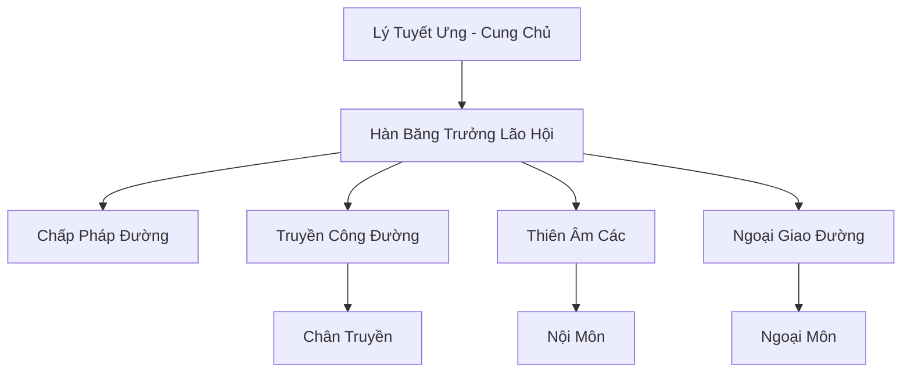

# HUYỀN BĂNG CUNG (玄冰宫)

## I. Tổng Quan (总览)
Huyền Băng Cung là đại tông môn chính đạo duy nhất thống trị vùng Bắc Băng lạnh giá. Nổi tiếng với phong thái thanh khiết, lánh đời và nghệ thuật kết hợp giữa âm nhạc (cầm thuật) với hàn khí cực hạn. Tông môn đóng vai trò là người gác cổng của phương Bắc, bảo vệ lục địa khỏi sự xâm lấn của yêu tộc và ma tu băng hệ tà ác.

## II. Địa Lý & Tài Nguyên (地理 với tài nguyên)
Trụ sở tọa lạc trên đỉnh Tuyết Sơn ngàn năm không tan, nơi linh khí thủy hệ biến dị thành hàn khí đậm đặc nhất thế giới. Cung sở hữu "Hàn Băng Cấm Địa" chứa đựng các mạch Hàn Ngọc Tủy vô giá và là nơi duy nhất trồng được Tuyết Liên Hoa ngàn năm - loại linh thảo có khả năng cải tử hoàn sinh và tịnh hóa tâm hồn.

## III. Văn Hóa & Tín Ngưỡng (文化 với信仰)
Tôn thờ sự tĩnh lặng và triết lý "Tâm Như Băng Thanh". Đệ tử Huyền Băng Cung phải tu luyện tâm tính để đạt đến trạng thái không lay chuyển trước mọi dục vọng thế gian. Văn hóa tông môn mang đậm tính nghệ thuật cầm kỳ thi họa, coi tiếng đàn là phương tiện để giao tiếp với thiên địa linh khí. Tình cảm nam nữ bị hạn chế khắt khe để giữ cho đạo tâm thuần khiết.

## IV. Cơ Cấu Tổ Chức (组织结构)


## V. Công Pháp & Trận Pháp (功法 với阵法)
- **Công Pháp:** *Băng Tâm Quyết* (Tâm pháp ổn định linh lực), *Thiên Âm Băng Phách* (Công kích âm thanh kết hợp hàn khí).
- **Trận Pháp:** *Cửu Thiên Hàn Băng Trận* - trận pháp hộ sơn cấp 9, có khả năng đóng băng toàn bộ không gian và thời gian trong phạm vi vạn dặm khi được kích hoạt hoàn toàn.

## VI. Đặc Sản Môn Phái (门派特产)
- **Hàn Băng Cầm:** Loại đàn cầm được chế tác từ băng vĩnh cửu và dây tơ tằm băng, giúp tăng cường uy lực âm công.
- **Tuyết Liên Đan:** Đan dược tịnh hóa tâm ma và hồi phục linh lực thủy hệ cấp tốc.

## VII. Cơ Sở Hạ Tầng (基础设施)
- **Băng Huyền Điện:** Đại điện trung tâm được chạm khắc hoàn toàn từ một khối băng khổng lồ.
- **Tuyệt Băng Uyên:** Vực sâu dùng làm nơi bế quan khổ tu cho những vị đại năng.

## VIII. Kinh Tế (経済)
Kinh tế phát triển nhờ việc cung cấp các loại linh thảo hàn băng quý hiếm cho các tông môn luyện đan trên toàn lục địa. Họ cũng nắm giữ thị trường ngọc tủy băng và cung cấp dịch vụ ổn định đạo tâm cho những tu sĩ bị tẩu hỏa nhập ma do hỏa công hoặc ma khí.

## IX. Lịch Sử Tóm Tắt (简史)
Sáng lập vào năm 90.000 (Kỷ Nguyên Khởi Nguyên) bởi Lý Tuyết Ưng, một nữ cường giả muốn tìm kiếm sự yên bình và bảo vệ đồng tộc phương Bắc. Tông môn đã khẳng định vị thế sau trận "Đại Chiến Tuyết Yêu", thống nhất các bộ lạc Bắc Băng dưới một ngọn cờ chính đạo duy nhất.

## X. Giai Thoại & Bí Mật (轶 sự với bí mật)
Tương truyền dưới lòng đất Huyền Băng Cung phong ấn một thực thể mang tên "Thái Cổ Hỏa Ma", và hàn khí vạn năm của tông môn chính là phong ấn để giữ cho thực thể này không tỉnh giấc tàn phá thế giới.

## XI. Quan Hệ Thế Lực (势力关系)
```mermaid
graph LR
    HBC[Huyền Băng Cung] -- Đối tác -- ĐHC[Đan Hà Cốc]
    HBC -- Tử địch -- SMU[Sương Ma Uyển]
    HBC -- Thù địch -- TYT[Yêu Tộc Bắc Băng]
    HBC -- Tôn trọng -- CHKT[Cửu Hoa Kiếm Tông]
```
