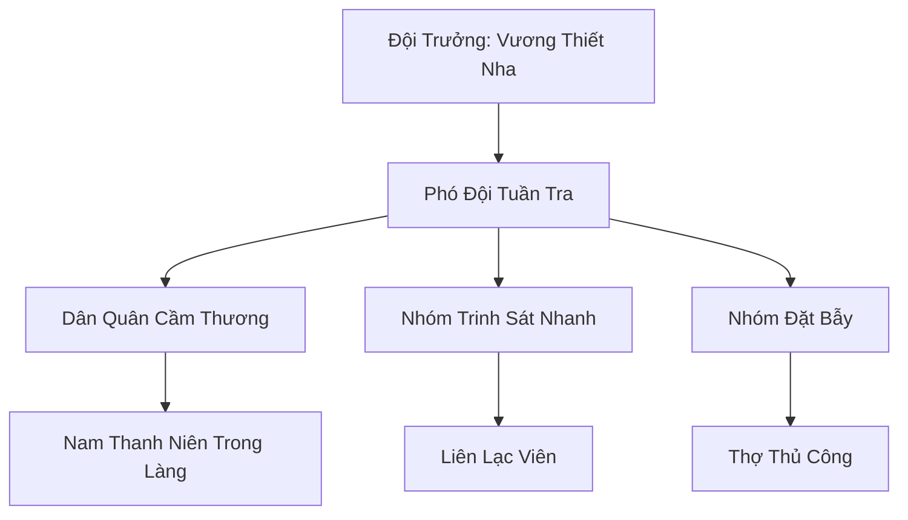

# HÀN DÂN HỘ VỆ ĐỘI (寒民护卫队)

## I. Tổng Quan (总览)
Hàn Dân Hộ Vệ Đội là lực lượng dân quân tự phát của những người phàm nhân và tu sĩ cấp thấp sinh sống tại chân núi Tuyết Sơn. Trong một môi trường nơi các đại tông môn chỉ quan tâm đến phi thăng và linh mạch, những con người này đã phải tự đứng lên để bảo vệ gia đình và xóm làng khỏi sự tàn sát của yêu thú và tuyết tặc. Với trang bị thô sơ nhưng lòng dũng cảm phi thường, họ là biểu tượng của ý chí sinh tồn mãnh liệt của nhân loại giữa băng giá.

## II. Địa Lý & Tài Nguyên (地理 với tài nguyên)
Hoạt động dọc theo sườn núi thấp của Tuyết Sơn, nơi 7 ngôi làng phàm nhân bám víu vào các khe đá và suối nước nóng nhỏ để tồn tại. Tài nguyên của đội cực kỳ thiếu thốn, chủ yếu là sắt vụn rèn thành giáo mác, da thú làm giáp và các loại dược thảo dân gian có tác dụng cầm máu nhanh. Họ phải chắt chiu từng viên linh thạch nhặt được để duy trì các lò lửa linh lực sưởi ấm cộng đồng.

## III. Văn Hóa & Tín Ngưỡng (文化 với信仰)
Đề cao triết lý: "Tông môn không bảo vệ dân, dân tự bảo vệ mình". Thành viên hộ vệ đội coi trọng lòng trung thành và sự hy sinh vì hàng xóm láng giềng. Văn hóa của họ mang đậm tính gắn kết cộng đồng, thể hiện qua nghi lễ "Thề Dưới Tuyết" trước mỗi buổi tuần tra ban đêm. Họ không tin vào sự cứu rỗi của thần thánh mà tin vào sức mạnh của bầy đàn và những cái bẫy chông được bố trí kỹ lưỡng.

## IV. Cơ Cấu Tổ Chức (组织结构)


## V. Công Pháp & Trận Pháp (功法 với阵法)
- **Công Pháp:** *Thiết Nha Thương Pháp* - bộ thương pháp thực dụng gồm 3 chiêu đâm đơn giản nhưng cực kỳ hiệu quả để đối phó với yêu thú lao tới. Các bài tập *Khí Huyết Cường Hóa* cơ bản dành cho phàm nhân.
- **Trận Pháp:** Sử dụng hệ thống bẫy cơ giới kết hợp với phù lục báo động (mua lại từ tán tu), tạo thành một mạng lưới "Thiên La Địa Võng" trên tuyết để làm chậm và tiêu diệt kẻ thù có số lượng đông hơn.

## VI. Đặc Sản Môn Phái (门派特产)
- **Rượu Thiết Nha:** Loại rượu mạnh nấu từ hạt linh cốc biến dị, giúp cơ thể sinh nhiệt tức thì để chống chọi với bão tuyết.
- **Giáo Sắt Phù Văn:** Những cây giáo bình thường được Vương Thiết Nha lén khắc một vài đường phù văn sơ cấp để tăng khả năng xuyên thấu vảy yêu thú.

## VII. Cơ Sở Hạ Tầng (基础设施)
- **Chòi Canh Tuyết:** Các tháp canh gỗ cao điểm rải rác quanh làng.
- **Hầm Trú Ẩn Cộng Đồng:** Các hang đá tự nhiên được gia cố để phụ nữ và trẻ em trú ẩn khi có biến lớn.

## VIII. Kinh Tế (経済)
Nền kinh tế hoàn toàn dựa vào sự đóng góp tự nguyện của các gia đình trong làng bằng lương thực và vật dụng. Đội cũng có nguồn thu nhỏ từ việc hộ tống các đoàn buôn lữ hành lẻ tẻ qua chân núi và việc bán các loại da thú săn được cho thương hội phương Bắc.

## IX. Lịch Sử Tóm Tắt (简史)
Thành lập cách đây 50 năm sau thảm họa "Tuyết Dạ Tàn Sát", nơi một ngôi làng bị xóa sổ mà không có bất kỳ sự hỗ trợ nào từ Huyền Băng Cung. Vương Thiết Nha, khi đó là một binh sĩ trẻ, đã tập hợp những người sống sót và thề sẽ xây dựng một lực lượng có thể tự quyết định vận mệnh của chính mình.

## X. Giai Thoại & Bí Mật (轶 sự với bí mật)
Tương truyền Vương Thiết Nha sở hữu một cuốn sách tu luyện cổ nát bướm nhặt được trong rừng, thực chất là tàn bản của một công pháp luyện thể cấp cao, nhưng ông chỉ dạy những phần cơ bản nhất vì sợ đệ tử bị tẩu hỏa nhập ma do linh căn yếu.

## XI. Quan Hệ Thế Lực (势力关系)
```mermaid
graph LR
    HDHVĐ[Hàn Dân Hộ Vệ Đội] -- Hợp tác -- BNTTH[Băng Nguyên Tán Tu Hội]
    HDHVĐ -- Oán hận -- HBC[Huyền Băng Cung]
    HDHVĐ -- Đối địch -- TT[Tuyết Tặc]
    HDHVĐ -- Bảo vệ -- LTCB[Làng Thôn Chân Bắc]
```
