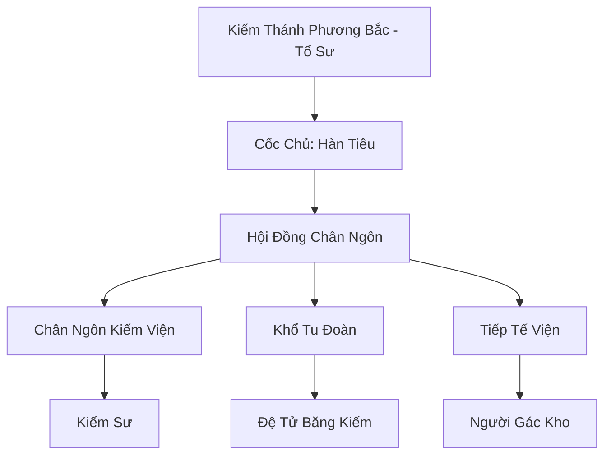

# HÀN KIẾM CỐC (寒剑谷)

## I. Tổng Quan (总览)
Hàn Kiếm Cốc là thánh địa của những kiếm tu khổ hạnh nhất lục địa, tọa lạc tại hẻm núi có khí hậu khắc nghiệt nhất Bắc Băng. Thay vì tìm kiếm sự giàu sang hay quyền lực, các tu sĩ tại đây dành cả đời mình để rèn luyện một nhát kiếm duy nhất có thể chẻ đôi bão tuyết. Họ nổi tiếng với tâm tính kiên cường, ý chí bất khuất và một cuộc sống tối giản đến mức cực đoan, coi thanh kiếm là vật dụng duy nhất cần thiết trên đời.

## II. Địa Lý & Tài Nguyên (地理 với tài nguyên)
Trụ sở chính nằm trong một hẻm núi hẹp đón trực diện các luồng bão tuyết gay gắt từ vùng lõi Bắc Băng. Nơi đây sở hữu "Vạn Niên Băng Kiếm Trì" - một hồ nước đóng băng vĩnh cửu có khả năng tôi luyện kiếm tâm và nhục thân đến mức kinh người. Tài nguyên duy nhất của họ chính là các loại linh thạch thủy hệ biến dị (Băng tinh) hình thành từ kiếm khí tích tụ lâu ngày.

## III. Văn Hóa & Tín Ngưỡng (文化 với信仰)
Tôn thờ Kiếm Thánh Phương Bắc và triết lý "Nhất Kiếm Vô Niệm". Đệ tử Hàn Kiếm Cốc không mặc gấm vóc, không ăn linh dược quý hiếm, chỉ ôm kiếm ngồi thiền giữa bão tuyết. Văn hóa của cốc đề cao sự im lặng và sự chuyên nhất. Một kiếm tu thực thụ tại đây được cho là người có thể khiến bão tuyết xung quanh mình phải ngừng rơi chỉ bằng một ánh mắt.

## IV. Cơ Cấu Tổ Chức (组织结构)


## V. Công Pháp & Trận Pháp (功法 với阵法)
- **Công Pháp:** *Phá Tuyết Nhất Kiếm* (Tấn công bùng nổ), *Hàn Sương Vô Niệm Quyết* (Kiếm ý đóng băng không gian).
- **Trận Pháp:** *Hàn Sương Kiếm Giới Trận* - trận pháp bao phủ toàn cốc, biến mọi hạt tuyết rơi xuống thành một lưỡi kiếm khí sắc bén, tạo ra một vùng tử địa cho những kẻ mang sát ý.

## VI. Đặc Sản Môn Phái (门派特产)
- **Băng Kiếm Phôi:** Thanh phôi kiếm đã được ngâm trong Kiếm Trì vạn năm, là nguyên liệu tốt nhất để đúc linh binh băng hệ.
- **Tuyết Phách Linh Đan:** Đan dược cực lạnh giúp tu sĩ lôi hệ hoặc hỏa hệ cân bằng lại linh lực khi bị bạo tẩu.

## VII. Cơ Sở Hạ Tầng (基础设施)
- **Kiếm Đài Phong Nhãn:** Sân tập luyện nằm đúng vị trí trung tâm của các luồng bão tuyết.
- **Thạch Thất Khổ Tu:** Các hang đá đơn sơ dành cho đệ tử bế quan vạn năm.

## VIII. Kinh Tế (経済)
Nghèo túng nhất trong các đại tông môn. Nguồn thu chủ yếu đến từ việc trao đổi các băng tinh hiếm thu thập được cho Cửu Hoa Kiếm Tông để lấy lương thực và vật dụng sinh hoạt tối thiểu. Họ không mặn mà với việc tích lũy linh thạch hay báu vật.

## IX. Lịch Sử Tóm Tắt (简史)
Sáng lập bởi Kiếm Thánh Phương Bắc, một vị đại năng từng thất bại trong việc phi thăng và quyết định rút về vùng đất lạnh lẽo nhất để rèn luyện lại kiếm tâm. Ông đã dùng một nhát kiếm duy nhất để tạo ra hẻm núi này, mở đường cho những kiếm tu có ý chí sắt đá tìm đến tu luyện.

## X. Giai Thoại & Bí Mật (轶 sự với bí mật)
Tương truyền trong lòng Vạn Niên Băng Kiếm Trì có cất giấu "Trái Tim Của Tuyết", thứ chứa đựng kiếm ý tối cao của tổ sư, và ai chạm vào được nó sẽ có khả năng đóng băng cả thời gian.

## XI. Quan Hệ Thế Lực (势力关系)
```mermaid
graph LR
    HKC[Hàn Kiếm Cốc] -- Tôn trọng -- CHKT[Cửu Hoa Kiếm Tông]
    HKC -- Đồng minh -- HBC[Huyền Băng Cung]
    HKC -- Tử địch -- SMU[Sương Ma Uyển]
    HKC -- Trợ giúp -- BLBL[Băng Lang Bộ Lạc]
```
