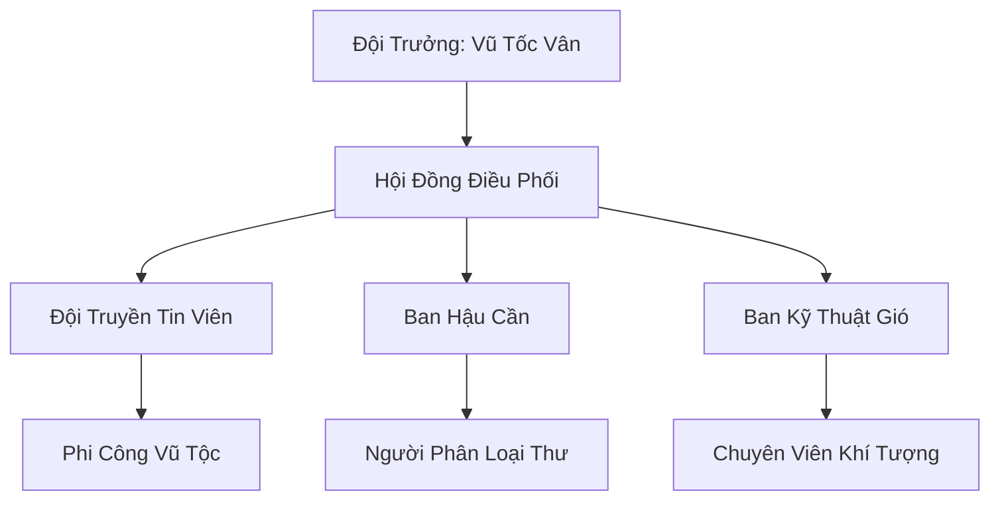

# HÀN PHONG TRUYỀN TIN ĐỘI (寒风传信队)

## I. Tổng Quan (总览)
Hàn Phong Truyền Tin Đội là đơn vị vận chuyển đường không duy nhất phục vụ các thế lực nhỏ và tán tu tại vùng Bắc Băng. Được vận hành bởi những cá thể Vũ Tộc không đủ tiêu chuẩn gia nhập Vũ Hoàng Các — người thì sải cánh quá ngắn, kẻ thì huyết mạch không đủ thuần — đội đã chứng minh rằng tốc độ và sự liều lĩnh có thể chiến thắng cả những trận đại bão tuyết tàn khốc nhất. Với tôn chỉ *"Thư phải đến nơi, dù bão hay chết"*, họ đã xây dựng được uy tín lớn trong giới lữ hành phương Bắc. Vũ Tốc Vân thường cười nói: *"Vũ Hoàng Các chê ta nhỏ con, nhưng chim sẻ bay trong bão thì đại bàng cũng phải nể."* Mười hai thành viên nhỏ bé ấy mang trên vai trọng trách kết nối toàn bộ phương Bắc từ trên không.

## II. Địa Lý & Tài Nguyên (地理 với tài nguyên)
Trụ sở đặt tại "Trạm Vọng Gió" — một vách đá cao phía đông gần Hàn Kiếm Cốc, nơi có các luồng gió "Đông Phong Thăng" mạnh vĩnh cửu giúp việc cất cánh trở nên dễ dàng ngay cả khi mang theo bưu kiện nặng. Đội không nắm giữ linh mạch nhưng sở hữu kiến thức độc quyền về "Hành Lang Gió" — bảy con đường mòn không trung an toàn ẩn giữa các tầng mây bão mà chỉ Vũ Tộc có giác quan phong hệ nhạy bén mới có thể cảm nhận được. Mỗi Hành Lang Gió được đặt tên riêng: "Bạch Vân Đạo", "Hàn Lưu Tuyến", "Phong Tức Cung"... và bản đồ của chúng là bí mật thương mại quan trọng nhất của đội.

## III. Văn Hóa & Tín Ngưỡng (文化 với信仰)
Đề cao danh dự nghề nghiệp và sự trung thực tuyệt đối. Thành viên đội coi mỗi bức thư là một "Phong Ước" — lời hứa linh hồn với gió — và phá vỡ Phong Ước là điều không thể tha thứ. Văn hóa của họ mang đậm tính thực dụng và sự chuẩn bị kỹ lưỡng: trước mỗi chuyến bay nguy hiểm, mỗi truyền tin viên đều để lại "Di Phong Thư" — bức thư trối trăng — cho đồng đội trong một hộp gỗ khắc tên tại Trạm Vọng Gió. Họ không tôn thờ thần thánh mà tôn trọng sự biến hóa khôn lường của mây gió, coi gió phương Bắc vừa là đồng minh vừa là kẻ thù. Mỗi tối sau khi trở về an toàn, cả đội sẽ uống một chén "Phong Ẩm Tửu" — rượu nóng pha mật ong tuyết — và kể lại hành trình trong ngày, coi đó là nghi thức "Quy Phong" biểu thị sự sống sót.

## IV. Cơ Cấu Tổ Chức (组织结构)


## V. Công Pháp & Trận Pháp (功法 với阵法)
- **Công Pháp:** *Phong Hành Quyết* (Tăng tốc độ và sự linh hoạt khi bay, cho phép truyền tin viên đạt tốc độ gấp ba lần bay bình thường trong thời gian ngắn — nhưng tiêu hao linh lực rất lớn), *Hàn Khí Ngự Thể* (Giữ ấm cơ thể bằng cách dẫn linh lực chạy qua kinh mạch cánh trong lúc bay ở độ cao lớn nơi nhiệt độ xuống dưới mức đóng băng máu). Hai bài công pháp này do Vũ Tốc Vân tự mày mò phát triển từ các mảnh kiến thức thu thập được qua nhiều năm.
- **Trận Pháp:** Sử dụng "Tụ Gió Trận" sơ cấp tại điểm cất cánh — năm viên "Phong Thạch" xếp hình ngôi sao trên rìa vách đá — để tạo lực đẩy ban đầu cho các thành viên khi mang theo bưu kiện nặng. Khi kích hoạt, trận pháp tạo ra một cột gió xoáy nhỏ đẩy truyền tin viên lên cao ba mươi trượng trong chớp mắt, tiết kiệm đáng kể linh lực cho hành trình dài.

## VI. Đặc Sản Môn Phái (门派特产)
- **Hàn Phong Bản Đồ "Phong Đạo Đồ":** Loại bản đồ da thú ghi lại các luồng gió và điểm dừng chân không trung an toàn theo mùa, cập nhật mỗi quý. Phiên bản đầy đủ chỉ bán cho đối tác tin cậy với giá hai trăm linh thạch hạ phẩm, phiên bản rút gọn bán rộng rãi với giá hai mươi linh thạch.
- **Lông Vũ Truyền Tin "Quy Sào Vũ":** Lông vũ được yểm bùa có khả năng tự động tìm đường về Trạm Vọng Gió nếu người đưa thư gặp nạn — lông sẽ phát sáng đỏ và bay về trạm, thông báo cho đồng đội biết vị trí cuối cùng của người mất tích.
- **Phong Ẩm Tửu:** Loại rượu nóng đặc sản của đội, pha từ mật ong tuyết sơn và thảo dược kháng hàn, giúp hồi phục thể lực nhanh chóng sau chuyến bay dài. Không bán ra ngoài, nhưng khách quen đôi khi được mời nếm thử.

## VII. Cơ Sở Hạ Tầng (基础设施)
- **Trạm Vọng Gió "Phong Sào":** Tháp canh gỗ Hàn Tùng trên vách đá với hệ thống đèn linh lực "Hồi Quang Đăng" báo hiệu hạ cánh — ba ngọn đèn xanh nghĩa là an toàn, đỏ nghĩa là nguy hiểm, tắt hết nghĩa là trạm bị tấn công. Bên trong tháp có phòng phân loại thư, kho bưu kiện, và phòng nghỉ cho tám truyền tin viên.
- **Hầm Trú Bão "Phong Tị Động":** Khu vực hang đá sâu trong vách đá dành cho thành viên nghỉ ngơi khi có đại bão cấp mười trở lên, trang bị đủ lương thực cho hai tuần và một lò sưởi linh lực nhỏ. Trên vách hầm khắc đầy tên của các truyền tin viên đã hy sinh trong bão — danh sách "Phong Liệt" — lời nhắc nhở về cái giá của nghề nghiệp.

## VIII. Kinh Tế (経済)
Nguồn thu nhập chính từ phí dịch vụ chuyển phát nhanh đường không, chia ba mức: "Thường Bay" (bảy ngày), "Tốc Bay" (ba ngày), và "Tử Phong" (một ngày, giá gấp hai mươi lần, chỉ nhận trong thời tiết tốt). Họ cũng thu lợi từ việc bán dữ liệu khí tượng "Phong Đạo Đồ" cho Bắc Phong Thông Tín Trạm và các thương đoàn — mỗi quý một bản cập nhật, mang lại nguồn thu ổn định. Kinh tế của đội tuy nhỏ nhưng ổn định, đủ để duy trì các trang thiết bị bảo hộ đắt tiền — đặc biệt là "Hàn Phong Hộ Giáp" cho mỗi truyền tin viên, giá một trăm linh thạch hạ phẩm mỗi bộ và cần thay mới mỗi năm.

## IX. Lịch Sử Tóm Tắt (简史)
Sáng lập bởi Vũ Tốc Vân, một nữ Vũ Tộc nhỏ con nhưng có ý chí sắt đá. Sau khi bị Vũ Hoàng Các từ chối vì sải cánh không đủ rộng — thiếu đúng hai thốn so với tiêu chuẩn — cô đã rời bỏ bầu trời phương Nam và tìm đến Bắc Băng. Tại đây, cô nhận ra rằng trong khi các đại tông phái có hệ thống truyền tin riêng, hàng trăm thế lực nhỏ và tán tu hoàn toàn bị cô lập về thông tin. Từ một nhóm ba người bay thuê, đội đã phát triển thành mạng lưới mười hai truyền tin viên tin cậy, với tỷ lệ giao thư thành công chín mươi bảy phần trăm — con số ấn tượng trong điều kiện thời tiết khắc nghiệt nhất Cố Nguyên Giới.

## X. Giai Thoại & Bí Mật (轶 sự với bí mật)
Tương truyền Vũ Tốc Vân đang nắm giữ một bức mật thư của Cực Quang Thần Điện bị rơi trong bão ba năm trước — bức thư bọc trong ống trúc mang ấn tín của hai vị trưởng lão, nội dung bên trong chứa đựng kế hoạch "Bạch Quang Thanh Tẩy" — một âm mưu chấn động nhằm thanh trừng các thế lực nhỏ không phục tùng thần điện. Vũ Tốc Vân đã giấu bức thư trong một khe đá bí mật gần Trạm Vọng Gió mà chỉ mình cô biết, coi đó là "bảo hiểm nhân thọ" cho toàn đội. Cô hiểu rằng nếu tiết lộ nội dung, cô sẽ bị Cực Quang Thần Điện truy sát — nhưng nếu giữ im lặng, bức thư sẽ là lá bùa hộ mệnh mạnh nhất phương Bắc.

## XI. Quan Hệ Thế Lực (势力关系)
```mermaid
graph LR
    HPTTĐ[Hàn Phong Truyền Tin Đội] -- Liên minh -- BPTTT[Bắc Phong Thông Tín Trạm]
    HPTTĐ -- Khách hàng -- HKC[Hàn Kiếm Cốc]
    HPTTĐ -- Cảnh giác -- CQTĐ[Cực Quang Thần Điện]
    HPTTĐ -- Tránh né -- VHC[Vũ Hoàng Các]
```
