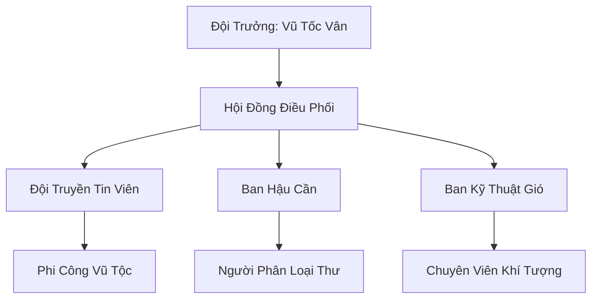

# HÀN PHONG TRUYỀN TIN ĐỘI (寒风传信队)

## I. Tổng Quan (总览)
Hàn Phong Truyền Tin Đội là đơn vị vận chuyển đường không duy nhất phục vụ các thế lực nhỏ và tán tu tại vùng Bắc Băng. Được vận hành bởi những cá thể Vũ Tộc không đủ tiêu chuẩn gia nhập Vũ Hoàng Các, đội đã chứng minh rằng tốc độ và sự liều lĩnh có thể chiến thắng cả những trận đại bão tuyết tàn khốc nhất. Với tôn chỉ "Thư phải đến nơi, dù bão hay chết", họ đã xây dựng được uy tín lớn trong giới lữ hành phương Bắc.

## II. Địa Lý & Tài Nguyên (地理 với tài nguyên)
Trụ sở đặt tại một vách đá cao phía đông gần Hàn Kiếm Cốc, nơi có các luồng gió mạnh vĩnh cửu giúp việc cất cánh trở nên dễ dàng. Đội không nắm giữ linh mạch nhưng sở hữu kiến thức độc quyền về "Hành lang gió" - những con đường mòn không trung an toàn ẩn giữa các tầng mây bão mà chỉ Vũ Tộc mới có thể cảm nhận được.

## III. Văn Hóa & Tín Ngưỡng (文化 với信仰)
Đề cao danh dự nghề nghiệp và sự trung thực tuyệt đối. Thành viên đội coi mỗi bức thư là một lời hứa linh hồn. Văn hóa của họ mang đậm tính thực dụng và sự chuẩn bị kỹ lưỡng: trước mỗi chuyến bay nguy hiểm, mỗi truyền tin viên đều để lại di thư cho đồng đội. Họ không tôn thờ thần thánh mà tôn trọng sự biến hóa khôn lường của mây gió.

## IV. Cơ Cấu Tổ Chức (组织结构)


## V. Công Pháp & Trận Pháp (功法 với阵法)
- **Công Pháp:** *Phong Hành Quyết* (Tăng tốc độ và sự linh hoạt khi bay), *Hàn Khí Ngự Thể* (Giữ ấm cơ thể trong lúc bay cao).
- **Trận Pháp:** Sử dụng "Trận Pháp Tụ Gió" sơ cấp tại điểm cất cánh để tạo lực đẩy ban đầu cho các thành viên khi mang theo bưu kiện nặng.

## VI. Đặc Sản Môn Phái (门派特产)
- **Hàn Phong Bản Đồ:** Loại bản đồ da thú ghi lại các luồng gió và điểm dừng chân không trung an toàn theo mùa.
- **Lông Vũ Truyền Tin:** Lông vũ được yểm bùa có khả năng tự động tìm đường về trạm nếu người đưa thư gặp nạn.

## VII. Cơ Sở Hạ Tầng (基础设施)
- **Trạm Vọng Gió:** Tháp canh gỗ trên vách đá với hệ thống đèn linh lực báo hiệu hạ cánh.
- **Hầm Trú Bão:** Khu vực sâu trong vách đá dành cho thành viên nghỉ ngơi khi có đại bão cấp 10.

## VIII. Kinh Tế (経済)
Nguồn thu nhập chính từ phí dịch vụ chuyển phát nhanh đường không. Họ cũng thu lợi từ việc bán dữ liệu khí tượng cho Bắc Phong Thông Tín Trạm và các thương đoàn. Kinh tế của đội tuy nhỏ nhưng ổn định, đủ để duy trì các trang thiết bị bảo hộ đắt tiền.

## IX. Lịch Sử Tóm Tắt (简史)
Sáng lập bởi Vũ Tốc Vân, một nữ Vũ Tộc nhỏ con nhưng có ý chí sắt đá. Sau khi bị Vũ Hoàng Các từ chối vì sải cánh không đủ rộng, cô đã tìm đến Bắc Băng và nhận ra tiềm năng của hệ thống bưu chính không trung tại đây. Từ một nhóm 3 người, đội đã phát triển thành một mạng lưới liên lạc đáng tin cậy hỗ trợ đắc lực cho đời sống tu chân phương Bắc.

## X. Giai Thoại & Bí Mật (轶 sự với bí mật)
Tương truyền Vũ Tốc Vân đang nắm giữ một bức mật thư của Cực Quang Thần Điện bị rơi trong bão, nội dung bên trong chứa đựng một âm mưu chấn động có thể làm sụp đổ sự cân bằng giữa các đại tông môn Bắc Băng.

## XI. Quan Hệ Thế Lực (势力关系)
```mermaid
graph LR
    HPTTĐ[Hàn Phong Truyền Tin Đội] -- Liên minh -- BPTTT[Bắc Phong Thông Tín Trạm]
    HPTTĐ -- Khách hàng -- HKC[Hàn Kiếm Cốc]
    HPTTĐ -- Cảnh giác -- CQTĐ[Cực Quang Thần Điện]
    HPTTĐ -- Tránh né -- VHC[Vũ Hoàng Các]
```
