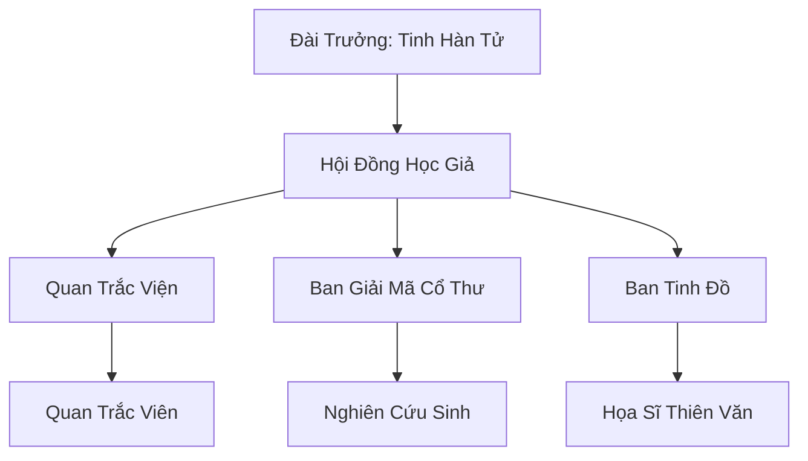

# HÀN TINH QUAN TRẮC ĐÀI (寒星观测台)

## I. Tổng Quan (总览)
Hàn Tinh Quan Trắc Đài là một cơ sở nghiên cứu thiên văn nhỏ bé nằm cô độc trên một đồi đá trơ trọi tại vùng Bắc Băng. Dưới sự dẫn dắt của lão tu Tinh Hàn Tử, đài đóng vai trò là "người giải mã bầu trời", chuyên theo dõi sự chuyển động của các vì sao và hiện tượng cực quang để dự đoán các biến động của thiên địa linh khí. Dù không có thế lực quân sự, những ghi chép chính xác của đài trong suốt 60 năm qua đã trở thành kho dữ liệu vô giá cho bất kỳ ai muốn thấu hiểu vận mệnh của Cố Nguyên Giới. Tinh Hàn Tử thường nói với các đệ tử: *"Sao trời không nói dối — chúng kể câu chuyện của vạn vật trước khi vạn vật biết chuyện gì sắp xảy ra."* Mười lăm người trên đồi đá này nắm trong tay nhiều bí mật hơn cả một số đại tông phái mà không ai hay biết.

## II. Địa Lý & Tài Nguyên (地理 với tài nguyên)
Trụ sở tọa lạc trên "Hàn Tinh Đồi" — một đồi đá cao điểm tách biệt khỏi dãy Tuyết Sơn, có bầu trời quanh năm quang đãng nhất khu vực nhờ một hiện tượng khí tượng đặc biệt: các luồng gió xoáy ngược đẩy mây tuyết tách ra hai bên, tạo ra một "Thiên Nhãn" vĩnh cửu phía trên đồi. Tài nguyên quý giá nhất là bộ "Kinh Tinh Tượng Cổ" — ba mươi sáu cuộn da thú ghi chép vị trí tinh tú từ thời đại trước bị thất lạc, được Tinh Hàn Tử tìm thấy trong phế tích nền đài — và kho dữ liệu thiên văn "Lục Thập Niên Tinh Lục" tích lũy qua sáu mươi năm quan sát liên tục không gián đoạn. Đài cũng sở hữu loại "Tinh Quang Mực" đặc biệt chế từ bột linh thạch pha Hàn Quang Linh Phấn để vẽ các bản "Tinh Đồ Sống" — bản đồ sao có khả năng tự cập nhật vị trí theo thời gian thực.

## III. Văn Hóa & Tín Ngưỡng (文化 với信仰)
Đề cao triết lý: *"Sao trời không nói dối — kẻ ghi sai là tội nhân của thiên đạo."* Thành viên đài coi sự trung thực trong ghi chép là đức hạnh tối cao, và bất kỳ ai bị phát hiện giả mạo dữ liệu sẽ bị trục xuất vĩnh viễn. Văn hóa tại đây mang đậm tính học thuật, yên bình và kiên nhẫn — cuộc sống quay quanh việc quan sát, ghi chép, và tranh luận. Họ có tập tục "Thức Tinh Dạ" — thức trắng đêm khi có nhật thực, nguyệt thực hoặc cực quang bất thường, coi đó là những thời khắc "Thiên Đạo mở lời" mà không được phép bỏ lỡ. Mỗi lần phát hiện một hiện tượng thiên văn mới, cả đài sẽ tổ chức "Tinh Trà Hội" — uống trà nóng và thảo luận ý nghĩa của phát hiện bên lò sưởi, đôi khi kéo dài suốt mấy ngày đêm.

## IV. Cơ Cấu Tổ Chức (组织结构)


## V. Công Pháp & Trận Pháp (功法 với阵法)
- **Công Pháp:** *Tinh Quang Hấp Thụ Thuật* — bài tập cơ bản giúp tu sĩ thanh lọc thần thức bằng ánh sáng sao, dù tốc độ thăng tiến tu vi cực chậm. Tuy nhiên, ai kiên trì luyện tập suốt đời sẽ đạt được thần thức trong sáng phi thường — Tinh Hàn Tử luyện sáu mươi năm và giờ có thể cảm nhận biến động thiên tượng chính xác hơn bất kỳ pháp bảo quan sát nào.
- **Trận Pháp:** Không có trận pháp chiến đấu, chỉ sử dụng các kết giới "Tinh Hộ Giới" nhỏ để bảo vệ các thiết bị quan sát khỏi sự ăn mòn của hơi lạnh và cát bụi tuyết. Ngoài ra, "Thiên Nhãn Trận" — trận pháp tận dụng hiện tượng gió xoáy tự nhiên trên đồi — giúp tăng cường độ trong suốt của bầu trời phía trên đài, cho phép quan sát ngay cả trong điều kiện mây mù nhẹ.

## VI. Đặc Sản Môn Phái (门派特产)
- **Hàn Tinh Đồ "Tinh Đồ Sống":** Các bản đồ thiên văn chính xác có khả năng tự cập nhật, được vẽ bằng Tinh Quang Mực trên da thú đặc biệt. Thường được các đại tông môn mua về để dự đoán thời điểm thích hợp cho việc đột phá cảnh giới — giá một bản từ năm trăm đến hai ngàn linh thạch hạ phẩm tùy độ chi tiết.
- **Linh Thạch Tụ Quang "Tinh Thạch":** Loại đá dùng để lưu trữ ánh sáng sao trong suốt đêm dài, có tác dụng ổn định đạo tâm và xua tan tâm ma cho tu sĩ khi bế quan. Mỗi viên cần phơi dưới sao trời ba tháng mới đủ năng lượng, giá mười linh thạch hạ phẩm mỗi viên.
- **Cực Quang Dự Báo Thư:** Bản tin hàng tháng phân tích hiện tượng cực quang và dự đoán các biến động linh khí lớn, được gửi đến các khách hàng đăng ký qua Bắc Phong Thông Tín Trạm.

## VII. Cơ Sở Hạ Tầng (基础设施)
- **Thiên Văn Đài Cổ "Vọng Tinh Đài":** Công trình bằng đá xám với hệ thống thấu kính "Thâm Hải Pha Lê" khổng lồ — ba tấm kính lớn bằng bàn ăn lắp trên khung gỗ xoay được, cho phép phóng đại hình ảnh tinh tú gấp trăm lần. Đây là di tích duy nhất còn sót lại từ phế tích ban đầu, và Tinh Hàn Tử tin rằng nó được xây bởi một nền văn minh cổ đại tiên tiến hơn nhiều so với hiện tại.
- **Tàng Thư Các Tinh Tượng "Tinh Thư Lầu":** Nơi lưu giữ hàng vạn cuộn giấy ghi chép dữ liệu qua sáu mươi năm, được phân loại theo năm, tháng và loại hiện tượng. Tầng hầm chứa bộ "Kinh Tinh Tượng Cổ" gốc, bọc trong vải chống ẩm và khóa bằng ba lớp phù ấn.

## VIII. Kinh Tế (経済)
Nguồn thu nhập khiêm tốn từ việc cung cấp bản tin dự báo thời tiết cho các làng phàm nhân và thương đoàn qua đường — mỗi bản tin giá năm linh thạch hạ phẩm, phát hành hàng tuần qua Bắc Phong Thông Tín Trạm. Đôi khi họ nhận được các khoản tài trợ nhỏ từ Thái Ất Môn để thực hiện các nghiên cứu thiên văn chuyên sâu — khoản lớn nhất gần đây là một ngàn linh thạch hạ phẩm cho dự án "Cực Quang Chu Kỳ" kéo dài ba năm. "Tinh Đồ Sống" là mặt hàng đắt nhất nhưng bán rất chậm — mỗi năm chỉ vài bản. Cuộc sống của các thành viên rất thanh đạm, chủ yếu dành cho niềm đam mê nghiên cứu — Tinh Hàn Tử thường đùa rằng *"tri thức là linh thạch, và ta giàu nhất Bắc Băng"*.

## IX. Lịch Sử Tóm Tắt (简史)
Sáng lập 60 năm trước bởi Tinh Hàn Tử sau khi ông bị Cực Quang Thần Điện từ chối thu nạp vì "linh căn quá kém, không xứng đáng". Không từ bỏ ước mơ giải mã bầu trời, ông đã tự mình xây dựng đài quan sát này từ đống đổ nát của một phế tích cổ trên Hàn Tinh Đồi — phát hiện ra rằng phế tích chính là tàn tích của một đài thiên văn từ thời đại trước. Qua thời gian, sự kiên trì và những phát hiện chính xác đáng kinh ngạc của ông đã cảm hóa được một số học trò — bắt đầu từ hai giáo sư bỏ tông phái đến theo, rồi dần dần có thêm sinh viên — tạo nên một cộng đồng học thuật nhỏ bé nhưng đáng kính giữa lòng Bắc Băng.

## X. Giai Thoại & Bí Mật (轶 sự với bí mật)
Tương truyền Tinh Hàn Tử đã quan sát thấy một ngôi sao mới xuất hiện ở phương Bắc mà không có trong bất kỳ cổ thư nào — ông đặt tên nó là "U Tinh" — và tin rằng đó là điềm báo cho sự tái sinh của một thực thể thượng cổ đang đến gần. U Tinh chỉ xuất hiện vào những đêm cực quang mạnh nhất, nhấp nháy theo nhịp hoàn toàn đồng bộ với ánh sáng của Băng Tinh Khuẩn Tộc dưới lòng đất — mối liên hệ mà Tinh Hàn Tử ghi trong nhật ký mật là "Thiên Địa Đồng Mạch". Ngoài ra, trong bộ "Kinh Tinh Tượng Cổ", ông đã tìm thấy một trang bị xé mất — và dựa trên các dấu vết còn lại, ông tin rằng trang đó chứa đựng bản đồ tinh tú chỉ dẫn đến vị trí phong ấn chính của ma tộc thượng cổ, bị ai đó cố tình hủy diệt để che giấu sự thật.

## XI. Quan Hệ Thế Lực (势力关系)
```mermaid
graph LR
    HTQTCĐ[Hàn Tinh Quan Trắc Đài] -- Cung cấp tin -- BPTTT[Bắc Phong Thông Tín Trạm]
    HTQTCĐ -- Phớt lờ -- CQTĐ[Cực Quang Thần Điện]
    HTQTCĐ -- Hợp tác ngầm -- ĐBTĐ[Đại Bàng Tuyết Đàn]
    HTQTCĐ -- Trao đổi -- TAM[Thái Ất Môn]
```
