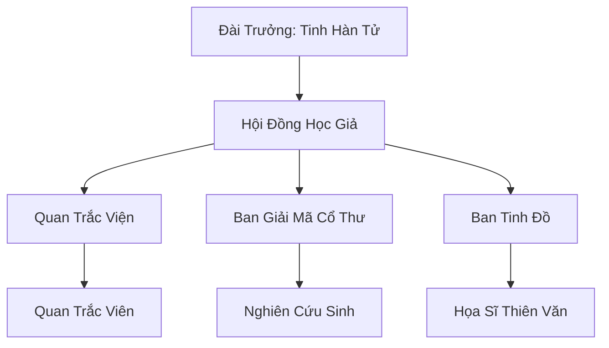

# HÀN TINH QUAN TRẮC ĐÀI (寒星观测台)

## I. Tổng Quan (总览)
Hàn Tinh Quan Trắc Đài là một cơ sở nghiên cứu thiên văn nhỏ bé nằm cô độc trên một đồi đá trơ trọi tại vùng Bắc Băng. Dưới sự dẫn dắt của lão tu Tinh Hàn Tử, đài đóng vai trò là "người giải mã bầu trời", chuyên theo dõi sự chuyển động của các vì sao và hiện tượng cực quang để dự đoán các biến động của thiên địa linh khí. Dù không có thế lực quân sự, những ghi chép chính xác của đài trong suốt 60 năm qua đã trở thành kho dữ liệu vô giá cho bất kỳ ai muốn thấu hiểu vận mệnh của Cố Nguyên Giới.

## II. Địa Lý & Tài Nguyên (地理 với tài nguyên)
Trụ sở tọa lạc trên một đồi đá cao điểm có bầu trời quanh năm quang đãng nhất khu vực, giúp việc quan sát tinh tú không bị cản trở bởi mây mù. Tài nguyên quý giá nhất là bộ "Kinh Tinh Tượng Cổ" - những ghi chép từ thời đại trước bị thất lạc và kho dữ liệu thiên văn tích lũy qua nhiều thập kỷ. Đài cũng sở hữu loại mực đặc biệt chế từ bột linh thạch để vẽ các bản tinh đồ có khả năng tự thay đổi theo thực tế.

## III. Văn Hóa & Tín Ngưỡng (文化 với信仰)
Đề cao triết lý: "Sao trời không nói dối". Thành viên đài coi sự trung thực trong ghi chép là đức hạnh tối cao. Văn hóa tại đây mang đậm tính học thuật, yên bình và kiên nhẫn. Họ có tập tục thức trắng đêm khi có nhật thực hoặc cực quang bất thường, coi đó là những thời khắc "Thiên Đạo mở lời". Họ tôn trọng quy luật tự nhiên và tin rằng mọi sự hưng vong trên mặt đất đều đã được định sẵn trên bầu trời.

## IV. Cơ Cấu Tổ Chức (组织结构)


## V. Công Pháp & Trận Pháp (功法 với阵法)
- **Công Pháp:** *Tinh Quang Hấp Thụ Thuật* - bài tập cơ bản giúp tu sĩ thanh lọc thần thức bằng ánh sáng sao, dù tốc độ thăng tiến tu vi cực chậm.
- **Trận Pháp:** Không có trận pháp chiến đấu, chỉ sử dụng các kết giới nhỏ để bảo vệ các thiết bị quan sát khỏi sự ăn mòn của hơi lạnh.

## VI. Đặc Sản Môn Phái (门派特产)
- **Hàn Tinh Đồ:** Các bản đồ thiên văn chính xác, thường được các đại tông môn mua về để dự đoán thời điểm thích hợp cho việc đột phá cảnh giới.
- **Linh Thạch Tụ Quang:** Loại đá dùng để lưu trữ ánh sáng sao, có tác dụng ổn định đạo tâm cho tu sĩ khi bế quan.

## VII. Cơ Sở Hạ Tầng (基础设施)
- **Thiên Văn Đài Cổ:** Công trình bằng đá với hệ thống thấu kính pha lê biển sâu khổng lồ.
- **Tàng Thư Các Tinh Tượng:** Nơi lưu giữ hàng vạn cuộn giấy ghi chép dữ liệu qua nhiều đời.

## VIII. Kinh Tế (経済)
Nguồn thu nhập khiêm tốn từ việc cung cấp bản tin dự báo thời tiết cho các làng phàm nhân và thương đoàn qua đường. Đôi khi họ nhận được các khoản tài trợ nhỏ từ Thái Ất Môn để thực hiện các nghiên cứu thiên văn chuyên sâu. Cuộc sống của các thành viên rất thanh đạm, chủ yếu dành cho niềm đam mê nghiên cứu.

## IX. Lịch Sử Tóm Tắt (简史)
Sáng lập 60 năm trước bởi Tinh Hàn Tử sau khi ông bị Cực Quang Thần Điện từ chối thu nạp. Không từ bỏ ước mơ, ông đã tự mình xây dựng đài quan sát này từ đống đổ nát của một phế tích cổ. Qua thời gian, sự kiên trì của ông đã cảm hóa được một số học trò, tạo nên một cộng đồng học thuật nhỏ bé nhưng đáng kính giữa lòng Bắc Băng.

## X. Giai Thoại & Bí Mật (轶 sự với bí mật)
Tương truyền Tinh Hàn Tử đã quan sát thấy một ngôi sao mới xuất hiện ở phương Bắc mà không có trong bất kỳ cổ thư nào, và ông tin rằng đó là điềm báo cho sự tái sinh của một thực thể thượng cổ đang đến gần.

## XI. Quan Hệ Thế Lực (势力关系)
```mermaid
graph LR
    HTQTCĐ[Hàn Tinh Quan Trắc Đài] -- Cung cấp tin -- BPTTT[Bắc Phong Thông Tín Trạm]
    HTQTCĐ -- Phớt lờ -- CQTĐ[Cực Quang Thần Điện]
    HTQTCĐ -- Hợp tác ngầm -- ĐBTĐ[Đại Bàng Tuyết Đàn]
    HTQTCĐ -- Trao đổi -- TAM[Thái Ất Môn]
```
