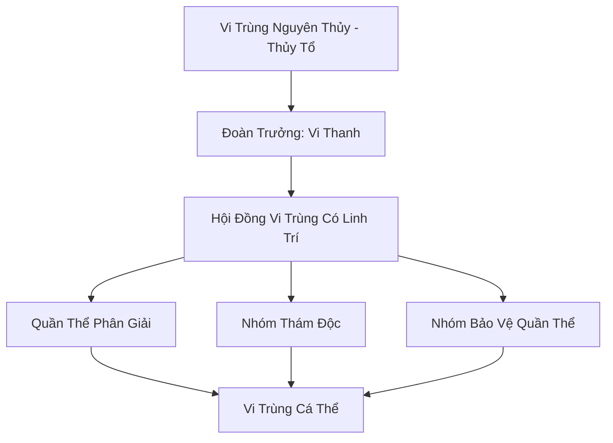

# HÀN ĐỘC VI TRÙNG ĐOÀN (寒毒微虫团)

## I. Tổng Quan (总览)
Hàn Độc Vi Trùng Đoàn là một chủng tộc Vi Tộc chuyên biệt hóa cao, đóng vai trò là "hệ thống miễn dịch" của vùng biển và bình nguyên Bắc Băng. Tồn tại dưới dạng hàng ngàn cá thể trùng nhỏ li ti có khả năng hấp thụ và phân giải các loại hàn độc tàn dư từ thời chiến trường thượng cổ, đoàn đóng vai trò âm thầm nhưng cực kỳ quan trọng trong việc duy trì sự sống cho các chủng tộc khác. Dù mang trong mình độc tố, bản tính của chúng là tịnh hóa thay vì tàn phá.

## II. Địa Lý & Tài Nguyên (地理 với tài nguyên)
Hoạt động tại bất kỳ khu vực nào bị nhiễm hàn độc nặng nề trên vùng tundra hoặc các khe nứt sông băng. Tài nguyên chính của đoàn là "Hàn Độc Linh Dịch" - sản phẩm phụ của quá trình phân giải độc tố, có giá trị cực cao trong việc luyện chế các loại thuốc giải cấp cao. Họ nắm giữ khả năng phát hiện các nguồn ô nhiễm linh lực từ khoảng cách hàng trăm dặm.

## III. Văn Hóa & Tín Ngưỡng (文化 với信仰)
Đề cao triết lý: "Ăn độc trả lành". Mỗi cá thể vi trùng coi việc phân giải độc tố là sứ mệnh duy nhất của đời mình. Họ không có văn hóa xã hội phức tạp, giao tiếp thông qua sự thay đổi màu sắc của cơ thể trong suốt. Tín ngưỡng duy nhất là sự sùng bái đối với "Vi Trùng Nguyên Thủy" - thực thể được cho là khởi nguồn của giống loài.

## IV. Cơ Cấu Tổ Chức (组织结构)


## V. Công Pháp & Trận Pháp (功法 với阵法)
- **Công Pháp:** Không có công pháp tu luyện nhân tạo, tiến hóa thông qua *Hàn Độc Thôn Phệ Thuật* - bản năng chuyển hóa độc tố thành linh lực thủy hệ tinh khiết.
- **Trận Pháp:** *Hàn Độc Tử Địa Trận* - khi toàn đoàn tập hợp và cùng lúc giải phóng lượng độc tố đã tích lũy, họ có thể tạo ra một vùng không gian cực độc có khả năng ăn mòn cả thần thức và nhục thân của những kẻ tấn công.

## VI. Đặc Sản Môn Phái (门派特产)
- **Hàn Độc Tinh Hoa:** Linh dịch cô đặc dùng để chế tác các loại ám khí độc hệ cực mạnh hoặc làm chất xúc tác cho luyện đan.
- **Vi Trùng Phấn:** Bào tử của vi trùng có tác dụng tịnh hóa các vùng đất bị nhiễm ma khí nhẹ.

## VII. Cơ Sở Hạ Tầng (基础设施)
- **Kén Trú Đông:** Các cấu trúc sinh học tạm thời dùng để bảo vệ quần thể trong những đợt bão tuyết quá mức.
- **Bể Chứa Độc:** Các hốc đá tự nhiên được yểm bùa để lưu trữ lượng độc tố chưa kịp phân giải.

## VIII. Kinh Tế (経済)
Kinh tế mang tính cộng sinh thụ động. Giá trị họ mang lại là sự thanh lọc môi trường cho toàn vùng Bắc Băng. Tuy nhiên, họ có mối quan hệ thương mại đặc biệt với Tuyết Liên Dược Phường, trao đổi linh dịch lấy các loại khoáng chất cần thiết cho sự tiến hóa của quần thể.

## IX. Lịch Sử Tóm Tắt (简史)
Xuất hiện từ kỷ nguyên Thái Cổ, Hàn Độc Vi Trùng đã cứu giúp hàng vạn làng phàm nhân và tu sĩ yếu khỏi cái chết do nhiễm độc từ các di tích cổ bị rò rỉ. Vi Thanh là cá thể hiếm hoi phát triển được ý thức cao và đã đứng ra tổ chức bầy trùng thành một "Đoàn" có hệ thống để bảo vệ giống loài trước sự săn lùng của tu sĩ tà đạo.

## X. Giai Thoại & Bí Mật (轶 sự với bí mật)
Tương truyền Vi Thanh đang cố gắng tiến hóa để có thể phân giải được cả "Ma Độc" - loại độc tố mang theo ý chí của ma tộc, một kỳ tích có thể thay đổi hoàn toàn cuộc chiến chống lại sự suy yếu của phong ấn Bắc Băng.

## XI. Quan Hệ Thế Lực (势力关系)
```mermaid
graph LR
    HĐVTD[Hàn Độc Vi Trùng Đoàn] -- Hợp tác -- TLDV[Tuyết Liên Dược Phường]
    HĐVTD -- Bị săn lùng -- MT Tà Đạo[Tu Sĩ Tà Đạo]
    HĐVTD -- Thanh lọc -- ALL[Hệ sinh thái Bắc Băng]
    HĐVTD -- Tránh né -- SMU[Sương Ma Uyển]
```
