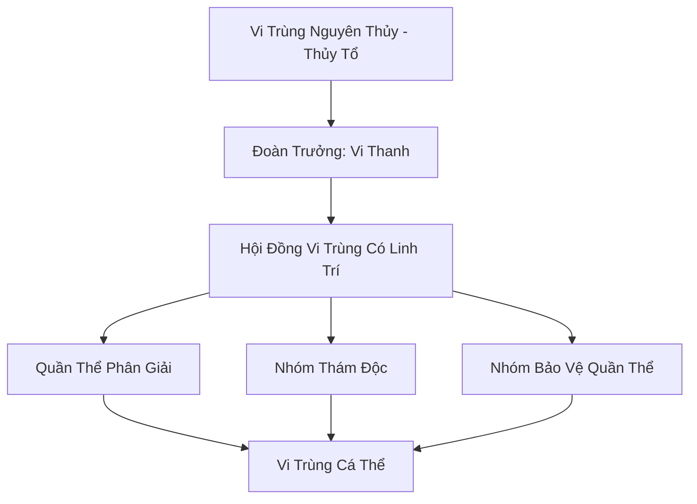

# HÀN ĐỘC VI TRÙNG ĐOÀN (寒毒微虫团)

## I. Tổng Quan (总览)
Hàn Độc Vi Trùng Đoàn là một chủng tộc Vi Tộc chuyên biệt hóa cao, đóng vai trò là "hệ thống miễn dịch" của vùng biển và bình nguyên Bắc Băng. Tồn tại dưới dạng hàng ngàn cá thể trùng nhỏ li ti có khả năng hấp thụ và phân giải các loại hàn độc tàn dư từ thời chiến trường thượng cổ, đoàn đóng vai trò âm thầm nhưng cực kỳ quan trọng trong việc duy trì sự sống cho các chủng tộc khác. Dù mang trong mình độc tố, bản tính của chúng là tịnh hóa thay vì tàn phá — như Tuyết Liên Dược Phường ghi trong dược điển: *"Vi trùng hàn độc ăn độc nhả lành, là thầy thuốc vô danh của đại địa."* Hiện tại, quần thể đang bận rộn hơn bao giờ hết do hàn độc gia tăng bất thường trên toàn vùng Bắc Băng — dấu hiệu mà Vi Thanh coi là điềm xấu.

## II. Địa Lý & Tài Nguyên (地理 với tài nguyên)
Hoạt động tại bất kỳ khu vực nào bị nhiễm hàn độc nặng nề trên vùng tundra hoặc các khe nứt sông băng — đặc biệt tập trung quanh "Độc Tuyền Thung" (thung lũng suối độc) và "Hàn Sương Trạch" (đầm sương lạnh), hai ổ hàn độc lớn nhất Bắc Băng. Tài nguyên chính của đoàn là "Hàn Độc Linh Dịch" — sản phẩm phụ của quá trình phân giải độc tố, có giá trị cực cao trong việc luyện chế các loại thuốc giải cấp cao, đặc biệt là "Bách Độc Giải" của Tuyết Liên Dược Phường. Họ nắm giữ khả năng phát hiện các nguồn ô nhiễm linh lực từ khoảng cách hàng trăm dặm thông qua "Độc Cảm" — giác quan thứ sáu đặc thù của giống loài mà không sinh vật nào khác sở hữu.
Khu vực xung quanh ẩn chứa nhiều bí mật chưa được khám phá — hang động chưa ai đến, mạch khoáng chưa ai biết, dấu tích cổ đại mà thời gian chưa kịp xóa nhòa.

## III. Văn Hóa & Tín Ngưỡng (文化 với信仰)
Đề cao triết lý: *"Ăn độc trả lành, thân mang vạn độc mà tâm vô hại."* Mỗi cá thể vi trùng coi việc phân giải độc tố là sứ mệnh duy nhất của đời mình — không phải vì nghĩa vụ, mà vì bản năng. Họ không có văn hóa xã hội phức tạp, giao tiếp thông qua sự thay đổi màu sắc của cơ thể trong suốt — từ xanh nhạt (bình thường) sang tím đậm (phát hiện độc) rồi vàng kim (đang phân giải) — tạo thành một ngôn ngữ thị giác đơn giản gọi là "Độc Sắc Ngữ". Tín ngưỡng duy nhất là sự sùng bái đối với "Vi Trùng Nguyên Thủy" — thực thể được cho là khởi nguồn của giống loài, đã tự hy sinh để phân giải nguồn hàn độc khổng lồ nhất thời Thái Cổ. Nghi thức "Tế Nguyên" diễn ra mỗi mùa xuân, khi toàn đoàn đồng loạt phát sáng vàng kim trong một khoảnh khắc để tưởng nhớ thủy tổ.
Mỗi thế hệ mới được truyền dạy không chỉ kỹ năng sinh tồn mà cả câu chuyện về nguồn cội, để ngọn lửa ký ức không bao giờ tắt dù hoàn cảnh khắc nghiệt đến đâu.

## IV. Cơ Cấu Tổ Chức (组织结构)


## V. Công Pháp & Trận Pháp (功法 với阵法)
- **Công Pháp:** Không có công pháp tu luyện nhân tạo, tiến hóa thông qua *Hàn Độc Thôn Phệ Thuật* — bản năng chuyển hóa độc tố thành linh lực thủy hệ tinh khiết. Mỗi lần phân giải một loại hàn độc mới, cá thể vi trùng sẽ "tiến hóa" thêm một bậc, phát triển khả năng kháng độc mới — Vi Thanh đã phân giải hơn một ngàn loại hàn độc khác nhau trong đời, giúp nó đạt đến thần thức tương đương Trúc Cơ, điều chưa từng có tiền lệ trong Vi Tộc.
- **Trận Pháp:** *Hàn Độc Tử Địa Trận* - khi toàn đoàn tập hợp và cùng lúc giải phóng lượng độc tố đã tích lũy, họ có thể tạo ra một vùng không gian cực độc mang tên "Vạn Độc Vực" có khả năng ăn mòn cả thần thức và nhục thân của những kẻ tấn công. Đây là vũ khí phòng thủ cuối cùng của đoàn, chỉ được sử dụng khi đối mặt với nguy cơ diệt chủng — vì sau khi kích hoạt, toàn đoàn sẽ kiệt sức và cần hàng thập kỷ để hồi phục.

## VI. Đặc Sản Môn Phái (门派特产)
- **Hàn Độc Tinh Hoa "Độc Tủy":** Linh dịch cô đặc dùng để chế tác các loại ám khí độc hệ cực mạnh hoặc làm chất xúc tác cho luyện đan, đặc biệt là "Hàn Độc Đan" — viên đan dược có khả năng giúp tu sĩ kháng lại hàn độc trong vòng bảy ngày. Tuyết Liên Dược Phường thu mua với giá năm mươi linh thạch trung phẩm mỗi bình.
- **Vi Trùng Phấn "Tịnh Độc Phấn":** Bào tử khô của vi trùng có tác dụng tịnh hóa các vùng đất bị nhiễm hàn độc nhẹ, khi rải lên sẽ nở thành quần thể vi trùng mới trong vòng một tháng. Được bán cho các bộ lạc và thợ mỏ để thanh lọc khu khai thác.
- **Giải Độc Ngọc Lộ:** Giọt sương trong suốt tiết ra khi vi trùng hoàn thành quá trình phân giải một loại hàn độc hiếm, có tác dụng giải trừ hàn độc trong kinh mạch tu sĩ — được gọi là "thuốc tiên" của Bắc Băng.
Ngoài ra, Hàn Độc Vi Trùng Đoàn còn sở hữu vật phẩm có giá trị văn hóa hơn vật chất — thứ mà thương nhân bỏ qua nhưng nhà sử học trả bất cứ giá nào.

## VII. Cơ Sở Hạ Tầng (基础设施)
- **Kén Trú Đông "Độc Kén":** Các cấu trúc sinh học tạm thời dùng để bảo vệ quần thể trong những đợt bão tuyết quá mức, hình dáng giống những quả trứng trong suốt bám trên vách đá. Mỗi kén chứa được khoảng năm trăm cá thể vi trùng, phát sáng nhẹ màu tím nhạt khi bão ập đến.
- **Bể Chứa Độc "Vạn Độc Trì":** Các hốc đá tự nhiên tại "Độc Tuyền Thung" được yểm bùa để lưu trữ lượng độc tố chưa kịp phân giải — tổng cộng bảy bể, mỗi bể chứa một loại hàn độc khác nhau. Đây cũng là khu vực nguy hiểm nhất Bắc Băng đối với tu sĩ bình thường — hơi độc bốc lên có thể phá hủy kinh mạch trong vài hơi thở.
Toàn bộ hạ tầng mang dấu ấn đặc trưng cộng đồng — không phải xa hoa mà là thực dụng đúc kết qua nhiều thế hệ thử nghiệm.

## VIII. Kinh Tế (経済)
Kinh tế mang tính cộng sinh thụ động. Giá trị họ mang lại là sự thanh lọc môi trường cho toàn vùng Bắc Băng — nếu không có vi trùng hàn độc, hàng chục ngôi làng và trại tu luyện sẽ bị hàn độc tàn dư từ chiến trường cổ xâm nhập và trở thành vùng đất chết. Họ có mối quan hệ thương mại đặc biệt với Tuyết Liên Dược Phường thông qua "Khế Ước Hàn Thanh" — mỗi mùa, dược phường cung cấp các loại khoáng chất cần thiết cho sự tiến hóa của quần thể (đặc biệt là "Ngọc Thủy Tinh"), đổi lại nhận về Hàn Độc Linh Dịch và Giải Độc Ngọc Lộ. Ngoài ra, Vi Trùng Phấn được bán cho các thợ mỏ với giá phải chăng, tạo ra một dòng thu nhập phụ ổn định.
Tiềm năng kinh tế vượt xa những gì đang được khai thác — sự thiếu hụt nhân lực, kiến thức thương mại, và bảo hộ chính trị khiến phần lớn giá trị vẫn nằm yên.

## IX. Lịch Sử Tóm Tắt (简史)
Xuất hiện từ kỷ nguyên Thái Cổ, Hàn Độc Vi Trùng đã cứu giúp hàng vạn làng phàm nhân và tu sĩ yếu khỏi cái chết do nhiễm độc từ các di tích cổ bị rò rỉ. Sự kiện quan trọng nhất trong lịch sử đoàn là "Đại Tịnh Hóa Hàn Sương Trạch" — khi quần thể mất hai trăm năm để thanh lọc hoàn toàn đầm sương độc lớn nhất Bắc Băng, biến nó từ vùng đất chết thành khu vực có thể canh tác dược thảo. Vi Thanh là cá thể hiếm hoi phát triển được ý thức cao — điều xảy ra sau khi nó vô tình phân giải một loại "Ma Độc" rò rỉ từ phong ấn Tuyết Sơn — và đã đứng ra tổ chức bầy trùng thành một "Đoàn" có hệ thống để bảo vệ giống loài trước sự săn lùng của tu sĩ tà đạo muốn dùng chúng làm nguyên liệu luyện Băng Thi.
Mỗi thế hệ kế tiếp gánh di sản và gánh nặng thế hệ trước — nhưng cũng mang khả năng mới mà cha ông chưa từng tưởng tượng.

## X. Giai Thoại & Bí Mật (轶 sự với bí mật)
Tương truyền Vi Thanh đang cố gắng tiến hóa để có thể phân giải được cả "Ma Độc" — loại độc tố mang theo ý chí của ma tộc, một kỳ tích có thể thay đổi hoàn toàn cuộc chiến chống lại sự suy yếu của phong ấn Bắc Băng. Vi Thanh đã từng nếm thử một giọt Ma Độc thuần túy và gần như bị phá hủy hoàn toàn thần thức — nhưng nó đã sống sót, và kể từ đó, một phần cơ thể nó đã chuyển sang màu đen bí ẩn mà chưa ai giải thích được. Ngoài ra, Tuyết Liên Dược Phường đang bí mật nghiên cứu khả năng "nuôi cấy" Vi Trùng Hàn Độc bên ngoài môi trường tự nhiên — nếu thành công, đây sẽ là cuộc cách mạng trong ngành đan dược phương Bắc, nhưng Vi Thanh phản đối kịch liệt vì coi đó là hành vi "nô dịch hóa đồng tộc".
Những bí mật này, nếu được tiết lộ, có thể khiến nhiều thế lực phải nhìn lại đánh giá của mình về cộng đồng nhỏ bé này — vừa là cơ hội vừa là mối nguy.

## XI. Quan Hệ Thế Lực (势力关系)
```mermaid
graph LR
    HĐVTD[Hàn Độc Vi Trùng Đoàn] -- Hợp tác -- TLDV[Tuyết Liên Dược Phường]
    HĐVTD -- Bị săn lùng -- MT Tà Đạo[Tu Sĩ Tà Đạo]
    HĐVTD -- Thanh lọc -- ALL[Hệ sinh thái Bắc Băng]
    HĐVTD -- Tránh né -- SMU[Sương Ma Uyển]
Nhìn tổng thể, mạng lưới quan hệ tuy mỏng manh nhưng đủ duy trì sự tồn tại — trong thế giới tu chân tàn khốc, tồn tại đã là chiến thắng.
```
