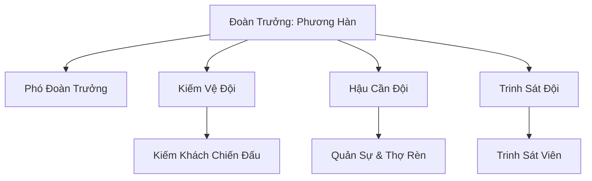
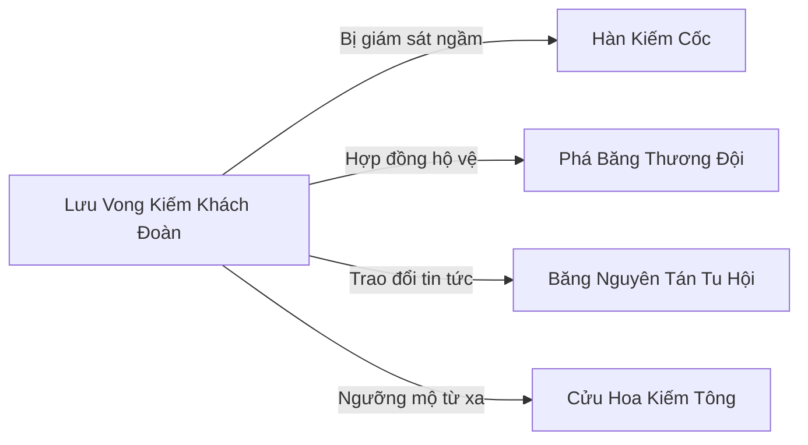

# Lưu Vong Kiếm Khách Đoàn (流亡剑客团)

## I. Tổng Quan (总览)
Lưu Vong Kiếm Khách Đoàn là một đoàn kiếm tu lưu vong tại Bắc Băng, được hình thành từ những cựu đệ tử bị trục xuất khỏi Hàn Kiếm Cốc vì phạm cốc quy. Dưới sự dẫn dắt của Đoàn Trưởng "Tàn Kiếm" Phương Hàn — một kiếm tu Kim Đan Sơ Kỳ từng là nội môn đệ tử xuất sắc — đoàn đã tập hợp khoảng ba mươi lăm kiếm khách lang bạt, sống bằng nghề hộ vệ thương đội và tiêu diệt yêu thú theo hợp đồng. Dù bị cắt đứt quan hệ với sư môn, mỗi thành viên đều mang trong lòng nỗi niềm khắc khoải về kiếm đạo dở dang. Triết lý "Kiếm gãy vẫn là kiếm" đã trở thành tôn chỉ không thành văn của đoàn — một lời nhắc nhở rằng dù thân phận lưu vong, ý chí cầu đạo không bao giờ bị bẻ gãy.

## II. Địa Lý & Tài Nguyên (地理 与 资源)
Trụ sở chính của đoàn nằm trong một hẻm núi nhỏ cách Hàn Kiếm Cốc khoảng trăm dặm về phía nam, nơi được gọi là Hẻm Tàn Kiếm. Khe núi hẹp, tuyết dày quanh năm, và gió kiếm ý tàn dư từ Hàn Kiếm Cốc vẫn lảng vảng trong không trung, khiến nơi đây nguy hiểm với người yếu nhưng lại trở thành môi trường tu luyện lý tưởng cho kiếm tu. Kiếm ý phân tán trong không khí giống như những mảnh vụn của một bài kiếm pháp chưa hoàn chỉnh, vô tình giúp các thành viên đoàn rèn giũa cảm ứng kiếm khí mỗi ngày.

Tài nguyên của đoàn vô cùng eo hẹp. Nguồn thu chính đến từ vài mỏ quặng sắt chịu lạnh ẩn sâu trong khe núi, cùng những thanh kiếm gãy nhặt nhạnh từ bãi tập cũ của Hàn Kiếm Cốc — nơi mà cốc môn đã bỏ đi từ lâu. Ngoài ra, đoàn còn duy trì một doanh trại lưu động dọc tuyến thương mại phía nam, phục vụ cho các hợp đồng hộ vệ.

## III. Văn Hóa & Tín Ngưỡng (文化 与 信仰)
Triết lý cốt lõi của Lưu Vong Kiếm Khách Đoàn gói gọn trong bốn chữ: "Kiếm gãy vẫn kiếm". Dù bị trục xuất, kiếm đạo không bao giờ bị bỏ. Mỗi thành viên khi gia nhập đều phải thề ba điều: không được dùng kiếm thuật Hàn Kiếm Cốc để hại người vô tội, không được quay lại cầu xin sư môn thu nhận, và không được phản bội đồng đoàn. Ba lời thề này không được viết trên giấy mà được khắc lên thanh kiếm tùy thân bằng chính kiếm khí của người thề.

Phong tục đặc trưng nhất là nghi thức "Nguyệt Hạ Vô Thanh Kiếm" — mỗi đêm trăng tròn, cả đoàn tụ tập trong hẻm núi, múa kiếm trong im lặng tuyệt đối. Không có tiếng hô chiêu thức, không có tiếng kiếm chạm nhau, chỉ có ánh trăng phản chiếu trên lưỡi kiếm và bóng người lướt đi như ma. Nghi thức này vừa là cách tưởng nhớ sư môn xưa, vừa là phương pháp rèn luyện kiếm ý vô thanh — một kỹ thuật mà chính Hàn Kiếm Cốc cũng không dạy cho ngoại môn đệ tử.

Bên cạnh đó, đoàn có truyền thống "Táng Kiếm" — khi một thành viên qua đời, thanh kiếm của người đó được cắm xuống tuyết tại bãi kiếm phía bắc hẻm núi, tạo nên một nghĩa địa kiếm âm u nhưng trang nghiêm.

## IV. Cơ Cấu Tổ Chức (组织结构)

Lưu Vong Kiếm Khách Đoàn tổ chức theo mô hình quân đoàn thu nhỏ, với Phương Hàn giữ quyền quyết định tối cao. Kiếm Vệ Đội là lực lượng nòng cốt gồm hai mươi kiếm khách từ Luyện Khí đến Trúc Cơ, chịu trách nhiệm nhận hợp đồng hộ vệ và xung trận. Hậu Cần Đội gồm chín người lo việc sửa chữa vũ khí, quản lý quặng sắt và chuẩn bị lương thảo. Trinh Sát Đội nhỏ nhất với sáu người, phụ trách dò đường, thu thập tin tức từ giới tán tu và cảnh giới an ninh cho doanh trại. Đáng chú ý, Trinh Sát Trưởng hiện tại thực chất là gián điệp do Hàn Kiếm Cốc cử đến giám sát — một sự thật mà Phương Hàn đã nghi ngờ nhưng chưa thể chứng minh.

Ngoài ba đội chính, đoàn còn tiếp nhận một số kiếm tu lang thang xin gia nhập để học kiếm pháp tàn khuyết, được xem như "Tân Nhân" và chưa chính thức thuộc đội nào.

## V. Công Pháp & Trận Pháp (功法 与 阵法)
- **Công Pháp:** Kiếm pháp của đoàn bắt nguồn từ kiếm thuật Hàn Kiếm Cốc, nhưng do bị cắt khỏi sư môn nên chỉ còn lại những chiêu thức bề ngoài, thiếu mất phần kiếm ý cốt lõi. Phương Hàn đã dành mười năm tự mày mò sáng tạo bộ *Tàn Kiếm Thất Thức* — bảy chiêu kiếm được phục dựng từ ký ức không trọn vẹn. Mỗi chiêu đều mang vẻ đẹp bi tráng của sự dở dang: chiêu thứ nhất mạnh nhưng thiếu biến hóa, chiêu thứ ba có biến hóa nhưng thiếu sức mạnh, chiêu thứ bảy gần như hoàn hảo nhưng người sử dụng sẽ bị phản thương kiếm khí. Tuy nhiên, chính sự khiếm khuyết này lại tạo nên một phong cách kiếm thuật độc đáo mà kẻ thù khó lường trước.
- **Bí Mật:** Phương Hàn lén giữ một bản sao không hoàn chỉnh của *Hàn Sương Vô Niệm Quyết* — tuyệt học trấn phái của Hàn Kiếm Cốc. Nếu sự thật này bại lộ, hắn sẽ bị truy sát đến chết.
- **Trận Pháp:** *Thất Tinh Kiếm Trận* — trận pháp do Phương Hàn thiết kế cho bảy kiếm khách mạnh nhất đoàn. Khi triển khai, bảy người đứng theo hình Bắc Đẩu, kiếm khí liên hoàn tạo thành một vùng phong tỏa. Trận pháp này không quá tinh diệu nhưng bù lại bằng sự phối hợp ăn ý của những người đã cùng nhau chiến đấu hàng chục năm.

## VI. Đặc Sản Môn Phái (门派特产)
- **Tàn Kiếm Phôi:** Những thanh kiếm gãy thu thập từ bãi tập cũ của Hàn Kiếm Cốc, dù đã hỏng nhưng vẫn tàng chứa kiếm ý tàn dư. Tu sĩ kiếm đạo mua về có thể cảm ngộ được một phần kiếm ý Hàn Cốc — đây là nguồn thu nhập phụ đáng kể vì nhiều kiếm tu tán tu sẵn sàng trả giá cao.
- **Hàn Thiết Quặng:** Quặng sắt chịu lạnh khai thác từ hẻm núi, có đặc tính hấp thụ hàn khí thiên nhiên, là nguyên liệu tốt cho việc đúc kiếm băng hệ. Chất lượng không bằng sản phẩm của Hàn Kiếm Cốc nhưng giá thành rẻ hơn nhiều, phù hợp cho kiếm tu trung và thấp cấp.
- **Dịch Vụ Hộ Vệ:** Tuy không phải "đặc sản" vật chất, nhưng danh tiếng hoàn thành hợp đồng hộ vệ không bao giờ thất bại của đoàn đã trở thành thương hiệu được giới thương đội Bắc Băng tin tưởng.

## VII. Cơ Sở Hạ Tầng (基础设施)
- **Tàn Kiếm Đường:** Tòa nhà chính của đoàn, thực chất chỉ là một hang động lớn trong hẻm núi được cải tạo thô sơ. Bên trong có phòng nghị sự, kho vũ khí và nơi nghỉ ngơi chung. Cửa hang được khắc hai câu đối: "Kiếm dù gãy, chí không gãy / Thân dù lưu vong, đạo không lưu vong".
- **Bãi Kiếm Nghĩa Địa:** Khu vực phía bắc hẻm núi, nơi cắm kiếm của những thành viên đã khuất. Hiện có mười bảy thanh kiếm đứng giữa tuyết, mỗi thanh đại diện cho một kiếm khách đã ngã xuống kể từ ngày lập đoàn.
- **Sân Tập Phong Kiếm:** Một bãi đất trống giữa hẻm núi nơi gió kiếm tàn dư mạnh nhất, được dùng làm sân tập luyện. Chỉ những kiếm tu từ Trúc Cơ trở lên mới dám luyện tại đây vì gió kiếm có thể cắt đứt da thịt.
- **Doanh Trại Lưu Động:** Hệ thống lều trại dễ tháo ráp, được bố trí dọc tuyến thương mại phía nam khi đoàn nhận hợp đồng hộ vệ. Mỗi lều đều được yểm bùa kháng hàn cơ bản do Băng Nguyên Tán Tu Hội cung cấp.

## VIII. Kinh Tế (经济)
Kinh tế của Lưu Vong Kiếm Khách Đoàn hoàn toàn dựa vào lao động và chiến đấu. Nguồn thu lớn nhất đến từ các hợp đồng hộ vệ thương đội, trong đó Phá Băng Thương Đội là đối tác ổn định nhất — đoàn đã hoàn thành ba lần hộ tống, mỗi lần đều thành công, dần xây dựng uy tín trong giới. Nguồn thu thứ hai là tiêu diệt yêu thú theo yêu cầu của các làng phàm nhân hoặc tiểu tông môn vùng biên, thù lao trả bằng linh thạch hoặc vật tư. Ngoài ra, quặng sắt chịu lạnh và kiếm phôi gãy cũng mang lại một khoản thu nhập phụ khi trao đổi với các lò rèn hoặc kiếm tu tán tu.

Tuy nhiên, thu nhập bấp bênh khiến đoàn thường xuyên thiếu thốn dược liệu và linh thạch tu luyện. Phương Hàn phải cân nhắc kỹ lưỡng từng hợp đồng, tránh những nhiệm vụ quá nguy hiểm có thể khiến đoàn tổn thất nhân mạng không đáng.

## IX. Lịch Sử Tóm Tắt (简史)
Bốn mươi năm trước, Phương Hàn — một nội môn đệ tử tài năng của Hàn Kiếm Cốc — bị trục xuất vì tội lén truyền kiếm pháp cho em gái ruột, một người ngoài cốc môn. Bi kịch là em gái hắn không có thể chất phù hợp với hàn hệ kiếm thuật, cuối cùng chết vì hàn độc xâm nhập kinh mạch. Nỗi đau mất em gái và sự phẫn nộ với cốc quy cứng nhắc đã biến Phương Hàn thành một kẻ lưu vong cô độc.

Sau khi rời cốc, Phương Hàn lang thang khắp vùng rìa Bắc Băng và dần gặp thêm nhiều cựu đệ tử bị đuổi vì các lý do khác nhau — người thì phạm giới, người thì tu vi thoái bộ không đạt yêu cầu, kẻ lại bị vu oan. Họ tụ lại thành đoàn, ban đầu chỉ là nhóm lang thang kiếm sống, sau dần có tổ chức hơn khi nhận các hợp đồng hộ vệ.

Hàn Kiếm Cốc biết sự tồn tại của đoàn nhưng chọn cách phớt lờ, coi như không thấy — miễn là đừng làm ô danh cốc môn. Tuy nhiên, họ vẫn bí mật cử người giám sát, đề phòng đoàn tiết lộ kiếm pháp bí truyền cho ngoại nhân.

## X. Giai Thoại & Bí Mật (轶事 与 秘密)
- **Nỗi đau không nói:** Phương Hàn truyền kiếm pháp cho em gái vì thương cô ấy bị bệnh, muốn cô ấy có khả năng tự vệ. Nhưng hàn hệ kiếm thuật xâm nhập kinh mạch cô ấy như thuốc độc, và cô ấy chết trong vòng tay hắn giữa trận bão tuyết. Đó là nỗi đau Phương Hàn không bao giờ nói ra, nhưng mỗi đêm trăng tròn, hắn luôn múa kiếm hướng về phía cốc môn cũ.
- **Gián điệp trong đoàn:** Một trong những thành viên sáng lập thực chất là mật thám của Hàn Kiếm Cốc, được cử đến theo dõi xem đoàn có tiết lộ kiếm pháp cốc môn cho ngoại nhân không. Người này đã ở trong đoàn hơn hai mươi năm, và theo thời gian, lòng trung thành của hắn đã bắt đầu lay động — hắn thực sự coi các đồng đoàn là anh em.
- **Bản sao cấm:** Phương Hàn giữ một bản sao không hoàn chỉnh của Hàn Sương Vô Niệm Quyết — tuyệt học trấn phái của Hàn Kiếm Cốc. Bản sao này được hắn ghi lại từ trí nhớ trước khi bị trục xuất, chỉ có khoảng sáu phần mười nội dung gốc. Nếu Hàn Kiếm Cốc phát hiện, hắn sẽ bị truy sát bất kể ở đâu.
- **Kiếm ý dị biến:** Gần đây, một số thành viên nhận thấy gió kiếm tàn dư trong hẻm núi đang mạnh lên bất thường, như thể có ai đó đang luyện kiếm ở sâu bên trong. Phương Hàn đã một mình thám hiểm nhưng không tìm thấy gì — chỉ thấy một vách đá có vết chém cũ kỹ phát ra ánh sáng mờ nhạt vào ban đêm.

## XI. Quan Hệ Thế Lực (势力关系)

