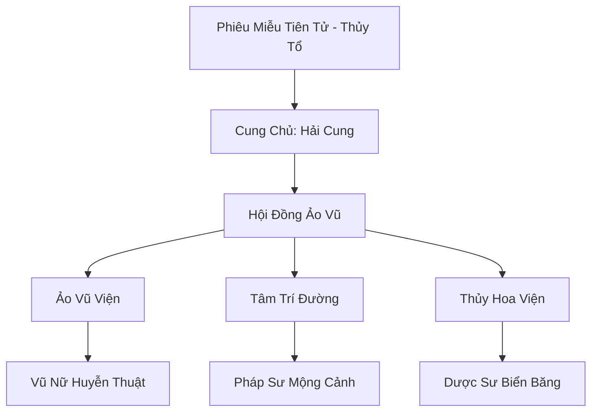

# PHIÊU MIỄU BĂNG HẢI (飘渺冰海)

## I. Tổng Quan (总览)
Phiêu Miễu Băng Hải là một tông môn nữ tu cổ xưa ẩn mình dưới những lớp băng dày của vùng biển Bắc Băng. Khác với sự cứng nhắc của Huyền Băng Cung, họ kết hợp cái lạnh thấu xương của băng giá với sự mềm mại, biến ảo của nước và âm nhạc. Các nữ tu tại đây là những bậc thầy về huyễn thuật âm thanh, có khả năng tiêu diệt đối phương ngay trong những giấc mơ đẹp nhất. Tông môn giữ thái độ trung lập và rất ít khi xuất thế, trừ khi vùng biển của họ bị xâm phạm.

## II. Địa Lý & Tài Nguyên (地理 với tài nguyên)
Trụ sở là Cung điện Phiêu Miễu được xây dựng trong một hang động khổng lồ dưới đáy biển, nơi có những dòng hải lưu ấm ngầm chảy qua tạo nên một hệ sinh thái kỳ ảo. Nơi đây sở hữu "Suối nguồn Phiêu Miễu" - mạch linh khí thủy hệ biến dị có tác dụng tẩy rửa tâm linh và tăng cường mị lực. Tài nguyên quý giá nhất là các loại san hô băng và linh hồn biển sâu tích tụ vạn năm.

## III. Văn Hóa & Tín Ngưỡng (文化 với信仰)
Tôn thờ Phiêu Miễu Tiên Tử và triết lý "Thế Gian Như Mộng, Tâm Lãnh Như Băng". Thành viên tông môn đề cao vẻ đẹp hình thể gắn liền với sự lạnh lùng của tâm trí. Văn hóa của họ xoay quanh các buổi trình diễn "Ảo Vũ" trên mặt nước và nghệ thuật dệt nên các giấc mơ ma thuật. Họ coi cảm xúc là vũ khí nhưng cũng là cạm bẫy lớn nhất của người tu hành.

## IV. Cơ Cấu Tổ Chức (组织结构)


## V. Công Pháp & Trận Pháp (功法 với阵法)
- **Công Pháp:** *Kinh Mộng Thủy Vũ* (Tấn công huyễn thuật), *Tâm Lãnh Như Sương* (Đóng băng cảm xúc).
- **Trận Pháp:** *Băng Hải Phiêu Miễu Trận* - đại trận bao phủ vùng biển cung điện, biến mặt nước thành một tấm gương khổng lồ phản chiếu những nỗi sợ hãi nhất của kẻ thù, khiến họ tự chìm xuống đáy biển trong vô thức.

## VI. Đặc Sản Môn Phái (门派特产)
- **Hải Thạch Đàn:** Loại nhạc cụ chế tác từ đá biển linh lực, có khả năng khuếch đại huyễn âm lên hàng vạn lần.
- **Mộng Cảnh Châu:** Viên ngọc lưu trữ một giấc mơ ảo giác, dùng để bẫy linh hồn đối phương.

## VII. Cơ Sở Hạ Tầng (基础设施)
- **Ảo Ảnh Điện:** Nơi diễn ra các buổi lễ trọng đại, kiến trúc liên tục thay đổi hình dạng theo âm nhạc.
- **Hàn Tinh Hồ:** Hồ nước ngầm nơi đệ tử rèn luyện khả năng điều khiển nước trong trạng thái đóng băng cực nhanh.

## VIII. Kinh Tế (経済)
Kinh tế dựa trên việc cung cấp các loại dược liệu và hương liệu chuyên trị tâm ma cho các đại năng lục địa. Họ cũng nắm giữ thị trường buôn bán cổ vật biển sâu và thông tin tình báo liên quan đến các hải tộc bí ẩn, thường xuyên giao dịch thông qua các kênh ngầm của Ảnh Nguyệt Uyển.

## IX. Lịch Sử Tóm Tắt (简史)
Sáng lập bởi Phiêu Miễu Tiên Tử vào thời Thượng Cổ, vốn là một thiên tài của Băng Tộc đã từ bỏ sự chính thống để tìm kiếm con đường tu luyện kết hợp giữa nước và tâm linh. Tông môn đã âm thầm tồn tại dưới lòng biển băng, đứng ngoài các cuộc tranh chấp đất liền nhưng lại có ảnh hưởng sâu sắc đến thế giới ngầm của Bắc Băng.

## X. Giai Thoại & Bí Mật (轶 sự với bí mật)
Tương truyền Cung Chủ Hải Cung sở hữu một bản nhạc mang tên "Trần Thế Chủng", nếu tấu lên trọn vẹn, có thể khiến toàn bộ sinh linh trong Cố Nguyên Giới rơi vào một giấc ngủ ngàn năm.

## XI. Quan Hệ Thế Lực (势力关系)
```mermaid
graph LR
    PMBH[Phiêu Miễu Băng Hải] -- Kình địch ngầm -- HBC[Huyền Băng Cung]
    PMBH -- Đối tác -- ANU[Ảnh Nguyệt Uyển]
    PMBH -- Tránh né -- CQTĐ[Cực Quang Thần Điện]
    PMBH -- Giao thương -- SHĐQ[San Hô Đảo Quốc]
```
