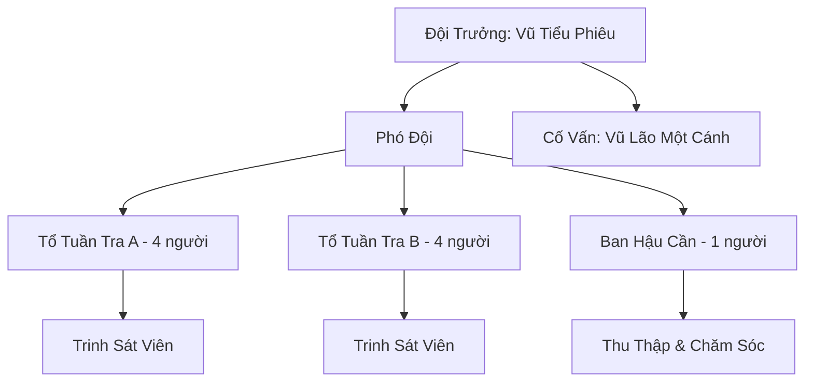

# PHONG VŨ TRINH SÁT ĐỘI (风雨侦察队)

## I. Tổng Quan (总览)
Phong Vũ Trinh Sát Đội là một đội trinh sát nhỏ bé gồm toàn thiếu niên Vũ Tộc, hoạt động quanh vùng trời tầm thấp gần lãnh thổ Hàn Kiếm Cốc. Do quá trẻ và yếu ớt để gia nhập bất kỳ thế lực chính thức nào, đám nhóc này đã tự tổ chức thành một đơn vị tuần tra nghiệp dư, bay lượn quanh vùng chân Tuyết Sơn để phát hiện yêu thú, tuyết tặc hoặc các dấu hiệu bất thường, rồi báo cáo cho các làng phàm nhân và thỉnh thoảng cho cả Hàn Kiếm Cốc để đổi lấy thức ăn và linh thạch cấp thấp.

Dù nhiều người trong Bắc Băng coi họ chỉ là một đám trẻ con chơi trò chiến tranh, thông tin trinh sát của Phong Vũ Trinh Sát Đội lại thường xuyên chính xác đến mức đáng kinh ngạc. Đội trưởng Vũ Tiểu Phiêu, một thiếu niên mồ côi mới 16 tuổi nhưng có đôi mắt sắc bén và ý chí kiên cường, đã dần dần xây dựng được uy tín nhỏ bé trong vùng. Với cánh nhỏ nhưng nhanh nhẹn, các thành viên của đội đang chứng minh rằng ngay cả những kẻ yếu nhất cũng có thể tìm ra chỗ đứng trong thế giới tu chân khắc nghiệt.

## II. Địa Lý & Tài Nguyên (地理 与 资源)
Căn cứ chính của Phong Vũ Trinh Sát Đội là một mỏm đá lớn nhô ra khỏi vách núi phía đông Hàn Kiếm Cốc, nơi được gọi là "Tổ Chim Đá". Mỏm đá này nằm ở độ cao vừa đủ để có tầm nhìn rộng xuống thung lũng bên dưới, đồng thời được che chắn bởi một vách đá lớn hơn phía trên, tạo thành một mái hiên tự nhiên chống tuyết và gió bão. Các thành viên đã dùng cỏ khô, lông vũ rụng và đá vụn để xây dựng những ổ ngủ thô sơ dọc theo các khe nứt trên mỏm đá.

Vùng hoạt động tuần tra trải dài từ chân Tuyết Sơn đến rìa ngoài lãnh thổ Hàn Kiếm Cốc, bao gồm cả các khu rừng tuyết thấp và các đồng cỏ băng. Đây là vùng đệm giữa lãnh thổ các đại tông môn và khu vực sinh sống của phàm nhân, nơi yêu thú cấp thấp thường xuyên lang thang và tuyết tặc hay ẩn náu. Tài nguyên của đội gần như không có gì đáng kể — họ sống nhờ thức ăn đổi được từ việc cung cấp tin, một ít thảo dược hoang và lông vũ linh cầm nhặt được trên vách đá. Viên linh thạch quý giá nhất mà Đội từng sở hữu là phần thưởng cho lần báo cáo chính xác về một đàn Tuyết Lang xâm nhập lãnh thổ gần Hàn Kiếm Cốc.

## III. Văn Hóa & Tín Ngưỡng (文化 与 信仰)
Triết lý của Phong Vũ Trinh Sát Đội đơn giản đến mức đáng thương: "Bay nhanh, nhìn xa, ăn no." Đây không phải là một câu nói mang tính triết học cao siêu mà là thực tế sinh tồn hàng ngày — nếu không bay đủ nhanh để thoát yêu thú, không nhìn đủ xa để phát hiện nguy hiểm, và không hoàn thành nhiệm vụ để đổi lấy thức ăn, thì cả đội sẽ chết đói hoặc bị ăn thịt.

Quy tắc duy nhất được thi hành nghiêm ngặt là: phải hoàn thành nhiệm vụ tuần tra mới được ăn. Kẻ lười biếng bị giảm khẩu phần, kẻ nói dối về những gì nhìn thấy bị đuổi khỏi đội. Mỗi sáng sớm, cả đội thực hiện nghi lễ "Chào Bình Minh" — tất cả bay lên cao nhất có thể và hét lớn về phía mặt trời mọc. Nghi lễ này vừa là bài tập thể lực (rèn khả năng bay cao), vừa là cách giữ tinh thần trong những ngày đói rét. Dù thô kệch, nghi lễ đã trở thành nét văn hóa đặc trưng mà mọi thành viên đều tự hào.

Các thành viên trong đội xưng hô với nhau bằng biệt hiệu dựa trên đặc điểm cánh hoặc tính cách, tạo nên một tình bạn gắn bó hiếm có giữa những đứa trẻ mồ côi và lưu lạc. Vũ Tiểu Phiêu luôn nhấn mạnh rằng Đội không phân biệt xuất thân — dù là Vũ Tộc cánh ngắn, cánh lệch hay thậm chí nửa máu, miễn bay được thì đều được chào đón.

## IV. Cơ Cấu Tổ Chức (组织结构)


Cơ cấu tổ chức của Phong Vũ Trinh Sát Đội đơn giản đến mức thô sơ, phản ánh bản chất của một nhóm thiếu niên tự tổ chức. Đứng đầu là Đội Trưởng Vũ Tiểu Phiêu, thiếu niên Vũ Tộc 16 tuổi với tu vi Luyện Khí Hậu Kỳ — cao nhất trong đám. Hắn tự phong mình làm đội trưởng vì hắn là người đầu tiên nghĩ ra ý tưởng thành lập đội và cũng là người bay nhanh nhất. Phó Đội phụ trách chia ca tuần tra và phân phối thức ăn. Toàn đội có 12 Vũ Tộc trẻ từ 14 đến 20 tuổi, tu vi dao động từ Luyện Khí Sơ Kỳ đến Trung Kỳ.

Thành viên đặc biệt nhất là một Vũ Tộc già từ Đoản Dực Lạc Đoàn — không còn bay được do mất một cánh, nhưng sở hữu kinh nghiệm đọc thời tiết và phán đoán hướng di chuyển yêu thú vô cùng chính xác. Lão được tôn làm "Cố Vấn", ở lại Tổ Chim Đá phân tích thông tin do các tổ tuần tra mang về và lên kế hoạch cho ngày hôm sau.

## V. Công Pháp & Trận Pháp (功法 与 阵法)
- **Công Pháp:** Phong Vũ Trinh Sát Đội không có bất kỳ công pháp bài bản nào. Toàn bộ kỹ năng chiến đấu và bay lượn đều do tự mày mò và rèn luyện thực chiến. Vũ Tiểu Phiêu dạy các thành viên mới ba điều cơ bản: bay thấp để tránh bị phát hiện, bay nhanh khi bị đuổi, và nhào xuống khe đá nếu không thoát được. Ngoài ra, hắn đang bí mật tự nghiên cứu kiếm ý từ một miếng kiếm mảnh nhặt được ở bãi tập cũ của Hàn Kiếm Cốc — dù hoàn toàn không biết mình đang chạm vào thứ nguy hiểm vượt xa tu vi hiện tại.
- **Trận Pháp:** Đội hình chiến đấu duy nhất là "Phong Vũ Chữ V" — khi gặp nguy hiểm, cả đội xếp thành hình chữ V với Vũ Tiểu Phiêu ở đầu, tận dụng luồng khí động học để bay nhanh hơn và phối hợp né tránh. Đây không phải trận pháp thực sự mà chỉ là chiến thuật bay bầy đàn bản năng, nhưng hiệu quả đáng kể khi cần rút lui khỏi yêu thú cấp thấp.

## VI. Đặc Sản Môn Phái (门派特产)
- **Bản Đồ Gió:** Các thành viên dùng lông vũ chấm nhựa thông vẽ bản đồ luồng gió và vị trí yêu thú lên trên đá phẳng. Dù thô sơ, các bản đồ này khá chính xác và đôi khi được Hàn Dân Hộ Vệ Đội hỏi mua.
- **Tín Hiệu Tiếng Hót:** Mỗi thành viên có một tiếng hót đặc trưng dùng để liên lạc khi bay xa. Hệ thống tín hiệu này phân biệt được ít nhất 7 loại cảnh báo khác nhau: yêu thú đơn lẻ, đàn yêu thú, tuyết tặc, bão tuyết, người lạ, an toàn và cầu cứu.
- **Lông Vũ Trinh Sát:** Lông vũ linh cầm nhặt được trên vách đá, tuy không có giá trị tu luyện cao nhưng được các phường luyện khí nhỏ mua làm nguyên liệu phụ gia.

## VII. Cơ Sở Hạ Tầng (基础设施)
- **Tổ Chim Đá:** Căn cứ chính trên mỏm đá nhô ra vách núi phía đông Hàn Kiếm Cốc. Gồm 4 ổ ngủ chung xây bằng cỏ khô và lông vũ, một khu vực phơi thức ăn và một "phòng họp" — thực chất là một mặt đá phẳng nơi Vũ Tiểu Phiêu họp đội mỗi sáng.
- **Đài Quan Sát Cây Khô:** Một thân cây chết khổng lồ nằm ngang trên đỉnh đồi gần Tổ Chim Đá, được dùng làm điểm quan sát ban ngày. Từ đây có thể nhìn thấy hầu hết các tuyến đường chính dẫn về phía các làng phàm nhân.
- **Hang Trú Bão:** Một khe nứt sâu trong vách đá gần Tổ Chim Đá, nơi cả đội chui vào trú ẩn khi bão tuyết lớn ập đến. Chật chội và tối tăm, nhưng đủ ấm để sống sót.

## VIII. Kinh Tế (经济)
Nền kinh tế của Phong Vũ Trinh Sát Đội hoàn toàn dựa trên hệ thống trao đổi hiện vật. Nguồn thu chính đến từ việc cung cấp thông tin trinh sát cho các làng phàm nhân — bay quanh vùng phát hiện yêu thú hay tuyết tặc, rồi cảnh báo kịp thời để đổi lấy lương thực, vải vóc hoặc dược liệu cơ bản. Hàn Kiếm Cốc thỉnh thoảng cho vài viên linh thạch cấp thấp khi thông tin tuần tra có ích cho việc bảo vệ ngoại vi — đây là nguồn thu quý giá nhất nhưng không ổn định.

Ngoài ra, đội thu thập lông vũ linh cầm rụng trên vách đá và một số thảo dược mọc ở những nơi chỉ có kẻ biết bay mới tiếp cận được, đem bán cho các phường luyện khí nhỏ hoặc trao đổi với thợ thủ công trong vùng. Tổng thu nhập hàng tháng thường chỉ vừa đủ để cả đội không chết đói — những tháng mùa đông khắc nghiệt, bữa ăn thường bị cắt xuống còn một bữa mỗi ngày.

## IX. Lịch Sử Tóm Tắt (简史)
Vũ Tiểu Phiêu là đứa trẻ Vũ Tộc mồ côi, cha mẹ mất trong một trận tấn công yêu thú khi hắn mới 8 tuổi. Quá nhỏ để được bất kỳ thế lực nào thu nhận, quá yếu để tự kiếm sống bằng tu luyện, hắn lớn lên trong Vũ Tộc Lưu Dân Trại — nơi tập hợp những Vũ Tộc vô gia cư, bệnh tật và bị ruồng bỏ. Ở đó, hắn gặp những đứa trẻ đồng cảnh ngộ và nhận ra rằng nếu đứng đơn lẻ thì từng đứa đều vô dụng, nhưng nếu phối hợp bay theo nhóm thì có thể quan sát cả một vùng rộng lớn.

Ba năm trước, khi mới 13 tuổi, Vũ Tiểu Phiêu chính thức tập hợp 11 bạn bè đồng trang lứa và thành lập Phong Vũ Trinh Sát Đội. Ban đầu họ chỉ bay quanh vùng gần nhất để tìm thức ăn, nhưng dần dần phát hiện rằng các làng phàm nhân sẵn sàng trả lương thực để đổi lấy cảnh báo sớm về yêu thú. Một bước ngoặt đến khi đội phát hiện chính xác đường di chuyển của một đàn Tuyết Lang lớn và cảnh báo kịp thời cho cả Hàn Dân Hộ Vệ Đội và một tiền đội tuần tra của Hàn Kiếm Cốc — từ đó, Hàn Kiếm Cốc bắt đầu chấp nhận sự tồn tại của đội ở rìa lãnh thổ và thỉnh thoảng ban thưởng linh thạch.

Dù đã hoạt động ba năm, đội vẫn không được bất kỳ thế lực nào công nhận chính thức. Nhiều người trong Bắc Băng coi họ là đám nhóc chơi trò chiến tranh, nhưng những ai từng được cứu nhờ thông tin của đội đều biết giá trị thực sự mà họ mang lại.

## X. Giai Thoại & Bí Mật (轶事 与 秘密)
Vũ Tiểu Phiêu giấu kín một bí mật mà ngay cả các thành viên trong đội cũng không ai biết: hắn từng lén lẻn vào bãi tập cũ bị bỏ hoang của Hàn Kiếm Cốc và nhặt được một miếng kiếm mảnh vỡ. Miếng kiếm này vẫn tàn lưu kiếm ý cực mạnh của một vị trưởng lão Hàn Kiếm Cốc từ hàng trăm năm trước. Vũ Tiểu Phiêu tự mò mẫm cảm nhận kiếm ý từ miếng sắt vụn đó mỗi đêm trước khi ngủ, không hề biết rằng kiếm ý tàn lưu ở cấp độ này có thể phá hủy kinh mạch của một tu sĩ Luyện Khí bất cứ lúc nào. Điều kỳ lạ là cho đến nay hắn vẫn an toàn — có lẽ do thể chất Vũ Tộc đặc thù, hoặc có lẽ do một lý do sâu xa hơn mà chưa ai nhận ra.

Ngoài ra, đội từng phát hiện một nhóm người bí ẩn mặc áo choàng đen xâm nhập lãnh thổ Bắc Băng từ phía nam vào một đêm không trăng. Vũ Tiểu Phiêu đã lập tức báo cáo cho cả Hàn Dân Hộ Vệ Đội và gián tiếp cho Hàn Kiếm Cốc, nhưng không ai tin — vì lời nói của một đám trẻ con không có trọng lượng trong thế giới tu chân. Sự kiện này ám ảnh Vũ Tiểu Phiêu cho đến tận hôm nay, và hắn vẫn âm thầm theo dõi tuyến đường mà nhóm người bí ẩn đó đi qua.

Ước mơ lớn nhất của Vũ Tiểu Phiêu là một ngày nào đó Phong Vũ Trinh Sát Đội được Hàn Kiếm Cốc chính thức thu nhận làm đơn vị trinh sát ngoại vi. Hắn biết điều đó gần như bất khả — một đám nhóc Vũ Tộc Luyện Khí không bao giờ được một đại tông phái kiếm tu nhìn nhận. Nhưng hắn vẫn kiên trì bay mỗi ngày, mài giũa từng chút kỹ năng, hy vọng một ngày nào đó sẽ có cơ hội chứng minh giá trị của mình.

## XI. Quan Hệ Thế Lực (势力关系)
```mermaid
graph LR
    PVTSĐ[Phong Vũ Trinh Sát Đội] -- Cung cấp tin / Lệ thuộc -- HKC[Hàn Kiếm Cốc]
    PVTSĐ -- Hợp tác cảnh báo -- HDHVĐ[Hàn Dân Hộ Vệ Đội]
    PVTSĐ -- Xuất thân liên quan -- ĐDLĐ[Đoản Dực Lạc Đoàn]
    PVTSĐ -- Ngưỡng mộ -- ĐBTĐ[Đại Bàng Tuyết Đàn]
```
